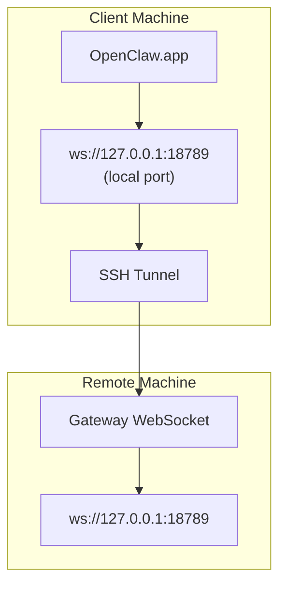

# Ejecutar OpenClaw.app con una Puerta de Enlace Remota

OpenClaw.app utiliza túneles SSH para conectarse a una puerta de enlace remota. Esta guía le muestra cómo configurarlo.

## Visión general



## Configuración rápida

### Paso 1: Agregar configuración SSH

Edite `~/.ssh/config` y añada:

```ssh
Host remote-gateway
    HostName <REMOTE_IP>          # e.g., 172.27.187.184
    User <REMOTE_USER>            # e.g., jefferson
    LocalForward 18789 127.0.0.1:18789
    IdentityFile ~/.ssh/id_rsa
```

Reemplace `<REMOTE_IP>` y `<REMOTE_USER>` con sus valores.

### Paso 2: Copiar clave SSH

Copie su clave pública a la máquina remota (ingrese la contraseña una vez):

```bash
ssh-copy-id -i ~/.ssh/id_rsa <REMOTE_USER>@<REMOTE_IP>
```

### Paso 3: Establecer token de puerta de enlace

```bash
launchctl setenv OPENCLAW_GATEWAY_TOKEN "<your-token>"
```

### Paso 4: Iniciar túnel SSH

```bash
ssh -N remote-gateway &
```

### Paso 5: Reiniciar OpenClaw.app

```bash
# Quit OpenClaw.app (⌘Q), then reopen:
open /path/to/OpenClaw.app
```

La aplicación ahora se conectará a la puerta de enlace remota a través del túnel SSH.

---

## Inicio automático del túnel al iniciar sesión

Para que el túnel SSH se inicie automáticamente cuando inicie sesión, cree un agente de lanzamiento (Launch Agent).

### Crear el archivo PLIST

Guarde esto como `~/Library/LaunchAgents/ai.openclaw.ssh-tunnel.plist`:

```xml
<?xml version="1.0" encoding="UTF-8"?>
<!DOCTYPE plist PUBLIC "-//Apple//DTD PLIST 1.0//EN" "http://www.apple.com/DTDs/PropertyList-1.0.dtd">
<plist version="1.0">
<dict>
    <key>Label</key>
    <string>ai.openclaw.ssh-tunnel</string>
    <key>ProgramArguments</key>
    <array>
        <string>/usr/bin/ssh</string>
        <string>-N</string>
        <string>remote-gateway</string>
    </array>
    <key>KeepAlive</key>
    <true/>
    <key>RunAtLoad</key>
    <true/>
</dict>
</plist>
```

### Cargar el agente de lanzamiento

```bash
launchctl bootstrap gui/$UID ~/Library/LaunchAgents/ai.openclaw.ssh-tunnel.plist
```

El túnel ahora:

- Se iniciará automáticamente cuando inicie sesión
- Se reiniciará si falla
- Seguirá ejecutándose en segundo plano

Nota heredada: elimine cualquier LaunchAgent `com.openclaw.ssh-tunnel` restante si está presente.

---

## Solución de problemas

**Verificar si el túnel está funcionando:**

```bash
ps aux | grep "ssh -N remote-gateway" | grep -v grep
lsof -i :18789
```

**Reiniciar el túnel:**

```bash
launchctl kickstart -k gui/$UID/ai.openclaw.ssh-tunnel
```

**Detener el túnel:**

```bash
launchctl bootout gui/$UID/ai.openclaw.ssh-tunnel
```

---

## Cómo funciona

| Componente                           | Lo que hace                                                |
| ------------------------------------ | ---------------------------------------------------------- |
| `LocalForward 18789 127.0.0.1:18789` | Reenvía el puerto local 18789 al puerto remoto 18789       |
| `ssh -N`                             | SSH sin ejecutar comandos remotos (solo reenvío de puerto) |
| `KeepAlive`                          | Reinicia automáticamente el túnel si falla                 |
| `RunAtLoad`                          | Inicia el túnel cuando se carga el agente                  |

OpenClaw.app se conecta a `ws://127.0.0.1:18789` en su máquina cliente. El túnel SSH reenvía esa conexión al puerto 18789 en la máquina remota donde se está ejecutando la Puerta de Enlace.

import es from "/components/footer/es.mdx";

<es />
