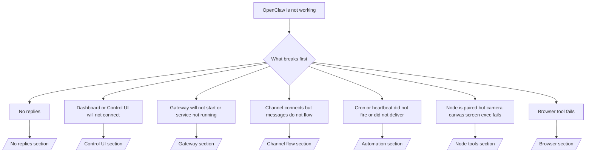

# Solución de problemas

Si solo tiene 2 minutos, use esta página como puerta de entrada de triaje.

## Primeros 60 segundos

Ejecute esta siguiente escalera exacta en orden:

```bash
openclaw status
openclaw status --all
openclaw gateway probe
openclaw gateway status
openclaw doctor
openclaw channels status --probe
openclaw logs --follow
```

Buena salida en una línea:

- `openclaw status` → muestra los canales configurados y ningún error de autenticación obvio.
- `openclaw status --all` → el informe completo está presente y se puede compartir.
- `openclaw gateway probe` → el destino de puerta de enlace esperado es alcanzable (`Reachable: yes`). `RPC: limited - missing scope: operator.read` es un diagnóstico degradado, no un fallo de conexión.
- `openclaw gateway status` → `Runtime: running` y `RPC probe: ok`.
- `openclaw doctor` → sin errores de configuración/servicio bloqueantes.
- `openclaw channels status --probe` → los canales reportan `connected` o `ready`.
- `openclaw logs --follow` → actividad constante, sin errores fatales repetitivos.

## Contexto largo de Anthropic 429

Si ves:
`HTTP 429: rate_limit_error: Extra usage is required for long context requests`,
ve a [/gateway/troubleshooting#anthropic-429-extra-usage-required-for-long-context](/es/gateway/troubleshooting#anthropic-429-extra-usage-required-for-long-context).

## La instalación del complemento falla con extensiones de openclaw faltantes

Si la instalación falla con `package.json missing openclaw.extensions`, el paquete del plugin
está usando un formato antiguo que OpenClaw ya no acepta.

Solución en el paquete del complemento:

1. Añade `openclaw.extensions` a `package.json`.
2. Apunta las entradas a los archivos de tiempo de ejecución construidos (generalmente `./dist/index.js`).
3. Republica el plugin y ejecuta `openclaw plugins install <npm-spec>` de nuevo.

Ejemplo:

```json
{
  "name": "@openclaw/my-plugin",
  "version": "1.2.3",
  "openclaw": {
    "extensions": ["./dist/index.js"]
  }
}
```

Referencia: [/tools/plugin#distribution-npm](/es/tools/plugin#distribution-npm)

## Árbol de decisiones



<AccordionGroup>
  <Accordion title="Sin respuestas">
    ```bash
    openclaw status
    openclaw gateway status
    openclaw channels status --probe
    openclaw pairing list --channel <channel> [--account <id>]
    openclaw logs --follow
    ```

    El resultado correcto se ve así:

    - `Runtime: running`
    - `RPC probe: ok`
    - Tu canal muestra conectado/listo en `channels status --probe`
    - El remitente aparece aprobado (o la política de DM está abierta/en lista de permitidos)

    Firmas de registro comunes:

    - `drop guild message (mention required` → el filtrado de menciones bloqueó el mensaje en Discord.
    - `pairing request` → el remitente no está aprobado y está esperando la aprobación de emparejamiento DM.
    - `blocked` / `allowlist` en los registros del canal → el remitente, la sala o el grupo está filtrado.

    Páginas profundas:

    - [/gateway/troubleshooting#no-replies](/es/gateway/troubleshooting#no-replies)
    - [/channels/troubleshooting](/es/channels/troubleshooting)
    - [/channels/pairing](/es/channels/pairing)

  </Accordion>

  <Accordion title="El panel o la interfaz de control no se conectan">
    ```bash
    openclaw status
    openclaw gateway status
    openclaw logs --follow
    openclaw doctor
    openclaw channels status --probe
    ```

    El resultado correcto se ve así:

    - `Dashboard: http://...` se muestra en `openclaw gateway status`
    - `RPC probe: ok`
    - Sin bucle de autenticación en los registros

    Firmas comunes de registros:

    - `device identity required` → El contexto HTTP/no seguro no puede completar la autenticación del dispositivo.
    - `AUTH_TOKEN_MISMATCH` con sugerencias de reintento (`canRetryWithDeviceToken=true`) → puede ocurrir automáticamente un reintento de token de dispositivo de confianza.
    - `unauthorized` repetido después de ese reintento → token/contraseña incorrectos, desajuste en el modo de autenticación o token de dispositivo emparejado obsoleto.
    - `gateway connect failed:` → La interfaz de usuario está apuntando a la URL/puerto incorrecto o a una puerta de enlace inalcanzable.

    Páginas en profundidad:

    - [/gateway/troubleshooting#dashboard-control-ui-connectivity](/es/gateway/troubleshooting#dashboard-control-ui-connectivity)
    - [/web/control-ui](/es/web/control-ui)
    - [/gateway/authentication](/es/gateway/authentication)

  </Accordion>

  <Accordion title="La puerta de enlace no se inicia o el servicio está instalado pero no se está ejecutando">
    ```bash
    openclaw status
    openclaw gateway status
    openclaw logs --follow
    openclaw doctor
    openclaw channels status --probe
    ```

    El resultado correcto se ve así:

    - `Service: ... (loaded)`
    - `Runtime: running`
    - `RPC probe: ok`

    Firmas comunes de registros:

    - `Gateway start blocked: set gateway.mode=local` → el modo de puerta de enlace no está configurado/es remoto.
    - `refusing to bind gateway ... without auth` → enlace no de bucle invertido sin token/contraseña.
    - `another gateway instance is already listening` o `EADDRINUSE` → puerto ya en uso.

    Páginas en profundidad:

    - [/gateway/troubleshooting#gateway-service-not-running](/es/gateway/troubleshooting#gateway-service-not-running)
    - [/gateway/background-process](/es/gateway/background-process)
    - [/gateway/configuration](/es/gateway/configuration)

  </Accordion>

  <Accordion title="El canal se conecta pero los mensajes no fluyen">
    ```bash
    openclaw status
    openclaw gateway status
    openclaw logs --follow
    openclaw doctor
    openclaw channels status --probe
    ```

    El resultado correcto se ve así:

    - El transporte del canal está conectado.
    - Las comprobaciones de emparejamiento/lista blanca se realizan correctamente.
    - Las menciones se detectan donde se requieren.

    Firmas de registro comunes:

    - `mention required` → el filtrado por mención de grupo bloqueó el procesamiento.
    - `pairing` / `pending` → el remitente del MD aún no está aprobado.
    - `not_in_channel`, `missing_scope`, `Forbidden`, `401/403` → problema con el token de permisos del canal.

    Páginas profundas:

    - [/gateway/troubleshooting#channel-connected-messages-not-flowing](/es/gateway/troubleshooting#channel-connected-messages-not-flowing)
    - [/channels/troubleshooting](/es/channels/troubleshooting)

  </Accordion>

  <Accordion title="El cron o el latido no se activaron o no se entregaron">
    ```bash
    openclaw status
    openclaw gateway status
    openclaw cron status
    openclaw cron list
    openclaw cron runs --id <jobId> --limit 20
    openclaw logs --follow
    ```

    El resultado correcto se ve así:

    - `cron.status` muestra que está habilitado con una próxima activación.
    - `cron runs` muestra entradas recientes de `ok`.
    - El latido está habilitado y no está fuera de las horas activas.

    Firmas de registro comunes:

    - `cron: scheduler disabled; jobs will not run automatically` → el cron está deshabilitado.
    - `heartbeat skipped` con `reason=quiet-hours` → fuera de las horas activas configuradas.
    - `requests-in-flight` → carril principal ocupado; la activación del latido se retrasó.
    - `unknown accountId` → la cuenta de destino de entrega del latido no existe.

    Páginas profundas:

    - [/gateway/troubleshooting#cron-and-heartbeat-delivery](/es/gateway/troubleshooting#cron-and-heartbeat-delivery)
    - [/automation/troubleshooting](/es/automation/troubleshooting)
    - [/gateway/heartbeat](/es/gateway/heartbeat)

  </Accordion>

  <Accordion title="El nodo está emparejado pero la herramienta falla en cámara, lienzo, pantalla o ejecución">
    ```bash
    openclaw status
    openclaw gateway status
    openclaw nodes status
    openclaw nodes describe --node <idOrNameOrIp>
    openclaw logs --follow
    ```

    La salida correcta se ve así:

    - El nodo figura como conectado y emparejado para el rol `node`.
    - Existe la capacidad para el comando que estás invocando.
    - El estado de permiso está otorgado para la herramienta.

    Firmas de registro comunes:

    - `NODE_BACKGROUND_UNAVAILABLE` → traer la aplicación del nodo al primer plano.
    - `*_PERMISSION_REQUIRED` → el permiso del sistema operativo fue denegado o falta.
    - `SYSTEM_RUN_DENIED: approval required` → la aprobación de ejecución está pendiente.
    - `SYSTEM_RUN_DENIED: allowlist miss` → el comando no está en la lista de permitidos para ejecución.

    Páginas en profundidad:

    - [/gateway/troubleshooting#node-paired-tool-fails](/es/gateway/troubleshooting#node-paired-tool-fails)
    - [/nodes/troubleshooting](/es/nodes/troubleshooting)
    - [/tools/exec-approvals](/es/tools/exec-approvals)

  </Accordion>

  <Accordion title="La herramienta del navegador falla">
    ```bash
    openclaw status
    openclaw gateway status
    openclaw browser status
    openclaw logs --follow
    openclaw doctor
    ```

    La salida correcta se ve así:

    - El estado del navegador muestra `running: true` y un navegador/perfil elegido.
    - `openclaw` se inicia, o `user` puede ver las pestañas locales de Chrome.

    Firmas de registro comunes:

    - `Failed to start Chrome CDP on port` → falló el inicio del navegador local.
    - `browser.executablePath not found` → la ruta binaria configurada es incorrecta.
    - `No Chrome tabs found for profile="user"` → el perfil de conexión de Chrome MCP no tiene pestañas locales de Chrome abiertas.
    - `Browser attachOnly is enabled ... not reachable` → el perfil de solo conexión no tiene un objetivo CDP activo.

    Páginas en profundidad:

    - [/gateway/troubleshooting#browser-tool-fails](/es/gateway/troubleshooting#browser-tool-fails)
    - [/tools/browser-linux-troubleshooting](/es/tools/browser-linux-troubleshooting)
    - [/tools/browser-wsl2-windows-remote-cdp-troubleshooting](/es/tools/browser-wsl2-windows-remote-cdp-troubleshooting)

  </Accordion>
</AccordionGroup>

import es from "/components/footer/es.mdx";

<es />
