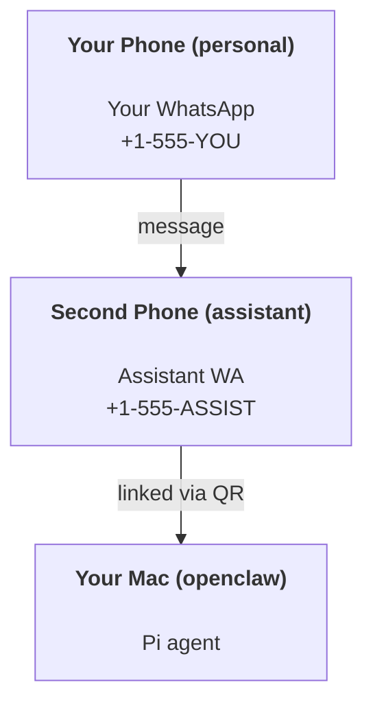

# Construir un asistente personal con OpenClaw

OpenClaw es una puerta de enlace de WhatsApp + Telegram + Discord + iMessage para agentes **Pi**. Los complementos añaden Mattermost. Esta guía es la configuración de "asistente personal": un número de WhatsApp dedicado que se comporta como tu agente siempre activo.

## ⚠️ Seguridad ante todo

Estás poniendo a un agente en una posición para:

- ejecutar comandos en tu máquina (dependiendo de la configuración de tus herramientas de Pi)
- leer/escribir archivos en tu espacio de trabajo
- enviar mensajes de vuelta a través de WhatsApp/Telegram/Discord/Mattermost (complemento)

Empieza con conservaduría:

- Establece siempre `channels.whatsapp.allowFrom` (nunca ejecutes abierto al mundo en tu Mac personal).
- Utiliza un número de WhatsApp dedicado para el asistente.
- Los latidos ahora por defecto son cada 30 minutos. Desactívalos hasta que confíes en la configuración estableciendo `agents.defaults.heartbeat.every: "0m"`.

## Requisitos previos

- OpenClaw instalado e incorporado — consulte [Introducción](/es/start/getting-started) si aún no ha hecho esto
- Un segundo número de teléfono (SIM/eSIM/prepago) para el asistente

## La configuración de dos teléfonos (recomendada)

Quieres esto:



Si vinculas tu WhatsApp personal a OpenClaw, cada mensaje que recibes se convierte en "entrada del agente". Eso casi nunca es lo que quieres.

## Inicio rápido de 5 minutos

1. Vincular WhatsApp Web (muestra un código QR; escanear con el teléfono del asistente):

```bash
openclaw channels login
```

2. Iniciar la puerta de enlace (dejarla en ejecución):

```bash
openclaw gateway --port 18789
```

3. Pon una configuración mínima en `~/.openclaw/openclaw.json`:

```json5
{
  channels: { whatsapp: { allowFrom: ["+15555550123"] } },
}
```

Ahora envía un mensaje al número del asistente desde tu teléfono autorizado.

Cuando finalice la incorporación, abrimos automáticamente el tablero e imprimimos un enlace limpio (sin tokenizar). Si solicita autenticación, pega el token de `gateway.auth.token` en la configuración de Control UI. Para reabrir más tarde: `openclaw dashboard`.

## Dale al agente un espacio de trabajo (AGENTS)

OpenClaw lee las instrucciones de operación y la "memoria" de su directorio de espacio de trabajo.

De forma predeterminada, OpenClaw usa `~/.openclaw/workspace` como el espacio de trabajo del agente y lo creará (junto con los archivos iniciales `AGENTS.md`, `SOUL.md`, `TOOLS.md`, `IDENTITY.md`, `USER.md`, `HEARTBEAT.md`) automáticamente durante la configuración/primera ejecución del agente. `BOOTSTRAP.md` solo se crea cuando el espacio de trabajo es completamente nuevo (no debería volver a aparecer después de eliminarlo). `MEMORY.md` es opcional (no se crea automáticamente); cuando está presente, se carga para las sesiones normales. Las sesiones de subagente solo inyectan `AGENTS.md` y `TOOLS.md`.

Sugerencia: trata esta carpeta como la "memoria" de OpenClaw y conviértela en un repositorio git (idealmente privado) para que tus `AGENTS.md` + archivos de memoria estén respaldados. Si git está instalado, los espacios de trabajo nuevos se inicializan automáticamente.

```bash
openclaw setup
```

Diseño completo del espacio de trabajo + guía de copia de seguridad: [Agente workspace](/es/concepts/agent-workspace)
Flujo de trabajo de memoria: [Memory](/es/concepts/memory)

Opcional: elige un espacio de trabajo diferente con `agents.defaults.workspace` (soporta `~`).

```json5
{
  agent: {
    workspace: "~/.openclaw/workspace",
  },
}
```

Si ya envías tus propios archivos de espacio de trabajo desde un repositorio, puedes desactivar completamente la creación de archivos de inicio:

```json5
{
  agent: {
    skipBootstrap: true,
  },
}
```

## La configuración que lo convierte en "un asistente"

De forma predeterminada, OpenClaw configura un buen asistente, pero generalmente querrás ajustar:

- persona/instrucciones en `SOUL.md`
- valores predeterminados de pensamiento (thinking) (si se desea)
- latidos (heartbeats) (una vez que confíes en él)

Ejemplo:

```json5
{
  logging: { level: "info" },
  agent: {
    model: "anthropic/claude-opus-4-6",
    workspace: "~/.openclaw/workspace",
    thinkingDefault: "high",
    timeoutSeconds: 1800,
    // Start with 0; enable later.
    heartbeat: { every: "0m" },
  },
  channels: {
    whatsapp: {
      allowFrom: ["+15555550123"],
      groups: {
        "*": { requireMention: true },
      },
    },
  },
  routing: {
    groupChat: {
      mentionPatterns: ["@openclaw", "openclaw"],
    },
  },
  session: {
    scope: "per-sender",
    resetTriggers: ["/new", "/reset"],
    reset: {
      mode: "daily",
      atHour: 4,
      idleMinutes: 10080,
    },
  },
}
```

## Sesiones y memoria

- Archivos de sesión: `~/.openclaw/agents/<agentId>/sessions/{{SessionId}}.jsonl`
- Metadatos de la sesión (uso de tokens, última ruta, etc.): `~/.openclaw/agents/<agentId>/sessions/sessions.json` (legado: `~/.openclaw/sessions/sessions.json`)
- `/new` o `/reset` inicia una sesión nueva para ese chat (configurable mediante `resetTriggers`). Si se envía solo, el agente responde con un breve saludo para confirmar el restablecimiento.
- `/compact [instructions]` compacta el contexto de la sesión e informa el presupuesto de contexto restante.

## Latidos (modo proactivo)

Por defecto, OpenClaw ejecuta un latido cada 30 minutos con el mensaje:
`Read HEARTBEAT.md if it exists (workspace context). Follow it strictly. Do not infer or repeat old tasks from prior chats. If nothing needs attention, reply HEARTBEAT_OK.`
Establezca `agents.defaults.heartbeat.every: "0m"` para desactivar.

- Si `HEARTBEAT.md` existe pero está efectivamente vacío (solo líneas en blanco y encabezados de markdown como `# Heading`), OpenClaw omite la ejecución del latido para ahorrar llamadas a la API.
- Si falta el archivo, el latido aún se ejecuta y el modelo decide qué hacer.
- Si el agente responde con `HEARTBEAT_OK` (opcionalmente con un pequeño relleno; consulte `agents.defaults.heartbeat.ackMaxChars`), OpenClaw suprime el envío saliente para ese latido.
- Por defecto, se permite la entrega de latidos a objetivos de tipo DM `user:<id>`. Establezca `agents.defaults.heartbeat.directPolicy: "block"` para suprimir la entrega a objetivos directos manteniendo activas las ejecuciones de latido.
- Los latidos ejecutan turnos completos del agente; los intervalos más cortos consumen más tokens.

```json5
{
  agent: {
    heartbeat: { every: "30m" },
  },
}
```

## Entrada y salida de medios

Los archivos adjuntos entrantes (imágenes/audio/documentos) pueden exponerse a su comando a través de plantillas:

- `{{MediaPath}}` (ruta de archivo temporal local)
- `{{MediaUrl}}` (pseudo-URL)
- `{{Transcript}}` (si la transcripción de audio está habilitada)

Archivos adjuntos salientes del agente: incluya `MEDIA:<path-or-url>` en su propia línea (sin espacios). Ejemplo:

```
Here’s the screenshot.
MEDIA:https://example.com/screenshot.png
```

OpenClaw los extrae y los envía como medios junto con el texto.

## Lista de verificación de operaciones

```bash
openclaw status          # local status (creds, sessions, queued events)
openclaw status --all    # full diagnosis (read-only, pasteable)
openclaw status --deep   # adds gateway health probes (Telegram + Discord)
openclaw health --json   # gateway health snapshot (WS)
```

Los registros se encuentran en `/tmp/openclaw/` (por defecto: `openclaw-YYYY-MM-DD.log`).

## Próximos pasos

- WebChat: [WebChat](/es/web/webchat)
- Operaciones de Gateway: [Gateway runbook](/es/gateway)
- Cron + despertares: [Cron jobs](/es/automation/cron-jobs)
- Compañero de barra de menús de macOS: [OpenClaw macOS app](/es/platforms/macos)
- Aplicación de nodo iOS: [iOS app](/es/platforms/ios)
- Aplicación de nodo Android: [Android app](/es/platforms/android)
- Estado de Windows: [Windows (WSL2)](/es/platforms/windows)
- Estado de Linux: [Linux app](/es/platforms/linux)
- Seguridad: [Security](/es/gateway/security)

import en from "/components/footer/en.mdx";

<en />
