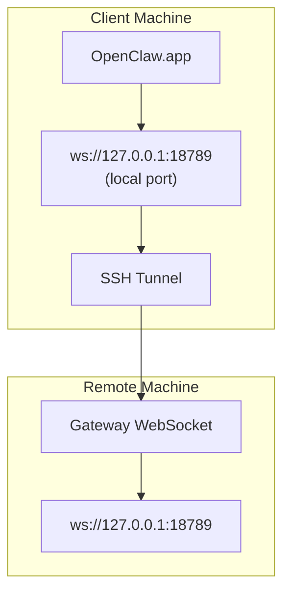

# Exécuter OpenClaw.app avec une passerelle distante

OpenClaw.app utilise le tunnellisation SSH pour se connecter à une passerelle distante. Ce guide vous montre comment le configurer.

## Vue d'ensemble



## Configuration rapide

### Étape 1 : Ajouter la configuration SSH

Modifiez `~/.ssh/config` et ajoutez :

```ssh
Host remote-gateway
    HostName <REMOTE_IP>          # e.g., 172.27.187.184
    User <REMOTE_USER>            # e.g., jefferson
    LocalForward 18789 127.0.0.1:18789
    IdentityFile ~/.ssh/id_rsa
```

Remplacez `<REMOTE_IP>` et `<REMOTE_USER>` par vos valeurs.

### Étape 2 : Copier la clé SSH

Copiez votre clé publique sur la machine distante (entrez le mot de passe une fois) :

```bash
ssh-copy-id -i ~/.ssh/id_rsa <REMOTE_USER>@<REMOTE_IP>
```

### Étape 3 : Définir le jeton de Gateway

```bash
launchctl setenv OPENCLAW_GATEWAY_TOKEN "<your-token>"
```

### Étape 4 : Démarrer le tunnel SSH

```bash
ssh -N remote-gateway &
```

### Étape 5 : Redémarrer OpenClaw.app

```bash
# Quit OpenClaw.app (⌘Q), then reopen:
open /path/to/OpenClaw.app
```

L'application se connectera maintenant à la passerelle distante via le tunnel SSH.

---

## Démarrage automatique du tunnel à la connexion

Pour que le tunnel SSH démarre automatiquement lorsque vous vous connectez, créez un agent de lancement.

### Créer le fichier PLIST

Enregistrez ceci sous `~/Library/LaunchAgents/ai.openclaw.ssh-tunnel.plist` :

```xml
<?xml version="1.0" encoding="UTF-8"?>
<!DOCTYPE plist PUBLIC "-//Apple//DTD PLIST 1.0//EN" "http://www.apple.com/DTDs/PropertyList-1.0.dtd">
<plist version="1.0">
<dict>
    <key>Label</key>
    <string>ai.openclaw.ssh-tunnel</string>
    <key>ProgramArguments</key>
    <array>
        <string>/usr/bin/ssh</string>
        <string>-N</string>
        <string>remote-gateway</string>
    </array>
    <key>KeepAlive</key>
    <true/>
    <key>RunAtLoad</key>
    <true/>
</dict>
</plist>
```

### Charger l'agent de lancement

```bash
launchctl bootstrap gui/$UID ~/Library/LaunchAgents/ai.openclaw.ssh-tunnel.plist
```

Le tunnel va maintenant :

- Démarrer automatiquement lorsque vous vous connectez
- Redémarrer en cas de plantage
- Continuer à fonctionner en arrière-plan

Note pour l'ancienne version : supprimez tout LaunchAgent `com.openclaw.ssh-tunnel` restant s'il est présent.

---

## Dépannage

**Vérifier si le tunnel fonctionne :**

```bash
ps aux | grep "ssh -N remote-gateway" | grep -v grep
lsof -i :18789
```

**Redémarrer le tunnel :**

```bash
launchctl kickstart -k gui/$UID/ai.openclaw.ssh-tunnel
```

**Arrêter le tunnel :**

```bash
launchctl bootout gui/$UID/ai.openclaw.ssh-tunnel
```

---

## Fonctionnement

| Composant                            | Ce qu'il fait                                                         |
| ------------------------------------ | --------------------------------------------------------------------- |
| `LocalForward 18789 127.0.0.1:18789` | Transfère le port local 18789 vers le port distant 18789              |
| `ssh -N`                             | SSH sans exécuter de commandes distantes (juste le transfert de port) |
| `KeepAlive`                          | Redémarre automatiquement le tunnel en cas de plantage                |
| `RunAtLoad`                          | Démarre le tunnel lors du chargement de l'agent                       |

OpenClaw.app se connecte à `ws://127.0.0.1:18789` sur votre machine cliente. Le tunnel SSH transfère cette connexion vers le port 18789 sur la machine distante où la Gateway est en cours d'exécution.

import fr from "/components/footer/fr.mdx";

<fr />
