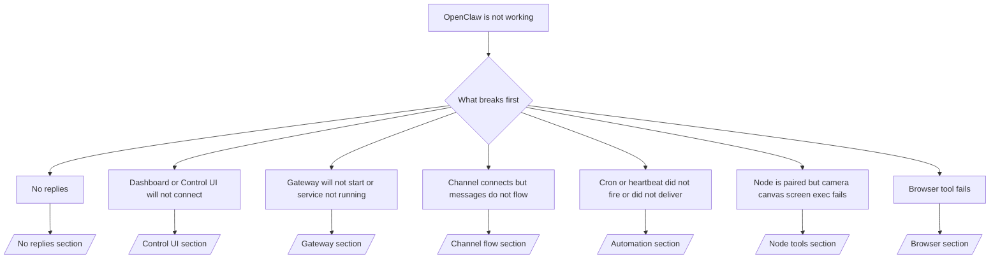

# Troubleshooting

Si vous n'avez que 2 minutes, utilisez cette page comme porte d'entrée de triage.

## Premières 60 secondes

Exécutez cette échelle exacte dans l'ordre :

```bash
openclaw status
openclaw status --all
openclaw gateway probe
openclaw gateway status
openclaw doctor
openclaw channels status --probe
openclaw logs --follow
```

Bonne sortie en une ligne :

- `openclaw status` → affiche les canaux configurés et aucune erreur d'auth évidente.
- `openclaw status --all` → le rapport complet est présent et partageable.
- `openclaw gateway probe` → la passerelle cible attendue est accessible.
- `openclaw gateway status` → `Runtime: running` et `RPC probe: ok`.
- `openclaw doctor` → aucune erreur de configuration/service bloquante.
- `openclaw channels status --probe` → les canaux indiquent `connected` ou `ready`.
- `openclaw logs --follow` → activité stable, aucune erreur fatale répétitive.

## Anthropic long context 429

Si vous voyez :
`HTTP 429: rate_limit_error: Extra usage is required for long context requests`,
allez sur [/gateway/troubleshooting#anthropic-429-extra-usage-required-for-long-context](/fr/gateway/troubleshooting#anthropic-429-extra-usage-required-for-long-context).

## L'échec de l'installation du plugin avec les extensions openclaw manquantes

Si l'installation échoue avec `package.json missing openclaw.extensions`, le paquet du plugin
utilise une ancienne forme que OpenClaw n'accepte plus.

Correction dans le paquet du plugin :

1. Ajoutez `openclaw.extensions` à `package.json`.
2. Faites pointer les entrées vers les fichiers d'exécution construits (généralement `./dist/index.js`).
3. Republish the plugin and run `openclaw plugins install <npm-spec>` again.

Exemple :

```json
{
  "name": "@openclaw/my-plugin",
  "version": "1.2.3",
  "openclaw": {
    "extensions": ["./dist/index.js"]
  }
}
```

Référence : [/tools/plugin#distribution-npm](/fr/tools/plugin#distribution-npm)

## Arbre de décision



<AccordionGroup>
  <Accordion title="No replies">
    ```bash
    openclaw status
    openclaw gateway status
    openclaw channels status --probe
    openclaw pairing list --channel <channel> [--account <id>]
    openclaw logs --follow
    ```

    Un bon résultat ressemble à ceci :

    - `Runtime: running`
    - `RPC probe: ok`
    - Votre channel affiche connecté/prêt dans `channels status --probe`
    - L'expéditeur semble approuvé (ou la stratégie de DM est ouverte/allowlist)

    Signatures de journal courantes :

    - `drop guild message (mention required` → le blocage de mention a bloqué le message dans Discord.
    - `pairing request` → l'expéditeur n'est pas approuvé et attend l'approbation d'appariement DM.
    - `blocked` / `allowlist` dans les journaux du channel → l'expéditeur, la salle ou le groupe est filtré.

    Pages approfondies :

    - [/gateway/troubleshooting#no-replies](/fr/gateway/troubleshooting#no-replies)
    - [/channels/troubleshooting](/fr/channels/troubleshooting)
    - [/channels/pairing](/fr/channels/pairing)

  </Accordion>

  <Accordion title="Le tableau de bord ou l'interface de contrôle ne se connecte pas">
    ```bash
    openclaw status
    openclaw gateway status
    openclaw logs --follow
    openclaw doctor
    openclaw channels status --probe
    ```

    Un bon résultat ressemble à :

    - `Dashboard: http://...` est affiché dans `openclaw gateway status`
    - `RPC probe: ok`
    - Aucune boucle d'authentification dans les journaux

    Signatures de journal courantes :

    - `device identity required` → Le contexte HTTP/non sécurisé ne peut pas compléter l'authentification de l'appareil.
    - `AUTH_TOKEN_MISMATCH` avec des indices de nouvelle tentative (`canRetryWithDeviceToken=true`) → une nouvelle tentative automatique du jeton d'appareil de confiance peut se produire.
    - `unauthorized` répété après cette nouvelle tentative → jeton/mot de passe incorrect, inadéquation du mode d'authentification ou jeton d'appareil appairé obsolète.
    - `gateway connect failed:` → l'interface cible la mauvaise URL/port ou une passerelle injoignable.

    Pages approfondies :

    - [/gateway/troubleshooting#dashboard-control-ui-connectivity](/fr/gateway/troubleshooting#dashboard-control-ui-connectivity)
    - [/web/control-ui](/fr/web/control-ui)
    - [/gateway/authentication](/fr/gateway/authentication)

  </Accordion>

  <Accordion title="Gateway ne démarre pas ou service installé mais non exécuté">
    ```bash
    openclaw status
    openclaw gateway status
    openclaw logs --follow
    openclaw doctor
    openclaw channels status --probe
    ```

    Un bon résultat ressemble à :

    - `Service: ... (loaded)`
    - `Runtime: running`
    - `RPC probe: ok`

    Signatures de journal courantes :

    - `Gateway start blocked: set gateway.mode=local` → le mode gateway est non défini/distant.
    - `refusing to bind gateway ... without auth` → liaison non bouclée sans jeton/mot de passe.
    - `another gateway instance is already listening` ou `EADDRINUSE` → port déjà utilisé.

    Pages approfondies :

    - [/gateway/troubleshooting#gateway-service-not-running](/fr/gateway/troubleshooting#gateway-service-not-running)
    - [/gateway/background-process](/fr/gateway/background-process)
    - [/gateway/configuration](/fr/gateway/configuration)

  </Accordion>

  <Accordion title="Le channel se connecte mais les messages ne circulent pas">
    ```bash
    openclaw status
    openclaw gateway status
    openclaw logs --follow
    openclaw doctor
    openclaw channels status --probe
    ```

    Un bon résultat ressemble à ceci :

    - Le transport du channel est connecté.
    - Les vérifications de jumelage/liste blanche réussissent.
    - Les mentions sont détectées là où c'est requis.

    Signatures de journal courantes :

    - `mention required` → le filtrage par mention de groupe a bloqué le traitement.
    - `pairing` / `pending` → l'expéditeur de DM n'est pas encore approuvé.
    - `not_in_channel`, `missing_scope`, `Forbidden`, `401/403` → problème de jeton d'autorisation du channel.

    Pages approfondies :

    - [/gateway/troubleshooting#channel-connected-messages-not-flowing](/fr/gateway/troubleshooting#channel-connected-messages-not-flowing)
    - [/channels/troubleshooting](/fr/channels/troubleshooting)

  </Accordion>

  <Accordion title="Cron ou heartbeat n'a pas été déclenché ou n'a pas été livré">
    ```bash
    openclaw status
    openclaw gateway status
    openclaw cron status
    openclaw cron list
    openclaw cron runs --id <jobId> --limit 20
    openclaw logs --follow
    ```

    Un bon résultat ressemble à :

    - `cron.status` indique qu'il est activé avec un prochain réveil.
    - `cron runs` montre des entrées `ok` récentes.
    - Le heartbeat est activé et n'est pas hors des heures actives.

    Signatures de journal courantes :

    - `cron: scheduler disabled; jobs will not run automatically` → cron est désactivé.
    - `heartbeat skipped` avec `reason=quiet-hours` → en dehors des heures actives configurées.
    - `requests-in-flight` → voie principale occupée ; le réveil du heartbeat a été différé.
    - `unknown accountId` → le compte cible de livraison du heartbeat n'existe pas.

    Pages approfondies :

    - [/gateway/troubleshooting#cron-and-heartbeat-delivery](/fr/gateway/troubleshooting#cron-and-heartbeat-delivery)
    - [/automation/troubleshooting](/fr/automation/troubleshooting)
    - [/gateway/heartbeat](/fr/gateway/heartbeat)

  </Accordion>

  <Accordion title="Node is paired but tool fails camera canvas screen exec">
    ```bash
    openclaw status
    openclaw gateway status
    openclaw nodes status
    openclaw nodes describe --node <idOrNameOrIp>
    openclaw logs --follow
    ```

    Un bon résultat ressemble à ceci :

    - Le nœud est répertorié comme connecté et jumelé pour le rôle `node`.
    - La capacité existe pour la commande que vous appelez.
    - L'état de l'autorisation est accordé pour l'outil.

    Signatures de journal courantes :

    - `NODE_BACKGROUND_UNAVAILABLE` → mettre l'application du nœud au premier plan.
    - `*_PERMISSION_REQUIRED` → l'autorisation du système d'exploitation a été refusée ou est manquante.
    - `SYSTEM_RUN_DENIED: approval required` → l'approbation d'exécution est en attente.
    - `SYSTEM_RUN_DENIED: allowlist miss` → commande non présente sur la liste d'autorisation d'exécution.

    Pages détaillées :

    - [/gateway/troubleshooting#node-paired-tool-fails](/fr/gateway/troubleshooting#node-paired-tool-fails)
    - [/nodes/troubleshooting](/fr/nodes/troubleshooting)
    - [/tools/exec-approvals](/fr/tools/exec-approvals)

  </Accordion>

  <Accordion title="Échec de l'outil de navigation">
    ```bash
    openclaw status
    openclaw gateway status
    openclaw browser status
    openclaw logs --follow
    openclaw doctor
    ```

    Un bon résultat ressemble à ceci :

    - L'état du navigateur affiche `running: true` et un navigateur/profil choisi.
    - Le profil `openclaw` démarre ou le relais `chrome` a un onglet attaché.

    Signatures de journal courantes :

    - `Failed to start Chrome CDP on port` → échec du lancement du navigateur local.
    - `browser.executablePath not found` → le chemin binaire configuré est incorrect.
    - `Chrome extension relay is running, but no tab is connected` → extension non attachée.
    - `Browser attachOnly is enabled ... not reachable` → le profil attachement uniquement n'a aucune cible CDP active.

    Pages approfondies :

    - [/gateway/troubleshooting#browser-tool-fails](/fr/gateway/troubleshooting#browser-tool-fails)
    - [/tools/browser-linux-troubleshooting](/fr/tools/browser-linux-troubleshooting)
    - [/tools/browser-wsl2-windows-remote-cdp-troubleshooting](/fr/tools/browser-wsl2-windows-remote-cdp-troubleshooting)
    - [/tools/chrome-extension](/fr/tools/chrome-extension)

  </Accordion>
</AccordionGroup>

import fr from '/components/footer/fr.mdx';

<fr />
