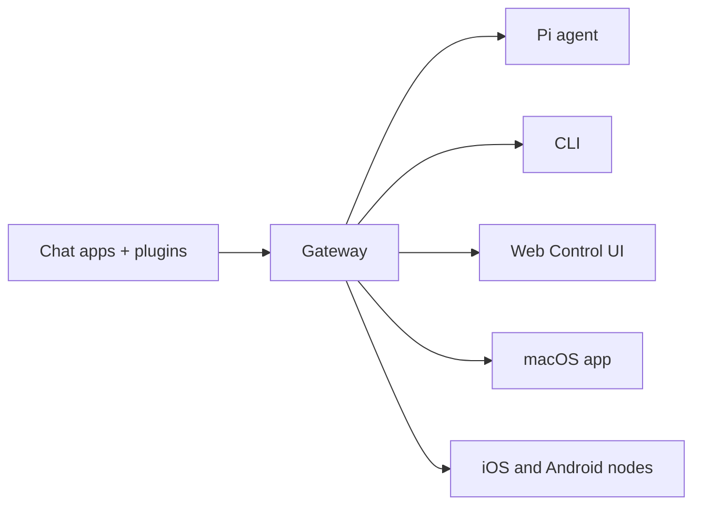

# OpenClaw 🦞

<p align="center">
  
  
</p>

> _"EXFOLIATE! EXFOLIATE!"_ — Une homarde spatiale, probablement

<p align="center">
  <strong>
    Passerelle pour agents IA sur n'importe quel OS, via WhatsApp, Telegram, Discord, iMessage, et
    plus.
  </strong>
  <br />
  Envoyez un message, obtenez une réponse d'un agent depuis votre poche. Les plugins ajoutent
  Mattermost et plus.
</p>

<Columns>
  <Card title="Get Started" href="/fr/start/getting-started" icon="rocket">
    Installez OpenClaw et lancez la Gateway en quelques minutes.
  </Card>
  <Card title="Run Onboarding" href="/fr/start/wizard" icon="sparkles">
    Configuration guidée avec `openclaw onboard` et les flux d'appairage.
  </Card>
  <Card title="Open the Control UI" href="/fr/web/control-ui" icon="layout-dashboard">
    Lancez le tableau de bord du navigateur pour le chat, la config et les sessions.
  </Card>
</Columns>

## Qu'est-ce que OpenClaw ?

OpenClaw est une **passerelle auto-hébergée** qui connecte vos applications de chat préférées — WhatsApp, Telegram, Discord, iMessage, et plus encore — aux agents de codage IA comme Pi. Vous exécutez un seul processus de passerelle sur votre propre machine (ou un serveur), et il devient le pont entre vos applications de messagerie et un assistant IA toujours disponible.

**À qui est-ce destiné ?** Aux développeurs et aux utilisateurs expérimentés qui souhaitent un assistant IA personnel qu'ils peuvent contacter de n'importe où — sans sacrifier le contrôle de leurs données ni dépendre d'un service hébergé.

**Qu'est-ce qui le rend différent ?**

- **Auto-hébergé** : fonctionne sur votre matériel, vos règles
- **Multi-canal** : un Gateway sert WhatsApp, Telegram, Discord et plus simultanément
- **Natif pour les agents** : conçu pour les agents de codation avec l'utilisation d'outils, les sessions, la mémoire et le routage multi-agents
- **Open source** : sous licence MIT, piloté par la communauté

**De quoi avez-vous besoin ?** Node 24 (recommandé), ou Node 22 LTS (`22.16+`) pour la compatibilité, une clé API de votre fournisseur choisi, et 5 minutes. Pour une meilleure qualité et sécurité, utilisez le modèle de dernière génération le plus performant disponible.

## Fonctionnement



Le Gateway est la source unique de vérité pour les sessions, le routage et les connexions aux canaux.

## Fonctionnalités clés

<Columns>
  <Card title="Multi-channel gateway" icon="network">
    WhatsApp, Telegram, Discord et iMessage avec un seul processus Gateway.
  </Card>
  <Card title="Plugin channels" icon="plug">
    Ajoutez Mattermost et plus avec des packages d'extension.
  </Card>
  <Card title="Multi-agent routing" icon="route">
    Sessions isolées par agent, espace de travail ou expéditeur.
  </Card>
  <Card title="Prise en charge des médias" icon="image">
    Envoyez et recevez des images, de l'audio et des documents.
  </Card>
  <Card title="Interface Web de contrôle" icon="monitor">
    Tableau de bord navigateur pour la discussion, la configuration, les sessions et les nœuds.
  </Card>
  <Card title="Nœuds mobiles" icon="smartphone">
    Appariez les nœuds iOS et Android pour les flux de travail Canvas, l'appareil photo et la voix.
  </Card>
</Columns>

## Démarrage rapide

<Steps>
  <Step title="Install OpenClaw">```bash npm install -g openclaw@latest ```</Step>
  <Step title="Onboard and install the service">```bash openclaw onboard --install-daemon ```</Step>
  <Step title="Pair WhatsApp and start the Gateway">
    ```bash openclaw channels login openclaw gateway --port 18789 ```
  </Step>
</Steps>

Besoin de l'installation complète et de la configuration de développement ? Voir [Quick start](/fr/start/quickstart).

## Tableau de bord

Ouvrez l'interface de contrôle du navigateur après le démarrage du Gateway.

- Par défaut local : [http://127.0.0.1:18789/](http://127.0.0.1:18789/)
- Accès distant : [Web surfaces](/fr/web) et [Tailscale](/fr/gateway/tailscale)

<p align="center">
  
</p>

## Configuration (facultatif)

La configuration se trouve dans `~/.openclaw/openclaw.json`.

- Si vous **ne faites rien**, OpenClaw utilise le binaire Pi inclus en mode RPC avec des sessions par expéditeur.
- Si vous souhaitez le verrouiller, commencez par `channels.whatsapp.allowFrom` et (pour les groupes) les règles de mention.

Exemple :

```json5
{
  channels: {
    whatsapp: {
      allowFrom: ["+15555550123"],
      groups: { "*": { requireMention: true } },
    },
  },
  messages: { groupChat: { mentionPatterns: ["@openclaw"] } },
}
```

## Commencer ici

<Columns>
  <Card title="Hubs de documentation" href="/fr/start/hubs" icon="book-open">
    Toute la documentation et les guides, organisés par cas d'usage.
  </Card>
  <Card title="Configuration" href="/fr/gateway/configuration" icon="settings">
    Paramètres du Gateway principal, jetons et configuration du provider.
  </Card>
  <Card title="Accès distant" href="/fr/gateway/remote" icon="globe">
    Modèles d'accès SSH et tailnet.
  </Card>
  <Card title="Canaux" href="/fr/channels/telegram" icon="message-square">
    Configuration spécifique au canal pour WhatsApp, Telegram, Discord, et plus encore.
  </Card>
  <Card title="Nœuds" href="/fr/nodes" icon="smartphone">
    Nœuds iOS et Android avec appairage, Canvas, caméra et actions d'appareil.
  </Card>
  <Card title="Aide" href="/fr/help" icon="life-buoy">
    Solutions courantes et point d'entrée pour le troubleshooting.
  </Card>
</Columns>

## En savoir plus

<Columns>
  <Card title="Liste complète des fonctionnalités" href="/fr/concepts/features" icon="list">
    Capacités complètes de channel, de routage et de média.
  </Card>
  <Card title="Routage multi-agent" href="/fr/concepts/multi-agent" icon="route">
    Isolement de l'espace de travail et sessions par agent.
  </Card>
  <Card title="Sécurité" href="/fr/gateway/security" icon="shield">
    Jetons, listes d'autorisation et contrôles de sécurité.
  </Card>
  <Card title="Troubleshooting" href="/fr/gateway/troubleshooting" icon="wrench">
    Gateway diagnostics et erreurs courantes.
  </Card>
  <Card title="À propos et crédits" href="/fr/reference/credits" icon="info">
    Origines du projet, contributeurs et licence.
  </Card>
</Columns>

import fr from "/components/footer/fr.mdx";

<fr />
