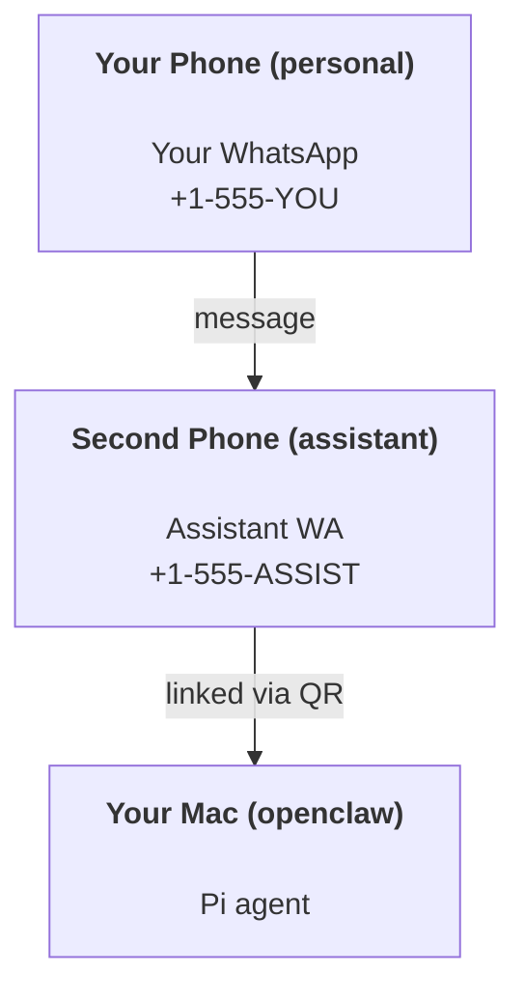

# Créer un assistant personnel avec OpenClaw

OpenClaw est une passerelle WhatsApp + Telegram + Discord + iMessage pour les agents **Pi**. Les plugins ajoutent Mattermost. Ce guide est la configuration "assistant personnel" : un numéro WhatsApp dédié qui se comporte comme votre agent toujours actif.

## ⚠️ Sécurité d'abord

Vous mettez un agent en position de :

- exécuter des commandes sur votre machine (en fonction de la configuration de votre outil Pi)
- lire/écrire des fichiers dans votre espace de travail
- renvoyer des messages via WhatsApp/Telegram/Discord/Mattermost (plugin)

Commencez prudemment :

- Toujours définir `channels.whatsapp.allowFrom` (ne jamais exécuter ouvert au monde sur votre Mac personnel).
- Utilisez un numéro WhatsApp dédié pour l'assistant.
- Les battements de cœur (Heartbeats) sont désormais par défaut toutes les 30 minutes. Désactivez-les jusqu'à ce que vous fassiez confiance à la configuration en définissant `agents.defaults.heartbeat.every: "0m"`.

## Prérequis

- OpenClaw installé et intégré — voir [Getting Started](/fr/start/getting-started) si vous ne l'avez pas encore fait
- Un deuxième numéro de téléphone (SIM/eSIM/prépayé) pour l'assistant

## La configuration à deux téléphones (recommandée)

Vous voulez ceci :



Si vous reliez votre WhatsApp personnel à OpenClaw, chaque message que vous recevez devient une "entrée d'agent". C'est rarement ce que vous voulez.

## Démarrage rapide en 5 minutes

1. Associer WhatsApp Web (affiche un QR ; scannez avec le téléphone de l'assistant) :

```bash
openclaw channels login
```

2. Démarrer la passerelle (Gateway) (laissez-la en cours d'exécution) :

```bash
openclaw gateway --port 18789
```

3. Mettre une configuration minimale dans `~/.openclaw/openclaw.json` :

```json5
{
  channels: { whatsapp: { allowFrom: ["+15555550123"] } },
}
```

Maintenant, envoyez un message au numéro de l'assistant depuis votre téléphone autorisé.

Lorsque l'intégration est terminée, nous ouvrons automatiquement le tableau de bord et imprimons un lien propre (non tokenisé). S'il demande une authentification, collez le jeton de `gateway.auth.token` dans les paramètres de l'interface de contrôle (Control UI). Pour rouvrir plus tard : `openclaw dashboard`.

## Donner à l'agent un espace de travail (AGENTS)

OpenClaw lit les instructions de fonctionnement et la "mémoire" à partir de son répertoire d'espace de travail.

Par défaut, OpenClaw utilise `~/.openclaw/workspace` comme espace de travail de l'agent, et le créera (ainsi que les fichiers de démarrage `AGENTS.md`, `SOUL.md`, `TOOLS.md`, `IDENTITY.md`, `USER.md`, `HEARTBEAT.md`) automatiquement lors de la configuration/première exécution de l'agent. `BOOTSTRAP.md` n'est créé que lorsque l'espace de travail est tout neuf (il ne devrait pas réapparaître après l'avoir supprimé). `MEMORY.md` est facultatif (non créé automatiquement) ; lorsqu'il est présent, il est chargé pour les sessions normales. Les sessions de sous-agents n'injectent que `AGENTS.md` et `TOOLS.md`.

Astuce : traitez ce dossier comme la « mémoire » d'OpenClaw et faites-en un dépôt git (idéalement privé) afin que vos fichiers `AGENTS.md` + mémoire soient sauvegardés. Si git est installé, les nouveaux espaces de travail sont initialisés automatiquement.

```bash
openclaw setup
```

Structure complète de l'espace de travail + guide de sauvegarde : [Espace de travail de l'agent](/fr/concepts/agent-workspace)
Flux de travail de la mémoire : [Mémoire](/fr/concepts/memory)

Optionnel : choisir un espace de travail différent avec `agents.defaults.workspace` (prend en charge `~`).

```json5
{
  agent: {
    workspace: "~/.openclaw/workspace",
  },
}
```

Si vous livrez déjà vos propres fichiers d'espace de travail depuis un dépôt, vous pouvez entièrement désactiver la création de fichiers d'amorçage :

```json5
{
  agent: {
    skipBootstrap: true,
  },
}
```

## La configuration qui le transforme en « assistant »

OpenClaw est configuré par défaut pour une bonne configuration d'assistant, mais vous voudrez généralement ajuster :

- personna/instructions dans `SOUL.md`
- valeurs par défaut de réflexion (si souhaité)
- battements de cœur (une fois que vous lui faites confiance)

Exemple :

```json5
{
  logging: { level: "info" },
  agent: {
    model: "anthropic/claude-opus-4-6",
    workspace: "~/.openclaw/workspace",
    thinkingDefault: "high",
    timeoutSeconds: 1800,
    // Start with 0; enable later.
    heartbeat: { every: "0m" },
  },
  channels: {
    whatsapp: {
      allowFrom: ["+15555550123"],
      groups: {
        "*": { requireMention: true },
      },
    },
  },
  routing: {
    groupChat: {
      mentionPatterns: ["@openclaw", "openclaw"],
    },
  },
  session: {
    scope: "per-sender",
    resetTriggers: ["/new", "/reset"],
    reset: {
      mode: "daily",
      atHour: 4,
      idleMinutes: 10080,
    },
  },
}
```

## Sessions et mémoire

- Fichiers de session : `~/.openclaw/agents/<agentId>/sessions/{{SessionId}}.jsonl`
- Métadonnées de session (utilisation des jetons, dernière route, etc.) : `~/.openclaw/agents/<agentId>/sessions/sessions.json` (ancien : `~/.openclaw/sessions/sessions.json`)
- `/new` ou `/reset` démarre une nouvelle session pour cette discussion (configurable via `resetTriggers`). S'il est envoyé seul, l'agent répond par un court bonjour pour confirmer la réinitialisation.
- `/compact [instructions]` compacte le contexte de la session et signale le budget contextuel restant.

## Battements de cœur (mode proactif)

Par défaut, OpenClaw exécute un battement de cœur (heartbeat) toutes les 30 minutes avec l'invite :
`Read HEARTBEAT.md if it exists (workspace context). Follow it strictly. Do not infer or repeat old tasks from prior chats. If nothing needs attention, reply HEARTBEAT_OK.`
Définissez `agents.defaults.heartbeat.every: "0m"` pour désactiver.

- Si `HEARTBEAT.md` existe mais est effectivement vide (uniquement des lignes vides et des en-têtes markdown comme `# Heading`), OpenClaw ignore l'exécution du battement de cœur pour économiser les appels API.
- Si le fichier est manquant, le battement de cœur s'exécute toujours et le modèle décide de ce qu'il faut faire.
- Si l'agent répond avec `HEARTBEAT_OK` (éventuellement avec un court remplissage ; voir `agents.defaults.heartbeat.ackMaxChars`), OpenClaw supprime la diffusion sortante pour ce battement de cœur.
- Par défaut, la livraison du battement de cœur aux cibles `user:<id>` de type DM est autorisée. Définissez `agents.defaults.heartbeat.directPolicy: "block"` pour supprimer la livraison directe à la cible tout en gardant les exécutions du battement de cœur actives.
- Les battements de cœur exécutent des tours complets de l'agent — des intervalles plus courts consomment plus de jetons.

```json5
{
  agent: {
    heartbeat: { every: "30m" },
  },
}
```

## Médias entrants et sortants

Les pièces jointes entrantes (images/audio/docs) peuvent être présentées à votre commande via des modèles :

- `{{MediaPath}}` (chemin de fichier temporaire local)
- `{{MediaUrl}}` (pseudo-URL)
- `{{Transcript}}` (si la transcription audio est activée)

Pièces jointes sortantes de l'agent : incluez `MEDIA:<path-or-url>` sur sa propre ligne (sans espaces). Exemple :

```
Here’s the screenshot.
MEDIA:https://example.com/screenshot.png
```

OpenClaw les extrait et les envoie en tant que média accompagnant le texte.

## Liste de vérification des opérations

```bash
openclaw status          # local status (creds, sessions, queued events)
openclaw status --all    # full diagnosis (read-only, pasteable)
openclaw status --deep   # adds gateway health probes (Telegram + Discord)
openclaw health --json   # gateway health snapshot (WS)
```

Les journaux se trouvent sous `/tmp/openclaw/` (par défaut : `openclaw-YYYY-MM-DD.log`).

## Étapes suivantes

- WebChat : [WebChat](/fr/web/webchat)
- Opérations Gateway : [Manuel Gateway](/fr/gateway)
- Cron + réveils : [Tâches Cron](/fr/automation/cron-jobs)
- Compagnon de barre de menu macOS : [Application OpenClaw macOS](/fr/platforms/macos)
- Application nœud iOS : [Application iOS](/fr/platforms/ios)
- Application nœud Android : [Application Android](/fr/platforms/android)
- Statut Windows : [Windows (WSL2)](/fr/platforms/windows)
- Statut Linux : [Application Linux](/fr/platforms/linux)
- Sécurité : [Sécurité](/fr/gateway/security)

import fr from "/components/footer/fr.mdx";

<fr />
