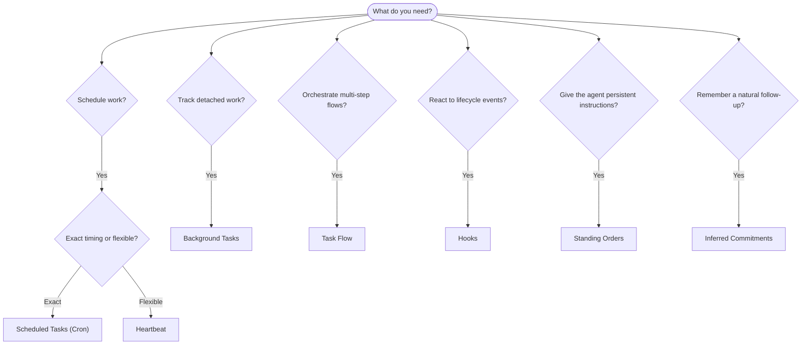

OpenClaw ejecuta trabajos en segundo plano a través de tareas, trabajos programados, compromisos inferidos, ganchos de eventos e instrucciones permanentes. Esta página le ayuda a elegir el mecanismo correcto y a entender cómo se relacionan entre sí.

## Guía rápida de decisión

| Caso de uso                                                      | Recomendado                            | Por qué                                                           |
| ---------------------------------------------------------------- | -------------------------------------- | ----------------------------------------------------------------- |
| Enviar informe diario a las 9:00 en punto                        | Tareas programadas (Cron)              | Sincronización exacta, ejecución aislada                          |
| Recordármelo en 20 minutos                                       | Tareas programadas (Cron)              | De un solo uso con sincronización precisa (`--at`)                |
| Ejecutar análisis profundo semanal                               | Tareas programadas (Cron)              | Tarea independiente, puede usar un modelo diferente               |
| Revisar bandeja de entrada cada 30 min                           | Latido (Heartbeat)                     | Se agrupa con otras comprobaciones, con conocimiento del contexto |
| Monitorear el calendario para próximos eventos                   | Latido (Heartbeat)                     | Adecuado para la conciencia periódica                             |
| Hacer un seguimiento después de una entrevista mencionada        | Compromisos inferidos                  | Seguimiento tipo memoria, sin solicitud de recordatorio exacta    |
| Verificación de atención gentil después del contexto del usuario | Compromisos inferidos                  | Limitado al mismo agente y canal                                  |
| Inspeccionar el estado de un subagente o ejecución de ACP        | Tareas en segundo plano                | El libro mayor de tareas rastrea todo el trabajo separado         |
| Auditar qué se ejecutó y cuándo                                  | Tareas en segundo plano                | `openclaw tasks list` y `openclaw tasks audit`                    |
| Investigación de varios pasos y luego resumir                    | Flujo de tareas                        | Orquestación duradera con seguimiento de revisiones               |
| Ejecutar un script al restablecer la sesión                      | Ganchos (Hooks)                        | Controlado por eventos, se activa en eventos del ciclo de vida    |
| Ejecutar código en cada llamada a herramienta                    | Ganchos de complementos (Plugin hooks) | Los ganchos en proceso pueden interceptar llamadas a herramientas |
| Verificar siempre el cumplimiento antes de responder             | Órdenes permanentes                    | Inyectado en cada sesión automáticamente                          |

### Tareas programadas (Cron) vs Heartbeat

| Dimensión           | Tareas programadas (Cron)                          | Heartbeat                                                        |
| ------------------- | -------------------------------------------------- | ---------------------------------------------------------------- |
| Sincronización      | Exacta (expresiones cron, única)                   | Aproximada (por defecto cada 30 min)                             |
| Contexto de sesión  | Nuevo (aislado) o compartido                       | Contexto completo de la sesión principal                         |
| Registros de tareas | Siempre creados                                    | Nunca creados                                                    |
| Entrega             | Canal, webhook o silencioso                        | En línea en la sesión principal                                  |
| Lo mejor para       | Informes, recordatorios, trabajos en segundo plano | Verificaciones de bandeja de entrada, calendario, notificaciones |

Use Tareas programadas (Cron) cuando necesite una sincronización precisa o ejecución aislada. Use Heartbeat cuando el trabajo se beneficie del contexto completo de la sesión y la sincronización aproximada sea adecuada.

## Conceptos clave

### Tareas programadas (cron)

Cron es el planificador integrado de Gateway para una sincronización precisa. Persiste los trabajos, despierta al agente en el momento adecuado y puede entregar la salida a un canal de chat o punto final de webhook. Admite recordatorios únicos, expresiones recurrentes y activadores de webhook entrantes.

Consulte [Tareas programadas](/es/automation/cron-jobs).

### Tareas

El libro mayor de tareas en segundo plano rastrea todo el trabajo separado: ejecuciones de ACP, creaciones de subagentes, ejecuciones de cron aisladas y operaciones de CLI. Las tareas son registros, no planificadores. Use `openclaw tasks list` y `openclaw tasks audit` para inspeccionarlas.

Consulte [Tareas en segundo plano](/es/automation/tasks).

### Compromisos inferidos

Los compromisos son memorias de seguimiento temporales y opcionales. OpenClaw los infiere
de conversaciones normales, los limita al mismo agente y canal, y
entrega los registros de vencimiento a través del latido. Los recordatorios exactos solicitados por el usuario todavía
pertenecen a cron.

Consulte [Compromisos inferidos](/es/concepts/commitments).

### Flujo de tareas

El flujo de tareas es el sustrato de orquestación de flujos por encima de las tareas en segundo plano. Gestiona flujos multipaso duraderos con modos de sincronización gestionados y reflejados, seguimiento de revisiones y `openclaw tasks flow list|show|cancel` para inspección.

Consulte [Flujo de tareas](/es/automation/taskflow).

### Órdenes permanentes

Las órdenes permanentes otorgan al agente autoridad operativa permanente para programas definidos. Residen en archivos del espacio de trabajo (típicamente `AGENTS.md`) y se inyectan en cada sesión. Combínelas con cron para el cumplimiento basado en tiempo.

Consulte [Órdenes permanentes](/es/automation/standing-orders).

### Ganchos

Los ganchos internos son scripts controlados por eventos activados por eventos del ciclo de vida del agente
(`/new`, `/reset`, `/stop`), compactación de sesión, inicio de puerta de enlace y flujo de mensajes.
Se descubren automáticamente desde directorios y se pueden gestionar
con `openclaw hooks`. Para la interceptación de llamadas a herramientas en proceso, use
[Ganchos de complemento](/es/plugins/hooks).

Consulte [Ganchos](/es/automation/hooks).

### Latido

El latido es un turno de sesión principal periódico (predeterminado cada 30 minutos). Agrupa múltiples verificaciones (bandeja de entrada, calendario, notificaciones) en un turno de agente con el contexto completo de la sesión. Los turnos de latido no crean registros de tareas y no extienden la vigencia del restablecimiento de sesión diario/inactivo. Use `HEARTBEAT.md` para una lista de verificación pequeña, o un bloque `tasks:` cuando desee verificaciones periódicas solo vencidas dentro del propio latido. Los archivos de latido vacíos se omiten como `empty-heartbeat-file`; el modo de tareas solo vencidas se omite como `no-tasks-due`. Los latidos se difieren mientras el trabajo cron está activo o en cola, y `heartbeat.skipWhenBusy` también puede diferirlos mientras los subagentes o carriles anidados están ocupados.

Consulte [Latido](/es/gateway/heartbeat).

## Cómo funcionan juntos

- **Cron** maneja horarios precisos (informes diarios, revisiones semanales) y recordatorios de una sola vez. Todas las ejecuciones de cron crean registros de tareas.
- **Heartbeat** maneja la monitorización de rutinas (bandeja de entrada, calendario, notificaciones) en un turno por lotes cada 30 minutos.
- **Hooks** reaccionan a eventos específicos (restablecimientos de sesión, compactación, flujo de mensajes) con scripts personalizados. Los hooks de complementos cubren llamadas a herramientas.
- **Standing orders** proporcionan al agente contexto persistente y límites de autoridad.
- **Task Flow** coordina flujos de varios pasos por encima de las tareas individuales.
- **Tasks** rastrean automáticamente todo el trabajo separado para que puedas inspeccionarlo y auditarlo.

## Relacionado

- [Tareas programadas](/es/automation/cron-jobs) — programación precisa y recordatorios de una sola vez
- [Compromisos inferidos](/es/concepts/commitments) — seguimientos de tipo memoria
- [Tareas en segundo plano](/es/automation/tasks) — libro mayor de tareas para todo el trabajo separado
- [Flujo de tareas](/es/automation/taskflow) — orquestación duradera de flujos de varios pasos
- [Hooks](/es/automation/hooks) — scripts de ciclo de vida impulsados por eventos
- [Hooks de complementos](/es/plugins/hooks) — hooks de herramientas, avisos, mensajes y ciclo de vida en proceso
- [Órdenes permanentes](/es/automation/standing-orders) — instrucciones persistentes del agente
- [Heartbeat](/es/gateway/heartbeat) — turnos periódicos de sesión principal
- [Referencia de configuración](/es/gateway/configuration-reference) — todas las claves de configuración
