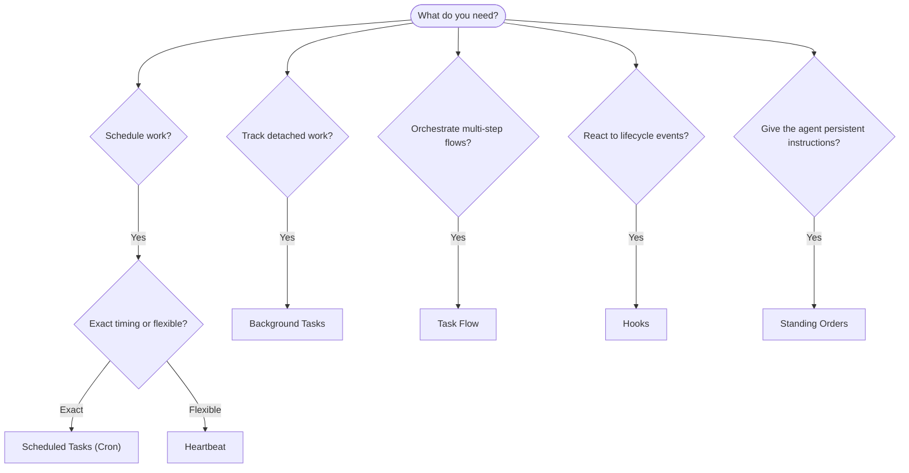

OpenClaw ejecuta trabajo en segundo plano a través de tareas, trabajos programados, ganchos de eventos e instrucciones permanentes. Esta página le ayuda a elegir el mecanismo correcto y a entender cómo se complementan.

## Guía rápida de decisión

| Caso de uso                                            | Recomendado                           | Por qué                                                           |
| ------------------------------------------------------ | ------------------------------------- | ----------------------------------------------------------------- |
| Enviar informe diario a las 9:00 en punto              | Tareas programadas (Cron)             | Sincronización exacta, ejecución aislada                          |
| Recordármelo en 20 minutos                             | Tareas programadas (Cron)             | De un solo uso con sincronización precisa (`--at`)                |
| Ejecutar análisis profundo semanal                     | Tareas programadas (Cron)             | Tarea independiente, puede usar un modelo diferente               |
| Revisar bandeja de entrada cada 30 min                 | Latido (Heartbeat)                    | Se agrupa con otras comprobaciones, con conocimiento del contexto |
| Monitorear el calendario para próximos eventos         | Latido (Heartbeat)                    | Adecuado para la conciencia periódica                             |
| Inspeccionar el estado de un subagente o ejecución ACP | Tareas en segundo plano               | El libro de tareas rastrea todo el trabajo desvinculado           |
| Auditar qué se ejecutó y cuándo                        | Tareas en segundo plano               | `openclaw tasks list` y `openclaw tasks audit`                    |
| Investigación de varios pasos y luego resumir          | Flujo de tareas                       | Orquestación duradera con seguimiento de revisiones               |
| Ejecutar un script al restablecer la sesión            | Ganchos (Hooks)                       | Impulsado por eventos, se activa en eventos del ciclo de vida     |
| Ejecutar código en cada llamada a herramienta          | Ganchos de complementos               | Los ganchos en proceso pueden interceptar llamadas a herramientas |
| Verificar siempre el cumplimiento antes de responder   | Órdenes permanentes (Standing Orders) | Se inyectan automáticamente en cada sesión                        |

### Tareas programadas (Cron) vs. Latido (Heartbeat)

| Dimensión           | Tareas programadas (Cron)                          | Latido (Heartbeat)                                         |
| ------------------- | -------------------------------------------------- | ---------------------------------------------------------- |
| Sincronización      | Exacta (expresiones cron, de un solo uso)          | Aproximada (por defecto cada 30 min)                       |
| Contexto de sesión  | Nuevo (aislado) o compartido                       | Contexto completo de la sesión principal                   |
| Registros de tareas | Siempre creados                                    | Nunca creados                                              |
| Entrega             | Canal, webhook o silencioso                        | En línea en la sesión principal                            |
| Mejor para          | Informes, recordatorios, trabajos en segundo plano | Revisión de bandeja de entrada, calendario, notificaciones |

Use Tareas programadas (Cron) cuando necesite una sincronización precisa o una ejecución aislada. Use Latido (Heartbeat) cuando el trabajo se beneficie del contexto completo de la sesión y una sincronización aproximada sea aceptable.

## Conceptos clave

### Tareas programadas (cron)

Cron es el programador integrado de la Gateway para una sincronización precisa. Persiste los trabajos, despierta al agente en el momento correcto y puede entregar la salida a un canal de chat o un punto final de webhook. Admite recordatorios de un solo uso, expresiones recurrentes y disparadores de webhook entrantes.

Consulte [Tareas programadas](/es/automation/cron-jobs).

### Tareas

El libro mayor de tareas en segundo plano rastrea todo el trabajo desacoplado: ejecuciones de ACP, generaciones de subagentes, ejecuciones aisladas de cron y operaciones de CLI. Las tareas son registros, no programadores. Use `openclaw tasks list` y `openclaw tasks audit` para inspeccionarlas.

Consulte [Tareas en segundo plano](/es/automation/tasks).

### Flujo de tareas

El flujo de tareas es el sustrato de orquestación de flujos por encima de las tareas en segundo plano. Gestiona flujos multipaso duraderos con modos de sincronización gestionados y reflejados, seguimiento de revisiones y `openclaw tasks flow list|show|cancel` para su inspección.

Consulte [Flujo de tareas](/es/automation/taskflow).

### Órdenes permanentes

Las órdenes permanentes otorgan al agente autoridad operativa permanente para programas definidos. Residen en archivos del espacio de trabajo (típicamente `AGENTS.md`) y se inyectan en cada sesión. Combínelas con cron para la aplicación basada en tiempo.

Consulte [Órdenes permanentes](/es/automation/standing-orders).

### Ganchos

Los ganchos internos son scripts controlados por eventos activados por eventos del ciclo de vida del agente
(`/new`, `/reset`, `/stop`), compactación de sesión, inicio de puerta de enlace y flujo de
mensajes. Se descubren automáticamente desde los directorios y se pueden gestionar
con `openclaw hooks`. Para la interceptación de llamadas a herramientas en proceso, use
[Ganchos de complementos](/es/plugins/hooks).

Consulte [Ganchos](/es/automation/hooks).

### Latido

Latido es un turno periódico de sesión principal (por defecto cada 30 minutos). Agrupa múltiples verificaciones (bandeja de entrada, calendario, notificaciones) en un turno de agente con el contexto completo de la sesión. Los turnos de Latido no crean registros de tareas y no extienden la frescura del restablecimiento de sesión diaria/inactiva. Use `HEARTBEAT.md` para una pequeña lista de verificación, o un bloque `tasks:` cuando desee verificaciones periódicas solo vencidas dentro del propio latido. Los archivos de latido vacíos se omiten como `empty-heartbeat-file`; el modo de tarea solo vencida se omite como `no-tasks-due`.

Consulte [Latido](/es/gateway/heartbeat).

## Cómo funcionan juntos

- **Cron** maneja horarios precisos (informes diarios, revisiones semanales) y recordatorios de una sola vez. Todas las ejecuciones de cron crean registros de tareas.
- **Heartbeat** maneja la supervisión de rutina (bandeja de entrada, calendario, notificaciones) en una sola ejecución por lotes cada 30 minutos.
- **Hooks** reaccionan a eventos específicos (restablecimientos de sesión, compactación, flujo de mensajes) con scripts personalizados. Los hooks de complementos cubren las llamadas a herramientas.
- **Standing orders** otorgan al agente contexto persistente y límites de autoridad.
- **Task Flow** coordina flujos de varios pasos por encima de las tareas individuales.
- **Tasks** rastrean automáticamente todo el trabajo desacoplado para que pueda inspeccionarlo y auditarlo.

## Relacionado

- [Scheduled Tasks](/es/automation/cron-jobs) — programación precisa y recordatorios de una sola vez
- [Background Tasks](/es/automation/tasks) — libro mayor de tareas para todo el trabajo desacoplado
- [Task Flow](/es/automation/taskflow) — orquestación de flujo de varios pasos duradero
- [Hooks](/es/automation/hooks) — scripts de ciclo de vida impulsados por eventos
- [Plugin hooks](/es/plugins/hooks) — hooks de herramientas, avisos, mensajes y ciclo de vida en proceso
- [Standing Orders](/es/automation/standing-orders) — instrucciones persistentes del agente
- [Heartbeat](/es/gateway/heartbeat) — ejecuciones periódicas de la sesión principal
- [Configuration Reference](/es/gateway/configuration-reference) — todas las claves de configuración
