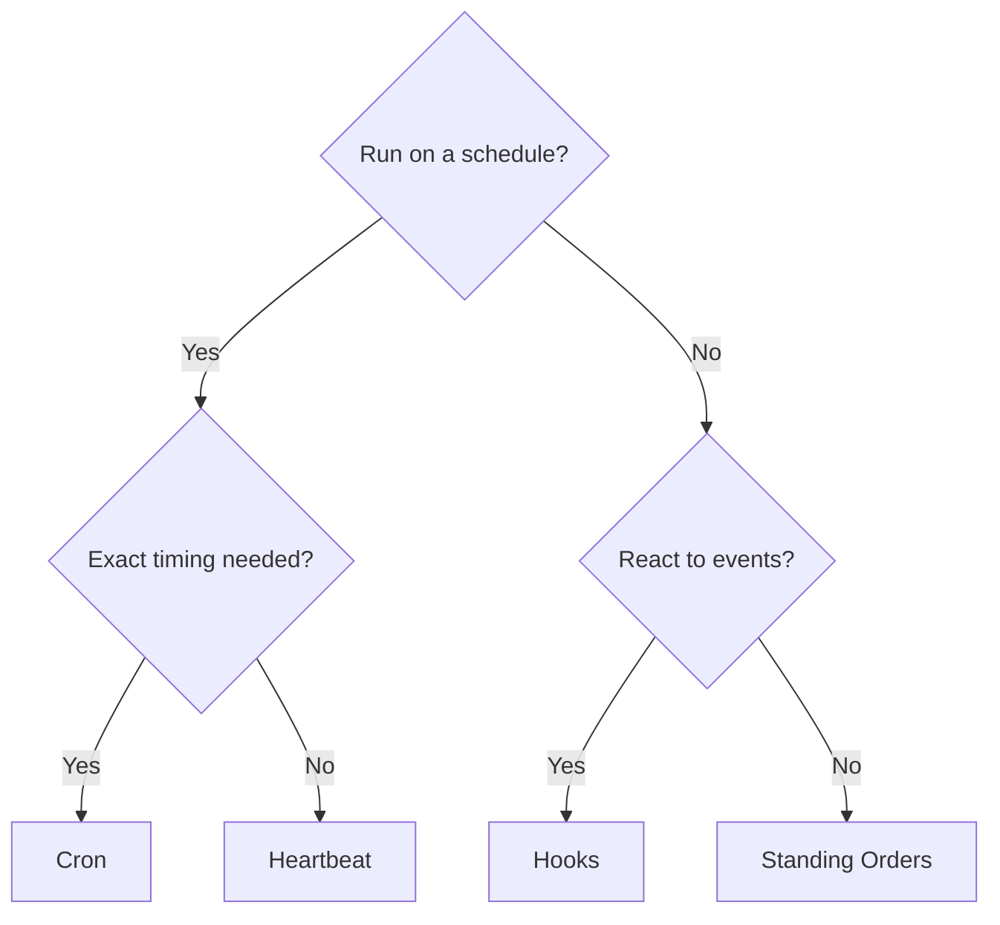

# Automatización

OpenClaw proporciona varios mecanismos de automatización, cada uno adecuado para diferentes casos de uso. Esta página le ayuda a elegir el correcto.

## Guía rápida de decisión

## Mecanismos de un vistazo

| Mecanismo                                                               | Lo que hace                                                                        | Se ejecuta en              | Crea registro de tarea |
| ----------------------------------------------------------------------- | ---------------------------------------------------------------------------------- | -------------------------- | ---------------------- |
| [Latido (Heartbeat)](/en/gateway/heartbeat)                             | Turno periódico de sesión principal: agrupa múltiples comprobaciones               | Sesión principal           | No                     |
| [Cron](/en/automation/cron-jobs)                                        | Trabajos programados con temporización precisa                                     | Sesión principal o aislada | Sí (todos los tipos)   |
| [Tareas en segundo plano](/en/automation/tasks)                         | Rastrea el trabajo desacoplado (cron, ACP, subagentes, CLI)                        | N/A (libro mayor)          | N/A                    |
| [Hooks](/en/automation/hooks)                                           | Scripts controlados por eventos activados por eventos del ciclo de vida del agente | Ejecutor de hooks          | No                     |
| [Órdenes permanentes (Standing Orders)](/en/automation/standing-orders) | Instrucciones persistentes inyectadas en el mensaje del sistema                    | Sesión principal           | No                     |
| [Webhooks](/en/automation/webhook)                                      | Recibe eventos HTTP entrantes y los enruta al agente                               | Puerta de enlace HTTP      | No                     |

### Automatización especializada

| Mecanismo                                                      | Lo que hace                                                      |
| -------------------------------------------------------------- | ---------------------------------------------------------------- |
| [Gmail PubSub](/en/automation/gmail-pubsub)                    | Notificaciones de Gmail en tiempo real a través de Google PubSub |
| [Sondeo (Polling)](/en/automation/poll)                        | Comprobaciones periódicas de fuentes de datos (RSS, API, etc.)   |
| [Supervisión de autenticación](/en/automation/auth-monitoring) | Alertas de estado y vencimiento de credenciales                  |

## Cómo funcionan juntos

Las configuraciones más eficaces combinan múltiples mecanismos:

1. **Latido (Heartbeat)** maneja la monitorización de rutina (bandeja de entrada, calendario, notificaciones) en un turno agrupado cada 30 minutos.
2. **Cron** maneja horarios precisos (informes diarios, revisiones semanales) y recordatorios de una sola vez.
3. **Hooks** reaccionan a eventos específicos (llamadas a herramientas, restablecimientos de sesión, compactación) con scripts personalizados.
4. **Órdenes permanentes (Standing Orders)** dan al agente un contexto persistente ("siempre revisar el tablero del proyecto antes de responder").
5. **Tareas en segundo plano** rastrean automáticamente todo el trabajo desacoplado para que pueda inspeccionarlo y auditarlo.

Consulte [Cron frente a Latido (Heartbeat)](/en/automation/cron-vs-heartbeat) para una comparación detallada de los dos mecanismos de programación.

## Referencias antiguas de ClawFlow

Las notas de la versión y la documentación anteriores pueden mencionar `ClawFlow` o `openclaw flows`, pero la superficie actual de la CLI en este repositorio es `openclaw tasks`.

Consulte [Background Tasks](/en/automation/tasks) para conocer los comandos compatibles del libro de tareas, además de [ClawFlow](/en/automation/clawflow) y [CLI: flows](/en/cli/flows) para notas de compatibilidad.

## Relacionado

- [Cron vs Heartbeat](/en/automation/cron-vs-heartbeat) — guía de comparación detallada
- [ClawFlow](/en/automation/clawflow) — nota de compatibilidad para documentación y notas de la versión anteriores
- [Troubleshooting](/en/automation/troubleshooting) — depuración de problemas de automatización
- [Configuration Reference](/en/gateway/configuration-reference) — todas las claves de configuración
