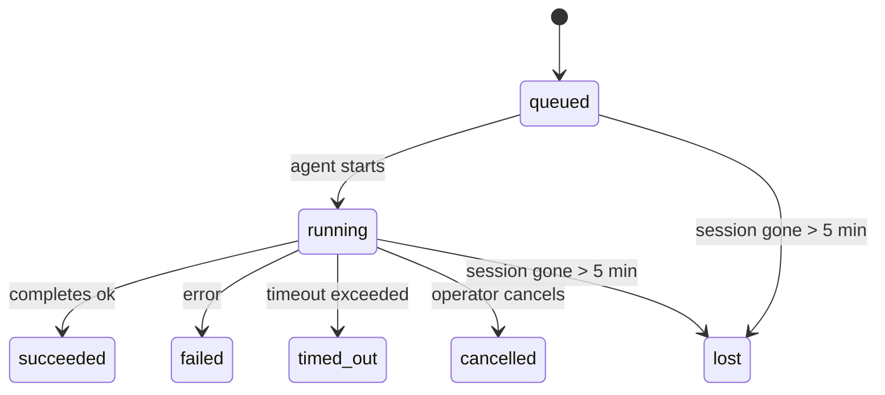

# Tareas en segundo plano

> **¿Buscas programación?** Consulta [Automation & Tasks](/es/automation) para elegir el mecanismo adecuado. Esta página trata sobre el **seguimiento** del trabajo en segundo plano, no sobre su programación.

Las tareas en segundo plano rastrean el trabajo que se ejecuta **fuera de su sesión de conversación principal**:
Ejecuciones de ACP, creaciones de subagentes, ejecuciones de trabajos de cron aislados y operaciones iniciadas por CLI.

Las tareas **no** reemplazan a las sesiones, trabajos de cron o heartbeats; son el **registro de actividad** que registra qué trabajo desacoplado ocurrió, cuándo y si tuvo éxito.

<Note>No todas las ejecuciones de agente crean una tarea. Los turnos de Heartbeat y el chat interactivo normal no la crean. Todas las ejecuciones de cron, creaciones de ACP, creaciones de subagentes y comandos de agente de CLI sí la crean.</Note>

## Resumen

- Las tareas son **registros**, no programadores; cron y heartbeat deciden _cuándo_ se ejecuta el trabajo, las tareas rastrean _qué ocurrió_.
- ACP, subagentes, todos los trabajos de cron y las operaciones de CLI crean tareas. Los turnos de Heartbeat no.
- Cada tarea pasa por `queued → running → terminal` (succeeded, failed, timed_out, cancelled o lost).
- Las tareas cron permanecen activas mientras el tiempo de ejecución cron todavía posee el trabajo; las tareas de CLI respaldadas por chat permanecen activas solo mientras su contexto de ejecución propietario todavía esté activo.
- La finalización se impulsa por eventos (push): el trabajo desvinculado puede notificar directamente o despertar la sesión/latido del solicitante cuando termina, por lo que los bucles de sondeo de estado suelen ser el enfoque incorrecto.
- Las ejecuciones cron aisladas y las finalizaciones de subagentes realizan un mejor esfuerzo para limpiar las pestañas/procesos del navegador rastreados para su sesión secundaria antes de la contabilidad final de limpieza.
- La entrega cron aislada suprime las respuestas principales interinas obsoletas mientras el trabajo del subagente descendente todavía se está drenando y prefiere la salida descendente final cuando llega antes de la entrega.
- Las notificaciones de finalización se entregan directamente a un canal o se ponen en cola para el siguiente latido.
- `openclaw tasks list` muestra todas las tareas; `openclaw tasks audit` destaca los problemas.
- Los registros terminales se mantienen durante 7 días y luego se podan automáticamente.

## Inicio rápido

```bash
# List all tasks (newest first)
openclaw tasks list

# Filter by runtime or status
openclaw tasks list --runtime acp
openclaw tasks list --status running

# Show details for a specific task (by ID, run ID, or session key)
openclaw tasks show <lookup>

# Cancel a running task (kills the child session)
openclaw tasks cancel <lookup>

# Change notification policy for a task
openclaw tasks notify <lookup> state_changes

# Run a health audit
openclaw tasks audit

# Preview or apply maintenance
openclaw tasks maintenance
openclaw tasks maintenance --apply

# Inspect TaskFlow state
openclaw tasks flow list
openclaw tasks flow show <lookup>
openclaw tasks flow cancel <lookup>
```

## Qué crea una tarea

| Fuente                              | Tipo de tiempo de ejecución | Cuándo se crea un registro de tarea                                       | Política de notificación predeterminada |
| ----------------------------------- | --------------------------- | ------------------------------------------------------------------------- | --------------------------------------- |
| Ejecuciones en segundo plano de ACP | `acp`                       | Generar una sesión secundaria de ACP                                      | `done_only`                             |
| Orquestación de subagentes          | `subagent`                  | Generar un subagente a través de `sessions_spawn`                         | `done_only`                             |
| Trabajos cron (todos los tipos)     | `cron`                      | Cada ejecución cron (sesión principal y aislada)                          | `silent`                                |
| Operaciones de CLI                  | `cli`                       | Comandos `openclaw agent` que se ejecutan a través de la puerta de enlace | `silent`                                |
| Trabajos de medios del agente       | `cli`                       | Ejecuciones `video_generate` respaldadas por sesión                       | `silent`                                |

Las tareas cron de la sesión principal usan la política de notificación `silent` de manera predeterminada: crean registros para el seguimiento pero no generan notificaciones. Las tareas cron aisladas también usan `silent` de manera predeterminada, pero son más visibles porque se ejecutan en su propia sesión.

Las ejecuciones de `video_generate` con respaldo de sesión también usan la política de notificación `silent`. Aún crean registros de tareas, pero la finalización se devuelve a la sesión del agente original como un "wake" interno para que el agente pueda escribir el mensaje de seguimiento y adjuntar el video terminado él mismo. Si optas por `tools.media.asyncCompletion.directSend`, las finalizaciones de `music_generate` y `video_generate` asíncronas intentan primero la entrega directa al canal antes de recurrir a la ruta de "wake" de la sesión solicitante.

Mientras una tarea de `video_generate` con respaldo de sesión todavía está activa, la herramienta también actúa como una barrera de protección: las llamadas repetidas a `video_generate` en esa misma sesión devuelven el estado de la tarea activa en lugar de iniciar una segunda generación simultánea. Usa `action: "status"` cuando quieras una búsqueda explícita de progreso/estado desde el lado del agente.

**Lo que no crea tareas:**

- Turnos de Heartbeat — sesión principal; consulta [Heartbeat](/es/gateway/heartbeat)
- Turnos normales de chat interactivo
- Respuestas directas de `/command`

## Ciclo de vida de la tarea



| Estado      | Lo que significa                                                                                              |
| ----------- | ------------------------------------------------------------------------------------------------------------- |
| `queued`    | Creada, esperando a que el agente comience                                                                    |
| `running`   | El turno del agente se está ejecutando activamente                                                            |
| `succeeded` | Completada con éxito                                                                                          |
| `failed`    | Completada con un error                                                                                       |
| `timed_out` | Excedió el tiempo de espera configurado                                                                       |
| `cancelled` | Detenida por el operador mediante `openclaw tasks cancel`                                                     |
| `lost`      | El tiempo de ejecución perdió el estado de respaldo autoritativo después de un período de gracia de 5 minutos |

Las transiciones ocurren automáticamente: cuando finaliza la ejecución del agente asociada, el estado de la tarea se actualiza para coincidir.

`lost` es consciente del tiempo de ejecución (runtime-aware):

- Tareas de ACP: los metadatos de la sesión secundaria de ACP de respaldo desaparecieron.
- Tareas de subagente: la sesión secundaria de respaldo desapareció del almacén del agente de destino.
- Tareas de cron: el tiempo de ejecución de cron ya no rastrea el trabajo como activo.
- Tareas de CLI: las tareas de sesión secundaria aisladas usan la sesión secundaria; las tareas de CLI respaldadas por chat usan el contexto de ejecución en vivo, por lo que las filas de sesión persistentes de canal/grupo/directo no las mantienen vivas.

## Entrega y notificaciones

Cuando una tarea alcanza un estado terminal, OpenClaw te notifica. Hay dos rutas de entrega:

**Entrega directa** — si la tarea tiene un destino de canal (el `requesterOrigin`), el mensaje de finalización va directamente a ese canal (Telegram, Discord, Slack, etc.). Para las finalizaciones de subagente, OpenClaw también preserva el enrutamiento de hilo/tema vinculado cuando está disponible y puede completar una `to` / cuenta faltante desde la ruta almacenada de la sesión solicitante (`lastChannel` / `lastTo` / `lastAccountId`) antes de abandonar la entrega directa.

**Entrega en cola de sesión** — si la entrega directa falla o no se establece ningún origen, la actualización se pone en cola como un evento del sistema en la sesión del solicitante y aparece en el siguiente latido.

<Tip>La finalización de la tarea activa un despertar de latido inmediato para que veas el resultado rápidamente; no tienes que esperar al siguiente tic programado de latido.</Tip>

Eso significa que el flujo de trabajo habitual se basa en el envío: inicia el trabajo desacoplado una vez y luego deja
que el tiempo de ejecución te despierte o te notifique al completarse. Sondea el estado de la tarea solo cuando
necesites depuración, intervención o una auditoría explícita.

### Políticas de notificación

Controla cuánto recibes sobre cada tarea:

| Política                     | Qué se entrega                                                                   |
| ---------------------------- | -------------------------------------------------------------------------------- |
| `done_only` (predeterminado) | Solo el estado terminal (exitoso, fallido, etc.) — **este es el predeterminado** |
| `state_changes`              | Cada transición de estado y actualización de progreso                            |
| `silent`                     | Nada en absoluto                                                                 |

Cambia la política mientras se ejecuta una tarea:

```bash
openclaw tasks notify <lookup> state_changes
```

## Referencia de CLI

### `tasks list`

```bash
openclaw tasks list [--runtime <acp|subagent|cron|cli>] [--status <status>] [--json]
```

Columnas de salida: ID de tarea, Tipo, Estado, Entrega, ID de ejecución, Sesión secundaria, Resumen.

### `tasks show`

```bash
openclaw tasks show <lookup>
```

El token de búsqueda acepta un ID de tarea, ID de ejecución o clave de sesión. Muestra el registro completo incluyendo el tiempo, el estado de entrega, el error y el resumen terminal.

### `tasks cancel`

```bash
openclaw tasks cancel <lookup>
```

Para tareas de ACP y subagentes, esto finaliza la sesión secundaria. Para tareas rastreadas por CLI, la cancelación se registra en el registro de tareas (no hay un identificador de tiempo de ejecución secundario separado). El estado cambia a `cancelled` y se envía una notificación de entrega cuando corresponda.

### `tasks notify`

```bash
openclaw tasks notify <lookup> <done_only|state_changes|silent>
```

### `tasks audit`

```bash
openclaw tasks audit [--json]
```

Muestra problemas operativos. Los hallazgos también aparecen en `openclaw status` cuando se detectan problemas.

| Hallazgo                  | Gravedad | Disparador                                                                 |
| ------------------------- | -------- | -------------------------------------------------------------------------- |
| `stale_queued`            | advertir | En cola durante más de 10 minutos                                          |
| `stale_running`           | error    | En ejecución durante más de 30 minutos                                     |
| `lost`                    | error    | Desapareció la propiedad de la tarea respaldada por el tiempo de ejecución |
| `delivery_failed`         | advertir | Error en la entrega y la política de notificación no es `silent`           |
| `missing_cleanup`         | advertir | Tarea terminal sin marca de tiempo de limpieza                             |
| `inconsistent_timestamps` | advertir | Violación de la línea de tiempo (por ejemplo, finalizó antes de comenzar)  |

### `tasks maintenance`

```bash
openclaw tasks maintenance [--json]
openclaw tasks maintenance --apply [--json]
```

Úselo para obtener una vista previa o aplicar la conciliación, el sellado de limpieza y la poda para
tareas y el estado del flujo de tareas.

La conciliación es consciente del tiempo de ejecución:

- Las tareas de ACP/subagente verifican su sesión secundaria de respaldo.
- Las tareas cron verifican si el tiempo de ejecución cron todavía posee el trabajo.
- Las tareas de CLI respaldadas por chat verifican el contexto de ejecución en vivo propietario, no solo la fila de la sesión de chat.

La limpieza al finalizar también es consciente del tiempo de ejecución:

- La finalización del subagente cierra, con el mejor esfuerzo, las pestañas/procesos del navegador rastreados para la sesión secundaria antes de que continúe la limpieza de anuncio.
- La finalización del cron aislado cierra, con el mejor esfuerzo, las pestañas/procesos del navegador rastreados para la sesión cron antes de que la ejecución se cierre por completo.
- La entrega del cron aislado espera el seguimiento del subagente descendente cuando es necesario y
  suprime el texto de reconocimiento del padre obsoleto en lugar de anunciarlo.
- La entrega de finalización de subagentes prefiere el texto del asistente visible más reciente; si está vacío, recurre al texto de herramienta/toolResult más reciente saneado, y las ejecuciones de llamadas a herramientas que solo terminan por tiempo de espera pueden colapsar en un resumen breve de progreso parcial. Las ejecuciones fallidas terminales anuncian el estado de fallo sin reproducir el texto de respuesta capturado.
- Los fallos de limpieza no ocultan el resultado real de la tarea.

### `tasks flow list|show|cancel`

```bash
openclaw tasks flow list [--status <status>] [--json]
openclaw tasks flow show <lookup> [--json]
openclaw tasks flow cancel <lookup>
```

Use estos cuando el flujo de tareas de orquestación es lo que le importa en lugar de
un registro de tarea en segundo plano individual.

## Tablero de tareas de chat (`/tasks`)

Use `/tasks` en cualquier sesión de chat para ver las tareas en segundo plano vinculadas a esa sesión. El tablero muestra
tareas activas y completadas recientemente con tiempo de ejecución, estado, cronometraje, y detalles de progreso o error.

Cuando la sesión actual no tiene tareas vinculadas visibles, `/tasks` recurre a los conteos de tareas locales del agente
para que aún así obtengas una vista general sin filtrar detalles de otras sesiones.

Para el libro mayor completo del operador, usa la CLI: `openclaw tasks list`.

## Integración de estado (presión de tareas)

`openclaw status` incluye un resumen de tareas de un vistazo:

```
Tasks: 3 queued · 2 running · 1 issues
```

El resumen informa:

- **active** — recuento de `queued` + `running`
- **failures** — recuento de `failed` + `timed_out` + `lost`
- **byRuntime** — desglose por `acp`, `subagent`, `cron`, `cli`

Tanto `/status` como la herramienta `session_status` utilizan una instantánea de tareas con conocimiento de limpieza: se prefieren las tareas activas,
se ocultan las filas completadas obsoletas y los fallos recientes solo aparecen cuando no queda trabajo activo.
Esto mantiene la tarjeta de estado enfocada en lo importante ahora mismo.

## Almacenamiento y mantenimiento

### Dónde residen las tareas

Los registros de tareas persisten en SQLite en:

```
$OPENCLAW_STATE_DIR/tasks/runs.sqlite
```

El registro se carga en memoria al iniciar la puerta de enlace y sincroniza las escrituras con SQLite para garantizar la durabilidad entre reinicios.

### Mantenimiento automático

Un limpiador se ejecuta cada **60 segundos** y maneja tres cosas:

1. **Reconciliation** — verifica si las tareas activas aún tienen soporte de tiempo de ejecución autorizado. Las tareas de ACP/subagente usan el estado de la sesión secundaria, las tareas de cron usan la propiedad del trabajo activo y las tareas de CLI respaldadas por chat usan el contexto de ejecución propietario. Si ese estado de soporte ha desaparecido durante más de 5 minutos, la tarea se marca como `lost`.
2. **Cleanup stamping** — establece una marca de tiempo `cleanupAfter` en las tareas terminales (endedAt + 7 días).
3. **Pruning** — elimina registros pasados su fecha `cleanupAfter`.

**Retención**: los registros de tareas terminales se conservan durante **7 días** y luego se eliminan automáticamente. No se requiere configuración.

## Cómo se relacionan las tareas con otros sistemas

### Tareas y Task Flow

[Task Flow](/es/automation/taskflow) es la capa de orquestación de flujos por encima de las tareas en segundo plano. Un único flujo puede coordinar múltiples tareas durante su vida útil utilizando modos de sincronización gestionados o reflejados. Usa `openclaw tasks` para inspeccionar registros de tareas individuales y `openclaw tasks flow` para inspeccionar el flujo de orquestación.

Consulta [Task Flow](/es/automation/taskflow) para obtener más detalles.

### Tareas y cron

Una **definición** de trabajo cron reside en `~/.openclaw/cron/jobs.json`; el estado de ejecución en tiempo de ejecución reside junto a ella en `~/.openclaw/cron/jobs-state.json`. **Todas** las ejecuciones de cron crean un registro de tarea, tanto en la sesión principal como en las aisladas. Las tareas cron de sesión principal tienen como valor predeterminado la política de notificación `silent` para que realicen un seguimiento sin generar notificaciones.

Consulta [Cron Jobs](/es/automation/cron-jobs).

### Tareas y heartbeat

Las ejecuciones de Heartbeat son turnos de sesión principal: no crean registros de tareas. Cuando se completa una tarea, puede activar una activación de heartbeat para que vea el resultado rápidamente.

Consulta [Heartbeat](/es/gateway/heartbeat).

### Tareas y sesiones

Una tarea puede hacer referencia a una `childSessionKey` (donde se ejecuta el trabajo) y a una `requesterSessionKey` (quien la inició). Las sesiones son el contexto de la conversación; las tareas son el seguimiento de la actividad encima de eso.

### Tareas y ejecuciones de agentes

El `runId` de una tarea se vincula a la ejecución del agente que realiza el trabajo. Los eventos del ciclo de vida del agente (inicio, final, error) actualizan automáticamente el estado de la tarea; no necesitas gestionar el ciclo de vida manualmente.

## Relacionado

- [Automation & Tasks](/es/automation) — todos los mecanismos de automatización de un vistazo
- [Task Flow](/es/automation/taskflow) — orquestación de flujos por encima de las tareas
- [Scheduled Tasks](/es/automation/cron-jobs) — programación del trabajo en segundo plano
- [Heartbeat](/es/gateway/heartbeat) — turnos periódicos de la sesión principal
- [CLI: Tareas](/es/cli/tasks) — Referencia de comandos de CLI
