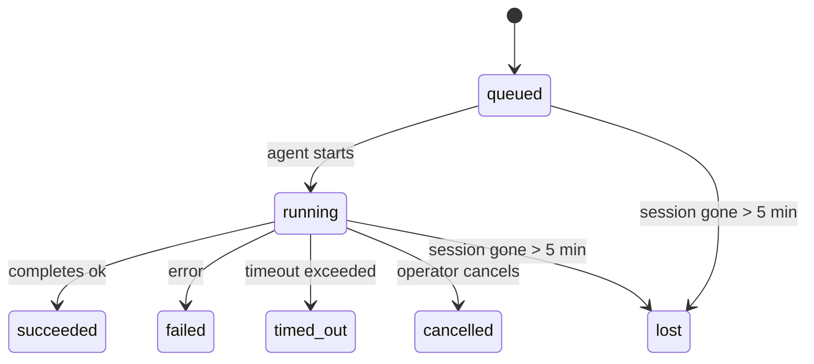

<Note>¿Buscas programación? Consulta [Automatización y tareas](/es/automation) para elegir el mecanismo adecuado. Esta página es el registro de actividad del trabajo en segundo plano, no el programador.</Note>

Las tareas en segundo plano rastrean el trabajo que se ejecuta **fuera de tu sesión de conversación principal**: ejecuciones de ACP, creaciones de subagentes, ejecuciones de trabajos de cron aislados y operaciones iniciadas por CLI.

Las tareas **no** reemplazan a las sesiones, trabajos de cron o heartbeats; son el **registro de actividad** que registra qué trabajo desacoplado ocurrió, cuándo y si tuvo éxito.

<Note>No todas las ejecuciones de agente crean una tarea. Los turnos de Heartbeat y el chat interactivo normal no la crean. Todas las ejecuciones de cron, creaciones de ACP, creaciones de subagentes y comandos de agente de CLI sí la crean.</Note>

## Resumen

- Las tareas son **registros**, no programadores; cron y heartbeat deciden _cuándo_ se ejecuta el trabajo, las tareas rastrean _qué ocurrió_.
- ACP, subagentes, todos los trabajos de cron y las operaciones de CLI crean tareas. Los turnos de Heartbeat no.
- Cada tarea pasa a través de `queued → running → terminal` (succeeded, failed, timed_out, cancelled o lost).
- Las tareas de cron se mantienen activas mientras el tiempo de ejecución de cron sea propietario del trabajo; si el
  estado del tiempo de ejecución en memoria desaparece, el mantenimiento de tareas verifica primero el historial duradero de
  ejecuciones de cron antes de marcar una tarea como perdida.
- La finalización se impulsa por eventos (push): el trabajo desvinculado puede notificar directamente o despertar la sesión/latido del solicitante cuando termina, por lo que los bucles de sondeo de estado suelen ser el enfoque incorrecto.
- Las ejecuciones cron aisladas y las finalizaciones de subagentes realizan un mejor esfuerzo para limpiar las pestañas/procesos del navegador rastreados para su sesión secundaria antes de la contabilidad final de limpieza.
- La entrega de cron aislada suprime las respuestas principales interinas obsoletas mientras el trabajo de subagente descendente aún se está drenando, y prefiere la salida descendente final cuando llega antes de la entrega.
- Las notificaciones de finalización se entregan directamente a un canal o se ponen en cola para el siguiente latido.
- `openclaw tasks list` muestra todas las tareas; `openclaw tasks audit` muestra los problemas.
- Los registros terminales se mantienen durante 7 días y luego se podan automáticamente.

## Inicio rápido

<Tabs>
  <Tab title="Listar y filtrar">
    ```bash
    # List all tasks (newest first)
    openclaw tasks list

    # Filter by runtime or status
    openclaw tasks list --runtime acp
    openclaw tasks list --status running
    ```

  </Tab>
  <Tab title="Inspect">
    ```bash
    # Show details for a specific task (by ID, run ID, or session key)
    openclaw tasks show <lookup>
    ```
  </Tab>
  <Tab title="Cancel and notify">
    ```bash
    # Cancel a running task (kills the child session)
    openclaw tasks cancel <lookup>

    # Change notification policy for a task
    openclaw tasks notify <lookup> state_changes
    ```

  </Tab>
  <Tab title="Audit and maintenance">
    ```bash
    # Run a health audit
    openclaw tasks audit

    # Preview or apply maintenance
    openclaw tasks maintenance
    openclaw tasks maintenance --apply
    ```

  </Tab>
  <Tab title="Task flow">
    ```bash
    # Inspect TaskFlow state
    openclaw tasks flow list
    openclaw tasks flow show <lookup>
    openclaw tasks flow cancel <lookup>
    ```
  </Tab>
</Tabs>

## Qué crea una tarea

| Fuente                              | Tipo de tiempo de ejecución | Cuándo se crea un registro de tarea                                       | Política de notificación predeterminada |
| ----------------------------------- | --------------------------- | ------------------------------------------------------------------------- | --------------------------------------- |
| Ejecuciones en segundo plano de ACP | `acp`                       | Generar una sesión secundaria de ACP                                      | `done_only`                             |
| Orquestación de subagentes          | `subagent`                  | Generar un subagente mediante `sessions_spawn`                            | `done_only`                             |
| Trabajos de cron (todos los tipos)  | `cron`                      | Cada ejecución de cron (sesión principal y aislada)                       | `silent`                                |
| Operaciones de CLI                  | `cli`                       | Comandos `openclaw agent` que se ejecutan a través de la puerta de enlace | `silent`                                |
| Trabajos de medios del agente       | `cli`                       | Ejecuciones de `video_generate` con respaldo de sesión                    | `silent`                                |

<AccordionGroup>
  <Accordion title="Valores predeterminados de notificación para cron y medios">
    Las tareas cron de sesión principal utilizan la política de notificación `silent` de manera predeterminada: crean registros para el seguimiento pero no generan notificaciones. Las tareas cron aisladas también tienen `silent` como valor predeterminado, pero son más visibles porque se ejecutan en su propia sesión.

    Las ejecuciones de `video_generate` respaldadas por sesión también utilizan la política de notificación `silent`. Aún crean registros de tareas, pero la finalización se devuelve a la sesión del agente original como un "wake" (activación) interno para que el agente pueda escribir el mensaje de seguimiento y adjuntar el video terminado por sí mismo. Si opta por `tools.media.asyncCompletion.directSend`, las finalizaciones asíncronas de `music_generate` y `video_generate` intentan primero la entrega por canal directo antes de recurrir a la ruta de activación de la sesión solicitante.

  </Accordion>
  <Accordion title="Guarda rail de video_generate simultáneo">
    Mientras una tarea de `video_generate` respaldada por sesión sigue activa, la herramienta también actúa como un "guardrail" (límite de seguridad): las llamadas repetidas a `video_generate` en esa misma sesión devuelven el estado de la tarea activa en lugar de iniciar una segunda generación simultánea. Use `action: "status"` cuando desee una consulta explícita de progreso/estado desde el lado del agente.
  </Accordion>
  <Accordion title="Qué no crea tareas">
    - Turnos de Heartbeat — sesión principal; consulte [Heartbeat](/es/gateway/heartbeat)
    - Turnos normales de chat interactivo
    - Respuestas directas de `/command`
  </Accordion>
</AccordionGroup>

## Ciclo de vida de la tarea



| Estado      | Lo que significa                                                                                              |
| ----------- | ------------------------------------------------------------------------------------------------------------- |
| `queued`    | Creada, esperando a que el agente se inicie                                                                   |
| `running`   | El turno del agente se está ejecutando activamente                                                            |
| `succeeded` | Completada exitosamente                                                                                       |
| `failed`    | Completada con un error                                                                                       |
| `timed_out` | Excedió el tiempo de espera configurado                                                                       |
| `cancelled` | Detenida por el operador mediante `openclaw tasks cancel`                                                     |
| `lost`      | El tiempo de ejecución perdió el estado de respaldo autoritativo después de un período de gracia de 5 minutos |

Las transiciones ocurren automáticamente: cuando finaliza la ejecución del agente asociado, el estado de la tarea se actualiza para coincidir.

La finalización de la ejecución del agente es autoritativa para los registros de tareas activas. Una ejecución desasociada exitosa se finaliza como `succeeded`, los errores de ejecución ordinarios se finalizan como `failed`, y los resultados de tiempo de espera o interrupción se finalizan como `timed_out`. Si un operador ya canceló la tarea, o el tiempo de ejecución ya registró un estado terminal más fuerte como `failed`, `timed_out` o `lost`, una señal de éxito posterior no degrada ese estado terminal.

`lost` es consciente del tiempo de ejecución:

- Tareas de ACP: los metadatos de la sesión secundaria de respaldo de ACP desaparecieron.
- Tareas de subagente: la sesión secundaria de respaldo desapareció del almacén del agente de destino.
- Tareas de cron: el tiempo de ejecución de cron ya no rastrea el trabajo como activo y duradero
  el historial de ejecuciones de cron no muestra un resultado terminal para esa ejecución. La auditoría
  de CLI fuera de línea no trata su propio estado vacío del tiempo de ejecución de cron en proceso como autoridad.
- Tareas de CLI: las tareas de sesión secundaria aisladas utilizan la sesión secundaria; las tareas de
  CLI con respaldo de chat utilizan el contexto de ejecución en vivo en su lugar, por lo que las filas de sesión
  persistentes de canal/grupo/directo no las mantienen vivas. Las ejecuciones de
  `openclaw agent` con respaldo de puerta de enlace también se finalizan a partir de su resultado de ejecución, por lo que las ejecuciones
  completas no permanecen activas hasta que el limpiador las marca como `lost`.

## Entrega y notificaciones

Cuando una tarea alcanza un estado terminal, OpenClaw le notifica. Hay dos rutas de entrega:

**Entrega directa** — si la tarea tiene un objetivo de canal (el `requesterOrigin`), el mensaje de finalización va directamente a ese canal (Telegram, Discord, Slack, etc.). Para las finalizaciones de subagente, OpenClaw también preserva el enrutamiento de hilo/tema vinculado cuando está disponible y puede completar una `to` / cuenta faltante a partir de la ruta almacenada de la sesión solicitante (`lastChannel` / `lastTo` / `lastAccountId`) antes de renunciar a la entrega directa.

**Entrega en cola de sesión** — si la entrega directa falla o no se ha establecido un origen, la actualización se pone en cola como un evento del sistema en la sesión del solicitante y aparece en el siguiente latido.

<Tip>La finalización de la tarea activa un despertar inmediato del latido para que vea el resultado rápidamente; no tiene que esperar al siguiente tick programado del latido.</Tip>

Esto significa que el flujo de trabajo habitual se basa en el envío (push): inicie el trabajo desvinculado una vez y luego deje que el tiempo de ejecución lo despierte o le notifique al completarse. Sondee el estado de la tarea solo cuando necesite depuración, intervención o una auditoría explícita.

### Políticas de notificación

Controle cuánto recibe sobre cada tarea:

| Política                     | Qué se entrega                                                                   |
| ---------------------------- | -------------------------------------------------------------------------------- |
| `done_only` (predeterminado) | Solo el estado terminal (exitoso, fallido, etc.) — **este es el predeterminado** |
| `state_changes`              | Cada transición de estado y actualización de progreso                            |
| `silent`                     | Nada en absoluto                                                                 |

Cambiar la política mientras se ejecuta una tarea:

```bash
openclaw tasks notify <lookup> state_changes
```

## Referencia de la CLI

<AccordionGroup>
  <Accordion title="tasks list">
    ```bash
    openclaw tasks list [--runtime <acp|subagent|cron|cli>] [--status <status>] [--json]
    ```

    Columnas de salida: ID de tarea, Tipo, Estado, Entrega, ID de ejecución, Sesión secundaria, Resumen.

  </Accordion>
  <Accordion title="tasks show">
    ```bash
    openclaw tasks show <lookup>
    ```

    El token de búsqueda acepta un ID de tarea, ID de ejecución o clave de sesión. Muestra el registro completo, incluyendo el tiempo, el estado de entrega, el error y el resumen terminal.

  </Accordion>
  <Accordion title="tasks cancel">
    ```bash
    openclaw tasks cancel <lookup>
    ```

    Para tareas de ACP y subagentes, esto termina la sesión secundaria. Para tareas rastreadas por la CLI, la cancelación se registra en el registro de tareas (no hay un identificador de tiempo de ejecución secundario separado). El estado cambia a `cancelled` y se envía una notificación de entrega cuando corresponda.

  </Accordion>
  <Accordion title="tasks notify">
    ```bash
    openclaw tasks notify <lookup> <done_only|state_changes|silent>
    ```
  </Accordion>
  <Accordion title="auditoría de tareas">
    ```bash
    openclaw tasks audit [--json]
    ```

    Muestra problemas operativos. Los hallazgos también aparecen en `openclaw status` cuando se detectan problemas.

    | Hallazgo                   | Gravedad   | Activador                                                                                                      |
    | ------------------------- | ---------- | ------------------------------------------------------------------------------------------------------------ |
    | `stale_queued`            | advertencia       | En cola durante más de 10 minutos                                                                              |
    | `stale_running`           | error      | En ejecución durante más de 30 minutos                                                                             |
    | `lost`                    | advertencia/error | La propiedad de la tarea respaldada por el runtime desapareció; las tareas perdidas retenidas advierten hasta `cleanupAfter`, luego se convierten en errores |
    | `delivery_failed`         | advertencia       | La entrega falló y la política de notificación no es `silent`                                                            |
    | `missing_cleanup`         | advertencia       | Tarea terminal sin marca de tiempo de limpieza                                                                      |
    | `inconsistent_timestamps` | advertencia       | Violación de la línea de tiempo (por ejemplo, terminó antes de comenzar)                                                        |

  </Accordion>
  <Accordion title="tasks maintenance">
    ```bash
    openclaw tasks maintenance [--json]
    openclaw tasks maintenance --apply [--json]
    ```

    Utilice esto para previsualizar o aplicar la conciliación, el sellado de limpieza y la poda para las tareas y el estado de Task Flow.

    La conciliación es consciente del tiempo de ejecución:

    - Las tareas de ACP/subagente verifican su sesión secundaria de respaldo.
    - Las tareas de Cron verifican si el tiempo de ejecución de cron todavía posee el trabajo, luego recuperan el estado terminal de los registros de ejecución de cron/estado del trabajo persistido antes de recurrir a `lost`. Solo el proceso Gateway es autorizado para el conjunto de trabajos activos de cron en memoria; la auditoría de CLI sin conexión utiliza el historial duradero, pero no marca una tarea de cron como perdida solo porque ese conjunto local está vacío.
    - Las tareas de CLI respaldadas por chat verifican el contexto de ejecución en vivo propietario, no solo la fila de la sesión de chat.

    La limpieza al completar también es consciente del tiempo de ejecución:

    - La finalización del subagente cierra, con el mejor esfuerzo, las pestañas/procesos del navegador rastreados para la sesión secundaria antes de que continúe la limpieza del anuncio.
    - La finalización de cron aislado cierra, con el mejor esfuerzo, las pestañas/procesos del navegador rastreados para la sesión de cron antes de que la ejecución se cierre por completo.
    - La entrega de cron aislado espera el seguimiento del subagente descendente cuando es necesario y suprime el texto de reconocimiento padre obsoleto en lugar de anunciarlo.
    - La entrega de finalización del subagente prefiere el último texto visible del asistente; si está vacío, recurre al texto de herramienta/toolResult más reciente saneado, y las ejecuciones de llamadas a herramienta solo por tiempo de espera pueden colapsarse a un breve resumen de progreso parcial. Las ejecuciones fallidas terminales anuncian el estado de fallo sin reproducir el texto de respuesta capturado.
    - Los fallos de limpieza no enmascaran el resultado real de la tarea.

  </Accordion>
  <Accordion title="tasks flow list | show | cancel">
    ```bash
    openclaw tasks flow list [--status <status>] [--json]
    openclaw tasks flow show <lookup> [--json]
    openclaw tasks flow cancel <lookup>
    ```

    Utilice estos cuando el flujo de tareas (Task Flow) de orquestación es lo que le importa en lugar de un registro individual de tarea en segundo plano.

  </Accordion>
</AccordionGroup>

## Tablero de tareas de chat (`/tasks`)

Use `/tasks` en cualquier sesión de chat para ver las tareas en segundo plano vinculadas a esa sesión. El tablero muestra tareas activas y completadas recientemente con detalles de tiempo de ejecución, estado, cronometraje y progreso o error.

Cuando la sesión actual no tiene tareas vinculadas visibles, `/tasks` recurre a los recuentos de tareas locales del agente para que aún obtengas una descripción general sin filtrar detalles de otras sesiones.

Para el libro mayor completo del operador, usa la CLI: `openclaw tasks list`.

## Integración de estado (presión de tareas)

`openclaw status` incluye un resumen de tareas de un vistazo:

```
Tasks: 3 queued · 2 running · 1 issues
```

El resumen informa:

- **activas** — recuento de `queued` + `running`
- **fallos** — recuento de `failed` + `timed_out` + `lost`
- **porRuntime** — desglose por `acp`, `subagent`, `cron`, `cli`

Tanto `/status` como la herramienta `session_status` utilizan una instantánea de tareas con limpieza: se prefieren las tareas activas, se ocultan las filas completadas obsoletas y los fallos recientes solo aparecen cuando no queda trabajo activo. Esto mantiene la tarjeta de estado enfocada en lo importante ahora mismo.

## Almacenamiento y mantenimiento

### Dónde residen las tareas

Los registros de tareas persisten en SQLite en:

```
$OPENCLAW_STATE_DIR/tasks/runs.sqlite
```

El registro se carga en memoria al iniciar la puerta de enlace y sincroniza las escrituras en SQLite para garantizar la durabilidad a través de reinicios.
La Gateway mantiene el registro de escritura anticipada (write-ahead log) de SQLite limitado utilizando el umbral de punto de control automático predeterminado de SQLite, además de puntos de control periódicos y de cierre `TRUNCATE`.

### Mantenimiento automático

Un limpiador se ejecuta cada **60 segundos** y maneja tres cosas:

<Steps>
  <Step title="Reconciliación">
    Comprueba si las tareas activas todavía tienen respaldo de runtime autorizado. Las tareas de ACP/subagente utilizan el estado de sub-sesión, las tareas de cron utilizan la propiedad de trabajo activo y las tareas de CLI respaldadas por chat utilizan el contexto de ejecución propietario. Si ese estado de respaldo ha desaparecido durante más de 5 minutos, la tarea se marca como `lost`.
  </Step>
  <Step title="Limpieza de marcas">Establece una marca de tiempo `cleanupAfter` en las tareas terminales (endedAt + 7 días). Durante la retención, las tareas perdidas todavía aparecen en la auditoría como advertencias; después de que `cleanupAfter` expire o cuando falten los metadatos de limpieza, son errores.</Step>
  <Step title="Poda">Elimina registros pasados su fecha `cleanupAfter`.</Step>
</Steps>

<Note>**Retención:** los registros de tareas terminales se conservan durante **7 días** y luego se eliminan automáticamente. No se necesita configuración.</Note>

## Cómo se relacionan las tareas con otros sistemas

<AccordionGroup>
  <Accordion title="Tareas y Task Flow">
    [Task Flow](/es/automation/taskflow) es la capa de orquestación de flujos por encima de las tareas en segundo plano. Un solo flujo puede coordinar múltiples tareas a lo largo de su vida útil utilizando modos de sincronización administrados o reflejados. Use `openclaw tasks` para inspeccionar registros de tareas individuales y `openclaw tasks flow` para inspeccionar el flujo de orquestación.

    Consulte [Task Flow](/es/automation/taskflow) para obtener más detalles.

  </Accordion>
  <Accordion title="Tareas y cron">
    Una **definición** de trabajo cron vive en `~/.openclaw/cron/jobs.json`; el estado de ejecución en tiempo de ejecución vive junto a él en `~/.openclaw/cron/jobs-state.json`. **Cada** ejecución de cron crea un registro de tarea, tanto de sesión principal como aislada. Las tareas cron de sesión principal tienen por defecto la política de notificación `silent` para que realicen un seguimiento sin generar notificaciones.

    Consulte [Cron Jobs](/es/automation/cron-jobs).

  </Accordion>
  <Accordion title="Tareas y heartbeat">
    Las ejecuciones de heartbeat son turnos de sesión principal; no crean registros de tareas. Cuando una tarea se completa, puede activar un despertar de heartbeat para que vea el resultado rápidamente.

    Consulte [Heartbeat](/es/gateway/heartbeat).

  </Accordion>
  <Accordion title="Tareas y sesiones">
    Una tarea puede hacer referencia a una `childSessionKey` (donde se ejecuta el trabajo) y una `requesterSessionKey` (quién la inició). Las sesiones son el contexto de la conversación; las tareas son el seguimiento de la actividad sobre eso.
  </Accordion>
  <Accordion title="Tareas y ejecuciones de agentes">
    El `runId` de una tarea se vincula a la ejecución del agente que realiza el trabajo. Los eventos del ciclo de vida del agente (inicio, fin, error) actualizan automáticamente el estado de la tarea; no necesita gestionar el ciclo de vida manualmente.
  </Accordion>
</AccordionGroup>

## Relacionado

- [Automatización y tareas](/es/automation) — todos los mecanismos de automatización en un vistazo
- [CLI: Tareas](/es/cli/tasks) — referencia de comandos de la CLI
- [Heartbeat](/es/gateway/heartbeat) — turnos periódicos de la sesión principal
- [Tareas programadas](/es/automation/cron-jobs) — programación de trabajo en segundo plano
- [Flujo de tareas](/es/automation/taskflow) — orquestación de flujos sobre las tareas
