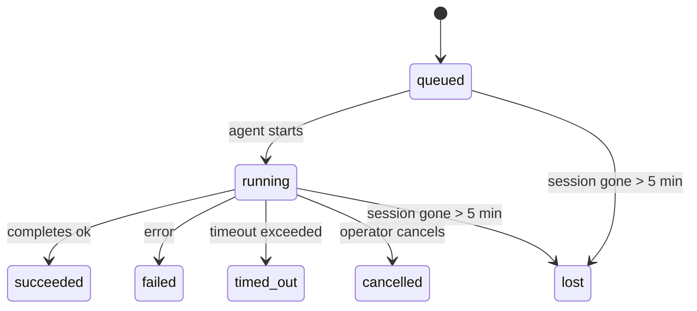

# Tareas en segundo plano

> **¿Cron vs Heartbeat vs Tareas?** Consulte [Cron vs Heartbeat](/en/automation/cron-vs-heartbeat) para elegir el mecanismo de programación adecuado. Esta página cubre el **seguimiento** del trabajo en segundo plano, no su programación.

Las tareas en segundo plano rastrean el trabajo que se ejecuta **fuera de su sesión de conversación principal**:
Ejecuciones de ACP, creaciones de subagentes, ejecuciones de trabajos de cron aislados y operaciones iniciadas por CLI.

Las tareas **no** reemplazan a las sesiones, trabajos de cron o heartbeats; son el **registro de actividad** que registra qué trabajo desacoplado ocurrió, cuándo y si tuvo éxito.

<Note>No todas las ejecuciones de agente crean una tarea. Los turnos de Heartbeat y el chat interactivo normal no la crean. Todas las ejecuciones de cron, creaciones de ACP, creaciones de subagentes y comandos de agente de CLI sí la crean.</Note>

## Resumen

- Las tareas son **registros**, no programadores; cron y heartbeat deciden _cuándo_ se ejecuta el trabajo, las tareas rastrean _qué ocurrió_.
- ACP, subagentes, todos los trabajos de cron y las operaciones de CLI crean tareas. Los turnos de Heartbeat no.
- Cada tarea pasa por `queued → running → terminal` (succeeded, failed, timed_out, cancelled o lost).
- Las notificaciones de finalización se entregan directamente a un canal o se ponen en cola para el próximo heartbeat.
- `openclaw tasks list` muestra todas las tareas; `openclaw tasks audit` muestra los problemas.
- Los registros terminales se mantienen durante 7 días y luego se eliminan automáticamente.

## Inicio rápido

```bash
# List all tasks (newest first)
openclaw tasks list

# Filter by runtime or status
openclaw tasks list --runtime acp
openclaw tasks list --status running

# Show details for a specific task (by ID, run ID, or session key)
openclaw tasks show <lookup>

# Cancel a running task (kills the child session)
openclaw tasks cancel <lookup>

# Change notification policy for a task
openclaw tasks notify <lookup> state_changes

# Run a health audit
openclaw tasks audit
```

## Qué crea una tarea

| Fuente                              | Tipo de tiempo de ejecución | Cuándo se crea un registro de tarea                                       | Política de notificación predeterminada |
| ----------------------------------- | --------------------------- | ------------------------------------------------------------------------- | --------------------------------------- |
| Ejecuciones en segundo plano de ACP | `acp`                       | Al generar una sesión secundaria de ACP                                   | `done_only`                             |
| Orquestación de subagentes          | `subagent`                  | Al generar un subagente mediante `sessions_spawn`                         | `done_only`                             |
| Trabajos de cron (todos los tipos)  | `cron`                      | Cada ejecución de cron (sesión principal y aislada)                       | `silent`                                |
| Operaciones de CLI                  | `cli`                       | Comandos `openclaw agent` que se ejecutan a través de la puerta de enlace | `done_only`                             |

Las tareas de cron de sesión principal usan la política de notificación `silent` de manera predeterminada: crean registros para el seguimiento pero no generan notificaciones. Las tareas de cron aisladas también tienen como valor predeterminado `silent` pero son más visibles porque se ejecutan en su propia sesión.

**Lo que no crea tareas:**

- Turnos de Heartbeat — sesión principal; consulte [Heartbeat](/en/gateway/heartbeat)
- Turnos normales de chat interactivo
- Respuestas `/command` directas

## Ciclo de vida de la tarea



| Estado      | Qué significa                                                                                         |
| ----------- | ----------------------------------------------------------------------------------------------------- |
| `queued`    | Creado, esperando a que el agente se inicie                                                           |
| `running`   | El turno del agente se está ejecutando activamente                                                    |
| `succeeded` | Completado con éxito                                                                                  |
| `failed`    | Completado con un error                                                                               |
| `timed_out` | Excedió el tiempo de espera configurado                                                               |
| `cancelled` | Detenido por el operador mediante `openclaw tasks cancel`                                             |
| `lost`      | La sesión secundaria de respaldo desapareció (detectado después de un período de gracia de 5 minutos) |

Las transiciones ocurren automáticamente; cuando finaliza la ejecución del agente asociada, el estado de la tarea se actualiza para coincidir.

## Entrega y notificaciones

Cuando una tarea alcanza un estado terminal, OpenClaw le notifica. Hay dos rutas de entrega:

**Entrega directa** — si la tarea tiene un destino de canal (el `requesterOrigin`), el mensaje de finalización va directamente a ese canal (Telegram, Discord, Slack, etc.).

**Entrega en cola de sesión** — si la entrega directa falla o no se establece un origen, la actualización se pone en cola como un evento del sistema en la sesión del solicitante y aparece en el siguiente latido.

<Tip>La finalización de la tarea activa un despertar inmediato de latido para que vea el resultado rápidamente; no tiene que esperar el siguiente tic programado de latido.</Tip>

### Políticas de notificación

Controle cuánto se entera sobre cada tarea:

| Política                     | Qué se entrega                                                                   |
| ---------------------------- | -------------------------------------------------------------------------------- |
| `done_only` (predeterminado) | Solo el estado terminal (exitoso, fallido, etc.) — **este es el predeterminado** |
| `state_changes`              | Cada transición de estado y actualización de progreso                            |
| `silent`                     | Nada en absoluto                                                                 |

Cambie la política mientras se ejecuta una tarea:

```bash
openclaw tasks notify <lookup> state_changes
```

## Referencia de CLI

### `tasks list`

```bash
openclaw tasks list [--runtime <acp|subagent|cron|cli>] [--status <status>] [--json]
```

Columnas de salida: ID de tarea, Tipo, Estado, Entrega, ID de ejecución, Sesión secundaria, Resumen.

### `tasks show`

```bash
openclaw tasks show <lookup>
```

El token de búsqueda acepta un ID de tarea, ID de ejecución o clave de sesión. Muestra el registro completo incluyendo el momento, el estado de entrega, el error y el resumen terminal.

### `tasks cancel`

```bash
openclaw tasks cancel <lookup>
```

Para tareas de ACP y subagentes, esto termina la sesión secundaria. El estado cambia a `cancelled` y se envía una notificación de entrega.

### `tasks notify`

```bash
openclaw tasks notify <lookup> <done_only|state_changes|silent>
```

### `tasks audit`

```bash
openclaw tasks audit [--json]
```

Muestra problemas operativos. Los hallazgos también aparecen en `openclaw status` cuando se detectan problemas.

| Hallazgo                  | Gravedad    | Disparador                                                               |
| ------------------------- | ----------- | ------------------------------------------------------------------------ |
| `stale_queued`            | advertencia | En cola durante más de 10 minutos                                        |
| `stale_running`           | error       | En ejecución durante más de 30 minutos                                   |
| `lost`                    | error       | La sesión de respaldo ha desaparecido                                    |
| `delivery_failed`         | advertencia | Fallo en la entrega y la política de notificación no es `silent`         |
| `missing_cleanup`         | advertencia | Tarea terminal sin marca de tiempo de limpieza                           |
| `inconsistent_timestamps` | advertencia | Violación de la línea de tiempo (por ejemplo, terminó antes de comenzar) |

## Tablero de tareas de chat (`/tasks`)

Use `/tasks` en cualquier sesión de chat para ver las tareas en segundo plano vinculadas a esa sesión. El tablero muestra tareas activas y completadas recientemente con tiempo de ejecución, estado, cronometraje y detalles de progreso o error.

Cuando la sesión actual no tiene tareas vinculadas visibles, `/tasks` recurre a los recuentos de tareas locales del agente para que todavía obtenga una descripción general sin filtrar detalles de otras sesiones.

Para el libro mayor completo del operador, use la CLI: `openclaw tasks list`.

## Integración de estado (presión de tareas)

`openclaw status` incluye un resumen de tareas de un vistazo:

```
Tasks: 3 queued · 2 running · 1 issues
```

El resumen informa:

- **activo** — recuento de `queued` + `running`
- **fallos** — recuento de `failed` + `timed_out` + `lost`
- **porTiempoDeEjecución** — desglose por `acp`, `subagent`, `cron`, `cli`

Tanto `/status` como la herramienta `session_status` utilizan una instantánea de tareas con conocimiento de limpieza: se prefieren las tareas activas, se ocultan las filas completadas obsoletas y los fallos recientes solo aparecen cuando no queda trabajo activo. Esto mantiene la tarjeta de estado centrada en lo importante ahora mismo.

## Almacenamiento y mantenimiento

### Dónde residen las tareas

Los registros de las tareas persisten en SQLite en:

```
$OPENCLAW_STATE_DIR/tasks/runs.sqlite
```

El registro se carga en memoria al iniciar la puerta de enlace y sincroniza las escrituras en SQLite para garantizar la durabilidad tras los reinicios.

### Mantenimiento automático

Un barrido se ejecuta cada **60 segundos** y se encarga de tres cosas:

1. **Conciliación** — comprueba si las sesiones de respaldo de las tareas activas todavía existen. Si una sesión secundaria ha estado ausente durante más de 5 minutos, la tarea se marca como `lost`.
2. **Limpieza de estampación** — establece una marca de tiempo `cleanupAfter` en las tareas terminales (endedAt + 7 días).
3. **Poda** — elimina los registros pasados su fecha `cleanupAfter`.

**Retención**: los registros de tareas terminales se conservan durante **7 días** y luego se eliminan automáticamente. No se requiere ninguna configuración.

## Cómo se relacionan las tareas con otros sistemas

### Tareas y referencias a flujos antiguos

Algunas notas de la versión y documentación antiguas de OpenClaw se referían a la gestión de tareas como `ClawFlow` y documentaban una superficie de comandos `openclaw flows`.

En la base de código actual, la superficie del operador admitida es `openclaw tasks`. Consulte [ClawFlow](/en/automation/clawflow) y [CLI: flows](/en/cli/flows) para obtener notas de compatibilidad que asignan esas referencias anteriores a los comandos de tareas actuales.

### Tareas y cron

Una **definición** de tarea cron vive en `~/.openclaw/cron/jobs.json`. **Cada** ejecución de cron crea un registro de tarea, tanto de sesión principal como aislada. Las tareas de cron de sesión principal tienen por defecto la política de notificación `silent` para que realicen un seguimiento sin generar notificaciones.

Consulte [Trabajos de Cron](/en/automation/cron-jobs).

### Tareas y latido

Las ejecuciones de Heartbeat son turnos de la sesión principal: no crean registros de tareas. Cuando se completa una tarea, puede activar una activación de Heartbeat para que veas el resultado rápidamente.

Consulta [Heartbeat](/en/gateway/heartbeat).

### Tareas y sesiones

Una tarea puede hacer referencia a un `childSessionKey` (donde se ejecuta el trabajo) y un `requesterSessionKey` (quien la inició). Las sesiones son el contexto de la conversación; las tareas son el seguimiento de la actividad encima de eso.

### Tareas y ejecuciones de agentes

El `runId` de una tarea se vincula a la ejecución del agente que realiza el trabajo. Los eventos del ciclo de vida del agente (inicio, finalización, error) actualizan automáticamente el estado de la tarea; no es necesario administrar el ciclo de vida manualmente.

## Relacionado

- [Información general sobre automatización](/en/automation) — todos los mecanismos de automatización de un vistazo
- [ClawFlow](/en/automation/clawflow) — nota de compatibilidad para documentación anterior y notas de versión
- [Trabajos Cron](/en/automation/cron-jobs) — programación de trabajo en segundo plano
- [Cron frente a Heartbeat](/en/automation/cron-vs-heartbeat) — elegir el mecanismo correcto
- [Heartbeat](/en/gateway/heartbeat) — turnos periódicos de la sesión principal
- [CLI: flows](/en/cli/flows) — nota de compatibilidad para el nombre de comando incorrecto
- [CLI: Tasks](/en/cli/index#tasks) — referencia de comandos de la CLI
