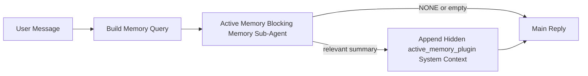

# Memoria Activa

La memoria activa es un subagente de memoria bloqueante opcional propiedad del complemento que se ejecuta
antes de la respuesta principal para sesiones conversacionales elegibles.

Existe porque la mayoría de los sistemas de memoria son capaces pero reactivos. Dependen
del agente principal para decidir cuándo buscar en la memoria, o del usuario para decir cosas
como "recuerda esto" o "buscar en la memoria". Para entonces, el momento en el que la memoria habría
hecho que la respuesta se sintiera natural ya ha pasado.

La memoria activa le da al sistema una oportunidad limitada para mostrar la memoria relevante
antes de que se genere la respuesta principal.

## Pega esto en tu agente

Pega esto en tu agente si deseas que habilite la Memoria Activa con una
configuración autónoma y predeterminada segura:

```json5
{
  plugins: {
    entries: {
      "active-memory": {
        enabled: true,
        config: {
          enabled: true,
          agents: ["main"],
          allowedChatTypes: ["direct"],
          modelFallbackPolicy: "default-remote",
          queryMode: "recent",
          promptStyle: "balanced",
          timeoutMs: 15000,
          maxSummaryChars: 220,
          persistTranscripts: false,
          logging: true,
        },
      },
    },
  },
}
```

Esto activa el complemento para el agente `main`, lo mantiene limitado a sesiones
de estilo de mensaje directo por defecto, le permite heredar primero el modelo de sesión actual y
aún permite la reserva remota integrada si no hay un modelo explícito o heredado
disponible.

Después de eso, reinicia la puerta de enlace:

```bash
node scripts/run-node.mjs gateway --profile dev
```

Para inspeccionarlo en vivo en una conversación:

```text
/verbose on
```

## Activar la memoria activa

La configuración más segura es:

1. habilitar el complemento
2. apuntar a un agente conversacional
3. mantener el registro activo solo mientras se ajusta

Comienza con esto en `openclaw.json`:

```json5
{
  plugins: {
    entries: {
      "active-memory": {
        enabled: true,
        config: {
          agents: ["main"],
          allowedChatTypes: ["direct"],
          modelFallbackPolicy: "default-remote",
          queryMode: "recent",
          promptStyle: "balanced",
          timeoutMs: 15000,
          maxSummaryChars: 220,
          persistTranscripts: false,
          logging: true,
        },
      },
    },
  },
}
```

Luego reinicia la puerta de enlace:

```bash
node scripts/run-node.mjs gateway --profile dev
```

Lo que esto significa:

- `plugins.entries.active-memory.enabled: true` activa el complemento
- `config.agents: ["main"]` opta solo por el agente `main` para la memoria activa
- `config.allowedChatTypes: ["direct"]` mantiene la memoria activa solo para sesiones de estilo de mensaje directo por defecto
- si `config.model` no está establecido, la memoria activa hereda primero el modelo de sesión actual
- `config.modelFallbackPolicy: "default-remote"` mantiene la reserva remota integrada como predeterminada cuando no hay un modelo explícito o heredado disponible
- `config.promptStyle: "balanced"` usa el estilo de prompt general de propósito predeterminado para el modo `recent`
- la memoria activa aún se ejecuta solo en sesiones de chat persistentes interactivas elegibles

## Cómo verlo

La memoria activa inyecta contexto del sistema oculto para el modelo. No expone
etiquetas `<active_memory_plugin>...</active_memory_plugin>` sin procesar al cliente.

## Alternancia de sesión

Use el comando del complemento cuando desee pausar o reanudar la memoria activa para la
sesión de chat actual sin editar la configuración:

```text
/active-memory status
/active-memory off
/active-memory on
```

Esto está limitado a la sesión. No cambia
`plugins.entries.active-memory.enabled`, el destino del agente ni otra configuración
global.

Si desea que el comando escriba la configuración y pause o reanude la memoria activa para
todas las sesiones, use el formulario global explícito:

```text
/active-memory status --global
/active-memory off --global
/active-memory on --global
```

El formulario global escribe `plugins.entries.active-memory.config.enabled`. Deja
`plugins.entries.active-memory.enabled` activado para que el comando siga disponible para
activar la memoria activa nuevamente más tarde.

Si desea ver qué está haciendo la memoria activa en una sesión en vivo, active el
modo detallado para esa sesión:

```text
/verbose on
```

Con el modo detallado habilitado, OpenClaw puede mostrar:

- una línea de estado de memoria activa como `Active Memory: ok 842ms recent 34 chars`
- un resumen de depuración legible como `Active Memory Debug: Lemon pepper wings with blue cheese.`

Esas líneas se derivan de la misma pasada de memoria activa que alimenta el contexto
del sistema oculto, pero se formatean para humanos en lugar de exponer el marcado
sin procesar del prompt.

De forma predeterminada, la transcripción del subagente de memoria de bloqueo es temporal y se elimina
una vez que se completa la ejecución.

Flujo de ejemplo:

```text
/verbose on
what wings should i order?
```

Forma esperada de la respuesta visible:

```text
...normal assistant reply...

🧩 Active Memory: ok 842ms recent 34 chars
🔎 Active Memory Debug: Lemon pepper wings with blue cheese.
```

## Cuándo se ejecuta

La memoria activa utiliza dos puertas:

1. **Opt-in de configuración**
   El complemento debe estar habilitado y el id del agente actual debe aparecer en
   `plugins.entries.active-memory.config.agents`.
2. **Elegibilidad estricta en tiempo de ejecución**
   Incluso cuando está habilitada y destinada, la memoria activa solo se ejecuta para sesiones
   de chat persistentes interactivas elegibles.

La regla real es:

```text
plugin enabled
+
agent id targeted
+
allowed chat type
+
eligible interactive persistent chat session
=
active memory runs
```

Si alguna de ellas falla, la memoria activa no se ejecuta.

## Tipos de sesión

`config.allowedChatTypes` controla qué tipos de conversaciones pueden ejecutar Memoria
Activa en absoluto.

El valor predeterminado es:

```json5
allowedChatTypes: ["direct"]
```

Eso significa que Memoria Activa se ejecuta de forma predeterminada en sesiones de estilo mensaje directo, pero
no en sesiones de grupo o canal a menos que las opte explícitamente.

Ejemplos:

```json5
allowedChatTypes: ["direct"]
```

```json5
allowedChatTypes: ["direct", "group"]
```

```json5
allowedChatTypes: ["direct", "group", "channel"]
```

## Dónde se ejecuta

La memoria activa es una función de enriquecimiento conversacional, no una función de inferencia
en toda la plataforma.

| Superficie                                                                | ¿Ejecuta memoria activa?                                         |
| ------------------------------------------------------------------------- | ---------------------------------------------------------------- |
| Sesiones persistentes de chat web / UI de control                         | Sí, si el complemento está habilitado y el agente está destinado |
| Otras sesiones de canal interactivas en la misma ruta de chat persistente | Sí, si el complemento está habilitado y el agente está destinado |
| Ejecuciones únicas sin interfaz                                           | No                                                               |
| Ejecuciones de latido/segundo plano                                       | No                                                               |
| Rutas internas genéricas `agent-command`                                  | No                                                               |
| Ejecución de subagente/ayudante interno                                   | No                                                               |

## Por qué usarla

Use la memoria activa cuando:

- la sesión es persistente y orientada al usuario
- el agente tiene memoria significativa a largo plazo para buscar
- la continuidad y la personalización importan más que el determinismo del prompt en bruto

Funciona especialmente bien para:

- preferencias estables
- hábitos recurrentes
- contexto de usuario a largo plazo que debería surgir de forma natural

No es adecuada para:

- automatización
- trabajadores internos
- tareas de API de una sola ejecución
- lugares donde la personalización oculta sería sorprendente

## Cómo funciona

La forma en tiempo de ejecución es:



El subagente de memoria de bloqueo solo puede usar:

- `memory_search`
- `memory_get`

Si la conexión es débil, debería devolver `NONE`.

## Modos de consulta

`config.queryMode` controla cuánta conversación ve el subagente de memoria de bloqueo.

## Estilos de prompt

`config.promptStyle` controla cuán ansioso o estricto es el subagente de memoria de bloqueo
al decidir si devolver memoria.

Estilos disponibles:

- `balanced`: predeterminado de propósito general para el modo `recent`
- `strict`: el menos ansioso; mejor cuando desea muy poca fuga del contexto cercano
- `contextual`: el más amigable con la continuidad; mejor cuando el historial de conversación debería importar más
- `recall-heavy`: más dispuesto a mostrar memoria en coincidencias más suaves pero aún plausibles
- `precision-heavy`: prefiere agresivamente `NONE` a menos que la coincidencia sea obvia
- `preference-only`: optimizado para favoritos, hábitos, rutinas, gusto y datos personales recurrentes

Asignación predeterminada cuando `config.promptStyle` no está establecido:

```text
message -> strict
recent -> balanced
full -> contextual
```

Si establece `config.promptStyle` explícitamente, esa anulación prevalece.

Ejemplo:

```json5
promptStyle: "preference-only"
```

## Política de reserva del modelo

Si `config.model` no está establecido, Active Memory intenta resolver un modelo en este orden:

```text
explicit plugin model
-> current session model
-> agent primary model
-> optional built-in remote fallback
```

`config.modelFallbackPolicy` controla el último paso.

Predeterminado:

```json5
modelFallbackPolicy: "default-remote"
```

Otra opción:

```json5
modelFallbackPolicy: "resolved-only"
```

Use `resolved-only` si quieres que Active Memory omita la recuperación en lugar de recurrir al valor predeterminado remoto integrado cuando no hay un modelo explícito o heredado disponible.

## Mecanismos de escape avanzados

Estas opciones intencionalmente no son parte de la configuración recomendada.

`config.thinking` puede anular el nivel de pensamiento del subagente de memoria de bloqueo:

```json5
thinking: "medium"
```

Predeterminado:

```json5
thinking: "off"
```

No habilites esto de forma predeterminada. Active Memory se ejecuta en la ruta de respuesta, por lo que el tiempo de pensamiento adicional aumenta directamente la latencia visible para el usuario.

`config.promptAppend` añade instrucciones adicionales del operador después del mensaje predeterminado de Active Memory y antes del contexto de la conversación:

```json5
promptAppend: "Prefer stable long-term preferences over one-off events."
```

`config.promptOverride` reemplaza el mensaje predeterminado de Active Memory. OpenClaw aún añade el contexto de la conversación después:

```json5
promptOverride: "You are a memory search agent. Return NONE or one compact user fact."
```

No se recomienda la personalización del mensaje a menos que estés probando deliberadamente un contrato de recuperación diferente. El mensaje predeterminado está ajustado para devolver `NONE` o un contexto compacto de datos del usuario para el modelo principal.

### `message`

Solo se envía el último mensaje del usuario.

```text
Latest user message only
```

Usa esto cuando:

- quieras el comportamiento más rápido
- quieras el sesgo más fuerte hacia la recuperación de preferencias estables
- las turnos de seguimiento no necesitan el contexto de la conversación

Tiempo de espera recomendado:

- comienza alrededor de `3000` a `5000` ms

### `recent`

Se envía el último mensaje del usuario más una pequeña cola conversacional reciente.

```text
Recent conversation tail:
user: ...
assistant: ...
user: ...

Latest user message:
...
```

Usa esto cuando:

- quieras un mejor equilibrio entre velocidad y fundamentación conversacional
- las preguntas de seguimiento a menudo dependen de los últimos turnos

Tiempo de espera recomendado:

- comienza alrededor de `15000` ms

### `full`

Se envía la conversación completa al subagente de memoria de bloqueo.

```text
Full conversation context:
user: ...
assistant: ...
user: ...
...
```

Usa esto cuando:

- la calidad de recuperación más fuerte es más importante que la latencia
- la conversación contiene una configuración importante muy atrás en el hilo

Tiempo de espera recomendado:

- auméntalo sustancialmente en comparación con `message` o `recent`
- comienza alrededor de `15000` ms o más, dependiendo del tamaño del hilo

En general, el tiempo de espera debería aumentar con el tamaño del contexto:

```text
message < recent < full
```

## Persistencia de la transcripción

Las ejecuciones del subagente de memoria de bloqueo de memoria activa crean una `session.jsonl`
transcripción real durante la llamada al subagente de memoria de bloqueo.

De forma predeterminada, esa transcripción es temporal:

- se escribe en un directorio temporal
- se usa solo para la ejecución del subagente de memoria de bloqueo
- se elimina inmediatamente después de que finaliza la ejecución

Si desea mantener esas transcripciones del subagente de memoria de bloqueo en el disco para depuración o
inspección, active la persistencia explícitamente:

```json5
{
  plugins: {
    entries: {
      "active-memory": {
        enabled: true,
        config: {
          agents: ["main"],
          persistTranscripts: true,
          transcriptDir: "active-memory",
        },
      },
    },
  },
}
```

Cuando está habilitado, la memoria activa almacena las transcripciones en un directorio separado en la
carpeta de sesiones del agente de destino, no en la ruta de la transcripción de la conversación
principal del usuario.

El diseño predeterminado es conceptualmente:

```text
agents/<agent>/sessions/active-memory/<blocking-memory-sub-agent-session-id>.jsonl
```

Puede cambiar el subdirectorio relativo con `config.transcriptDir`.

Úselo con cuidado:

- las transcripciones del subagente de memoria de bloqueo pueden acumularse rápidamente en sesiones ocupadas
- el modo de consulta `full` puede duplicar mucho contexto de conversación
- estas transcripciones contienen contexto de indicador oculto y recuerdos recuperados

## Configuración

Toda la configuración de memoria activa reside en:

```text
plugins.entries.active-memory
```

Los campos más importantes son:

| Clave                       | Tipo                                                                                                 | Significado                                                                                                                                         |
| --------------------------- | ---------------------------------------------------------------------------------------------------- | --------------------------------------------------------------------------------------------------------------------------------------------------- |
| `enabled`                   | `boolean`                                                                                            | Habilita el complemento en sí                                                                                                                       |
| `config.agents`             | `string[]`                                                                                           | Ids de agentes que pueden usar memoria activa                                                                                                       |
| `config.model`              | `string`                                                                                             | Referencia opcional del modelo del subagente de memoria de bloqueo; cuando no está configurado, la memoria activa usa el modelo de la sesión actual |
| `config.queryMode`          | `"message" \| "recent" \| "full"`                                                                    | Controla cuánta conversación ve el subagente de memoria de bloqueo                                                                                  |
| `config.promptStyle`        | `"balanced" \| "strict" \| "contextual" \| "recall-heavy" \| "precision-heavy" \| "preference-only"` | Controla qué tan ansioso o estricto es el subagente de memoria de bloqueo al decidir si devolver memoria                                            |
| `config.thinking`           | `"off" \| "minimal" \| "low" \| "medium" \| "high" \| "xhigh" \| "adaptive"`                         | Invalidación avanzada de pensamiento para el subagente de memoria de bloqueo; `off` predeterminado para mayor velocidad                             |
| `config.promptOverride`     | `string`                                                                                             | Reemplazo avanzado de la solicitud completa; no recomendado para uso normal                                                                         |
| `config.promptAppend`       | `string`                                                                                             | Instrucciones adicionales avanzadas agregadas a la solicitud predeterminada o anulada                                                               |
| `config.timeoutMs`          | `number`                                                                                             | Tiempo de espera límite para el subagente de memoria bloqueante                                                                                     |
| `config.maxSummaryChars`    | `number`                                                                                             | Máximo total de caracteres permitidos en el resumen de memoria activa                                                                               |
| `config.logging`            | `boolean`                                                                                            | Emite registros de memoria activa durante el ajuste                                                                                                 |
| `config.persistTranscripts` | `boolean`                                                                                            | Mantiene las transcripciones del subagente de memoria bloqueante en el disco en lugar de eliminar los archivos temporales                           |
| `config.transcriptDir`      | `string`                                                                                             | Directorio relativo de transcripciones del subagente de memoria bloqueante bajo la carpeta de sesiones del agente                                   |

Campos de ajuste útiles:

| Clave                         | Tipo     | Significado                                                              |
| ----------------------------- | -------- | ------------------------------------------------------------------------ |
| `config.maxSummaryChars`      | `number` | Máximo total de caracteres permitidos en el resumen de memoria activa    |
| `config.recentUserTurns`      | `number` | Turnos de usuario previos para incluir cuando `queryMode` es `recent`    |
| `config.recentAssistantTurns` | `number` | Turnos del asistente previos para incluir cuando `queryMode` es `recent` |
| `config.recentUserChars`      | `number` | Máx. caracteres por turno de usuario reciente                            |
| `config.recentAssistantChars` | `number` | Máx. caracteres por turno de asistente reciente                          |
| `config.cacheTtlMs`           | `number` | Reutilización de caché para consultas idénticas repetidas                |

## Configuración recomendada

Comience con `recent`.

```json5
{
  plugins: {
    entries: {
      "active-memory": {
        enabled: true,
        config: {
          agents: ["main"],
          queryMode: "recent",
          promptStyle: "balanced",
          timeoutMs: 15000,
          maxSummaryChars: 220,
          logging: true,
        },
      },
    },
  },
}
```

Si desea inspeccionar el comportamiento en vivo mientras ajusta, use `/verbose on` en la sesión
en lugar de buscar un comando de depuración de memoria activa separado.

Luego pase a:

- `message` si desea una menor latencia
- `full` si decide que el contexto adicional vale la pena el subagente de memoria bloqueante más lento

## Depuración

Si la memoria activa no aparece donde espera:

1. Confirme que el complemento está habilitado en `plugins.entries.active-memory.enabled`.
2. Confirme que el id del agente actual está listado en `config.agents`.
3. Confirme que está probando a través de una sesión de chat persistente interactiva.
4. Activa `config.logging: true` y observa los registros de la puerta de enlace.
5. Verifica que la búsqueda de memoria funcione por sí sola con `openclaw memory status --deep`.

Si los resultados de memoria son ruidosos, ajusta:

- `maxSummaryChars`

Si la memoria activa es demasiado lenta:

- reduce `queryMode`
- reduce `timeoutMs`
- reduce los recuentos de turnos recientes
- reduce los límites de caracteres por turno

## Páginas relacionadas

- [Búsqueda de memoria](/en/concepts/memory-search)
- [Referencia de configuración de memoria](/en/reference/memory-config)
- [Configuración del SDK de complementos](/en/plugins/sdk-setup)
