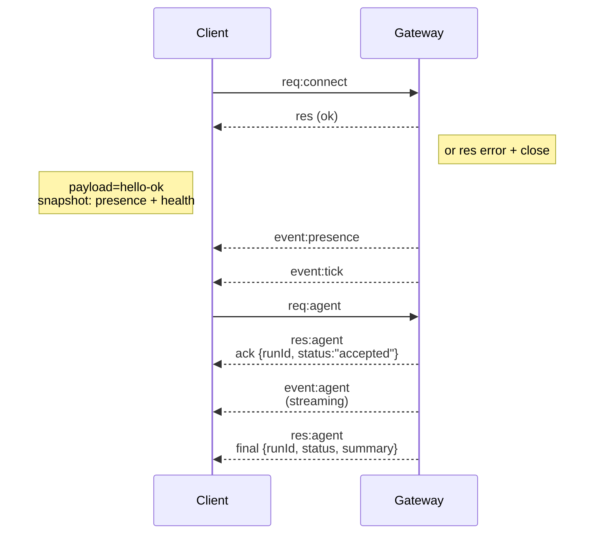

# Arquitectura del Gateway

## Visión general

- Un único **Gateway** de larga duración posee todas las superficies de mensajería (WhatsApp a través de Baileys, Telegram a través de grammY, Slack, Discord, Signal, iMessage, WebChat).
- Los clientes del plano de control (app de macOS, CLI, interfaz web, automatizaciones) se conectan al Gateway a través de **WebSocket** en el host de enlace configurado (por defecto `127.0.0.1:18789`).
- Los **Nodos** (macOS/iOS/Android/headless) también se conectan a través de **WebSocket**, pero declaran `role: node` con capacidades/comandos explícitos.
- Un Gateway por host; es el único lugar que abre una sesión de WhatsApp.
- El **host del lienzo (canvas host)** es servido por el servidor HTTP del Gateway bajo:
  - `/__openclaw__/canvas/` (host editable por el agente HTML/CSS/JS)
  - `/__openclaw__/a2ui/` (host A2UI)
    Utiliza el mismo puerto que el Gateway (por defecto `18789`).

## Componentes y flujos

### Gateway (demonio)

- Mantiene las conexiones de los proveedores.
- Expone una API WS tipada (solicitudes, respuestas, eventos de envío del servidor).
- Valida las tramas entrantes contra JSON Schema.
- Emite eventos como `agent`, `chat`, `presence`, `health`, `heartbeat`, `cron`.

### Clientes (app de Mac / CLI / administrador web)

- Una conexión WS por cliente.
- Envían solicitudes (`health`, `status`, `send`, `agent`, `system-presence`).
- Se suscriben a eventos (`tick`, `agent`, `presence`, `shutdown`).

### Nodos (macOS / iOS / Android / headless)

- Se conectan al **mismo servidor WS** con `role: node`.
- Proporcionan una identidad de dispositivo en `connect`; el emparejamiento es **basado en dispositivo** (rol `node`) y la aprobación reside en el almacén de emparejamiento de dispositivos.
- Exponen comandos como `canvas.*`, `camera.*`, `screen.record`, `location.get`.

Detalles del protocolo:

- [Protocolo del Gateway](/en/gateway/protocol)

### WebChat

- Interfaz de usuario estática que utiliza la API WS del Gateway para el historial de chat y los envíos.
- En configuraciones remotas, se conecta a través del mismo túnel SSH/Tailscale que otros
  clientes.

## Ciclo de vida de la conexión (cliente único)



## Protocolo de cable (resumen)

- Transporte: WebSocket, tramas de texto con cargas útiles JSON.
- La primera trama **debe** ser `connect`.
- Después del handshake:
  - Solicitudes: `{type:"req", id, method, params}` → `{type:"res", id, ok, payload|error}`
  - Eventos: `{type:"event", event, payload, seq?, stateVersion?}`
- Si `OPENCLAW_GATEWAY_TOKEN` (o `--token`) está configurado, `connect.params.auth.token`
  debe coincidir o el socket se cierra.
- Las claves de idempotencia son necesarias para los métodos con efectos secundarios (`send`, `agent`) para
  reintentar de forma segura; el servidor mantiene un caché de deduplicación de corta duración.
- Los nodos deben incluir `role: "node"` además de caps/commands/permissions en `connect`.

## Emparejamiento + confianza local

- Todos los clientes WS (operadores + nodos) incluyen una **identidad de dispositivo** en `connect`.
- Los nuevos IDs de dispositivo requieren aprobación de emparejamiento; el Gateway emite un **token de dispositivo**
  para las conexiones posteriores.
- Las conexiones **locales** (loopback o la dirección tailnet propia del host del gateway) pueden ser
  aprobadas automáticamente para mantener la UX del mismo host fluida.
- Todas las conexiones deben firmar el nonce `connect.challenge`.
- La carga útil de la firma `v3` también vincula `platform` + `deviceFamily`; el gateway
  fija los metadatos emparejados al reconectar y requiere un emparejamiento de reparación para cambios en los
  metadatos.
- Las conexiones **no locales** aún requieren aprobación explícita.
- La autenticación del Gateway (`gateway.auth.*`) todavía se aplica a **todas** las conexiones, locales o
  remotas.

Detalles: [Gateway protocol](/en/gateway/protocol), [Pairing](/en/channels/pairing),
[Security](/en/gateway/security).

## Escritura de protocolos y generación de código

- Los esquemas TypeBox definen el protocolo.
- JSON Schema se genera a partir de esos esquemas.
- Los modelos Swift se generan a partir del JSON Schema.

## Acceso remoto

- Preferido: Tailscale o VPN.
- Alternativa: túnel SSH

  ```bash
  ssh -N -L 18789:127.0.0.1:18789 user@host
  ```

- El mismo handshake + token de autenticación se aplican a través del túnel.
- TLS + anclaje opcional se pueden habilitar para WS en configuraciones remotas.

## Instantánea de operaciones

- Inicio: `openclaw gateway` (en primer plano, registra en stdout).
- Salud: `health` a través de WS (también incluido en `hello-ok`).
- Supervisión: launchd/systemd para reinicio automático.

## Invariantes

- Exactamente un Gateway controla una sola sesión de Baileys por host.
- El protocolo de enlace es obligatorio; cualquier primer marco que no sea JSON o no sea de conexión es un cierre brusco.
- Los eventos no se reproducen; los clientes deben actualizar cuando haya lagunas.

## Relacionado

- [Agent Loop](/en/concepts/agent-loop) — ciclo de ejecución detallado del agente
- [Gateway Protocol](/en/gateway/protocol) — contrato del protocolo WebSocket
- [Queue](/en/concepts/queue) — cola de comandos y concurrencia
- [Security](/en/gateway/security) — modelo de confianza y endurecimiento
