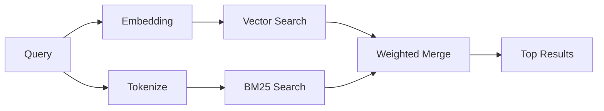

`memory_search` encuentra notas relevantes en tus archivos de memoria, incluso cuando la redacción difiere del texto original. Funciona indexando la memoria en pequeños fragmentos y buscándolos mediante incrustaciones, palabras clave o ambos.

## Inicio rápido

Si tienes una suscripción a GitHub Copilot, o una clave API de OpenAI, Gemini, Voyage o Mistral configurada, la búsqueda en memoria funciona automáticamente. Para establecer un proveedor explícitamente:

```json5
{
  agents: {
    defaults: {
      memorySearch: {
        provider: "openai", // or "gemini", "local", "ollama", etc.
      },
    },
  },
}
```

Para incrustaciones locales sin clave API, instala el paquete de tiempo de ejecución opcional `node-llama-cpp` junto a OpenClaw y usa `provider: "local"`.

Algunos puntos finales de incrustación compatibles con OpenAI requieren etiquetas asimétricas como `input_type: "query"` para búsquedas y `input_type: "document"` o `"passage"` para fragmentos indexados. Configúralos con `memorySearch.queryInputType` y `memorySearch.documentInputType`; consulta la [referencia de configuración de memoria](/es/reference/memory-config#provider-specific-config).

## Proveedores compatibles

| Proveedor      | ID               | Necesita clave de API | Notas                                                                         |
| -------------- | ---------------- | --------------------- | ----------------------------------------------------------------------------- |
| Bedrock        | `bedrock`        | No                    | Detectado automáticamente cuando se resuelve la cadena de credenciales de AWS |
| Gemini         | `gemini`         | Sí                    | Admite la indexación de imágenes/audio                                        |
| GitHub Copilot | `github-copilot` | No                    | Detectado automáticamente, usa la suscripción a Copilot                       |
| Local          | `local`          | No                    | Modelo GGUF, descarga de ~0.6 GB                                              |
| Mistral        | `mistral`        | Sí                    | Detectado automáticamente                                                     |
| Ollama         | `ollama`         | No                    | Local, debe configurarse explícitamente                                       |
| OpenAI         | `openai`         | Sí                    | Detectado automáticamente, rápido                                             |
| Voyage         | `voyage`         | Sí                    | Detectado automáticamente                                                     |

## Cómo funciona la búsqueda

OpenClaw ejecuta dos rutas de recuperación en paralelo y fusiona los resultados:



- **Búsqueda vectorial** encuentra notas con significado similar ("gateway host" coincide con
  "la máquina que ejecuta OpenClaw").
- **Búsqueda de palabras clave BM25** encuentra coincidencias exactas (ID, cadenas de error, claves
  de configuración).

Si solo hay una ruta disponible (sin incrustaciones o sin FTS), la otra se ejecuta sola.

Cuando las incrustaciones no están disponibles, OpenClaw aún utiliza un ordenamiento léxico sobre los resultados de FTS en lugar de recurrir únicamente a un ordenamiento de coincidencia exacta bruto. Ese modo degradado impulsa los fragmentos con una mayor cobertura de términos de consulta y rutas de archivo relevantes, lo que mantiene la recuperación útil incluso sin `sqlite-vec` o un proveedor de incrustaciones.

## Mejorar la calidad de la búsqueda

Dos funciones opcionales ayudan cuando tienes un historial de notas grande:

### Decaimiento temporal

Las notas antiguas pierden gradualmente peso en el ordenamiento para que la información reciente aparezca primero. Con la vida media predeterminada de 30 días, una nota del mes pasado puntúa al 50% de su peso original. Los archivos perennes como `MEMORY.md` nunca se degradan.

<Tip>Active el decaimiento temporal si su agente tiene meses de notas diarias y la información obsoleta sigue superando en clasificación al contexto reciente.</Tip>

### MMR (diversidad)

Reduce los resultados redundantes. Si cinco notas mencionan la misma configuración de enrutador, MMR
asegura que los resultados principales cubran diferentes temas en lugar de repetirse.

<Tip>Habilita MMR si `memory_search` sigue devolviendo fragmentos casi duplicados de diferentes notas diarias.</Tip>

### Activar ambos

```json5
{
  agents: {
    defaults: {
      memorySearch: {
        query: {
          hybrid: {
            mmr: { enabled: true },
            temporalDecay: { enabled: true },
          },
        },
      },
    },
  },
}
```

## Memoria multimodal

Con Gemini Embedding 2, puedes indexar imágenes y archivos de audio junto con
Markdown. Las consultas de búsqueda siguen siendo texto, pero coinciden con el contenido visual y de audio.
Consulta la [referencia de configuración de memoria](/es/reference/memory-config) para
la configuración.

## Búsqueda en la memoria de la sesión

Opcionalmente, puedes indexar las transcripciones de las sesiones para que `memory_search` pueda recordar
conversaciones anteriores. Esto es opcional a través de
`memorySearch.experimental.sessionMemory`. Consulta la
[referencia de configuración](/es/reference/memory-config) para obtener más detalles.

## Solución de problemas

**¿No hay resultados?** Ejecuta `openclaw memory status` para verificar el índice. Si está vacío, ejecuta
`openclaw memory index --force`.

**¿Solo coincidencias de palabras clave?** Es posible que tu proveedor de incrustaciones (embeddings) no esté configurado. Verifica
`openclaw memory status --deep`.

**¿Las incrustaciones locales agotan el tiempo de espera?** `ollama`, `lmstudio` y `local` usan un tiempo de espera
de batch en línea más largo de forma predeterminada. Si el host es simplemente lento, establece
`agents.defaults.memorySearch.sync.embeddingBatchTimeoutSeconds` y vuelve a ejecutar
`openclaw memory index --force`.

**¿Texto CJK no encontrado?** Reconstruye el índice FTS con
`openclaw memory index --force`.

## Lectura adicional

- [Active Memory](/es/concepts/active-memory) -- memoria de subagente para sesiones de chat interactivas
- [Memory](/es/concepts/memory) -- diseño de archivos, backends, herramientas
- [Referencia de configuración de memoria](/es/reference/memory-config) -- todos los controles de configuración

## Relacionado

- [Resumen de memoria](/es/concepts/memory)
- [Memoria activa](/es/concepts/active-memory)
- [Motor de memoria integrado](/es/concepts/memory-builtin)
