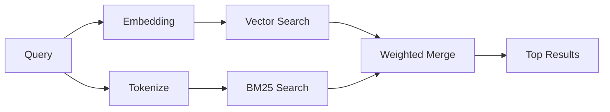

# Búsqueda de memoria

`memory_search` encuentra notas relevantes en tus archivos de memoria, incluso cuando la redacción difiere del texto original. Funciona indexando la memoria en pequeños fragmentos y buscándolos mediante incrustaciones, palabras clave o ambos.

## Inicio rápido

Si tienes una clave de API de OpenAI, Gemini, Voyage o Mistral configurada, la búsqueda de memoria funciona automáticamente. Para establecer un proveedor explícitamente:

```json5
{
  agents: {
    defaults: {
      memorySearch: {
        provider: "openai", // or "gemini", "local", "ollama", etc.
      },
    },
  },
}
```

Para incrustaciones locales sin clave de API, usa `provider: "local"` (requiere node-llama-cpp).

## Proveedores compatibles

| Proveedor | ID        | Necesita clave de API | Notas                                   |
| --------- | --------- | --------------------- | --------------------------------------- |
| OpenAI    | `openai`  | Sí                    | Detección automática, rápido            |
| Gemini    | `gemini`  | Sí                    | Admite la indexación de imágenes/audio  |
| Voyage    | `voyage`  | Sí                    | Detección automática                    |
| Mistral   | `mistral` | Sí                    | Detección automática                    |
| Ollama    | `ollama`  | No                    | Local, debe establecerse explícitamente |
| Local     | `local`   | No                    | Modelo GGUF, descarga de ~0.6 GB        |

## Cómo funciona la búsqueda

OpenClaw ejecuta dos rutas de recuperación en paralelo y fusiona los resultados:



- **Búsqueda vectorial** encuentra notas con significados similares ("host de puerta de enlace" coincide con "la máquina que ejecuta OpenClaw").
- **Búsqueda de palabras clave BM25** encuentra coincidencias exactas (ID, cadenas de error, claves de configuración).

Si solo hay una ruta disponible (sin incrustaciones o sin FTS), la otra se ejecuta sola.

## Mejorar la calidad de la búsqueda

Dos funciones opcionales ayudan cuando tienes un historial grande de notas:

### Decaimiento temporal

Las notas antiguas pierden gradualmente peso en la clasificación para que la información reciente aparezca primero. Con la vida media predeterminada de 30 días, una nota del mes pasado puntúa al 50% de su peso original. Los archivos perennes como `MEMORY.md` nunca se decaen.

<Tip>Habilita el decaimiento temporal si tu agente tiene meses de notas diarias y la información obsoleta sigue superando en clasificación al contexto reciente.</Tip>

### MMR (diversidad)

Reduce los resultados redundantes. Si cinco notas mencionan la misma configuración de enrutador, MMR asegura que los resultados principales cubran diferentes temas en lugar de repetirse.

<Tip>Active MMR si `memory_search` sigue devolviendo fragmentos casi duplicados de diferentes notas diarias.</Tip>

### Activar ambos

```json5
{
  agents: {
    defaults: {
      memorySearch: {
        query: {
          hybrid: {
            mmr: { enabled: true },
            temporalDecay: { enabled: true },
          },
        },
      },
    },
  },
}
```

## Memoria multimodal

Con Gemini Embedding 2, puedes indexar imágenes y archivos de audio junto con
Markdown. Las consultas de búsqueda siguen siendo texto, pero coinciden con el contenido visual y de audio.
Consulta la [referencia de configuración de memoria](/en/reference/memory-config) para
la configuración.

## Búsqueda en la memoria de sesión

Opcionalmente, puedes indexar las transcripciones de la sesión para que `memory_search` pueda recordar
conversaciones anteriores. Esto es opcional a través de
`memorySearch.experimental.sessionMemory`. Consulta la
[referencia de configuración](/en/reference/memory-config) para más detalles.

## Solución de problemas

**¿Sin resultados?** Ejecuta `openclaw memory status` para verificar el índice. Si está vacío, ejecuta
`openclaw memory index --force`.

**¿Solo coincidencias de palabras clave?** Es posible que tu proveedor de incrustaciones no esté configurado. Verifica
`openclaw memory status --deep`.

**¿Texto CJK no encontrado?** Reconstruye el índice FTS con
`openclaw memory index --force`.

## Lecturas adicionales

- [Memoria](/en/concepts/memory) -- diseño de archivos, backends, herramientas
- [Referencia de configuración de memoria](/en/reference/memory-config) -- todos los controles de configuración
