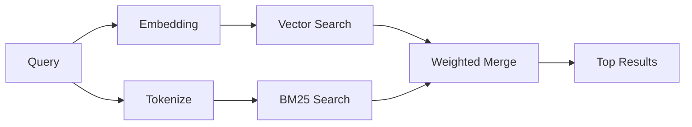

`memory_search` encuentra notas relevantes en tus archivos de memoria, incluso cuando la redacción difiere del texto original. Funciona indexando la memoria en pequeños fragmentos y buscándolos mediante incrustaciones, palabras clave o ambos.

## Inicio rápido

La búsqueda de memoria utiliza incrustaciones de OpenAI de forma predeterminada. Para usar otro backend de incrustaciones, establezca un proveedor explícitamente:

```json5
{
  agents: {
    defaults: {
      memorySearch: {
        provider: "openai", // or "gemini", "local", "ollama", "openai-compatible", etc.
      },
    },
  },
}
```

Para configuraciones de múltiples puntos finales con proveedores específicos de memoria, `provider` también puede ser una entrada personalizada de `models.providers.<id>`, como `ollama-5080`, cuando ese proveedor establece `api: "ollama"` u otro propietario de adaptador de incrustación de memoria.

Para incrustaciones locales sin clave API, establezca `provider: "local"`. Las comprobaciones de fuente aún pueden requerir aprobación de compilación nativa: `pnpm approve-builds` luego `pnpm rebuild node-llama-cpp`.

Algunos puntos finales de incrustación compatibles con OpenAI requieren etiquetas asimétricas como `input_type: "query"` para búsquedas y `input_type: "document"` o `"passage"` para fragmentos indexados. Configure esos con `memorySearch.queryInputType` y `memorySearch.documentInputType`; consulte la [referencia de configuración de memoria](/es/reference/memory-config#provider-specific-config).

## Proveedores compatibles

| Proveedor             | ID                  | Requiere clave API | Notas                                |
| --------------------- | ------------------- | ------------------ | ------------------------------------ |
| Bedrock               | `bedrock`           | No                 | Usa la cadena de credenciales de AWS |
| DeepInfra             | `deepinfra`         | Sí                 | Predeterminado: `BAAI/bge-m3`        |
| Gemini                | `gemini`            | Sí                 | Admite indexación de imagen/audio    |
| GitHub Copilot        | `github-copilot`    | No                 | Usa la suscripción a Copilot         |
| Local                 | `local`             | No                 | Modelo GGUF, descarga de ~0.6 GB     |
| Mistral               | `mistral`           | Sí                 |                                      |
| Ollama                | `ollama`            | No                 | Local/autoalojado                    |
| OpenAI                | `openai`            | Sí                 | Predeterminado                       |
| Compatible con OpenAI | `openai-compatible` | Generalmente       | `/v1/embeddings` genérico            |
| Voyage                | `voyage`            | Sí                 |                                      |

## Cómo funciona la búsqueda

OpenClaw ejecuta dos rutas de recuperación en paralelo y fusiona los resultados:



- **Búsqueda vectorial** encuentra notas con significado similar ("host de puerta de enlace" coincide con "la máquina que ejecuta OpenClaw").
- **Búsqueda de palabras clave BM25** encuentra coincidencias exactas (ID, cadenas de error, claves de configuración).

Si solo hay una ruta disponible (sin incrustaciones o sin FTS), la otra se ejecuta sola.

Cuando las incrustaciones no están disponibles, OpenClaw aún utiliza el ranking léxico sobre los resultados de FTS en lugar de recurrir solo al ordenamiento de coincidencia exacta bruta. Ese modo degradado impulsa los fragmentos con una mayor cobertura de términos de consulta y rutas de archivo relevantes, lo que mantiene la recuperación útil incluso sin `sqlite-vec` o un proveedor de incrustaciones.

## Mejorar la calidad de la búsqueda

Dos características opcionales ayudan cuando tienes un historial grande de notas:

### Decadencia temporal

Las notas antiguas pierden gradualmente peso en la clasificación para que la información reciente aparezca primero.
Con la vida media predeterminada de 30 días, una nota del mes anterior puntúa el 50% de
su peso original. Los archivos perennes como `MEMORY.md` nunca decaen.

<Tip>Habilite la decadencia temporal si su agente tiene meses de notas diarias y la información obsoleta sigue superando en clasificación al contexto reciente.</Tip>

### MMR (diversidad)

Reduce resultados redundantes. Si cinco notas mencionan la misma configuración del enrutador, MMR
asegura que los mejores resultados cubran diferentes temas en lugar de repetirse.

<Tip>Habilite MMR si `memory_search` sigue devolviendo fragmentos casi duplicados de diferentes notas diarias.</Tip>

### Habilitar ambos

```json5
{
  agents: {
    defaults: {
      memorySearch: {
        query: {
          hybrid: {
            mmr: { enabled: true },
            temporalDecay: { enabled: true },
          },
        },
      },
    },
  },
}
```

## Memoria multimodal

Con Gemini Embedding 2, puede indexar imágenes y archivos de audio junto con
Markdown. Las consultas de búsqueda siguen siendo de texto, pero coinciden con el contenido visual y de audio.
Vea la [referencia de configuración de Memory](/es/reference/memory-config) para
la configuración.

## Búsqueda en memoria de sesión

Opcionalmente, puede indexar las transcripciones de la sesión para que `memory_search` pueda recordar
conversaciones anteriores. Esto es opcional a través de
`memorySearch.experimental.sessionMemory`. Vea la
[referencia de configuración](/es/reference/memory-config) para obtener detalles.

## Solución de problemas

**¿Sin resultados?** Ejecute `openclaw memory status` para verificar el índice. Si está vacío, ejecute
`openclaw memory index --force`.

**¿Solo coincidencias de palabras clave?** Es posible que su proveedor de incrustaciones no esté configurado. Verifique
`openclaw memory status --deep`.

**¿Las incrustaciones locales agotan el tiempo de espera?** `ollama`, `lmstudio` y `local` usan un tiempo de espera
de lote en línea más largo de forma predeterminada. Si el host es simplemente lento, configure
`agents.defaults.memorySearch.sync.embeddingBatchTimeoutSeconds` y vuelva a ejecutar
`openclaw memory index --force`.

**¿Texto CJK no encontrado?** Reconstruya el índice FTS con
`openclaw memory index --force`.

## Lecturas adicionales

- [Active Memory](/es/concepts/active-memory) -- memoria de subagente para sesiones de chat interactivas
- [Memory](/es/concepts/memory) -- diseño de archivos, backends, herramientas
- [Referencia de configuración de memoria](/es/reference/memory-config) -- todos los controles de configuración

## Relacionado

- [Resumen de memoria](/es/concepts/memory)
- [Memoria activa](/es/concepts/active-memory)
- [Motor de memoria incorporado](/es/concepts/memory-builtin)
