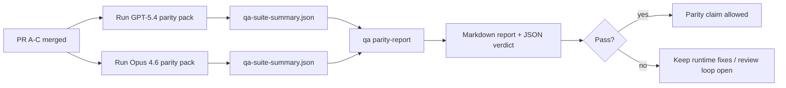

# Notas del mantenedor de paridad GPT-5.4 / Codex

Esta nota explica cómo revisar el programa de paridad GPT-5.4 / Codex como cuatro unidades de fusión sin perder la arquitectura original de seis contratos.

## Unidades de fusión

### PR A: ejecución estricta de agente

Es propietario de:

- `executionContract`
- seguimiento en el mismo turno con prioridad en GPT-5
- `update_plan` como seguimiento del progreso no terminal
- estados bloqueados explícitos en lugar de detenciones silenciosas solo de planificación

No es propietario de:

- clasificación de fallos de autenticación/ejecución
- veracidad de permisos
- rediseño de reproducción/continuación
- evaluación comparativa de paridad

### PR B: veracidad de tiempo de ejecución

Es propietario de:

- corrección del alcance OAuth de Codex
- clasificación de fallos de proveedor con tipo/tiempo de ejecución
- disponibilidad y razones bloqueadas veraces de `/elevated full`

No es propietario de:

- normalización del esquema de herramientas
- estado de reproducción/supervivencia
- activación de evaluación comparativa

### PR C: corrección de ejecución

Es propietario de:

- compatibilidad de herramientas OpenAI/Codex propiedad del proveedor
- manejo de esquemas estrictos sin parámetros
- superficie de reproducción no válida
- visibilidad del estado de tareas largas en pausa, bloqueadas y abandonadas

No es propietario de:

- continuación autoseleccionada
- comportamiento del dialecto genérico de Codex fuera de los enlaces del proveedor
- activación de evaluación comparativa

### PR D: arnés de paridad

Es propietario de:

- paquete de escenarios de primera ola GPT-5.4 vs Opus 4.6
- documentación de paridad
- informe de paridad y mecánicas de puerta de lanzamiento

No es propietario de:

- cambios de comportamiento de tiempo de ejecución fuera del laboratorio de QA
- simulación de autenticación/proxy/DNS dentro del arnés

## Asignación de vuelta a los seis contratos originales

| Contrato original                                     | Unidad de fusión |
| ----------------------------------------------------- | ---------------- |
| Corrección de transporte/autenticación del proveedor  | PR B             |
| Compatibilidad de contrato/esquema de herramienta     | PR C             |
| Ejecución en el mismo turno                           | PR A             |
| Veracidad de permisos                                 | PR B             |
| Corrección de reproducción/continuación/supervivencia | PR C             |
| Puerta de evaluación comparativa/lanzamiento          | PR D             |

## Orden de revisión

1. PR A
2. PR B
3. PR C
4. PR D

PR D es la capa de prueba. No debería ser la razón por la que se retrasen las PR de corrección de tiempo de ejecución.

## Qué buscar

### PR A

- las ejecuciones de GPT-5 actúan o fallan de forma cerrada en lugar de detenerse en el comentario
- `update_plan` ya no parece progreso por sí mismo
- el comportamiento se mantiene con prioridad en GPT-5 y con alcance en Pi integrado

### PR B

- los fallos de autenticación/proxy/tiempo de ejecución dejan de colapsar en el manejo genérico de "falla del modelo"
- `/elevated full` solo se describe como disponible cuando realmente está disponible
- los motivos de bloqueo son visibles tanto para el modelo como para el runtime orientado al usuario

### PR C

- el registro estricto de herramientas de OpenAI/Codex se comporta de manera predecible
- las herramientas sin parámetros no fallan las verificaciones estrictas del esquema
- los resultados de la reproducción y la compactación preservan el estado de actividad verídico

### PR D

- el paquete de escenarios es comprensible y reproducible
- el paquete incluye un carril de seguridad de reproducción con mutaciones, no solo flujos de solo lectura
- los informes son legibles por humanos y por automatización
- las afirmaciones de paridad están respaldadas por evidencia, no son anecdóticas

Artefactos esperados de la PR D:

- `qa-suite-report.md` / `qa-suite-summary.json` para cada ejecución del modelo
- `qa-agentic-parity-report.md` con comparación agregada y a nivel de escenario
- `qa-agentic-parity-summary.json` con un veredicto legible por máquina

## Release gate

No afirme paridad o superioridad de GPT-5.4 sobre Opus 4.6 hasta:

- La PR A, la PR B y la PR C se han fusionado
- la PR D ejecuta el paquete de paridad de la primera ola correctamente
- las suites de regresión de veracidad en tiempo de ejecución siguen en verde
- el informe de paridad no muestra casos de falso éxito ni regresión en el comportamiento de detención

El arnés de paridad no es la única fuente de evidencia. Mantenga esta división explícita en la revisión:

- la PR D es propietaria de la comparación basada en escenarios entre GPT-5.4 y Opus 4.6
- las suites deterministas de la PR B siguen siendo propietarias de la evidencia de veracidad de auth/proxy/DNS y de acceso completo

## Goal-to-evidence map

| Completion gate item                     | Primary owner | Review artifact                                                                  |
| ---------------------------------------- | ------------- | -------------------------------------------------------------------------------- |
| No plan-only stalls                      | PR A          | pruebas de runtime estrictas y `approval-turn-tool-followthrough`                |
| No fake progress or fake tool completion | PR A + PR D   | conteo de falsos éxitos de paridad más detalles del informe a nivel de escenario |
| No false `/elevated full` guidance       | PR B          | suites deterministas de veracidad en tiempo de ejecución                         |
| Replay/liveness failures remain explicit | PR C + PR D   | suites de ciclo de vida/reproducción más `compaction-retry-mutating-tool`        |
| GPT-5.4 matches or beats Opus 4.6        | PR D          | `qa-agentic-parity-report.md` y `qa-agentic-parity-summary.json`                 |

## Reviewer shorthand: before vs after

| User-visible problem before                                                      | Review signal after                                                                                      |
| -------------------------------------------------------------------------------- | -------------------------------------------------------------------------------------------------------- |
| GPT-5.4 stopped after planning                                                   | la PR A muestra un comportamiento de actuar o bloquear en lugar de una finalización con solo comentarios |
| Tool use felt brittle with strict OpenAI/Codex schemas                           | la PR C mantiene el registro de herramientas y la invocación sin parámetros de manera predecible         |
| `/elevated full` pistas a veces eran engañosas                                   | PR B vincula la orientación con la capacidad de tiempo de ejecución real y las razones de bloqueo        |
| Las tareas largas podían desaparecer en la ambigüedad de repetición/compactación | PR C emite estados explícitos de pausa, bloqueo, abandono y no válido de repetición                      |
| Las afirmaciones de paridad eran anecdóticas                                     | PR D produce un informe más un veredicto JSON con la misma cobertura de escenarios en ambos modelos      |
