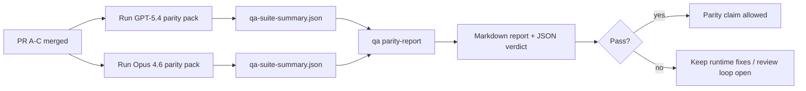

Esta nota explica cómo revisar el programa de paridad GPT-5.4 / Codex como cuatro unidades de fusión sin perder la arquitectura original de seis contratos.

## Unidades de fusión

### PR A: ejecución agéntica estricta

Propiedad:

- `executionContract`
- seguimiento continuo del mismo turno con prioridad GPT-5
- `update_plan` como seguimiento del progreso no terminal
- estados de bloqueo explícitos en lugar de detenciones silenciosas solo de planificación

Sin propiedad:

- clasificación de fallos de autenticación/ejecución
- veracidad de permisos
- rediseño de repetición/continuación
- evaluación comparativa de paridad

### PR B: veracidad en tiempo de ejecución

Propiedad:

- corrección del alcance de OAuth de Codex
- clasificación de fallos de proveedor/ejecución tipados
- disponibilidad veraz `/elevated full` y motivos de bloqueo

No posee:

- normalización del esquema de herramientas
- estado de reproducción/actividad
- control de puntos de referencia (benchmark gating)

### PR C: corrección de la ejecución

Posee:

- compatibilidad de herramientas de OpenAI/Codex propiedad del proveedor
- manejo de esquema estricto sin parámetros
- exposición de inválidos de reproducción
- visibilidad del estado de tareas largas en pausa, bloqueadas y abandonadas

No posee:

- continuación autoelegida
- comportamiento genérico del dialecto Codex fuera de los enlaces del proveedor
- control de puntos de referencia (benchmark gating)

### PR D: arnés de paridad

Posee:

- paquete de escenarios de primera ola GPT-5.4 frente a Opus 4.6
- documentación de paridad
- informe de paridad y mecánicas de control de lanzamiento

No posee:

- cambios de comportamiento en tiempo de ejecución fuera del laboratorio de QA
- simulación de autenticación/proxy/DNS dentro del arnés

## Asignación de vuelta a los seis contratos originales

| Contrato original                                    | Unidad de fusión |
| ---------------------------------------------------- | ---------------- |
| Corrección de transporte/autenticación del proveedor | PR B             |
| Compatibilidad de contrato/esquema de herramientas   | PR C             |
| Ejecución en el mismo turno                          | PR A             |
| Veracidad de los permisos                            | PR B             |
| Corrección de repetición/continuación/actividad      | PR C             |
| Benchmark/puerta de lanzamiento                      | PR D             |

## Orden de revisión

1. PR A
2. PR B
3. PR C
4. PR D

PR D es la capa de prueba. No debería ser la razón por la que se retrasan los PR de corrección en tiempo de ejecución.

## Qué buscar

### PR A

- Las ejecuciones de GPT-5 actúan o fallan de forma cerrada en lugar de detenerse en el comentario
- `update_plan` ya no parece progreso por sí mismo
- el comportamiento se mantiene prioridad para GPT-5 y con alcance en Pi incrustado

### PR B

- los fallos de auth/proxy/runtime dejan de colapsarse en el manejo genérico de "model failed"
- `/elevated full` solo se describe como disponible cuando realmente lo está
- los motivos de bloqueo son visibles tanto para el modelo como para el runtime orientado al usuario

### PR C

- el registro estricto de herramientas de OpenAI/Codex se comporta de manera predecible
- las herramientas sin parámetros no fallan las comprobaciones estrictas del esquema
- los resultados de la reproducción y compactación preservan el estado de actividad veraz

### PR D

- el paquete de escenarios es comprensible y reproducible
- el paquete incluye un carril de seguridad de reproducción mutante, no solo flujos de solo lectura
- los informes son legibles por humanos y automatización
- las afirmaciones de paridad están respaldadas por evidencia, no son anecdóticas

Artefactos esperados de la PR D:

- `qa-suite-report.md` / `qa-suite-summary.json` para cada ejecución del modelo
- `qa-agentic-parity-report.md` con comparación agregada y a nivel de escenario
- `qa-agentic-parity-summary.json` con un veredicto legible por máquina

## Release gate

No afirme paridad o superioridad de GPT-5.4 sobre Opus 4.6 hasta que:

- se fusionen la PR A, la PR B y la PR C
- la PR D ejecute el paquete de paridad de la primera ola correctamente
- las suites de regresión de veracidad del runtime permanecen en verde
- el informe de paridad no muestra casos de éxito falso ni regresión en el comportamiento de detención

El arnés de paridad no es la única fuente de evidencia. Mantenga esta división explícita en la revisión:

- la PR D es propietaria de la comparación basada en escenarios entre GPT-5.4 y Opus 4.6
- las suites deterministas de la PR B siguen siendo propietarias de la evidencia de veracidad de auth/proxy/DNS y de acceso completo

## Mapa de objetivo a evidencia

| Elemento de puerta de finalización                         | Propietario principal | Artefacto de revisión                                                              |
| ---------------------------------------------------------- | --------------------- | ---------------------------------------------------------------------------------- |
| Sin bloqueos solo de planificación                         | PR A                  | pruebas de runtime estrictamente agentic y `approval-turn-tool-followthrough`      |
| Sin falso progreso o finalización falsa de herramientas    | PR A + PR D           | recuento de éxitos falsos de paridad más detalles del informe a nivel de escenario |
| Sin orientación falsa de `/elevated full`                  | PR B                  | suites deterministas de veracidad del runtime                                      |
| los fallos de reproducción/actividad permanecen explícitos | PR C + PR D           | suites de ciclo de vida/reproducción más `compaction-retry-mutating-tool`          |
| GPT-5.4 iguala o supera a Opus 4.6                         | PR D                  | `qa-agentic-parity-report.md` y `qa-agentic-parity-summary.json`                   |

## Abreviatura del revisor: antes vs después

| Problema visible por el usuario antes                                            | Señal de revisión después                                                                               |
| -------------------------------------------------------------------------------- | ------------------------------------------------------------------------------------------------------- |
| GPT-5.4 se detuvo después de la planificación                                    | la PR A muestra un comportamiento de actuar o bloquear en lugar de una finalización de solo comentarios |
| El uso de herramientas se sentía frágil con esquemas estrictos de OpenAI/Codex   | La PR C mantiene el registro de herramientas y la invocación sin parámetros de manera predecible        |
| Las sugerencias `/elevated full` a veces eran engañosas                          | La PR B vincula la guía con la capacidad real de tiempo de ejecución y las razones de bloqueo           |
| Las tareas largas podían desaparecer en la ambigüedad de repetición/compactación | La PR C emite estados explícitos de pausa, bloqueo, abandono e invalidación de repetición               |
| Las afirmaciones de paridad eran anecdóticas                                     | La PR D produce un informe más un veredicto JSON con la misma cobertura de escenarios en ambos modelos  |

## Relacionado

- [Paridad agéntica de GPT-5.4 / Codex](/es/help/gpt54-codex-agentic-parity)
