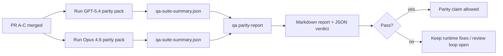

# Notas del encargado de mantenimiento de paridad GPT-5.4 / Codex

Esta nota explica cómo revisar el programa de paridad GPT-5.4 / Codex como cuatro unidades de fusión sin perder la arquitectura original de seis contratos.

## Unidades de fusión

### PR A: ejecución estricta de agente

Es propietario de:

- `executionContract`
- seguimiento de cumplimiento en el mismo turno con prioridad en GPT-5
- `update_plan` como seguimiento del progreso no terminal
- estados de bloqueo explícitos en lugar de detenciones silenciosas solo en el plan

No es propietario de:

- clasificación de fallos de autenticación/tiempo de ejecución
- veracidad de permisos
- rediseño de reproducción/continuación
- referencias de paridad

### PR B: veracidad en tiempo de ejecución

Es propietario de:

- corrección del alcance de OAuth de Codex
- clasificación de fallos de proveedor/tiempo de ejecución con tipo
- disponibilidad veraz de `/elevated full` y razones de bloqueo

No es propietario de:

- normalización de esquemas de herramientas
- estado de reproducción/actividad
- bloqueo de referencias

### PR C: corrección de ejecución

Es propietario de:

- compatibilidad de herramientas OpenAI/Codex propiedad del proveedor
- manejo de esquemas estrictos sin parámetros
- visualización de invalidaciones de reproducción
- visibilidad del estado de tareas largas en pausa, bloqueadas y abandonadas

No es propietario de:

- continuación autoelegida
- comportamiento genérico del dialecto Codex fuera de los enlaces del proveedor
- bloqueo de referencias

### PR D: arnés de paridad

Es propietario de:

- paquete de escenarios de primera ola GPT-5.4 vs Opus 4.6
- documentación de paridad
- mecánicas de informes y puertas de lanzamiento de paridad

No es propietario de:

- cambios de comportamiento en tiempo de ejecución fuera del laboratorio de QA
- simulación de autenticación/proxy/DNS dentro del arnés

## Mapeo de vuelta a los seis contratos originales

| Contrato original                                    | Unidad de fusión |
| ---------------------------------------------------- | ---------------- |
| Corrección de transporte/autenticación del proveedor | PR B             |
| Compatibilidad de contratos/esquemas de herramientas | PR C             |
| Ejecución en el mismo turno                          | PR A             |
| Veracidad de permisos                                | PR B             |
| Corrección de reproducción/continuación/actividad    | PR C             |
| Referencia/puerta de lanzamiento                     | PR D             |

## Orden de revisión

1. PR A
2. PR B
3. PR C
4. PR D

La PR D es la capa de prueba. No debería ser la razón por la que se retrasen las PR de corrección de tiempo de ejecución.

## Qué buscar

### PR A

- Las ejecuciones de GPT-5 actúan o fallan de forma cerrada en lugar de detenerse en comentarios
- `update_plan` ya no parece progreso por sí solo
- el comportamiento se mantiene con prioridad en GPT-5 y con alcance en Pi incrustado

### PR B

- los fallos de autenticación/proxy/runtime dejan de colapsarse en el manejo genérico de "fallo del modelo"
- `/elevated full` solo se describe como disponible cuando realmente lo está
- las razones de bloqueo son visibles tanto para el modelo como para el runtime orientado al usuario

### PR C

- el registro estricto de herramientas de OpenAI/Codex se comporta de manera predecible
- las herramientas sin parámetros no fallan las comprobaciones estrictas del esquema
- los resultados de la reproducción y compactación preservan el estado de actividad verídico

### PR D

- el paquete de escenarios es comprensible y reproducible
- el paquete incluye un carril de seguridad de reproducción con mutaciones, no solo flujos de solo lectura
- los informes son legibles por humanos y automatización
- las afirmaciones de paridad están respaldadas por evidencia, no son anecdóticas

Artefactos esperados del PR D:

- `qa-suite-report.md` / `qa-suite-summary.json` para cada ejecución del modelo
- `qa-agentic-parity-report.md` con comparación agregada y a nivel de escenario
- `qa-agentic-parity-summary.json` con un veredicto legible por máquina

## Criterion de lanzamiento

No afirmar la paridad o superioridad de GPT-5.4 sobre Opus 4.6 hasta que:

- PR A, PR B y PR C se han fusionado
- PR D ejecuta el paquete de paridad de primera ola sin problemas
- las suites de regresión de veracidad del runtime permanecen en verde
- el informe de paridad no muestra casos de éxito falso ni regresión en el comportamiento de detención

El arnés de paridad no es la única fuente de evidencia. Mantenga esta división explícita en la revisión:

- PR D posee la comparación basada en escenarios de GPT-5.4 vs Opus 4.6
- las suites deterministas de PR B aún poseen la evidencia de veracidad de auth/proxy/DNS y de acceso completo

## Mapa de objetivo a evidencia

| Elemento del criterio de finalización                      | Propietario principal | Artefacto de revisión                                                              |
| ---------------------------------------------------------- | --------------------- | ---------------------------------------------------------------------------------- |
| Sin bloqueos solo de planificación                         | PR A                  | pruebas de runtime estrictamente agénticas y `approval-turn-tool-followthrough`    |
| Sin progreso falso o finalización falsa de herramientas    | PR A + PR D           | recuento de éxitos falsos de paridad más detalles del informe a nivel de escenario |
| Sin orientación falsa de `/elevated full`                  | PR B                  | suites deterministas de veracidad del runtime                                      |
| Los fallos de reproducción/actividad permanecen explícitos | PR C + PR D           | suites de ciclo de vida/reproducción más `compaction-retry-mutating-tool`          |
| GPT-5.4 iguala o supera a Opus 4.6                         | PR D                  | `qa-agentic-parity-report.md` y `qa-agentic-parity-summary.json`                   |

## Abreviatura del revisor: antes vs después

| Problema visible por el usuario antes                                            | Señal de revisión después                                                                             |
| -------------------------------------------------------------------------------- | ----------------------------------------------------------------------------------------------------- |
| GPT-5.4 se detuvo después de la planificación                                    | PR A muestra un comportamiento de actuar o bloquear en lugar de una finalización solo de comentarios  |
| El uso de herramientas se sentía frágil con esquemas estrictos de OpenAI/Codex   | La PR C mantiene el registro de herramientas y la invocación sin parámetros predecible                |
| Las sugerencias `/elevated full` a veces eran engañosas                          | La PR B vincula la orientación con la capacidad real de ejecución y las razones de bloqueo            |
| Las tareas largas podían desaparecer en la ambigüedad de repetición/compactación | La PR C emite estados explícitos de pausado, bloqueado, abandonado y repetición no válida             |
| Las afirmaciones de paridad eran anecdóticas                                     | La PR D genera un informe más un veredicto JSON con la misma cobertura de escenarios en ambos modelos |
