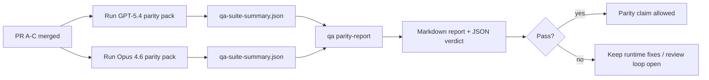

# Notas del mantenedor de paridad GPT-5.4 / Codex

Esta nota explica cómo revisar el programa de paridad GPT-5.4 / Codex como cuatro unidades de fusión sin perder la arquitectura original de seis contratos.

## Unidades de fusión

### PR A: ejecución strict-agentic

Posee:

- `executionContract`
- seguimiento en el mismo turno con prioridad GPT-5
- `update_plan` como seguimiento de progreso no terminal
- estados bloqueados explícitos en lugar de paradas silenciosas de solo planificación

No posee:

- clasificación de fallos de autenticación/runtime
- veracidad de permisos
- rediseño de reproducción/continuación
- benchmarking de paridad

### PR B: veracidad del runtime

Posee:

- corrección de scopes OAuth de Codex
- clasificación tipada de fallos de proveedor/runtime
- disponibilidad veraz de `/elevated full` y razones de bloqueo

No posee:

- normalización de esquemas de herramientas
- estado de reproducción/vitalidad
- control de puerta de benchmark

### PR C: corrección de ejecución

Posee:

- compatibilidad de herramientas OpenAI/Codex propiedad del proveedor
- manejo de esquemas estrictos sin parámetros
- visibilidad de invalidez de reproducción
- visibilidad de estados de tareas largas en pausa, bloqueadas y abandonadas

No posee:

- continuación auto-elegida
- comportamiento genérico de dialecto Codex fuera de los hooks del proveedor
- control de puerta de benchmark

### PR D: arnés de paridad

Posee:

- paquete de escenarios GPT-5.4 vs Opus 4.6 de primera ola
- documentación de paridad
- informe de paridad y mecánicas de puerta de liberación

No posee:

- cambios de comportamiento del runtime fuera del laboratorio de QA
- simulación de autenticación/proxy/DNS dentro del arnés

## Mapeo a los seis contratos originales

| Contrato original                                    | Unidad de fusión |
| ---------------------------------------------------- | ---------------- |
| Corrección de transporte/autenticación del proveedor | PR B             |
| Compatibilidad de contratos/esquemas de herramientas | PR C             |
| Ejecución en el mismo turno                          | PR A             |
| Veracidad de permisos                                | PR B             |
| Corrección de reproducción/continuación/vitalidad    | PR C             |
| Puerta de benchmark/liberación                       | PR D             |

## Orden de revisión

1. PR A
2. PR B
3. PR C
4. PR D

PR D es la capa de prueba. No debería ser la razón por la que los PR de corrección del runtime se retrasen.

## Qué buscar

### PR A

- las ejecuciones de GPT-5 actúan o fallan cerrado en lugar de detenerse en comentarios
- `update_plan` ya no parece progreso por sí mismo
- el comportamiento se mantiene con prioridad GPT-5 y alcance de Pi integrado

### PR B

- los fallos de autenticación/proxy/runtime dejan de colapsar en el manejo genérico de "el modelo falló"
- `/elevated full` solo se describe como disponible cuando realmente está disponible
- las razones de bloqueo son visibles tanto para el modelo como para el runtime面向 usuario

### PR C

- el registro estricto de herramientas OpenAI/Codex se comporta de forma predecible
- las herramientas sin parámetros no fallan las verificaciones de esquema estricto
- los resultados de reproducción y compactación preservan un estado de vitalidad veraz

### PR D

- el paquete de escenarios es comprensible y reproducible
- el paquete incluye una vía de seguridad de reproducción mutante, no solo flujos de solo lectura
- los informes son legibles por humanos y automatización
- las afirmaciones de paridad están respaldadas por evidencia, no son anecdóticas

Artefactos esperados de PR D:

- `qa-suite-report.md` / `qa-suite-summary.json` para cada ejecución de modelo
- `qa-agentic-parity-report.md` con comparación agregada y por escenario
- `qa-agentic-parity-summary.json` con un veredicto legible por máquina

## Puerta de liberación

No afirmar paridad o superioridad de GPT-5.4 sobre Opus 4.6 hasta que:

- PR A, PR B y PR C estén fusionados
- PR D ejecute limpiamente el paquete de paridad de primera ola
- las suites de regresión de veracidad del runtime permanezcan verdes
- el informe de paridad no muestre casos de falsos éxitos ni regresión en el comportamiento de parada

El arnés de paridad no es la única fuente de evidencia. Mantenga esta separación explícita en la revisión:

- PR D posee la comparación GPT-5.4 vs Opus 4.6 basada en escenarios
- Las suites deterministas de PR B siguen poseyendo la evidencia de veracidad de autenticación/proxy/DNS y acceso completo

## Mapa de objetivo a evidencia

| Elemento de la puerta de finalización                      | Propietario principal | Artefacto de revisión                                                     |
| ---------------------------------------------------------- | --------------------- | ------------------------------------------------------------------------- |
| Sin estancamientos de solo plan                            | PR A                  | pruebas de runtime strict-agentic y `approval-turn-tool-followthrough`    |
| Sin progreso falso ni finalización falsa de herramientas   | PR A + PR D           | conteo de falsos éxitos de paridad más detalles del informe por escenario |
| Sin guía errónea de `/elevated full`                       | PR B                  | suites deterministas de veracidad del runtime                             |
| Los fallos de reproducción/vitalidad permanecen explícitos | PR C + PR D           | suites de ciclo de vida/reproducción y `compaction-retry-mutating-tool`   |
| GPT-5.4 iguala o supera a Opus 4.6                         | PR D                  | `qa-agentic-parity-report.md` y `qa-agentic-parity-summary.json`          |

## Referencia rápida del revisor: antes vs después

| Problema visible por el usuario antes                                              | Señal de revisión después                                                                           |
| ---------------------------------------------------------------------------------- | --------------------------------------------------------------------------------------------------- |
| GPT-5.4 se detenía después de planificar                                           | PR A muestra comportamiento de acción o bloqueo en lugar de finalización de solo comentario         |
| El uso de herramientas parecía frágil con esquemas estrictos OpenAI/Codex          | PR C mantiene el registro de herramientas y la invocación sin parámetros predecible                 |
| Las sugerencias de `/elevated full` eran a veces engañosas                         | PR B vincula la guía a la capacidad real del runtime y las razones de bloqueo                       |
| Las tareas largas podían desaparecer en la ambigüedad de reproducción/compactación | PR C emite estados explícitos de pausa, bloqueado, abandonado y reproducción inválida               |
| Las afirmaciones de paridad eran anecdóticas                                       | PR D produce un informe más un veredicto JSON con la misma cobertura de escenarios en ambos modelos |
