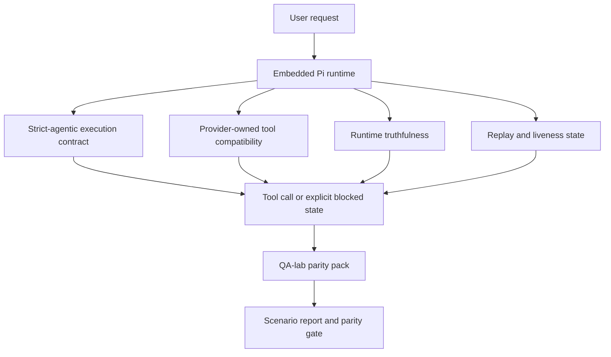
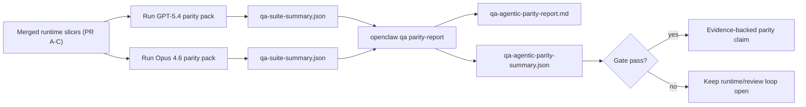

# Paridad de GPT-5.4 / Codex Agentic en OpenClaw

OpenClaw ya funcionaba bien con modelos frontera que usan herramientas, pero los modelos GPT-5.4 y de estilo Codex todavía tenían un rendimiento inferior en algunos aspectos prácticos:

- podían detenerse después de la planificación en lugar de hacer el trabajo
- podían usar esquemas de herramientas estrictos de OpenAI/Codex incorrectamente
- podían solicitar `/elevated full` incluso cuando el acceso completo era imposible
- podían perder el estado de tareas de larga duración durante la repetición o compactación
- las afirmaciones de paridad con Claude Opus 4.6 se basaban en anécdotas en lugar de escenarios repetibles

Este programa de paridad corrige esas lagunas en cuatro segmentos revisables.

## Qué cambió

### PR A: ejecución estricta de agentes

Este segmento añade un contrato de ejecución `strict-agentic` opcional para las ejecuciones integradas de Pi GPT-5.

Cuando se habilita, OpenClaw deja de aceptar turnos de solo planificación como una finalización "suficientemente buena". Si el modelo solo dice lo que pretende hacer y no utiliza realmente herramientas o avanza, OpenClaw lo reintenta con una instrucción de actuación inmediata y luego falla cerrando con un estado bloqueado explícito en lugar de finalizar silenciosamente la tarea.

Esto mejora la experiencia de GPT-5.4 principalmente en:

- breves seguimientos de "ok hazlo"
- tareas de código donde el primer paso es obvio
- flujos donde `update_plan` debe ser seguimiento del progreso en lugar de texto de relleno

### PR B: veracidad en tiempo de ejecución

Este segmento hace que OpenClaw diga la verdad sobre dos cosas:

- por qué falló la llamada del proveedor/tiempo de ejecución
- si `/elevated full` está realmente disponible

Eso significa que GPT-5.4 obtiene mejores señales de tiempo de ejecución para el alcance faltante, fallos de actualización de autenticación, fallos de autenticación HTML 403, problemas de proxy, fallos de DNS o tiempo de espera agotado, y modos de acceso completo bloqueados. Es menos probable que el modelo alucine la solución incorrecta o siga solicitando un modo de permiso que el tiempo de ejecución no puede proporcionar.

### PR C: corrección de ejecución

Este segmento mejora dos tipos de corrección:

- compatibilidad de esquemas de herramientas de OpenAI/Codex propiedad del proveedor
- revelación de la actividad en la repetición y tareas largas

El trabajo de compatibilidad de herramientas reduce la fricción del esquema para el registro estricto de herramientas de OpenAI/Codex, especialmente en torno a herramientas sin parámetros y expectativas estrictas de raíz de objeto. El trabajo de repetición/actividad hace que las tareas de larga duración sean más observables, por lo que los estados en pausa, bloqueados y abandonados son visibles en lugar de desaparecer en un texto de falla genérico.

### PR D: arnés de paridad

Este segmento añade el primer paquete de paridad del laboratorio de control de calidad (QA-lab) para que GPT-5.4 y Opus 4.6 puedan ejercitarse a través de los mismos escenarios y compararse utilizando evidencia compartida.

El paquete de paridad es la capa de prueba. No cambia el comportamiento en tiempo de ejecución por sí mismo.

Una vez que tenga dos artefactos `qa-suite-summary.json`, genere la comparación de la puerta de lanzamiento (release-gate) con:

```bash
pnpm openclaw qa parity-report \
  --repo-root . \
  --candidate-summary .artifacts/qa-e2e/gpt54/qa-suite-summary.json \
  --baseline-summary .artifacts/qa-e2e/opus46/qa-suite-summary.json \
  --output-dir .artifacts/qa-e2e/parity
```

Ese comando escribe:

- un informe en Markdown legible por humanos
- un veredicto JSON legible por máquina
- un resultado de puerta explícito `pass` / `fail`

## Por qué esto mejora GPT-5.4 en la práctica

Antes de este trabajo, GPT-5.4 en OpenClaw podía parecerse menos a una agente que Opus en sesiones reales de codificación porque el tiempo de ejecución toleraba comportamientos que son especialmente dañinos para los modelos estilo GPT-5:

- turnos de solo comentario
- fricción del esquema alrededor de las herramientas
- comentarios de permisos vagos
- reproducción silenciosa o interrupción de compactación

El objetivo no es hacer que GPT-5.4 imite a Opus. El objetivo es dar a GPT-5.4 un contrato de tiempo de ejecución que recompense el progreso real, proporcione semánticas de herramientas y permisos más limpias, y convierta los modos de fallo en estados explícitos legibles por máquina y por humanos.

Eso cambia la experiencia del usuario de:

- “el modelo tenía un buen plan pero se detuvo”

a:

- “el modelo actuó, o OpenClaw mostró la razón exacta por la que no podía”

## Antes y después para los usuarios de GPT-5.4

| Antes de este programa                                                                                                            | Después de las PR A-D                                                                                                     |
| --------------------------------------------------------------------------------------------------------------------------------- | ------------------------------------------------------------------------------------------------------------------------- |
| GPT-5.4 podía detenerse después de un plan razonable sin dar el siguiente paso de herramienta                                     | La PR A convierte “solo planificar” en “actuar ahora o mostrar un estado bloqueado”                                       |
| Los esquemas estrictos de herramientas podían rechazar herramientas sin parámetros o con forma de OpenAI/Codex de formas confusas | La PR C hace que el registro y la invocación de herramientas propiedad del proveedor sean más predecibles                 |
| La guía `/elevated full` podía ser vaga o incorrecta en tiempos de ejecución bloqueados                                           | La PR B proporciona a GPT-5.4 y al usuario sugerencias veraces sobre el tiempo de ejecución y los permisos                |
| Los fallos de reproducción o compactación podían parecer que la tarea desaparecía silenciosamente                                 | La PR C muestra explícitamente los resultados en pausa, bloqueados, abandonados e inválidos para la reproducción          |
| “GPT-5.4 se siente peor que Opus” era mayormente anecdótico                                                                       | La PR D convierte eso en el mismo paquete de escenarios, las mismas métricas y una puerta de aprobado/suspendido estricta |

## Arquitectura



## Flujo de lanzamiento



## Paquete de escenarios

El primer paquete de paridad cubre actualmente cinco escenarios:

### `approval-turn-tool-followthrough`

Comprueba que el modelo no se detenga en «Lo haré» después de una breve aprobación. Debe tomar la primera acción concreta en el mismo turno.

### `model-switch-tool-continuity`

Comprueba que el trabajo con herramientas sigue siendo coherente a través de los límites de cambio de modelo/tiempo de ejecución en lugar de restablecerse en comentarios o perder el contexto de ejecución.

### `source-docs-discovery-report`

Comprueba que el modelo pueda leer el código fuente y la documentación, sintetizar los hallazgos y continuar la tarea de manera agéntica en lugar de producir un resumen superficial y detenerse prematuramente.

### `image-understanding-attachment`

Comprueba que las tareas de modo mixto que implican archivos adjuntos sigan siendo accionables y no colapsen en una narración vaga.

### `compaction-retry-mutating-tool`

Comprueba que una tarea con una escritura mutante real mantenga la inseguridad de reproducción explícita en lugar de parecer silenciosamente segura para la reproducción si la ejecución se compacta, reintenta o pierde el estado de respuesta bajo presión.

## Matriz de escenarios

| Escenario                          | Lo que prueba                                                       | Buen comportamiento de GPT-5.4                                                                               | Señal de fallo                                                                                             |
| ---------------------------------- | ------------------------------------------------------------------- | ------------------------------------------------------------------------------------------------------------ | ---------------------------------------------------------------------------------------------------------- |
| `approval-turn-tool-followthrough` | Turnos de aprobación cortos después de un plan                      | Inicia la primera acción de herramienta concreta inmediatamente en lugar de reiterar la intención            | seguimiento solo del plan, sin actividad de herramientas o turno bloqueado sin un bloqueador real          |
| `model-switch-tool-continuity`     | Cambio de modelo/tiempo de ejecución durante el uso de herramientas | Conserva el contexto de la tarea y continúa actuando de manera coherente                                     | se restablece en comentarios, pierde el contexto de las herramientas o se detiene después del cambio       |
| `source-docs-discovery-report`     | Lectura de fuentes + síntesis + acción                              | Encuentra fuentes, utiliza herramientas y produce un informe útil sin detenerse                              | resumen superficial, falta de trabajo con herramientas o detención en un turno incompleto                  |
| `image-understanding-attachment`   | Trabajo agéntico impulsado por archivos adjuntos                    | Interpreta el archivo adjunto, lo conecta con las herramientas y continúa la tarea                           | narración vaga, archivo adjunto ignorado o ninguna acción concreta siguiente                               |
| `compaction-retry-mutating-tool`   | Trabajo mutante bajo presión de compactación                        | Realiza una escritura real y mantiene la inseguridad de reproducción explícita después del efecto secundario | ocurre una escritura mutante pero la seguridad de reproducción está implícita, ausente o es contradictoria |

## Puerta de lanzamiento

Solo se puede considerar que GPT-5.4 está a la par o es mejor cuando el tiempo de ejecución combinado supera el paquete de paridad y las regresiones de veracidad del tiempo de ejecución al mismo tiempo.

Resultados requeridos:

- sin estancamiento de solo plan cuando la siguiente acción de herramienta es clara
- sin finalización falsa sin ejecución real
- sin orientación incorrecta de `/elevated full`
- sin repetición silenciosa o abandono de compactación
- métricas de parity-pack que sean al menos tan sólidas como la línea base de Opus 4.6 acordada

Para el harness de primera ola, el gate compara:

- tasa de finalización
- tasa de paradas no intencionadas
- tasa de llamadas a herramientas válidas
- recuento de éxitos falsos

La evidencia de paridad se divide intencionalmente en dos capas:

- PR D demuestra el comportamiento de GPT-5.4 frente a Opus 4.6 en el mismo escenario con QA-lab
- las suites deterministas de PR B prueban la veracidad de auth, proxy, DNS y `/elevated full` fuera del harness

## Matriz de objetivo a evidencia

| Elemento del gate de finalización                                           | PR propietaria | Fuente de evidencia                                                             | Señal de paso                                                                                                                 |
| --------------------------------------------------------------------------- | -------------- | ------------------------------------------------------------------------------- | ----------------------------------------------------------------------------------------------------------------------------- |
| GPT-5.4 ya no se bloquea después de la planificación                        | PR A           | `approval-turn-tool-followthrough` más suites de runtime de PR A                | los turnos de aprobación activan el trabajo real o un estado bloqueado explícito                                              |
| GPT-5.4 ya no falsifica el progreso o la finalización falsa de herramientas | PR A + PR D    | resultados de escenarios del informe de paridad y recuento de éxitos falsos     | sin resultados de paso sospechosos y sin finalización solo de comentarios                                                     |
| GPT-5.4 ya no da orientación falsa de `/elevated full`                      | PR B           | suites de veracidad deterministas                                               | las razones de bloqueo y las pistas de acceso completo se mantienen precisas en tiempo de ejecución                           |
| Los fallos de repetición/vigencia se mantienen explícitos                   | PR C + PR D    | suites de ciclo de vida/repetición de PR C más `compaction-retry-mutating-tool` | el trabajo de mutación mantiene la inseguridad de repetición explícita en lugar de desaparecer silenciosamente                |
| GPT-5.4 iguala o supera a Opus 4.6 en las métricas acordadas                | PR D           | `qa-agentic-parity-report.md` y `qa-agentic-parity-summary.json`                | misma cobertura de escenarios y sin regresión en la finalización, el comportamiento de parada o el uso válido de herramientas |

## Cómo leer el veredicto de paridad

Use el veredicto en `qa-agentic-parity-summary.json` como la decisión final legible por máquina para el paquete de paridad de primera ola.

- `pass` significa que GPT-5.4 cubrió los mismos escenarios que Opus 4.6 y no regresionó en las métricas agregadas acordadas.
- `fail` significa que se activó al menos un gate duro: finalización más débil, paradas no intencionadas peores, uso de herramientas válido más débil, cualquier caso de éxito falso o cobertura de escenarios desigual.
- "shared/base CI issue" no es en sí mismo un resultado de paridad. Si el ruido de CI fuera de PR D bloquea una ejecución, el veredicto debe esperar a una ejecución limpia en el runtime fusionado en lugar de inferirse a partir de registros de la era de la rama.
- La veracidad de Auth, proxy, DNS y `/elevated full` todavía proviene de los conjuntos deterministas de PR B, por lo que la afirmación de lanzamiento final necesita ambos: un veredicto de paridad de PR D superado y una cobertura de veracidad de PR B en verde.

## Quién debe habilitar `strict-agentic`

Use `strict-agentic` cuando:

- se espera que el agente actúe de inmediato cuando el siguiente paso sea obvio
- los modelos GPT-5.4 o de la familia Codex son el runtime principal
- prefiere estados bloqueados explícitos sobre respuestas de "resumen" "útiles"

Mantenga el contrato predeterminado cuando:

- desea el comportamiento más flexible existente
- no está usando modelos de la familia GPT-5
- está probando indicaciones (prompts) en lugar de la aplicación del runtime
