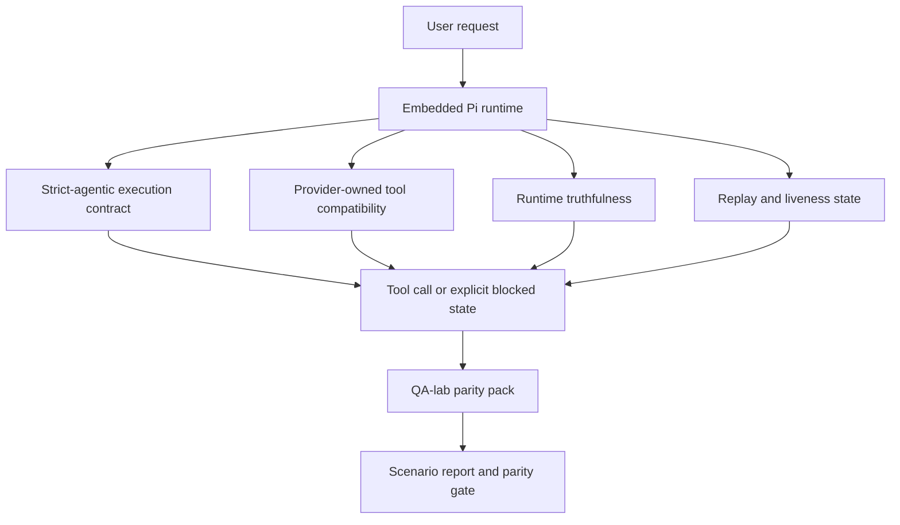
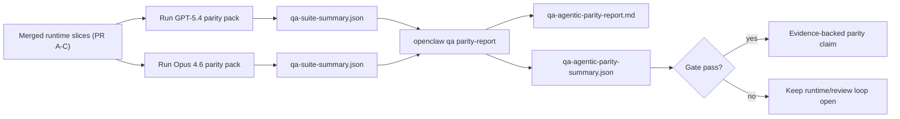

# Paridad agentic de GPT-5.4 / Codex en OpenClaw

OpenClaw ya funcionaba bien con modelos de frontera que usan herramientas, pero GPT-5.4 y los modelos de tipo Codex todavía presentaban carencias en algunos aspectos prácticos:

- podían detenerse después de la planificación en lugar de realizar el trabajo
- podían usar incorrectamente los esquemas estrictos de herramientas OpenAI/Codex
- podían solicitar `/elevated full` incluso cuando el acceso completo era imposible
- podían perder el estado de tareas de larga duración durante la reproducción o compactación
- las afirmaciones de paridad frente a Claude Opus 4.6 se basaban en anécdotas en lugar de escenarios reproducibles

Este programa de paridad corrige esas carencias en cuatro tramos revisables.

## Qué cambió

### PR A: ejecución strict-agentic

Este tramo añade un contrato de ejecución `strict-agentic` opt-in para las ejecuciones GPT-5 Pi integradas.

Cuando está habilitado, OpenClaw deja de aceptar turnos de solo planificación como una finalización "suficientemente buena". Si el modelo solo dice lo que tiene intención de hacer y no usa herramientas ni progresa realmente, OpenClaw reintenta con una indicación de acción inmediata y luego falla cerrado con un estado bloqueado explícito en lugar de terminar silenciosamente la tarea.

Esto mejora la experiencia de GPT-5.4 principalmente en:

- seguimientos cortos de tipo "ok, hazlo"
- tareas de código donde el primer paso es obvio
- flujos donde `update_plan` debería ser seguimiento de progreso en lugar de texto de relleno

### PR B: veracidad del runtime

Este tramo hace que OpenClaw diga la verdad sobre dos cosas:

- por qué falló la llamada al proveedor/runtime
- si `/elevated full` está realmente disponible

Eso significa que GPT-5.4 obtiene mejores señales de runtime para ámbitos faltantes, fallos de renovación de autenticación, fallos de autenticación HTML 403, problemas de proxy, fallos de DNS o timeout, y modos de acceso completo bloqueados. El modelo es menos propenso a alucinar una remediación incorrecta o seguir pidiendo un modo de permiso que el runtime no puede proporcionar.

### PR C: corrección de ejecución

Este tramo mejora dos tipos de corrección:

- compatibilidad de esquemas de herramientas OpenAI/Codex propiedad del proveedor
- visibilidad del estado de reproducción y tareas de larga duración

El trabajo de compatibilidad de herramientas reduce la fricción de esquemas para el registro estricto de herramientas OpenAI/Codex, especialmente alrededor de herramientas sin parámetros y expectativas estrictas de raíz de objeto. El trabajo de reproducción/vitalidad hace que las tareas de larga duración sean más observables, de modo que los estados en pausa, bloqueados y abandonados son visibles en lugar de desaparecer en texto de fallo genérico.

### PR D: arnés de paridad

Este tramo añade el paquete de paridad de primera ola del laboratorio de QA para que GPT-5.4 y Opus 4.6 puedan ejercitarse a través de los mismos escenarios y compararse usando evidencia compartida.

El paquete de paridad es la capa de prueba. No cambia el comportamiento del runtime por sí mismo.

Una vez que tenga dos artefactos `qa-suite-summary.json`, genere la comparación de puerta de liberación con:

```bash
pnpm openclaw qa parity-report \
  --repo-root . \
  --candidate-summary .artifacts/qa-e2e/gpt54/qa-suite-summary.json \
  --baseline-summary .artifacts/qa-e2e/opus46/qa-suite-summary.json \
  --output-dir .artifacts/qa-e2e/parity
```

Ese comando genera:

- un informe Markdown legible por humanos
- un veredicto JSON legible por máquina
- un resultado de puerta explícito `pass` / `fail`

## Por qué esto mejora GPT-5.4 en la práctica

Antes de este trabajo, GPT-5.4 en OpenClaw podía parecer menos agentic que Opus en sesiones de codificación reales porque el runtime toleraba comportamientos especialmente perjudiciales para modelos de estilo GPT-5:

- turnos de solo comentario
- fricción de esquemas alrededor de herramientas
- retroalimentación vaga sobre permisos
- rotura silenciosa de reproducción o compactación

El objetivo no es que GPT-5.4 imite a Opus. El objetivo es dar a GPT-5.4 un contrato de runtime que recompense el progreso real, proporcione semánticas más claras de herramientas y permisos, y convierta los modos de fallo en estados explícitos legibles por máquina y por humanos.

Eso cambia la experiencia del usuario de:

- "el modelo tenía un buen plan pero se detuvo"

a:

- "el modelo actuó, o OpenClaw mostró la razón exacta por la que no pudo"

## Antes vs después para usuarios de GPT-5.4

| Antes de este programa                                                                                                      | Después de PR A-D                                                                                        |
| --------------------------------------------------------------------------------------------------------------------------- | -------------------------------------------------------------------------------------------------------- |
| GPT-5.4 podía detenerse después de un plan razonable sin ejecutar el siguiente paso de herramienta                          | PR A convierte "solo plan" en "actúa ahora o muestra un estado bloqueado"                                |
| Los esquemas estrictos de herramientas podían rechazar herramientas sin parámetros o de forma OpenAI/Codex de forma confusa | PR C hace que el registro e invocación de herramientas propiedad del proveedor sea más predecible        |
| La guía de `/elevated full` podía ser vaga o incorrecta en runtimes bloqueados                                              | PR B da a GPT-5.4 y al usuario pistas veraces sobre runtime y permisos                                   |
| Los fallos de reproducción o compactación podían parecer que la tarea desapareció silenciosamente                           | PR C muestra explícitamente estados en pausa, bloqueados, abandonados y de reproducción inválida         |
| "GPT-5.4 se siente peor que Opus" era mayormente anecdótico                                                                 | PR D lo convierte en el mismo paquete de escenarios, las mismas métricas y una puerta pass/fail estricta |

## Arquitectura



## Flujo de liberación



## Paquete de escenarios

El paquete de paridad de primera ola cubre actualmente cinco escenarios:

### `approval-turn-tool-followthrough`

Verifica que el modelo no se detenga en "voy a hacer eso" después de una breve aprobación. Debería ejecutar la primera acción concreta en el mismo turno.

### `model-switch-tool-continuity`

Verifica que el trabajo con herramientas se mantenga coherente a través de los límites de cambio de modelo/runtime en lugar de reiniciarse en comentarios o perder el contexto de ejecución.

### `source-docs-discovery-report`

Verifica que el modelo pueda leer fuentes y documentación, sintetizar hallazgos y continuar la tarea de manera agentic en lugar de producir un resumen superficial y detenerse prematuramente.

### `image-understanding-attachment`

Verifica que las tareas en modo mixto que involucran adjuntos sigan siendo procesables y no colapsen en narración vaga.

### `compaction-retry-mutating-tool`

Verifica que una tarea con una escritura mutante real mantenga explícita la inseguridad de reproducción en lugar de parecer silenciosamente segura para reproducción si la ejecución se compacta, reintenta o pierde el estado de respuesta bajo presión.

## Matriz de escenarios

| Escenario                          | Lo que prueba                                     | Buen comportamiento de GPT-5.4                                                                               | Señal de fallo                                                                                          |
| ---------------------------------- | ------------------------------------------------- | ------------------------------------------------------------------------------------------------------------ | ------------------------------------------------------------------------------------------------------- |
| `approval-turn-tool-followthrough` | Turnos cortos de aprobación después de un plan    | Inicia la primera acción concreta de herramienta inmediatamente en lugar de reformular la intención          | seguimiento de solo plan, sin actividad de herramientas, o turno bloqueado sin un bloqueador real       |
| `model-switch-tool-continuity`     | Cambio de runtime/modelo bajo uso de herramientas | Preserva el contexto de la tarea y continúa actuando coherentemente                                          | se reinicia en comentarios, pierde el contexto de herramientas, o se detiene después del cambio         |
| `source-docs-discovery-report`     | Lectura de fuentes + síntesis + acción            | Encuentra fuentes, usa herramientas y produce un informe útil sin estancarse                                 | resumen superficial, trabajo de herramientas faltante, o parada de turno incompleto                     |
| `image-understanding-attachment`   | Trabajo agentic impulsado por adjuntos            | Interpreta el adjunto, lo conecta con herramientas y continúa la tarea                                       | narración vaga, adjunto ignorado, o ninguna acción concreta siguiente                                   |
| `compaction-retry-mutating-tool`   | Trabajo mutante bajo presión de compactación      | Realiza una escritura real y mantiene explícita la inseguridad de reproducción después del efecto secundario | la escritura mutante ocurre pero la seguridad de reproducción está implícita, faltante o contradictoria |

## Puerta de liberación

GPT-5.4 solo puede considerarse a paridad o superior cuando el runtime fusionado pasa simultáneamente el paquete de paridad y las regresiones de veracidad del runtime.

Resultados requeridos:

- sin estancamiento de solo plan cuando la siguiente acción de herramienta es clara
- sin finalización falsa sin ejecución real
- sin guía incorrecta de `/elevated full`
- sin abandono silencioso de reproducción o compactación
- métricas del paquete de paridad al menos tan sólidas como la línea base acordada de Opus 4.6

Para el arnés de primera ola, la puerta compara:

- tasa de finalización
- tasa de paradas no intencionadas
- tasa de llamadas de herramientas válidas
- conteo de falsos éxitos

La evidencia de paridad se divide intencionalmente en dos capas:

- PR D demuestra el comportamiento de GPT-5.4 vs Opus 4.6 en los mismos escenarios con el laboratorio de QA
- Las suites deterministas de PR B demuestran la veracidad de autenticación, proxy, DNS y `/elevated full` fuera del arnés

## Matriz de objetivo a evidencia

| Elemento de la puerta de finalización                             | PR propietario | Fuente de evidencia                                                             | Señal de aprobación                                                                                                  |
| ----------------------------------------------------------------- | -------------- | ------------------------------------------------------------------------------- | -------------------------------------------------------------------------------------------------------------------- |
| GPT-5.4 ya no se estanca después de la planificación              | PR A           | `approval-turn-tool-followthrough` y suites de runtime de PR A                  | los turnos de aprobación activan trabajo real o un estado bloqueado explícito                                        |
| GPT-5.4 ya no finge progreso o finalización falsa de herramientas | PR A + PR D    | resultados de escenarios del informe de paridad y conteo de falsos éxitos       | sin resultados de aprobación sospechosos y sin finalización de solo comentario                                       |
| GPT-5.4 ya no da guía falsa de `/elevated full`                   | PR B           | suites deterministas de veracidad del runtime                                   | las razones de bloqueo y las sugerencias de acceso completo se mantienen precisas al runtime                         |
| Los fallos de reproducción/vitalidad permanecen explícitos        | PR C + PR D    | suites de ciclo de vida/reproducción de PR C y `compaction-retry-mutating-tool` | el trabajo mutante mantiene explícita la inseguridad de reproducción en lugar de desaparecer silenciosamente         |
| GPT-5.4 iguala o supera a Opus 4.6 en las métricas acordadas      | PR D           | `qa-agentic-parity-report.md` y `qa-agentic-parity-summary.json`                | misma cobertura de escenarios y sin regresión en finalización, comportamiento de parada o uso válido de herramientas |

## Cómo leer el veredicto de paridad

Use el veredicto en `qa-agentic-parity-summary.json` como la decisión final legible por máquina para el paquete de paridad de primera ola.

- `pass` significa que GPT-5.4 cubrió los mismos escenarios que Opus 4.6 sin regresión en las métricas agregadas acordadas.
- `fail` significa que al menos una puerta dura se activó: finalización más débil, peores paradas no intencionadas, uso de herramientas válidas más débil, cualquier caso de falso éxito, o cobertura de escenarios inconsistente.
- "problema de CI compartido/base" no es en sí mismo un resultado de paridad. Si el ruido de CI fuera de PR D bloquea una ejecución, el veredicto debe esperar una ejecución limpia del runtime fusionado en lugar de inferirse de los registros de la era de la rama.
- La veracidad de autenticación, proxy, DNS y `/elevated full` todavía proviene de las suites deterministas de PR B, por lo que la afirmación de liberación final necesita ambos: un veredicto de paridad PR D aprobado y cobertura de veracidad PR B verde.

## Quién debería habilitar `strict-agentic`

Habilite `strict-agentic` cuando:

- se espera que el agente actúe inmediatamente cuando el siguiente paso es obvio
- GPT-5.4 o modelos de la familia Codex son el runtime principal
- prefiere estados bloqueados explícitos sobre respuestas de solo resumen "útiles"

Mantenga el contrato predeterminado cuando:

- desea el comportamiento existente más flexible
- no está usando modelos de la familia GPT-5
- está probando prompts en lugar de la aplicación del runtime
