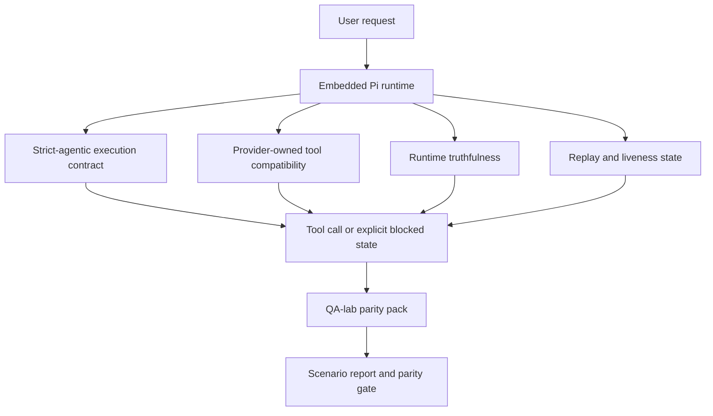
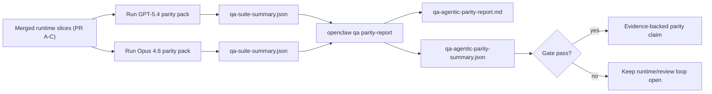

# Paridad Agentic de GPT-5.4 / Codex en OpenClaw

OpenClaw ya funcionaba bien con modelos fronterizos que utilizan herramientas, pero GPT-5.4 y los modelos estilo Codex aún estaban por debajo de lo esperado en unos pocos aspectos prácticos:

- podían detenerse después de planificar en lugar de hacer el trabajo
- podían usar esquemas de herramientas estrictos de OpenAI/Codex incorrectamente
- podían pedir `/elevated full` incluso cuando el acceso completo era imposible
- podían perder el estado de tareas de larga duración durante la reproducción o compactación
- las afirmaciones de paridad contra Claude Opus 4.6 se basaban en anécdotas en lugar de escenarios repetibles

Este programa de paridad corrige esas brechas en cuatro segmentos revisables.

## Qué cambió

### PR A: ejecución estricta-agentic

Este segmento añade un contrato de ejecución `strict-agentic` opcional para ejecuciones integradas de Pi GPT-5.

Cuando está habilitado, OpenClaw deja de aceptar turnos de solo planificación como una finalización "suficientemente buena". Si el modelo solo dice lo que pretende hacer y no usa herramientas o hace progreso real, OpenClaw reintenta con una guía de actuación inmediata y luego falla cerrando con un estado de bloqueo explícito en lugar de terminar silenciosamente la tarea.

Esto mejora la experiencia de GPT-5.4 principalmente en:

- breves seguimientos de "ok hazlo"
- tareas de código donde el primer paso es obvio
- flujos donde `update_plan` debe ser un seguimiento del progreso en lugar de texto de relleno

### PR B: veracidad en tiempo de ejecución

Este segmento hace que OpenClaw diga la verdad sobre dos cosas:

- por qué falló la llamada del proveedor/tiempo de ejecución
- si `/elevated full` está realmente disponible

Eso significa que GPT-5.4 recibe mejores señales de tiempo de ejecución para el alcance faltante, fallas de actualización de autenticación, fallos de autenticación HTML 403, problemas de proxy, fallos de DNS o tiempo de espera, y modos de acceso completo bloqueados. Es menos probable que el modelo alucine la solución incorrecta o siga pidiendo un modo de permiso que el tiempo de ejecución no puede proporcionar.

### PR C: corrección de ejecución

Este segmento mejora dos tipos de corrección:

- compatibilidad de esquemas de herramientas de OpenAI/Codex propiedad del proveedor
- reproducción y superficie de actividad de tareas largas

El trabajo de compatibilidad de herramientas (tool-compat) reduce la fricción del esquema para el registro estricto de herramientas de OpenAI/Codex, especialmente en torno a las herramientas sin parámetros y las expectativas estrictas de objeto raíz. El trabajo de repetición/actividad (replay/liveness) hace que las tareas de larga duración sean más observables, por lo que los estados en pausa, bloqueados y abandonados son visibles en lugar de desaparecer en un texto de falla genérico.

### PR D: arnés de paridad

Este segmento añade el paquete de paridad del laboratorio de QA de primera ola para que GPT-5.4 y Opus 4.6 puedan ser ejercitados a través de los mismos escenarios y comparados utilizando pruebas compartidas.

El paquete de paridad es la capa de prueba. No cambia el comportamiento de tiempo de ejecución por sí mismo.

Una vez que tenga dos artefactos `qa-suite-summary.json`, genere la comparación del control de liberación (release-gate) con:

```bash
pnpm openclaw qa parity-report \
  --repo-root . \
  --candidate-summary .artifacts/qa-e2e/gpt54/qa-suite-summary.json \
  --baseline-summary .artifacts/qa-e2e/opus46/qa-suite-summary.json \
  --output-dir .artifacts/qa-e2e/parity
```

Ese comando escribe:

- un informe Markdown legible por humanos
- un veredicto JSON legible por máquinas
- un resultado de control (gate) explícito de `pass` / `fail`

## Por qué esto mejora GPT-5.4 en la práctica

Antes de este trabajo, GPT-5.4 en OpenClaw podía parecerse menos a un agente que Opus en sesiones de codificación reales porque el tiempo de ejecución toleraba comportamientos que son especialmente dañinos para los modelos tipo GPT-5:

- turnos solo de comentarios
- fricción del esquema alrededor de las herramientas
- comentarios de permisos vagos
- fallos silenciosos de repetición o compactación

El objetivo no es hacer que GPT-5.4 imite a Opus. El objetivo es darle a GPT-5.4 un contrato de tiempo de ejecución que recompense el progreso real, proporcione semánticas más limpias de herramientas y permisos, y convierta los modos de fallo en estados explícitos legibles por máquinas y humanos.

Eso cambia la experiencia del usuario de:

- “el modelo tenía un buen plan pero se detuvo”

a:

- “el modelo actuó, o OpenClaw mostró la razón exacta por la que no podía”

## Antes y después para los usuarios de GPT-5.4

| Antes de este programa                                                                                                             | Después de la PR A-D                                                                                                    |
| ---------------------------------------------------------------------------------------------------------------------------------- | ----------------------------------------------------------------------------------------------------------------------- |
| GPT-5.4 podía detenerse después de un plan razonable sin tomar el siguiente paso de herramienta                                    | La PR A convierte “solo plan” en “actuar ahora o mostrar un estado bloqueado”                                           |
| Los esquemas estrictos de herramientas podían rechazar herramientas sin parámetros o con forma de OpenAI/Codex de maneras confusas | La PR C hace que el registro y la invocación de herramientas propiedad del proveedor sean más predecibles               |
| La orientación `/elevated full` podía ser vaga o incorrecta en tiempos de ejecución bloqueados                                     | La PR B proporciona a GPT-5.4 y al usuario sugerencias verdaderas sobre el tiempo de ejecución y los permisos           |
| Los fallos de repetición o compactación podían parecer que la tarea desapareció silenciosamente                                    | La PR C expone explícitamente los resultados en pausa, bloqueados, abandonados y no válidos para repetición             |
| "GPT-5.4 se siente peor que Opus" era mayormente anecdótico                                                                        | La PR D convierte eso en el mismo paquete de escenarios, las mismas métricas y una puerta de aprobado/suspenso estricta |

## Arquitectura



## Flujo de lanzamiento



## Paquete de escenarios

El paquete de paridad de la primera ola cubre actualmente cinco escenarios:

### `approval-turn-tool-followthrough`

Verifica que el modelo no se detenga en "Haré eso" después de una breve aprobación. Debe tomar la primera acción concreta en el mismo turno.

### `model-switch-tool-continuity`

Verifica que el trabajo con herramientas permanezca coherente a través de los límites de cambio de modelo/tiempo de ejecución en lugar de restablecerse en comentarios o perder el contexto de ejecución.

### `source-docs-discovery-report`

Verifica que el modelo pueda leer el código fuente y los documentos, sintetizar los hallazgos y continuar la tarea de manera agéntica en lugar de producir un resumen breve y detenerse antes de tiempo.

### `image-understanding-attachment`

Verifica que las tareas de modo mixto que involucran archivos adjuntos sigan siendo procesables y no colapsen en una narrativa vaga.

### `compaction-retry-mutating-tool`

Verifica que una tarea con una escritura mutadora real mantenga explícita la inseguridad de repetición en lugar de parecer silenciosamente segura para la repetición si la ejecución se compacta, reintenta o pierde el estado de respuesta bajo presión.

## Matriz de escenarios

| Escenario                          | Lo que prueba                                                       | Buen comportamiento de GPT-5.4                                                                               | Señal de fallo                                                                                             |
| ---------------------------------- | ------------------------------------------------------------------- | ------------------------------------------------------------------------------------------------------------ | ---------------------------------------------------------------------------------------------------------- |
| `approval-turn-tool-followthrough` | Turnos de aprobación cortos después de un plan                      | Inicia la primera acción de herramienta concreta inmediatamente en lugar de reiterar la intención            | seguimiento solo de plan, sin actividad de herramientas o turno bloqueado sin un bloqueador real           |
| `model-switch-tool-continuity`     | Cambio de tiempo de ejecución/modelo durante el uso de herramientas | Conserva el contexto de la tarea y continúa actuando de manera coherente                                     | se restablece en comentarios, pierde el contexto de las herramientas o se detiene después del cambio       |
| `source-docs-discovery-report`     | Lectura de código fuente + síntesis + acción                        | Encuentra fuentes, usa herramientas y produce un informe útil sin detenerse                                  | resumen breve, trabajo de herramientas faltante o detención en turno incompleto                            |
| `image-understanding-attachment`   | Trabajo agéntico impulsado por archivos adjuntos                    | Interpreta el archivo adjunto, lo conecta con las herramientas y continúa con la tarea                       | narrativa vaga, archivo adjunto ignorado o ninguna acción siguiente concreta                               |
| `compaction-retry-mutating-tool`   | Trabajo mutador bajo presión de compactación                        | Realiza una escritura real y mantiene la inseguridad de reproducción explícita después del efecto secundario | ocurre una escritura mutante pero la seguridad de reproducción está implícita, ausente o es contradictoria |

## Puerta de lanzamiento

GPT-5.4 solo se puede considerar a la par o mejor cuando el tiempo de ejecución combinado supera el paquete de paridad y las regresiones de veracidad del tiempo de ejecución al mismo tiempo.

Resultados requeridos:

- ningún estancamiento de solo plan cuando la siguiente acción de herramienta es clara
- ninguna finalización falsa sin ejecución real
- ninguna guía incorrecta `/elevated full`
- ningún abandono silencioso de reproducción o compactación
- métricas del paquete de paridad que sean al menos tan fuertes como la línea base acordada de Opus 4.6

Para el arnés de primera ola, la puerta compara:

- tasa de finalización
- tasa de detención no intencionada
- tasa de llamadas a herramientas válidas
- recuento de éxitos falsos

La evidencia de paridad se divide intencionalmente en dos capas:

- PR D demuestra el comportamiento de GPT-5.4 frente a Opus 4.6 en el mismo escenario con QA-lab
- Los conjuntos deterministas de PR B demuestran la veracidad de autenticación, proxy, DNS y `/elevated full` fuera del arnés

## Matriz de objetivo a evidencia

| Elemento de puerta de finalización                                            | PR propietario | Fuente de evidencia                                                                  | Señal de aprobado                                                                                                               |
| ----------------------------------------------------------------------------- | -------------- | ------------------------------------------------------------------------------------ | ------------------------------------------------------------------------------------------------------------------------------- |
| GPT-5.4 ya no se estanca después de planificar                                | PR A           | `approval-turn-tool-followthrough` más conjuntos de tiempo de ejecución de PR A      | los turnos de aprobación activan el trabajo real o un estado bloqueado explícito                                                |
| GPT-5.4 ya no falsifica el progreso o la finalización falsa de la herramienta | PR A + PR D    | resultados de escenarios del informe de paridad y recuento de éxitos falsos          | sin resultados de aprobación sospechosos y sin finalización solo con comentarios                                                |
| GPT-5.4 ya no da una guía `/elevated full` falsa                              | PR B           | conjuntos de veracidad deterministas                                                 | las razones de bloqueo y las sugerencias de acceso completo se mantienen precisas en el tiempo de ejecución                     |
| Los fallos de reproducción/actividad se mantienen explícitos                  | PR C + PR D    | conjuntos de ciclo de vida/reproducción de PR C más `compaction-retry-mutating-tool` | el trabajo mutante mantiene la inseguridad de reproducción explícita en lugar de desaparecer silenciosamente                    |
| GPT-5.4 iguala o supera a Opus 4.6 en las métricas acordadas                  | PR D           | `qa-agentic-parity-report.md` y `qa-agentic-parity-summary.json`                     | misma cobertura de escenario y sin regresión en la finalización, el comportamiento de detención o el uso válido de herramientas |

## Cómo leer el veredicto de paridad

Use el veredicto en `qa-agentic-parity-summary.json` como la decisión final legible por máquina para el paquete de paridad de primera ola.

- `pass` significa que GPT-5.4 cubrió los mismos escenarios que Opus 4.6 y no regresó en las métricas agregadas acordadas.
- `fail` significa que se activó al menos una puerta estricta: finalización más débil, paradas no intencionales peores, uso válido de herramientas más débil, cualquier caso de éxito falso o cobertura de escenarios desajustada.
- "shared/base CI issue" no es en sí mismo un resultado de paridad. Si el ruido de CI fuera del PR D bloquea una ejecución, el veredicto debe esperar a una ejecución limpia de merged-runtime en lugar de inferirse a partir de los registros de la era de la rama.
- La veracidad de Auth, proxy, DNS y `/elevated full` todavía proviene de los conjuntos deterministas del PR B, por lo que la afirmación de versión final necesita ambos: un veredicto de paridad del PR D aprobado y cobertura de veracidad verde del PR B.

## Quién debe habilitar `strict-agentic`

Use `strict-agentic` cuando:

- se espera que el agente actúe inmediatamente cuando el siguiente paso sea obvio
- GPT-5.4 o los modelos de la familia Codex son el tiempo de ejecución principal
- prefiere estados bloqueados explícitos sobre respuestas "útiles" que solo sean resúmenes

Mantenga el contrato predeterminado cuando:

- quiera el comportamiento más flexible existente
- no está usando modelos de la familia GPT-5
- está probando indicadores en lugar del cumplimiento del tiempo de ejecución
