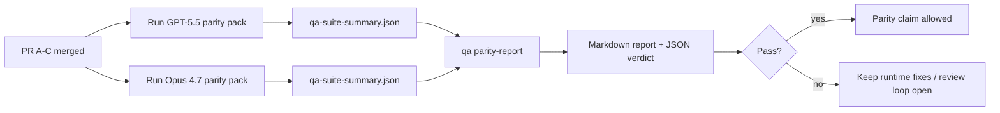

Esta nota explica cómo revisar el programa de paridad GPT-5.5 / Codex como cuatro unidades de fusión sin perder la arquitectura original de seis contratos.

## Unidades de fusión

### PR A: ejecución estrictamente agéntica

Es propietario de:

- `executionContract`
- seguimiento de continuación en el mismo turno con prioridad GPT-5
- `update_plan` como seguimiento del progreso no terminal
- estados bloqueados explícitos en lugar de detenciones silenciosas solo de planificación

No es propietario de:

- clasificación de fallos de autenticación/ejecución
- veracidad de permisos
- rediseño de reproducción/continuación
- evaluación comparativa de paridad

### PR B: veracidad en tiempo de ejecución

Es propietario de:

- corrección del alcance OAuth de Codex
- clasificación de fallos de proveedor con tipo/ejecución
- disponibilidad veraz y razones de bloqueo de `/elevated full`

No es propietario de:

- normalización del esquema de herramientas
- estado de reproducción/actividad
- puertas de evaluación comparativa

### PR C: corrección de la ejecución

Es propietario de:

- compatibilidad de herramientas OpenAI/Codex propiedad del proveedor
- manejo de esquema estricto sin parámetros
- superficie de inválidos de reproducción
- visibilidad del estado de tareas largas en pausa, bloqueadas y abandonadas

No es propietario de:

- continuación autoseleccionada
- comportamiento genérico del dialecto Codex fuera de los enlaces del proveedor
- puertas de evaluación comparativa

### PR D: arnés de paridad

Es propietario de:

- paquete de escenarios de primera ola de GPT-5.5 frente a Opus 4.7
- documentación de paridad
- informe de paridad y mecánicas de puerta de lanzamiento

No es propietario de:

- cambios de comportamiento en tiempo de ejecución fuera del laboratorio de QA
- simulación de autenticación/proxy/DNS dentro del arnés

## Mapeo de vuelta a los seis contratos originales

| Contrato original                                    | Unidad de fusión |
| ---------------------------------------------------- | ---------------- |
| Corrección de transporte/autenticación del proveedor | PR B             |
| Compatibilidad de contrato/esquema de herramientas   | PR C             |
| Ejecución en el mismo turno                          | PR A             |
| Veracidad de permisos                                | PR B             |
| Corrección de reproducción/continuación/actividad    | PR C             |
| Puerta de evaluación comparativa/lanzamiento         | PR D             |

## Orden de revisión

1. PR A
2. PR B
3. PR C
4. PR D

PR D es la capa de prueba. No debe ser la razón por la que se retrasen las PR de corrección en tiempo de ejecución.

## Qué buscar

### PR A

- Las ejecuciones de GPT-5 actúan o fallan de forma cerrada en lugar de detenerse en el comentario
- `update_plan` ya no parece progreso por sí mismo
- el comportamiento permanece con prioridad GPT-5 y con alcance Pi integrado

### PR B

- los fallos de autenticación/proxy/tiempo de ejecución dejan de colapsarse en el manejo genérico de "fallo del modelo"
- `/elevated full` solo se describe como disponible cuando realmente lo está
- las razones de bloqueo son visibles tanto para el modelo como para el runtime orientado al usuario

### PR C

- el registro estricto de herramientas de OpenAI/Codex se comporta de manera predecible
- las herramientas sin parámetros no fallan las verificaciones estrictas del esquema
- los resultados de la repetición (replay) y la compactación preservan el estado de actividad veraz

### PR D

- el paquete de escenarios es comprensible y reproducible
- el paquete incluye un carril de seguridad de repetición (replay) con mutaciones, no solo flujos de solo lectura
- los informes son legibles por humanos y automatización
- las afirmaciones de paridad están respaldadas por evidencia, no son anecdóticas

Artefactos esperados de la PR D:

- `qa-suite-report.md` / `qa-suite-summary.json` para cada ejecución del modelo
- `qa-agentic-parity-report.md` con comparación agregada y a nivel de escenario
- `qa-agentic-parity-summary.json` con un veredicto legible por máquina

## Portal de lanzamiento

No afirme la paridad o superioridad de GPT-5.5 sobre Opus 4.7 hasta que:

- la PR A, la PR B y la PR C se hayan fusionado
- la PR D ejecute el paquete de paridad de primera ola limpiamente
- las suites de regresión de veracidad del runtime se mantienen en verde
- el informe de paridad no muestra casos de éxito falso ni regresión en el comportamiento de detención

El arnés de paridad no es la única fuente de evidencia. Mantenga esta división explícita en la revisión:

- El PR D es el propietario de la comparación basada en escenarios entre GPT-5.5 y Opus 4.7
- las suites deterministas de la PR B siguen siendo propietarias de la evidencia de veracidad de auth/proxy/DNS y de acceso completo

## Flujo de trabajo de fusión rápido para el encargado de mantenimiento

Úselo cuando esté listo para integrar una PR de paridad y desee una secuencia repetible y de bajo riesgo.

1. Confirme que se cumpla el estándar de evidencia antes de la fusión:
   - síntoma reproducible o prueba fallida
   - causa raíz verificada en el código modificado
   - corrección en la ruta implicada
   - prueba de regresión o nota de verificación manual explícita
2. Triaje/Etiquetado antes de la fusión:
   - aplique cualquier etiqueta de cierre automático `r:*` cuando la PR no deba integrarse
   - mantenga a los candidatos de fusión libres de hilos de bloqueo sin resolver
3. Valide localmente en la superficie modificada:
   - `pnpm check:changed`
   - `pnpm test:changed` cuando cambien las pruebas o la confianza en la corrección de errores dependa de la cobertura de pruebas
4. Integre con el flujo estándar del encargado de mantenimiento (proceso `/landpr`), luego verifique:
   - comportamiento de cierre automático de problemas vinculados
   - Estado de CI y posterior a la fusión en `main`
5. Después de la integración, realice una búsqueda de duplicados para PRs/issues abiertos relacionados y cierre solo con una referencia canónica.

Si falta alguno de los elementos de la barra de evidencia, solicite cambios en lugar de fusionar.

## Mapa de objetivo a evidencia

| Elemento de puerta de finalización                            | Propietario principal | Artefacto de revisión                                                                    |
| ------------------------------------------------------------- | --------------------- | ---------------------------------------------------------------------------------------- |
| Sin bloqueos de solo planificación                            | PR A                  | pruebas de tiempo de ejecución estrictas de agentic y `approval-turn-tool-followthrough` |
| Sin progreso falso o finalización falsa de herramientas       | PR A + PR D           | recuento de éxitos falsos de paridad más detalles del informe a nivel de escenario       |
| Sin guía falsa de `/elevated full`                            | PR B                  | suites deterministas de veracidad en tiempo de ejecución                                 |
| Los fallos de reproducción/actividad siguen siendo explícitos | PR C + PR D           | suites de ciclo de vida/reproducción más `compaction-retry-mutating-tool`                |
| GPT-5.5 iguala o supera a Opus 4.7                            | PR D                  | `qa-agentic-parity-report.md` y `qa-agentic-parity-summary.json`                         |

## Abreviatura del revisor: antes vs después

| Problema visible por el usuario antes                                               | Señal de revisión después                                                                             |
| ----------------------------------------------------------------------------------- | ----------------------------------------------------------------------------------------------------- |
| GPT-5.5 se detuvo después de la planificación                                       | PR A muestra el comportamiento de actuar o bloquear en lugar de una finalización solo con comentarios |
| El uso de herramientas se sentía frágil con esquemas estrictos de OpenAI/Codex      | PR C mantiene el registro de herramientas y la invocación sin parámetros predecibles                  |
| Las pistas de `/elevated full` a veces eran engañosas                               | PR B vincula la guía con la capacidad real de tiempo de ejecución y las razones de bloqueo            |
| Las tareas largas podrían desaparecer en la ambigüedad de reproducción/compactación | PR C emite estados explícitos de pausado, bloqueado, abandonado y reproducción no válida              |
| Las afirmaciones de paridad eran anecdóticas                                        | PR D produce un informe más un veredicto JSON con la misma cobertura de escenario en ambos modelos    |

## Relacionado

- [Paridad agentic de GPT-5.5 / Codex](/es/help/gpt55-codex-agentic-parity)
