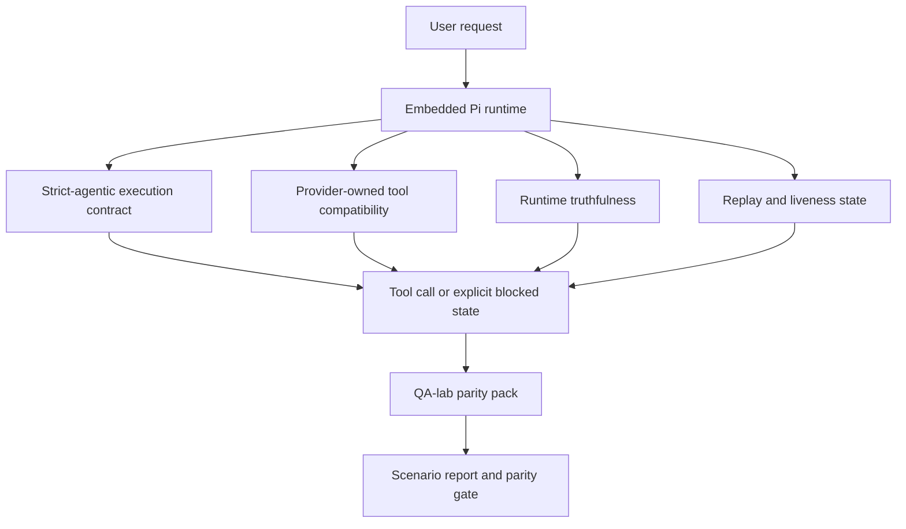
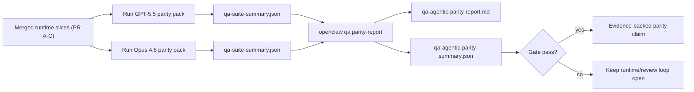

# Paridad de agentes GPT-5.5 / Codex en OpenClaw

OpenClaw ya funcionaba bien con los modelos frontera que utilizan herramientas, pero los modelos GPT-5.5 y estilo Codex aún tenían un rendimiento inferior en algunos aspectos prácticos:

- podían detenerse después de planificar en lugar de realizar el trabajo
- podían usar esquemas de herramientas estrictos de OpenAI/Codex incorrectamente
- podían pedir `/elevated full` incluso cuando el acceso completo era imposible
- podían perder el estado de tareas de larga duración durante la repetición o compactación
- las afirmaciones de paridad con Claude Opus 4.6 se basaban en anécdotas en lugar de escenarios repetibles

Este programa de paridad soluciona esas brechas en cuatro segmentos revisables.

## Qué cambió

### PR A: ejecución estrictamente agente

Este segmento añade un contrato de ejecución `strict-agentic` opcional para ejecuciones de GPT-5 Pi integradas.

Cuando está habilitado, OpenClaw deja de aceptar turnos de solo planificación como una finalización "suficientemente buena". Si el modelo solo dice lo que pretende hacer y no usa realmente las herramientas o avanza, OpenClaw lo reintenta con una dirección de actuar ahora y luego falla cerrado con un estado bloqueado explícito en lugar de terminar silenciosamente la tarea.

Esto mejora la experiencia de GPT-5.5 principalmente en:

- seguidores cortos de "ok hazlo"
- tareas de código donde el primer paso es obvio
- flujos donde `update_plan` debe ser un seguimiento del progreso en lugar de texto de relleno

### PR B: veracidad en tiempo de ejecución

Este segmento hace que OpenClaw diga la verdad sobre dos cosas:

- por qué falló la llamada al proveedor/tiempo de ejecución
- si `/elevated full` está realmente disponible

Eso significa que GPT-5.5 obtiene mejores señales de tiempo de ejecución para el alcance faltante, fallas de actualización de autenticación, fallas de autenticación HTML 403, problemas de proxy, fallas de DNS o tiempo de espera, y modos de acceso completo bloqueados. Es menos probable que el modelo alucine la solución incorrecta o siga pidiendo un modo de permiso que el tiempo de ejecución no puede proporcionar.

### PR C: corrección de ejecución

Este segmento mejora dos tipos de corrección:

- compatibilidad de esquema de herramientas OpenAI/Codex propiedad del proveedor
- revelación de repetición y actividad de tareas largas

El trabajo de compatibilidad de herramientas (tool-compat) reduce la fricción del esquema para el registro estricto de herramientas de OpenAI/Codex, especialmente en torno a las herramientas sin parámetros y las expectativas estrictas de objeto raíz. El trabajo de reproducción/actividad (replay/liveness) hace que las tareas de larga duración sean más observables, por lo que los estados en pausa, bloqueados y abandonados son visibles en lugar de desaparecer en un texto de error genérico.

### PR D: arnés de paridad

Este segmento añade el paquete de paridad de QA-lab de primera ola para que GPT-5.5 y Opus 4.6 puedan ejercitarse a través de los mismos escenarios y compararse utilizando pruebas compartidas.

El paquete de paridad es la capa de prueba. Por sí mismo, no cambia el comportamiento en tiempo de ejecución.

Una vez que tengas dos artefactos `qa-suite-summary.json`, genera la comparación del punto de control de lanzamiento (release-gate) con:

```bash
pnpm openclaw qa parity-report \
  --repo-root . \
  --candidate-summary .artifacts/qa-e2e/gpt55/qa-suite-summary.json \
  --baseline-summary .artifacts/qa-e2e/opus46/qa-suite-summary.json \
  --output-dir .artifacts/qa-e2e/parity
```

Ese comando escribe:

- un informe en Markdown legible por humanos
- un veredicto JSON legible por máquinas
- un resultado de puerta explícito `pass` / `fail`

## Por qué esto mejora GPT-5.5 en la práctica

Antes de este trabajo, GPT-5.5 en OpenClaw podía parecerse menos a un agente que Opus en sesiones de codificación reales porque el tiempo de ejecución toleraba comportamientos que son especialmente dañinos para los modelos tipo GPT-5:

- turnos de solo comentarios
- fricción del esquema alrededor de las herramientas
- comentarios de permisos vagos
- reproducción silenciosa o interrupción de compactación

El objetivo no es hacer que GPT-5.5 imite a Opus. El objetivo es dar a GPT-5.5 un contrato de tiempo de ejecución que recompense el progreso real, proporcione semánticas más limpias de herramientas y permisos, y convierta los modos de fallo en estados explícitos legibles por máquina y por humanos.

Eso cambia la experiencia del usuario de:

- "el modelo tenía un buen plan pero se detuvo"

a:

- "el modelo actuó, o OpenClaw mostró la razón exacta por la que no pudo"

## Antes y después para los usuarios de GPT-5.5

| Antes de este programa                                                                                                            | Después de las PR A-D                                                                                                  |
| --------------------------------------------------------------------------------------------------------------------------------- | ---------------------------------------------------------------------------------------------------------------------- |
| GPT-5.5 podía detenerse después de un plan razonable sin dar el siguiente paso de herramienta                                     | La PR A convierte el "solo planificar" en "actuar ahora o mostrar un estado bloqueado"                                 |
| Los esquemas estrictos de herramientas podían rechazar herramientas sin parámetros o con forma de OpenAI/Codex de formas confusas | La PR C hace que el registro y la invocación de herramientas propiedad del proveedor sean más predecibles              |
| La orientación `/elevated full` podía ser vaga o incorrecta en tiempos de ejecución bloqueados                                    | La PR B proporciona a GPT-5.5 y al usuario pistas veraces sobre el tiempo de ejecución y los permisos                  |
| Los fallos de reproducción o compactación podían hacer que la tarea pareciera haber desaparecido silenciosamente                  | La PR C expone explícitamente los resultados en pausa, bloqueados, abandonados y no válidos para repetición            |
| "GPT-5.5 se siente peor que Opus" era mayormente anecdótico                                                                       | La PR D convierte eso en el mismo paquete de escenarios, las mismas métricas y una puerta de aprobado/rechazo estricta |

## Arquitectura



## Flujo de lanzamiento



## Paquete de escenarios

El paquete de paridad de primera ola cubre actualmente cinco escenarios:

### `approval-turn-tool-followthrough`

Comprueba que el modelo no se detenga en "Lo haré" después de una breve aprobación. Debe tomar la primera acción concreta en el mismo turno.

### `model-switch-tool-continuity`

Comprueba que el trabajo con herramientas sigue siendo coherente a través de los límites de cambio de modelo/tiempo de ejecución en lugar de restablecerse en comentarios o perder el contexto de ejecución.

### `source-docs-discovery-report`

Comprueba que el modelo pueda leer el código fuente y la documentación, sintetizar los hallazgos y continuar la tarea de manera agéntica en lugar de producir un resumen superficial y detenerse prematuramente.

### `image-understanding-attachment`

Comprueba que las tareas de modo mixto que involucran archivos adjuntos sigan siendo accionables y no colapsen en una narración vaga.

### `compaction-retry-mutating-tool`

Comprueba que una tarea con una escritura mutadora real mantenga la inseguridad de repetición explícita en lugar de parecer silenciosamente segura para la repetición si la ejecución se compacta, reintenta o pierde el estado de respuesta bajo presión.

## Matriz de escenarios

| Escenario                          | Lo que prueba                                                       | Comportamiento correcto de GPT-5.5                                                                         | Señal de fallo                                                                                           |
| ---------------------------------- | ------------------------------------------------------------------- | ---------------------------------------------------------------------------------------------------------- | -------------------------------------------------------------------------------------------------------- |
| `approval-turn-tool-followthrough` | Turnos de aprobación cortos después de un plan                      | Inicia la primera acción de herramienta concreta inmediatamente en lugar de reiterar la intención          | seguimiento solo del plan, sin actividad de herramientas o turno bloqueado sin un bloqueador real        |
| `model-switch-tool-continuity`     | Cambio de modelo/tiempo de ejecución durante el uso de herramientas | Conserva el contexto de la tarea y continúa actuando de manera coherente                                   | se reinicia en comentarios, pierde el contexto de las herramientas o se detiene después del cambio       |
| `source-docs-discovery-report`     | Lectura de fuentes + síntesis + acción                              | Encuentra fuentes, utiliza herramientas y produce un informe útil sin detenerse                            | resumen superficial, falta de trabajo con herramientas o detención en turno incompleto                   |
| `image-understanding-attachment`   | Trabajo agéntico impulsado por archivos adjuntos                    | Interpreta el archivo adjunto, lo conecta con las herramientas y continúa la tarea                         | narración vaga, archivo adjunto ignorado o ninguna acción concreta siguiente                             |
| `compaction-retry-mutating-tool`   | Trabajo mutador bajo presión de compactación                        | Realiza una escritura real y mantiene la inseguridad de repetición explícita después del efecto secundario | ocurre una escritura mutante pero la seguridad de repetición está implícita, ausente o es contradictoria |

## Release gate

GPT-5.5 solo se puede considerar a la par o mejor cuando el tiempo de ejecución combinado pasa el paquete de paridad y las regresiones de veracidad del tiempo de ejecución al mismo tiempo.

Resultados requeridos:

- sin estancamiento de solo plan cuando la siguiente acción de herramienta es clara
- sin finalización falsa sin ejecución real
- sin `/elevated full` guía incorrecta
- sin abandono silencioso de repetición o compactación
- métricas del paquete de paridad que sean al menos tan fuertes como la línea base acordada de Opus 4.6

Para el arnés de primera ola, el gate compara:

- tasa de finalización
- tasa de parada no intencionada
- tasa de llamadas a herramientas válidas
- recuento de éxitos falsos

La evidencia de paridad se divide intencionalmente en dos capas:

- PR D prueba el comportamiento de GPT-5.5 frente a Opus 4.6 en el mismo escenario con el laboratorio de QA
- Las suites deterministas de PR B prueban la veracidad de autenticación, proxy, DNS y `/elevated full` fuera del arnés

## Matriz de objetivo a evidencia

| Elemento del gate de finalización                                       | PR propietario | Fuente de evidencia                                                             | Señal de paso                                                                                                                |
| ----------------------------------------------------------------------- | -------------- | ------------------------------------------------------------------------------- | ---------------------------------------------------------------------------------------------------------------------------- |
| GPT-5.5 ya no se estanca después de planificar                          | PR A           | `approval-turn-tool-followthrough` más suites de tiempo de ejecución de PR A    | los turnos de aprobación activan un trabajo real o un estado bloqueado explícito                                             |
| GPT-5.5 ya no finge el progreso o la finalización falsa de herramientas | PR A + PR D    | resultados de escenarios del informe de paridad y recuento de éxitos falsos     | sin resultados de paso sospechosos y sin finalización solo de comentarios                                                    |
| GPT-5.5 ya no da falsa `/elevated full` orientación                     | PR B           | suites de veracidad deterministas                                               | las razones bloqueadas y las sugerencias de acceso completo mantienen la precisión del tiempo de ejecución                   |
| Los fallos de repetición/vitalidad permanecen explícitos                | PR C + PR D    | suites de ciclo de vida/repetición de PR C más `compaction-retry-mutating-tool` | el trabajo mutante mantiene la inseguridad de repetición explícita en lugar de desaparecer silenciosamente                   |
| GPT-5.5 iguala o supera a Opus 4.6 en las métricas acordadas            | PR D           | `qa-agentic-parity-report.md` y `qa-agentic-parity-summary.json`                | misma cobertura de escenario y sin regresión en la finalización, el comportamiento de parada o el uso válido de herramientas |

## Cómo leer el veredicto de paridad

Use el veredicto en `qa-agentic-parity-summary.json` como la decisión final legible por máquina para el paquete de paridad de primera ola.

- `pass` significa que GPT-5.5 cubrió los mismos escenarios que Opus 4.6 y no regresó en las métricas agregadas acordadas.
- `fail` significa que al menos una puerta de seguridad se activó: finalización más débil, paradas no intencionadas peores, uso válido de herramientas más débil, cualquier caso de falso éxito, o cobertura de escenario desajustada.
- "shared/base CI issue" no es en sí mismo un resultado de paridad. Si el ruido de CI fuera del PR D bloquea una ejecución, el veredicto debe esperar a una ejecución limpia en el tiempo de ejecución fusionado en lugar de inferirse a partir de los registros de la era de la rama.
- Auth, proxy, DNS y la veracidad de `/elevated full` aún provienen de los conjuntos deterministas del PR B, por lo que la afirmación de lanzamiento final necesita ambas cosas: un veredicto de paridad del PR D aprobado y una cobertura de veracidad del PR B verde.

## Quién debe habilitar `strict-agentic`

Use `strict-agentic` cuando:

- se espera que el agente actúe inmediatamente cuando un siguiente paso es obvio
- los modelos de la familia GPT-5.5 o Codex son el tiempo de ejecución principal
- prefiere estados de bloqueo explícitos sobre respuestas "útiles" que solo sean resúmenes

Mantenga el contrato predeterminado cuando:

- desea el comportamiento más flexible existente
- no está utilizando modelos de la familia GPT-5
- está probando indicaciones en lugar de la aplicación en tiempo de ejecución

## Relacionado

- [Notas del mantenedor de paridad GPT-5.5 / Codex](/es/help/gpt55-codex-agentic-parity-maintainers)
