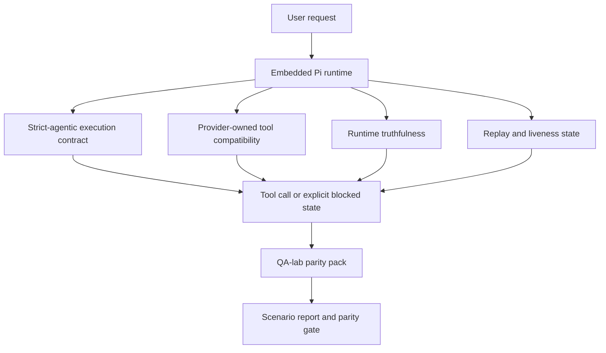
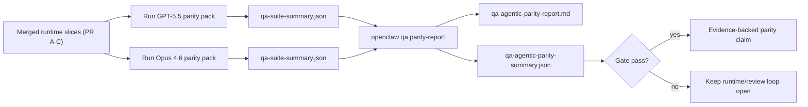

OpenClaw ya funcionaba bien con los modelos frontera que utilizan herramientas, pero los modelos estilo GPT-5.5 y Codex aún tenían un rendimiento inferior en algunos aspectos prácticos:

- podían detenerse después de planificar en lugar de realizar el trabajo
- podían utilizar incorrectamente los esquemas de herramientas estrictos de OpenAI/Codex
- podían solicitar `/elevated full` incluso cuando el acceso completo era imposible
- podían perder el estado de tareas de larga duración durante la repetición o la compactación
- las afirmaciones de paridad con Claude Opus 4.6 se basaban en anécdotas en lugar de escenarios repetibles

Este programa de paridad corrige esas lagunas en cuatro segmentos revisables.

## Qué cambió

### PR A: ejecución estrictamente agente

Este segmento añade un contrato de ejecución opcional `strict-agentic` para las ejecuciones de Pi GPT-5 integradas.

Cuando se habilita, OpenClaw deja de aceptar turnos de solo planificación como una finalización "suficientemente buena". Si el modelo solo dice lo que tiene la intención de hacer y no utiliza realmente herramientas o avanza, OpenClaw lo reintenta con una dirección de acción inmediata y luego falla de forma cerrada con un estado de bloqueo explícito en lugar de finalizar silenciosamente la tarea.

Esto mejora la experiencia de GPT-5.5 principalmente en:

- breves seguimientos de "ok, hazlo"
- tareas de código donde el primer paso es obvio
- flujos donde `update_plan` debe ser un seguimiento del progreso en lugar de texto de relleno

### PR B: veracidad en tiempo de ejecución

Este segmento hace que OpenClaw diga la verdad sobre dos cosas:

- por qué falló la llamada del proveedor/tiempo de ejecución
- si `/elevated full` está realmente disponible

Esto significa que GPT-5.5 recibe mejores señales de tiempo de ejecución para el alcance faltante, fallos de actualización de autenticación, fallos de autenticación HTML 403, problemas de proxy, fallos de DNS o tiempo de espera, y modos de acceso completo bloqueados. Es menos probable que el modelo alucine la solución incorrecta o siga solicitando un modo de permiso que el tiempo de ejecución no puede proporcionar.

### PR C: corrección de ejecución

Este segmento mejora dos tipos de corrección:

- compatibilidad de esquemas de herramientas de OpenAI/Codex propiedad del proveedor
- revelación de la actividad en la repetición y en tareas largas

El trabajo de compatibilidad de herramientas reduce la fricción del esquema para el registro estricto de herramientas de OpenAI/Codex, especialmente en torno a las herramientas sin parámetros y las expectativas estrictas de raíz de objeto. El trabajo de repetición/actividad hace que las tareas de larga duración sean más observables, por lo que los estados de pausa, bloqueo y abandono son visibles en lugar de desaparecer en un texto de falla genérico.

### PR D: arnés de paridad

Este segmento añade el primer paquete de paridad del laboratorio de QA para que GPT-5.5 y Opus 4.6 puedan ser ejercitados a través de los mismos escenarios y comparados utilizando evidencia compartida.

El paquete de paridad es la capa de prueba. Por sí solo, no cambia el comportamiento en tiempo de ejecución.

Después de tener dos artefactos `qa-suite-summary.json`, genera la comparación de la puerta de lanzamiento con:

```bash
pnpm openclaw qa parity-report \
  --repo-root . \
  --candidate-summary .artifacts/qa-e2e/gpt55/qa-suite-summary.json \
  --baseline-summary .artifacts/qa-e2e/opus46/qa-suite-summary.json \
  --output-dir .artifacts/qa-e2e/parity
```

Ese comando escribe:

- un informe de Markdown legible por humanos
- un veredicto JSON legible por máquinas
- un resultado de puerta explícito `pass` / `fail`

## Por qué esto mejora GPT-5.5 en la práctica

Antes de este trabajo, GPT-5.5 en OpenClaw podía parecerse menos agente que Opus en sesiones de codificación reales porque el tiempo de ejecución toleraba comportamientos que son especialmente dañinos para los modelos estilo GPT-5:

- turnos de solo comentarios
- fricción del esquema alrededor de las herramientas
- comentarios de permisos vagos
- reproducción silenciosa o interrupción de compactación

El objetivo no es hacer que GPT-5.5 imite a Opus. El objetivo es dar a GPT-5.5 un contrato de tiempo de ejecución que recompense el progreso real, proporcione semánticas de herramientas y permisos más limpias, y convierta los modos de fallo en estados explícitos legibles por máquinas y humanos.

Eso cambia la experiencia del usuario de:

- "el modelo tenía un buen plan pero se detuvo"

a:

- "el modelo actuó, o OpenClaw reveló la razón exacta por la que no pudo"

## Antes y después para los usuarios de GPT-5.5

| Antes de este programa                                                                                                           | Después de las PR A-D                                                                                                  |
| -------------------------------------------------------------------------------------------------------------------------------- | ---------------------------------------------------------------------------------------------------------------------- |
| GPT-5.5 podía detenerse después de un plan razonable sin tomar el siguiente paso de herramienta                                  | La PR A convierte "solo plan" en "actuar ahora o revelar un estado bloqueado"                                          |
| Los esquemas estrictos de herramientas podían rechazar herramientas sin parámetros o con forma de OpenAI/Codex de manera confusa | La PR C hace que el registro y la invocación de herramientas propiedad del proveedor sean más predecibles              |
| La orientación `/elevated full` podía ser vaga o incorrecta en tiempos de ejecución bloqueados                                   | La PR B proporciona a GPT-5.5 y al usuario pistas de permisos y tiempo de ejecución veraces                            |
| Los fallos de reproducción o compactación podían parecer que la tarea desaparecía silenciosamente                                | La PR C revela explícitamente los resultados en pausa, bloqueados, abandonados y de reproducción no válida             |
| "GPT-5.5 se siente peor que Opus" era mayormente anecdótico                                                                      | La PR D convierte eso en el mismo paquete de escenarios, las mismas métricas y una puerta de aprobado/rechazo estricta |

## Arquitectura



## Flujo de lanzamiento



## Paquete de escenarios

El paquete de paridad de primera ola cubre actualmente cinco escenarios:

### `approval-turn-tool-followthrough`

Comprueba que el modelo no se detenga en "Lo haré" después de una aprobación breve. Debe tomar la primera acción concreta en el mismo turno.

### `model-switch-tool-continuity`

Comprueba que el trabajo con herramientas sigue siendo coherente a través de los límites de cambio de modelo/tiempo de ejecución en lugar de restablecerse en comentarios o perder el contexto de ejecución.

### `source-docs-discovery-report`

Comprueba que el modelo puede leer el código fuente y la documentación, sintetizar los hallazgos y continuar la tarea de manera agéntica en lugar de producir un resumen superficial y detenerse antes de tiempo.

### `image-understanding-attachment`

Comprueba que las tareas de modo mixto que implican archivos adjuntos sigan siendo accionables y no colapsen en una narración vaga.

### `compaction-retry-mutating-tool`

Comprueba que una tarea con una escritura mutante real mantenga la inseguridad de repetición explícita en lugar de parecer silenciosamente segura para la repetición si la ejecución se compacta, reintenta o pierde el estado de respuesta bajo presión.

## Matriz de escenarios

| Escenario                          | Lo que prueba                                                       | Buen comportamiento de GPT-5.5                                                                             | Señal de fallo                                                                                         |
| ---------------------------------- | ------------------------------------------------------------------- | ---------------------------------------------------------------------------------------------------------- | ------------------------------------------------------------------------------------------------------ |
| `approval-turn-tool-followthrough` | Turnos de aprobación breves después de un plan                      | Inicia la primera acción de herramienta concreta de inmediato en lugar de reiterar la intención            | seguimiento solo de plan, sin actividad de herramientas o turno bloqueado sin un bloqueador real       |
| `model-switch-tool-continuity`     | Cambio de modelo/tiempo de ejecución durante el uso de herramientas | Conserva el contexto de la tarea y continúa actuando de manera coherente                                   | se restablece en comentarios, pierde el contexto de las herramientas o se detiene después del cambio   |
| `source-docs-discovery-report`     | Lectura de código fuente + síntesis + acción                        | Encuentra las fuentes, utiliza las herramientas y produce un informe útil sin detenerse                    | resumen superficial, trabajo de herramientas faltante o detención de turno incompleto                  |
| `image-understanding-attachment`   | Trabajo agéntico impulsado por archivos adjuntos                    | Interpreta el archivo adjunto, lo conecta con las herramientas y continúa con la tarea                     | narración vaga, archivo adjunto ignorado o ninguna siguiente acción concreta                           |
| `compaction-retry-mutating-tool`   | Trabajo de mutación bajo presión de compactación                    | Realiza una escritura real y mantiene la inseguridad de repetición explícita después del efecto secundario | ocurre una escritura mutante pero la seguridad de repetición está implícita, falta o es contradictoria |

## Puerta de lanzamiento

GPT-5.5 solo puede considerarse a la par o mejor cuando el tiempo de ejecución combinado pasa el paquete de paridad y las regresiones de veracidad del tiempo de ejecución al mismo tiempo.

Resultados requeridos:

- sin estancamiento de solo plan cuando la siguiente acción de herramienta es clara
- sin finalización falsa sin ejecución real
- sin orientación incorrecta `/elevated full`
- sin repetición silenciosa o abandono de compactación
- métricas del parity-pack que sean al menos tan sólidas como la línea base acordada de Opus 4.6

Para el harness de primera ola, el gate compara:

- tasa de finalización
- tasa de detenciones no intencionadas
- tasa de llamadas a herramientas válidas
- recuento de éxitos falsos

La evidencia de paridad se divide intencionalmente en dos capas:

- PR D demuestra el comportamiento de GPT-5.5 frente a Opus 4.6 en el mismo escenario con QA-lab
- Las suites deterministas de PR B prueban la veracidad de auth, proxy, DNS y `/elevated full` fuera del harness

## Matriz de objetivo a evidencia

| Elemento de gate de finalización                                            | PR propietaria | Fuente de evidencia                                                             | Señal de aprobación                                                                                                    |
| --------------------------------------------------------------------------- | -------------- | ------------------------------------------------------------------------------- | ---------------------------------------------------------------------------------------------------------------------- |
| GPT-5.5 ya no se detiene después de la planificación                        | PR A           | `approval-turn-tool-followthrough` más suites de tiempo de ejecución de PR A    | los turnos de aprobación activan el trabajo real o un estado bloqueado explícito                                       |
| GPT-5.5 ya no falsifica el progreso o la finalización falsa de herramientas | PR A + PR D    | resultados de escenarios del informe de paridad y recuento de éxitos falsos     | sin resultados de aprobación sospechosos y sin finalización solo con comentarios                                       |
| GPT-5.5 ya no da orientación `/elevated full` falsa                         | PR B           | suites de veracidad deterministas                                               | las razones de bloqueo y las pistas de acceso completo se mantienen precisas en tiempo de ejecución                    |
| los fallos de repetición/actividad se mantienen explícitos                  | PR C + PR D    | suites de ciclo de vida/repetición de PR C más `compaction-retry-mutating-tool` | el trabajo de mutación mantiene la falta de seguridad de repetición explícita en lugar de desaparecer silenciosamente  |
| GPT-5.5 iguala o supera a Opus 4.6 en las métricas acordadas                | PR D           | `qa-agentic-parity-report.md` y `qa-agentic-parity-summary.json`                | misma cobertura de escenario y sin regresión en finalización, comportamiento de detención o uso válido de herramientas |

## Cómo leer el veredicto de paridad

Utilice el veredicto en `qa-agentic-parity-summary.json` como la decisión final legible por máquina para el parity-pack de primera ola.

- `pass` significa que GPT-5.5 cubrió los mismos escenarios que Opus 4.6 y no regresionó en las métricas agregadas acordadas.
- `fail` significa que se activó al menos un gate duro: finalización más débil, peores detenciones no intencionadas, uso de herramientas válido más débil, cualquier caso de éxito falso o cobertura de escenario discordante.
- "shared/base CI issue" no es en sí mismo un resultado de paridad. Si el ruido de CI fuera de la PR D bloquea una ejecución, el veredicto debe esperar a una ejecución limpia en el tiempo de ejecución fusionado en lugar de inferirse a partir de los registros de la época de la rama.
- La autenticación, el proxy, el DNS y la veracidad de `/elevated full` provienen aún de las suites deterministas de la PR B, por lo que la afirmación de lanzamiento final necesita ambas: un veredicto de paridad de la PR D aprobado y una cobertura de veracidad de la PR B en verde.

## Quién debe habilitar `strict-agentic`

Use `strict-agentic` cuando:

- se espera que el agente actúe inmediatamente cuando el siguiente paso sea obvio
- los modelos de la familia GPT-5.5 o Codex son el tiempo de ejecución principal
- prefiere estados de bloqueo explícitos sobre respuestas "útiles" que sean solo resúmenes

Mantenga el contrato predeterminado cuando:

- desea el comportamiento más flexible existente
- no está utilizando modelos de la familia GPT-5
- está probando indicaciones en lugar de la aplicación en tiempo de ejecución

## Relacionado

- [Notas del mantenedor de paridad de GPT-5.5 / Codex](/es/help/gpt55-codex-agentic-parity-maintainers)
