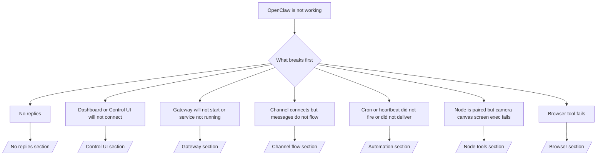

# Solución de problemas

Si solo tiene 2 minutos, use esta página como puerta de entrada de triaje.

## Primeros 60 segundos

Ejecute esta siguiente escalera exacta en orden:

```bash
openclaw status
openclaw status --all
openclaw gateway probe
openclaw gateway status
openclaw doctor
openclaw channels status --probe
openclaw logs --follow
```

Buena salida en una línea:

- `openclaw status` → muestra los canales configurados y no hay errores de autenticación obvios.
- `openclaw status --all` → el informe completo está presente y se puede compartir.
- `openclaw gateway probe` → el objetivo de puerta de enlace esperado es alcanzable (`Reachable: yes`). `RPC: limited - missing scope: operator.read` son diagnósticos degradados, no un fallo de conexión.
- `openclaw gateway status` → `Runtime: running` y `RPC probe: ok`.
- `openclaw doctor` → sin errores de configuración/servicio que bloqueen.
- `openclaw channels status --probe` → reachable gateway returns live per-account
  transport state plus probe/audit results such as `works` or `audit ok`; if the
  gateway is unreachable, the command falls back to config-only summaries.
- `openclaw logs --follow` → actividad constante, sin errores fatales repetitivos.

## Contexto largo de Anthropic 429

Si ves:
`HTTP 429: rate_limit_error: Extra usage is required for long context requests`,
ve a [/gateway/troubleshooting#anthropic-429-extra-usage-required-for-long-context](/en/gateway/troubleshooting#anthropic-429-extra-usage-required-for-long-context).

## La instalación del complemento falla con extensiones de openclaw faltantes

Si la instalación falla con `package.json missing openclaw.extensions`, el paquete del complemento
está usando una forma antigua que OpenClaw ya no acepta.

Solución en el paquete del complemento:

1. Añade `openclaw.extensions` a `package.json`.
2. Apunta las entradas a los archivos de tiempo de ejecución compilados (generalmente `./dist/index.js`).
3. Republica el complemento y ejecuta `openclaw plugins install <package>` de nuevo.

Ejemplo:

```json
{
  "name": "@openclaw/my-plugin",
  "version": "1.2.3",
  "openclaw": {
    "extensions": ["./dist/index.js"]
  }
}
```

Referencia: [Arquitectura del complemento](/en/plugins/architecture)

## Árbol de decisiones



<AccordionGroup>
  <Accordion title="No replies">
    ```bash
    openclaw status
    openclaw gateway status
    openclaw channels status --probe
    openclaw pairing list --channel <channel> [--account <id>]
    openclaw logs --follow
    ```

    La salida correcta tiene el siguiente aspecto:

    - `Runtime: running`
    - `RPC probe: ok`
    - Tu canal muestra el transporte conectado y, si es compatible, `works` o `audit ok` en `channels status --probe`
    - El remitente aparece aprobado (o la política de DM es abierta/allowlist)

    Firmas de registro comunes:

    - `drop guild message (mention required` → mention gating bloqueó el mensaje en Discord.
    - `pairing request` → el remitente no está aprobado y está esperando la aprobación de emparejamiento por DM.
    - `blocked` / `allowlist` en los registros del canal → el remitente, la sala o el grupo están filtrados.

    Páginas en profundidad:

    - [/gateway/troubleshooting#no-replies](/en/gateway/troubleshooting#no-replies)
    - [/channels/troubleshooting](/en/channels/troubleshooting)
    - [/channels/pairing](/en/channels/pairing)

  </Accordion>

  <Accordion title="El panel o la interfaz de usuario de control no se conecta">
    ```bash
    openclaw status
    openclaw gateway status
    openclaw logs --follow
    openclaw doctor
    openclaw channels status --probe
    ```

    La salida correcta se ve así:

    - `Dashboard: http://...` se muestra en `openclaw gateway status`
    - `RPC probe: ok`
    - Sin bucle de autenticación en los registros

    Firmas comunes de registros:

    - `device identity required` → el contexto HTTP/no seguro no puede completar la autenticación del dispositivo.
    - `origin not allowed` → el navegador `Origin` no está permitido para el destino de la puerta de enlace de la interfaz de usuario de control.
    - `AUTH_TOKEN_MISMATCH` con sugerencias de reintento (`canRetryWithDeviceToken=true`) → puede producirse automáticamente un reintento de token de dispositivo de confianza.
    - Ese reintento de token en caché reutiliza el conjunto de ámbitos en caché almacenados con el token del dispositivo emparejado. Los llamadores explícitos `deviceToken` / explícitos `scopes` mantienen su conjunto de ámbitos solicitado en su lugar.
    - En la ruta asíncrona de la interfaz de usuario de control de Tailscale Serve, los intentos fallidos para el mismo `{scope, ip}` se serializan antes de que el limitador registre el fallo, por lo que un segundo reintento incorrecto simultáneo ya puede mostrar `retry later`.
    - `too many failed authentication attempts (retry later)` desde un origen de navegador localhost → los fallos repetidos de ese mismo `Origin` se bloquean temporalmente; otro origen localhost utiliza un depósito separado.
    - `unauthorized` repetidos después de ese reintento → token/contraseña incorrectos, discrepancia en el modo de autenticación o token de dispositivo emparejado obsoleto.
    - `gateway connect failed:` → la interfaz de usuario está apuntando a la URL/puerto incorrectos o a una puerta de enlace inalcanzable.

    Páginas profundas:

    - [/gateway/troubleshooting#dashboard-control-ui-connectivity](/en/gateway/troubleshooting#dashboard-control-ui-connectivity)
    - [/web/control-ui](/en/web/control-ui)
    - [/gateway/authentication](/en/gateway/authentication)

  </Accordion>

  <Accordion title="Gateway will not start or service installed but not running">
    ```bash
    openclaw status
    openclaw gateway status
    openclaw logs --follow
    openclaw doctor
    openclaw channels status --probe
    ```

    La salida correcta se parece a:

    - `Service: ... (loaded)`
    - `Runtime: running`
    - `RPC probe: ok`

    Firmas de registro comunes:

    - `Gateway start blocked: set gateway.mode=local` o `existing config is missing gateway.mode` → el modo de puerta de enlace es remoto o al archivo de configuración le falta el sello de modo local y debe repararse.
    - `refusing to bind gateway ... without auth` → enlace que no es de bucle local sin una ruta de autenticación de puerta de enlace válida (token/contraseña o proxy de confianza donde esté configurado).
    - `another gateway instance is already listening` o `EADDRINUSE` → puerto ya en uso.

    Páginas profundas:

    - [/gateway/troubleshooting#gateway-service-not-running](/en/gateway/troubleshooting#gateway-service-not-running)
    - [/gateway/background-process](/en/gateway/background-process)
    - [/gateway/configuration](/en/gateway/configuration)

  </Accordion>

  <Accordion title="Channel connects but messages do not flow">
    ```bash
    openclaw status
    openclaw gateway status
    openclaw logs --follow
    openclaw doctor
    openclaw channels status --probe
    ```

    La salida correcta se parece a:

    - El transporte del canal está conectado.
    - Las comprobaciones de emparejamiento/lista blanca pasan.
    - Las menciones se detectan donde se requieren.

    Firmas de registro comunes:

    - `mention required` → el bloqueo de la puerta de mención de grupo bloqueó el procesamiento.
    - `pairing` / `pending` → el remitente del MD aún no está aprobado.
    - `not_in_channel`, `missing_scope`, `Forbidden`, `401/403` → problema con el token de permisos del canal.

    Páginas profundas:

    - [/gateway/troubleshooting#channel-connected-messages-not-flowing](/en/gateway/troubleshooting#channel-connected-messages-not-flowing)
    - [/channels/troubleshooting](/en/channels/troubleshooting)

  </Accordion>

  <Accordion title="El cron o el latido no se activó o no se entregó">
    ```bash
    openclaw status
    openclaw gateway status
    openclaw cron status
    openclaw cron list
    openclaw cron runs --id <jobId> --limit 20
    openclaw logs --follow
    ```

    Una salida correcta se ve así:

    - `cron.status` muestra que está habilitado con un próximo despertar.
    - `cron runs` muestra entradas `ok` recientes.
    - El latido está habilitado y no está fuera del horario activo.

    Firmas de registro comunes:

- `cron: scheduler disabled; jobs will not run automatically` → el cron está deshabilitado.
- `heartbeat skipped` con `reason=quiet-hours` → fuera del horario activo configurado.
- `heartbeat skipped` con `reason=empty-heartbeat-file` → `HEARTBEAT.md` existe pero solo contiene un andamio vacío/solo con encabezados.
- `heartbeat skipped` con `reason=no-tasks-due` → el modo de tarea de `HEARTBEAT.md` está activo pero aún no vence ningún intervalo de tareas.
- `heartbeat skipped` con `reason=alerts-disabled` → toda la visibilidad del latido está deshabilitada (`showOk`, `showAlerts` y `useIndicator` están todos apagados).
- `requests-in-flight` → carril principal ocupado; el despertar del latido se aplazó. - `unknown accountId` → la cuenta de destino de entrega del latido no existe.

      Páginas profundas:

      - [/gateway/troubleshooting#cron-and-heartbeat-delivery](/en/gateway/troubleshooting#cron-and-heartbeat-delivery)
      - [/automation/cron-jobs#troubleshooting](/en/automation/cron-jobs#troubleshooting)
      - [/gateway/heartbeat](/en/gateway/heartbeat)

    </Accordion>

    <Accordion title="Node is paired but tool fails camera canvas screen exec">
    ```bash
    openclaw status
    openclaw gateway status
    openclaw nodes status
    openclaw nodes describe --node <idOrNameOrIp>
    openclaw logs --follow
    ```

      El resultado correcto tiene el siguiente aspecto:

      - Node aparece como conectado y emparejado para el rol `node`.
      - Existe la capacidad para el comando que estás invocando.
      - El estado del permiso está concedido para la herramienta.

      Firmas de registro comunes:

      - `NODE_BACKGROUND_UNAVAILABLE` → traer la aplicación del nodo al primer plano.
      - `*_PERMISSION_REQUIRED` → el permiso del SO fue denegado o falta.
      - `SYSTEM_RUN_DENIED: approval required` → la aprobación de ejecución está pendiente.
      - `SYSTEM_RUN_DENIED: allowlist miss` → comando no en la lista de permitidos de ejecución.

      Páginas profundas:

      - [/gateway/troubleshooting#node-paired-tool-fails](/en/gateway/troubleshooting#node-paired-tool-fails)
      - [/nodes/troubleshooting](/en/nodes/troubleshooting)
      - [/tools/exec-approvals](/en/tools/exec-approvals)

    </Accordion>

    <Accordion title="Exec suddenly asks for approval">
    ```bash
    openclaw config get tools.exec.host
    openclaw config get tools.exec.security
    openclaw config get tools.exec.ask
    openclaw gateway restart
    ```

      Qué cambió:

      - Si `tools.exec.host` no está establecido, el valor predeterminado es `auto`.
      - `host=auto` se resuelve en `sandbox` cuando un tiempo de ejecución de zona de pruebas (sandbox) está activo, `gateway` en caso contrario.
      - `host=auto` es solo de enrutamiento; el comportamiento "YOLO" sin solicitud proviene de `security=full` más `ask=off` en gateway/node.
      - En `gateway` y `node`, `tools.exec.security` sin establecer tiene como valor predeterminado `full`.
      - `tools.exec.ask` sin establecer tiene como valor predeterminado `off`.
      - Resultado: si está viendo aprobaciones, alguna política local de host o por sesión ha restringido exec respecto a los valores predeterminados actuales.

      Restaurar el comportamiento predeterminado actual sin aprobación:

      ```bash
      openclaw config set tools.exec.host gateway
      openclaw config set tools.exec.security full
      openclaw config set tools.exec.ask off
      openclaw gateway restart
      ```

      Alternativas más seguras:

      - Establezca solo `tools.exec.host=gateway` si solo desea un enrutamiento de host estable.
      - Use `security=allowlist` con `ask=on-miss` si desea exec de host pero aún desea revisiones por fallos en la lista de permitidos (allowlist).
      - Habilite el modo de zona de pruebas (sandbox) si desea que `host=auto` se resuelva nuevamente a `sandbox`.

      Firmas de registro comunes:

      - `Approval required.` → el comando está esperando en `/approve ...`.
      - `SYSTEM_RUN_DENIED: approval required` → la aprobación de exec de node-host está pendiente.
      - `exec host=sandbox requires a sandbox runtime for this session` → selección implícita/explícita de zona de pruebas pero el modo de zona de pruebas está desactivado.

      Páginas detalladas:

      - [/tools/exec](/en/tools/exec)
      - [/tools/exec-approvals](/en/tools/exec-approvals)
      - [/gateway/security#runtime-expectation-drift](/en/gateway/security#runtime-expectation-drift)

    </Accordion>

    <Accordion title="Browser tool fails">
    ```bash
    openclaw status
    openclaw gateway status
    openclaw browser status
    openclaw logs --follow
    openclaw doctor
    ```

      El resultado correcto se ve así:

      - El estado del navegador muestra `running: true` y un navegador/perfil elegido.
      - `openclaw` se inicia, o `user` puede ver las pestañas locales de Chrome.

      Firmas comunes de registro:

      - `unknown command "browser"` o `unknown command 'browser'` → `plugins.allow` está configurado y no incluye `browser`.
      - `Failed to start Chrome CDP on port` → falló el inicio del navegador local.
      - `browser.executablePath not found` → la ruta binaria configurada es incorrecta.
      - `browser.cdpUrl must be http(s) or ws(s)` → la URL de CDP configurada utiliza un esquema no compatible.
      - `browser.cdpUrl has invalid port` → la URL de CDP configurada tiene un puerto incorrecto o fuera de rango.
      - `No Chrome tabs found for profile="user"` → el perfil de conexión de Chrome MCP no tiene pestañas locales de Chrome abiertas.
      - `Remote CDP for profile "<name>" is not reachable` → el punto final de CDP remoto configurado no es accesible desde este host.
      - `Browser attachOnly is enabled ... not reachable` o `Browser attachOnly is enabled and CDP websocket ... is not reachable` → el perfil de solo conexión no tiene un objetivo CDP activo.
      - anulaciones obsoletas de ventana gráfica / modo oscuro / configuración regional / sin conexión en perfiles de CDP remoto o de solo conexión → ejecute `openclaw browser stop --browser-profile <name>` para cerrar la sesión de control activa y liberar el estado de emulación sin reiniciar la puerta de enlace.

      Páginas profundas:

      - [/gateway/troubleshooting#browser-tool-fails](/en/gateway/troubleshooting#browser-tool-fails)
      - [/tools/browser#missing-browser-command-or-tool](/en/tools/browser#missing-browser-command-or-tool)
      - [/tools/browser-linux-troubleshooting](/en/tools/browser-linux-troubleshooting)
      - [/tools/browser-wsl2-windows-remote-cdp-troubleshooting](/en/tools/browser-wsl2-windows-remote-cdp-troubleshooting)

    </Accordion>
</AccordionGroup>

## Relacionado

- [Preguntas frecuentes](/en/help/faq) — preguntas frecuentes
- [Solución de problemas de la puerta de enlace](/en/gateway/troubleshooting) — problemas específicos de la puerta de enlace
- [Doctor](/en/gateway/doctor) — comprobaciones automáticas de estado y reparaciones
- [Solución de problemas del canal](/en/channels/troubleshooting) — problemas de conectividad del canal
- [Solución de problemas de automatización](/en/automation/cron-jobs#troubleshooting) — problemas de cron y latido
