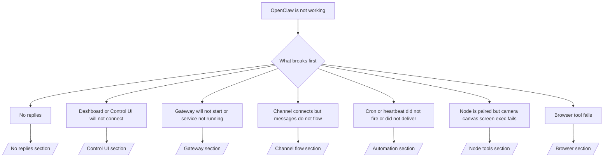

Si solo tienes 2 minutos, usa esta página como una puerta de entrada de triaje.

## Primeros 60 segundos

Ejecuta esta escalera exacta en orden:

```bash
openclaw status
openclaw status --all
openclaw gateway probe
openclaw gateway status
openclaw doctor
openclaw channels status --probe
openclaw logs --follow
```

Buena salida en una línea:

- `openclaw status` → muestra los canales configurados y sin errores de autenticación obvios.
- `openclaw status --all` → el informe completo está presente y se puede compartir.
- `openclaw gateway probe` → el objetivo de puerta de enlace esperado es alcanzable (`Reachable: yes`). `Capability: ...` te indica qué nivel de autenticación pudo probar la sonda, y `Read probe: limited - missing scope: operator.read` son diagnósticos degradados, no un fallo de conexión.
- `openclaw gateway status` → `Runtime: running`, `Connectivity probe: ok`, y una línea `Capability: ...` plausible. Usa `--require-rpc` si también necesitas una prueba de RPC con alcance de lectura.
- `openclaw doctor` → sin errores de configuración/servicio bloqueantes.
- `openclaw channels status --probe` → una puerta de enlace alcanzable devuelve el estado de transporte en vivo por cuenta
  más resultados de sonda/auditoría como `works` o `audit ok`; si la
  puerta de enlace es inalcanzable, el comando recurre a resúmenes solo de configuración.
- `openclaw logs --follow` → actividad constante, sin errores fatales repetitivos.

## Contexto largo de Anthropic 429

Si ves:
`HTTP 429: rate_limit_error: Extra usage is required for long context requests`,
ve a [/gateway/troubleshooting#anthropic-429-extra-usage-required-for-long-context](/es/gateway/troubleshooting#anthropic-429-extra-usage-required-for-long-context).

## El backend compatible con OpenAI local funciona directamente pero falla en OpenClaw

Si tu backend `/v1` local o autoalojado responde a pequeñas sondas directas
`/v1/chat/completions` pero falla en `openclaw infer model run` o en turnos de
agente normales:

1. Si el error menciona que `messages[].content` espera una cadena, establece
   `models.providers.<provider>.models[].compat.requiresStringContent: true`.
2. Si el backend sigue fallando solo en los turnos del agente OpenClaw, establece
   `models.providers.<provider>.models[].compat.supportsTools: false` y reinténtalo.
3. Si las llamas directas pequeñas todavía funcionan pero los avisos grandes de OpenClaw bloquean el
   backend, trata el problema restante como una limitación del modelo/servidor ascendente y
   continúa en el manual profundo:
   [/gateway/troubleshooting#local-openai-compatible-backend-passes-direct-probes-but-agent-runs-fail](/es/gateway/troubleshooting#local-openai-compatible-backend-passes-direct-probes-but-agent-runs-fail)

## La instalación del complemento falla con extensiones de openclaw faltantes

Si la instalación falla con `package.json missing openclaw.extensions`, el paquete del complemento
está usando una forma antigua que OpenClaw ya no acepta.

Solución en el paquete del complemento:

1. Agrega `openclaw.extensions` a `package.json`.
2. Apunta las entradas a los archivos de tiempo de ejecución compilados (generalmente `./dist/index.js`).
3. Vuelve a publicar el complemento y ejecuta `openclaw plugins install <package>` de nuevo.

Ejemplo:

```json
{
  "name": "@openclaw/my-plugin",
  "version": "1.2.3",
  "openclaw": {
    "extensions": ["./dist/index.js"]
  }
}
```

Referencia: [Arquitectura del complemento](/es/plugins/architecture)

## Árbol de decisión



<AccordionGroup>
  <Accordion title="Sin respuestas">
    ```bash
    openclaw status
    openclaw gateway status
    openclaw channels status --probe
    openclaw pairing list --channel <channel> [--account <id>]
    openclaw logs --follow
    ```

    El resultado correcto se ve así:

    - `Runtime: running`
    - `Connectivity probe: ok`
    - `Capability: read-only`, `write-capable`, o `admin-capable`
    - Tu canal muestra el transporte conectado y, cuando sea compatible, `works` o `audit ok` en `channels status --probe`
    - El remitente aparece aprobado (o la política de MD está abierta/en lista de permitidos)

    Firmas de registro comunes:

    - `drop guild message (mention required` → el filtrado de menciones bloqueó el mensaje en Discord.
    - `pairing request` → el remitente no está aprobado y está esperando la aprobación de emparejamiento por DM.
    - `blocked` / `allowlist` en los registros del canal → el remitente, la sala o el grupo están filtrados.

    Páginas profundas:

    - [/gateway/troubleshooting#no-replies](/es/gateway/troubleshooting#no-replies)
    - [/channels/troubleshooting](/es/channels/troubleshooting)
    - [/channels/pairing](/es/channels/pairing)

  </Accordion>

  <Accordion title="El Panel o la Interfaz de Control no se conectará">
    ```bash
    openclaw status
    openclaw gateway status
    openclaw logs --follow
    openclaw doctor
    openclaw channels status --probe
    ```

    Una salida correcta se ve así:

    - `Dashboard: http://...` se muestra en `openclaw gateway status`
    - `Connectivity probe: ok`
    - `Capability: read-only`, `write-capable` o `admin-capable`
    - No hay bucle de autenticación en los registros

    Firmas comunes de registro:

    - `device identity required` → el contexto HTTP/no seguro no puede completar la autenticación del dispositivo.
    - `origin not allowed` → el navegador `Origin` no está permitido para el destino de
      la puerta de enlace de la Interfaz de Control.
    - `AUTH_TOKEN_MISMATCH` con sugerencias de reintento (`canRetryWithDeviceToken=true`) → puede producirse automáticamente un reintento de token de dispositivo de confianza.
    - Ese reintento de token en caché reutiliza el conjunto de ámbitos en caché almacenados con el token del
      dispositivo emparejado. Los llamadores explícitos `deviceToken` / explícitos `scopes` mantienen
      su conjunto de ámbitos solicitado en su lugar.
    - En la ruta asincrónica de la Interfaz de Control de Tailscale Serve, los intentos fallidos para el mismo
      `{scope, ip}` se serializan antes de que el limitador registre el fallo, por lo que un
      segundo reintento incorrecto concurrente ya puede mostrar `retry later`.
    - `too many failed authentication attempts (retry later)` desde un origen de
      navegador localhost → los fallos repetidos de ese mismo `Origin` están temporalmente
      bloqueados; otro origen localhost usa un depósito separado.
    - `unauthorized` repetidos después de ese reintento → token/contraseña incorrectos, discrepancia del modo de autenticación o token de dispositivo emparejado obsoleto.
    - `gateway connect failed:` → la Interfaz de Usuario está apuntando a la URL/puerto incorrectos o a una puerta de enlace inalcanzable.

    Páginas en profundidad:

    - [/gateway/troubleshooting#dashboard-control-ui-connectivity](/es/gateway/troubleshooting#dashboard-control-ui-connectivity)
    - [/web/control-ui](/es/web/control-ui)
    - [/gateway/authentication](/es/gateway/authentication)

  </Accordion>

  <Accordion title="El Gateway no se inicia o el servicio está instalado pero no se está ejecutando">
    ```bash
    openclaw status
    openclaw gateway status
    openclaw logs --follow
    openclaw doctor
    openclaw channels status --probe
    ```

    La salida correcta debería verse así:

    - `Service: ... (loaded)`
    - `Runtime: running`
    - `Connectivity probe: ok`
    - `Capability: read-only`, `write-capable` o `admin-capable`

    Firmas de registro comunes:

    - `Gateway start blocked: set gateway.mode=local` o `existing config is missing gateway.mode` → el modo de gateway es remoto, o al archivo de configuración le falta la marca de modo local y debe repararse.
    - `refusing to bind gateway ... without auth` → enlace que no es de bucle local (non-loopback) sin una ruta de autenticación de gateway válida (token/contraseña, o proxy de confianza donde esté configurado).
    - `another gateway instance is already listening` o `EADDRINUSE` → puerto ya ocupado.

    Páginas en profundidad:

    - [/gateway/troubleshooting#gateway-service-not-running](/es/gateway/troubleshooting#gateway-service-not-running)
    - [/gateway/background-process](/es/gateway/background-process)
    - [/gateway/configuration](/es/gateway/configuration)

  </Accordion>

  <Accordion title="El canal se conecta pero los mensajes no fluyen">
    ```bash
    openclaw status
    openclaw gateway status
    openclaw logs --follow
    openclaw doctor
    openclaw channels status --probe
    ```

    La salida correcta debería verse así:

    - El transporte del canal está conectado.
    - Las comprobaciones de emparejamiento/lista blanca (pairing/allowlist) son exitosas.
    - Las menciones se detectan donde se requieren.

    Firmas de registro comunes:

    - `mention required` → el bloqueo de filtrado de menciones de grupo impidió el procesamiento.
    - `pairing` / `pending` → el remitente del MD aún no está aprobado.
    - `not_in_channel`, `missing_scope`, `Forbidden`, `401/403` → problema con el token de permisos del canal.

    Páginas en profundidad:

    - [/gateway/troubleshooting#channel-connected-messages-not-flowing](/es/gateway/troubleshooting#channel-connected-messages-not-flowing)
    - [/channels/troubleshooting](/es/channels/troubleshooting)

  </Accordion>

  <Accordion title="Cron o heartbeat no se activó o no se entregó">
    ```bash
    openclaw status
    openclaw gateway status
    openclaw cron status
    openclaw cron list
    openclaw cron runs --id <jobId> --limit 20
    openclaw logs --follow
    ```

    El resultado correcto se ve así:

    - `cron.status` muestra que está habilitado con un próximo despertar.
    - `cron runs` muestra entradas `ok` recientes.
    - El heartbeat está habilitado y no está fuera del horario activo.

    Firmas de registro comunes:

    - `cron: scheduler disabled; jobs will not run automatically` → cron está deshabilitado.
    - `heartbeat skipped` con `reason=quiet-hours` → fuera del horario activo configurado.
    - `heartbeat skipped` con `reason=empty-heartbeat-file` → `HEARTBEAT.md` existe pero solo contiene un andamiaje vacío/solo de encabezados.
    - `heartbeat skipped` con `reason=no-tasks-due` → el modo de tarea `HEARTBEAT.md` está activo pero aún no vence ninguno de los intervalos de tarea.
    - `heartbeat skipped` con `reason=alerts-disabled` → toda la visibilidad del heartbeat está deshabilitada (`showOk`, `showAlerts` y `useIndicator` están apagados).
    - `requests-in-flight` → carril principal ocupado; el despertar del heartbeat se diferió.
    - `unknown accountId` → la cuenta de destino de entrega del heartbeat no existe.

    Páginas profundas:

    - [/gateway/troubleshooting#cron-and-heartbeat-delivery](/es/gateway/troubleshooting#cron-and-heartbeat-delivery)
    - [/automation/cron-jobs#troubleshooting](/es/automation/cron-jobs#troubleshooting)
    - [/gateway/heartbeat](/es/gateway/heartbeat)

  </Accordion>

  <Accordion title="El nodo está emparejado pero la herramienta falla cámara lienzo pantalla exec">
    ```bash
    openclaw status
    openclaw gateway status
    openclaw nodes status
    openclaw nodes describe --node <idOrNameOrIp>
    openclaw logs --follow
    ```

    El resultado correcto se ve así:

    - El nodo aparece como conectado y emparejado para el rol `node`.
    - Existe la capacidad para el comando que estás invocando.
    - El estado de permiso está concedido para la herramienta.

    Firmas de registro comunes:

    - `NODE_BACKGROUND_UNAVAILABLE` → traer la aplicación del nodo al primer plano.
    - `*_PERMISSION_REQUIRED` → el permiso del SO fue denegado o no existe.
    - `SYSTEM_RUN_DENIED: approval required` → la aprobación de exec está pendiente.
    - `SYSTEM_RUN_DENIED: allowlist miss` → comando no está en la lista de permitidos de exec.

    Páginas profundas:

    - [/gateway/troubleshooting#node-paired-tool-fails](/es/gateway/troubleshooting#node-paired-tool-fails)
    - [/nodes/troubleshooting](/es/nodes/troubleshooting)
    - [/tools/exec-approvals](/es/tools/exec-approvals)

  </Accordion>

  <Accordion title="Exec de repente pide aprobación">
    ```bash
    openclaw config get tools.exec.host
    openclaw config get tools.exec.security
    openclaw config get tools.exec.ask
    openclaw gateway restart
    ```

    Qué cambió:

    - Si `tools.exec.host` no está definido, el valor predeterminado es `auto`.
    - `host=auto` se resuelve a `sandbox` cuando un entorno de ejecución (runtime) de sandbox está activo, `gateway` en caso contrario.
    - `host=auto` es solo de enrutamiento; el comportamiento "YOLO" sin solicitud proviene de `security=full` más `ask=off` en el gateway/nodo.
    - En `gateway` y `node`, si `tools.exec.security` no está definido, el valor predeterminado es `full`.
    - Si `tools.exec.ask` no está definido, el valor predeterminado es `off`.
    - Resultado: si estás viendo aprobaciones, alguna política local de host o por sesión ha restringido exec alejándolo de los valores predeterminados actuales.

    Restaurar el comportamiento predeterminado actual sin aprobación:

    ```bash
    openclaw config set tools.exec.host gateway
    openclaw config set tools.exec.security full
    openclaw config set tools.exec.ask off
    openclaw gateway restart
    ```

    Alternativas más seguras:

    - Establezca solo `tools.exec.host=gateway` si solo desea un enrutamiento de host estable.
    - Use `security=allowlist` con `ask=on-miss` si desea exec de host pero aún desea revisión cuando falten en la lista de permitidos (allowlist).
    - Habilite el modo sandbox si desea que `host=auto` se resuelva nuevamente a `sandbox`.

    Firmas de registro comunes:

    - `Approval required.` → el comando está esperando en `/approve ...`.
    - `SYSTEM_RUN_DENIED: approval required` → la aprobación de exec del nodo-host (node-host) está pendiente.
    - `exec host=sandbox requires a sandbox runtime for this session` → selección implícita/explícita de sandbox pero el modo sandbox está desactivado.

    Páginas en profundidad:

    - [/tools/exec](/es/tools/exec)
    - [/tools/exec-approvals](/es/tools/exec-approvals)
    - [/gateway/security#what-the-audit-checks-high-level](/es/gateway/security#what-the-audit-checks-high-level)

  </Accordion>

  <Accordion title="Browser tool fails">
    ```bash
    openclaw status
    openclaw gateway status
    openclaw browser status
    openclaw logs --follow
    openclaw doctor
    ```

    La salida correcta se ve así:

    - El estado del navegador muestra `running: true` y un navegador/perfil elegido.
    - `openclaw` se inicia, o `user` puede ver las pestañas locales de Chrome.

    Firmas de registro comunes:

    - `unknown command "browser"` o `unknown command 'browser'` → `plugins.allow` está configurado y no incluye `browser`.
    - `Failed to start Chrome CDP on port` → falló el inicio del navegador local.
    - `browser.executablePath not found` → la ruta configurada del binario es incorrecta.
    - `browser.cdpUrl must be http(s) or ws(s)` → la URL de CDP configurada usa un esquema no compatible.
    - `browser.cdpUrl has invalid port` → la URL de CDP configurada tiene un puerto malo o fuera de rango.
    - `No Chrome tabs found for profile="user"` → el perfil de conexión de Chrome MCP no tiene pestañas locales de Chrome abiertas.
    - `Remote CDP for profile "<name>" is not reachable` → el endpoint CDP remoto configurado no es alcanzable desde este host.
    - `Browser attachOnly is enabled ... not reachable` o `Browser attachOnly is enabled and CDP websocket ... is not reachable` → el perfil de solo conexión no tiene un destino CDP activo.
    - anulaciones obsoletas de viewport / modo oscuro / configuración regional / sin conexión en perfiles de solo conexión o CDP remoto → ejecute `openclaw browser stop --browser-profile <name>` para cerrar la sesión de control activa y liberar el estado de emulación sin reiniciar el gateway.

    Páginas profundas:

    - [/gateway/troubleshooting#browser-tool-fails](/es/gateway/troubleshooting#browser-tool-fails)
    - [/tools/browser#missing-browser-command-or-tool](/es/tools/browser#missing-browser-command-or-tool)
    - [/tools/browser-linux-troubleshooting](/es/tools/browser-linux-troubleshooting)
    - [/tools/browser-wsl2-windows-remote-cdp-troubleshooting](/es/tools/browser-wsl2-windows-remote-cdp-troubleshooting)

  </Accordion>

</AccordionGroup>

## Relacionado

- [Preguntas frecuentes](/es/help/faq) — preguntas frecuentes
- [Solución de problemas del Gateway](/es/gateway/troubleshooting) — problemas específicos del gateway
- [Doctor](/es/gateway/doctor) — comprobaciones automáticas de salud y reparaciones
- [Solución de problemas de canales](/es/channels/troubleshooting) — problemas de conectividad de canales
- [Solución de problemas de automatización](/es/automation/cron-jobs#troubleshooting) — problemas de cron y latidos (heartbeat)
