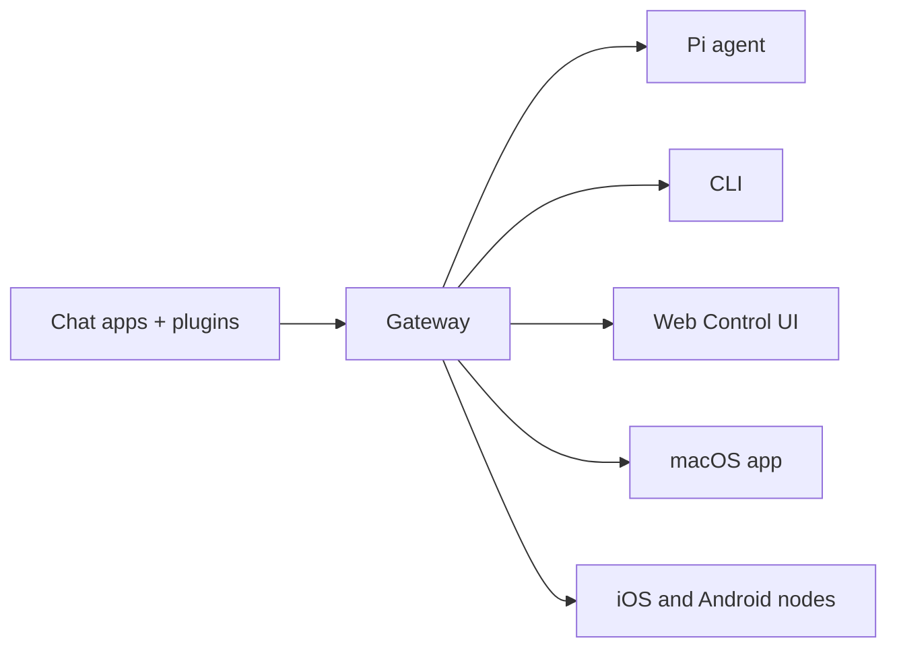

# OpenClaw 🦞

<p align="center">
  
  
</p>

> _"¡EXFOLIAR! ¡EXFOLIAR!"_ — Una langosta espacial, probablemente

<p align="center">
  <strong>Una puerta de enlace para cualquier sistema operativo para agentes de IA a través de Discord, Google Chat, iMessage, Matrix, Microsoft Teams, Signal, Slack, Telegram, WhatsApp, Zalo y más.</strong>
  <br />
  Envía un mensaje, obtén una respuesta de un agente desde tu bolsillo. Ejecuta una sola puerta de enlace a través de canales integrados, complementos de canal incluidos, WebChat y nodos móviles.
</p>

<Columns>
  <Card title="Comenzar" href="/es/start/getting-started" icon="rocket">
    Instala OpenClaw y pon en marcha la puerta de enlace en minutos.
  </Card>
  <Card title="Ejecutar incorporación" href="/es/start/wizard" icon="sparkles">
    Configuración guiada con `openclaw onboard` y flujos de vinculación.
  </Card>
  <Card title="Abrir la interfaz de control" href="/es/web/control-ui" icon="layout-dashboard">
    Inicia el panel del navegador para chat, configuración y sesiones.
  </Card>
</Columns>

## ¿Qué es OpenClaw?

OpenClaw es una **puerta de enlace autohospedada** que conecta tus aplicaciones de chat favoritas y superficies de canal (canales integrados más complementos de canal incluidos o externos como Discord, Google Chat, iMessage, Matrix, Microsoft Teams, Signal, Slack, Telegram, WhatsApp, Zalo y más) con agentes de codificación de IA como Pi. Ejecutas un único proceso de puerta de enlace en tu propia máquina (o en un servidor) y este se convierte en el puente entre tus aplicaciones de mensajería y un asistente de IA siempre disponible.

**¿Para quién es?** Para desarrolladores y usuarios avanzados que desean un asistente de IA personal al que puedan enviar mensajes desde cualquier lugar, sin renunciar al control de sus datos ni depender de un servicio alojado.

**¿Qué lo hace diferente?**

- **Autoalojado**: se ejecuta en tu hardware, tus reglas
- **Multicanal**: una sola puerta de enlace sirve a los canales integrados más los complementos de canal incluidos o externos simultáneamente
- **Nativo para agentes**: diseñado para agentes de programación con uso de herramientas, sesiones, memoria y enrutamiento multi-agente
- **Código abierto**: con licencia MIT, impulsado por la comunidad

**¿Qué necesitas?** Node 24 (recomendado), o Node 22 LTS (`22.14+`) para compatibilidad, una clave de API de tu proveedor elegido y 5 minutos. Para obtener la mejor calidad y seguridad, utiliza el modelo más potente de última generación disponible.

## Cómo funciona



El Gateway es la única fuente de verdad para las sesiones, el enrutamiento y las conexiones de canal.

## Funciones clave

<Columns>
  <Card title="Puerta de enlace multicanal" icon="network">
    Discord, iMessage, Signal, Slack, Telegram, WhatsApp, WebChat y más con un único proceso de puerta de enlace.
  </Card>
  <Card title="Canales de complementos" icon="plug">
    Los complementos incluidos añaden Matrix, Nostr, Twitch, Zalo y más en las versiones normales actuales.
  </Card>
  <Card title="Enrutamiento multiagente" icon="route">
    Sesiones aisladas por agente, espacio de trabajo o remitente.
  </Card>
  <Card title="Soporte multimedia" icon="image">
    Envía y recibe imágenes, audio y documentos.
  </Card>
  <Card title="Interfaz de control web" icon="monitor">
    Panel del navegador para chat, configuración, sesiones y nodos.
  </Card>
  <Card title="Nodos móviles" icon="smartphone">
    Empareja nodos iOS y Android para Canvas, cámara y flujos de trabajo con voz.
  </Card>
</Columns>

## Inicio rápido

<Steps>
  <Step title="Instalar OpenClaw">
    ```bash
    npm install -g openclaw@latest
    ```
  </Step>
  <Step title="Incorporarse e instalar el servicio">
    ```bash
    openclaw onboard --install-daemon
    ```
  </Step>
  <Step title="Chat">
    Abre la interfaz de usuario de control en tu navegador y envía un mensaje:

    ```bash
    openclaw dashboard
    ```

    O conecta un canal ([Telegram](/es/channels/telegram) es el más rápido) y chatea desde tu teléfono.

  </Step>
</Steps>

¿Necesitas la instalación completa y la configuración de desarrollo? Consulta [Introducción](/es/start/getting-started).

## Panel de control

Abre la interfaz de usuario de control en el navegador después de que se inicie la puerta de enlace.

- Predeterminado local: [http://127.0.0.1:18789/](http://127.0.0.1:18789/)
- Acceso remoto: [Superficies web](/es/web) y [Tailscale](/es/gateway/tailscale)

<p align="center">
  
</p>

## Configuración (opcional)

La configuración se encuentra en `~/.openclaw/openclaw.json`.

- Si **no haces nada**, OpenClaw usará el binario Pi incluido en modo RPC con sesiones por remitente.
- Si deseas bloquearlo, comienza con `channels.whatsapp.allowFrom` y (para grupos) reglas de mención.

Ejemplo:

```json5
{
  channels: {
    whatsapp: {
      allowFrom: ["+15555550123"],
      groups: { "*": { requireMention: true } },
    },
  },
  messages: { groupChat: { mentionPatterns: ["@openclaw"] } },
}
```

## Comienza aquí

<Columns>
  <Card title="Centros de documentación" href="/es/start/hubs" icon="book-open">
    Toda la documentación y guías, organizadas por caso de uso.
  </Card>
  <Card title="Configuración" href="/es/gateway/configuration" icon="settings">
    Configuración principal de la puerta de enlace, tokens y configuración del proveedor.
  </Card>
  <Card title="Acceso remoto" href="/es/gateway/remote" icon="globe">
    Patrones de acceso SSH y tailnet.
  </Card>
  <Card title="Channels" href="/es/channels/telegram" icon="message-square">
    Configuración específica del canal para Feishu, Microsoft Teams, WhatsApp, Telegram, Discord y más.
  </Card>
  <Card title="Nodes" href="/es/nodes" icon="smartphone">
    Nodos de iOS y Android con emparejamiento, Canvas, cámara y acciones del dispositivo.
  </Card>
  <Card title="Help" href="/es/help" icon="life-buoy">
    Punto de entrada para soluciones comunes y solución de problemas.
  </Card>
</Columns>

## Más información

<Columns>
  <Card title="Full feature list" href="/es/concepts/features" icon="list">
    Capacidades completas de canal, enrutamiento y medios.
  </Card>
  <Card title="Multi-agent routing" href="/es/concepts/multi-agent" icon="route">
    Aislamiento del espacio de trabajo y sesiones por agente.
  </Card>
  <Card title="Security" href="/es/gateway/security" icon="shield">
    Tokens, listas de permitidos y controles de seguridad.
  </Card>
  <Card title="Troubleshooting" href="/es/gateway/troubleshooting" icon="wrench">
    Diagnósticos de puerta de enlace y errores comunes.
  </Card>
  <Card title="About and credits" href="/es/reference/credits" icon="info">
    Orígenes del proyecto, colaboradores y licencia.
  </Card>
</Columns>
