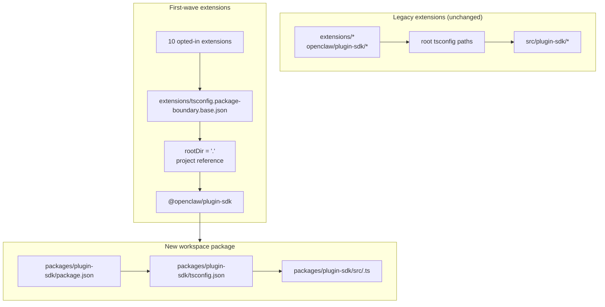

# refactor: Convertir el plugin-sdk en un paquete de espacio de trabajo real de forma incremental

## Descripción general

Este plan introduce un paquete de espacio de trabajo real para el SDK de plugins en
`packages/plugin-sdk` y lo utiliza para incorporar una primera ola pequeña de extensiones a
los límites de paquetes aplicados por el compilador. El objetivo es hacer que las importaciones
relativas ilegales fallen bajo la `tsc` normal para un conjunto seleccionado de extensiones de proveedor
incluidas, sin forzar una migración en todo el repositorio o una superficie gigante de conflictos de fusión.

El movimiento incremental clave es ejecutar dos modos en paralelo durante un tiempo:

| Modo                           | Forma de importación     | Quién lo usa                                     | Aplicación                                            |
| ------------------------------ | ------------------------ | ------------------------------------------------ | ----------------------------------------------------- |
| Modo heredado                  | `openclaw/plugin-sdk/*`  | todas las extensiones existentes no incorporadas | el comportamiento permisivo actual se mantiene        |
| Modo de incorporación (opt-in) | `@openclaw/plugin-sdk/*` | solo extensiones de la primera ola               | `rootDir` local del paquete + referencias de proyecto |

## Marco del problema

El repositorio actual exporta una gran superficie pública del SDK de plugins, pero no es un paquete
real de espacio de trabajo. En su lugar:

- la raíz `tsconfig.json` asigna `openclaw/plugin-sdk/*` directamente a
  `src/plugin-sdk/*.ts`
- las extensiones que no se incorporaron al experimento anterior todavía comparten ese
  comportamiento de alias de fuente global
- agregar `rootDir` solo funciona cuando las importaciones permitidas del SDK dejan de resolverse en la fuente
  sin procesar del repositorio

Eso significa que el repositorio puede describir la política de límites deseada, pero TypeScript
no la hace cumplir de manera limpia para la mayoría de las extensiones.

Desea una ruta incremental que:

- haga que `plugin-sdk` sea real
- mueva el SDK hacia un paquete de espacio de trabajo llamado `@openclaw/plugin-sdk`
- cambie solo unas 10 extensiones en el primer PR
- deje el resto del árbol de extensiones en el esquema antiguo hasta la limpieza posterior
- evite el flujo de trabajo `tsconfig.plugin-sdk.dts.json` + declaración generada en postinstall
  como mecanismo principal para el despliegue de la primera ola

## Trazabilidad de requisitos

- R1. Crear un paquete de espacio de trabajo real para el SDK de plugins en `packages/`.
- R2. Nombrar el nuevo paquete `@openclaw/plugin-sdk`.
- R3. Dar al nuevo paquete del SDK su propio `package.json` y `tsconfig.json`.
- R4. Mantener las importaciones de `openclaw/plugin-sdk/*` heredadas funcionando para las
  extensiones no incorporadas durante el período de migración.
- R5. Incorporar solo una primera ola pequeña de extensiones en el primer PR.
- R6. Las extensiones de la primera ola deben fallar (cerrarse) para las importaciones relativas que salgan
  de su raíz de paquete.
- R7. Las extensiones de la primera ola deben consumir el SDK a través de una dependencia
  de paquete y una referencia de proyecto TS, no a través de alias `paths` raíz.
- R8. El plan debe evitar un paso de generación posterior a la instalación obligatorio en todo el repositorio para
  la corrección del editor.
- R9. El despliegue de la primera ola debe poder revisarse y fusionarse como un PR moderado,
  no como una refactorización de más de 300 archivos en todo el repositorio.

## Límites del Alcance

- Sin migración completa de todas las extensiones incluidas en el primer PR.
- Sin requisito de eliminar `src/plugin-sdk` en el primer PR.
- Sin requisito de reconectar cada ruta de compilación o prueba raíz para usar el nuevo paquete
  inmediatamente.
- Sin intento de forzar los subrayados ondulados de VS Code para cada extensión no incorporada.
- Sin limpieza de linting amplia para el resto del árbol de extensiones.
- Sin grandes cambios de comportamiento en tiempo de ejecución más allá de la resolución de importaciones, la propiedad del paquete
  y la aplicación de límites para las extensiones incorporadas.

## Contexto e Investigación

### Código y Patrones Relevantes

- `pnpm-workspace.yaml` ya incluye `packages/*` y `extensions/*`, por lo que un
  nuevo paquete de espacio de trabajo bajo `packages/plugin-sdk` se ajusta al diseño existente del
  repositorio.
- Los paquetes de espacio de trabajo existentes, como `packages/memory-host-sdk/package.json`
  y `packages/plugin-package-contract/package.json`, ya usan mapas `exports`
  locales del paquete con raíz en `src/*.ts`.
- El `package.json` raíz actualmente publica la superficie del SDK a través de `./plugin-sdk`
  y exportaciones `./plugin-sdk/*` respaldadas por `dist/plugin-sdk/*.js` y
  `dist/plugin-sdk/*.d.ts`.
- `src/plugin-sdk/entrypoints.ts` y `scripts/lib/plugin-sdk-entrypoints.json`
  ya actúan como el inventario canónico de puntos de entrada para la superficie del SDK.
- El `tsconfig.json` raíz actualmente mapea:
  - `openclaw/plugin-sdk` -> `src/plugin-sdk/index.ts`
  - `openclaw/plugin-sdk/*` -> `src/plugin-sdk/*.ts`
- El experimento de límites anterior mostró que el `rootDir` local de paquetes funciona para
  las importaciones relativas ilegales solo después de que las importaciones del SDK permitidas dejen de resolverse al código fuente
  sin procesar fuera del paquete de extensión.

### Primer Conjunto de Extensiones

Este plan asume que la primera ola es el conjunto centrado en proveedores que es menos probable
que arrastre casos extremos complejos de tiempo de ejecución del canal:

- `extensions/anthropic`
- `extensions/exa`
- `extensions/firecrawl`
- `extensions/groq`
- `extensions/mistral`
- `extensions/openai`
- `extensions/perplexity`
- `extensions/tavily`
- `extensions/together`
- `extensions/xai`

### Inventario de Superficie del SDK de la Primera Ola

Las extensiones de la primera ola actualmente importan un subconjunto manejable de subrutas del SDK.
El paquete inicial `@openclaw/plugin-sdk` solo necesita cubrir estas:

- `agent-runtime`
- `cli-runtime`
- `config-runtime`
- `core`
- `image-generation`
- `media-runtime`
- `media-understanding`
- `plugin-entry`
- `plugin-runtime`
- `provider-auth`
- `provider-auth-api-key`
- `provider-auth-login`
- `provider-auth-runtime`
- `provider-catalog-shared`
- `provider-entry`
- `provider-http`
- `provider-model-shared`
- `provider-onboard`
- `provider-stream-family`
- `provider-stream-shared`
- `provider-tools`
- `provider-usage`
- `provider-web-fetch`
- `provider-web-search`
- `realtime-transcription`
- `realtime-voice`
- `runtime-env`
- `secret-input`
- `security-runtime`
- `speech`
- `testing`

### Aprendizajes Institucionales

- No había entradas `docs/solutions/` relevantes presentes en este árbol de trabajo.

### Referencias Externas

- No se necesitó investigación externa para este plan. El repositorio ya contiene los patrones relevantes de paquetes de espacio de trabajo y exportaciones del SDK.

## Decisiones Técnicas Clave

- Introducir `@openclaw/plugin-sdk` como un nuevo paquete de espacio de trabajo manteniendo la superficie raíz heredada `openclaw/plugin-sdk/*` activa durante la migración. Razón: esto permite que un primer conjunto de extensiones pase a una resolución de paquetes real sin forzar a cada extensión y cada ruta de compilación raíz a cambiar a la vez.

- Usar una configuración base de límite de participación dedicada como `extensions/tsconfig.package-boundary.base.json` en lugar de reemplazar la base de extensión existente para todos. Razón: el repositorio necesita admitir modos de extensión heredados y de participación simultáneamente durante la migración.

- Usar referencias de proyectos TS desde las extensiones de la primera ola hacia `packages/plugin-sdk/tsconfig.json` y establecer `disableSourceOfProjectReferenceRedirect` para el modo de límite de participación. Razón: esto da a `tsc` un gráfico de paquetes real mientras se desalienta el respaldo del editor y el compilador al recorrido de código fuente sin procesar.

- Mantener `@openclaw/plugin-sdk` privado en la primera ola. Razón: el objetivo inmediato es el cumplimiento de los límites internos y la seguridad de la migración, no publicar un segundo contrato de SDK externo antes de que la superficie sea estable.

- Mover solo las subrutas del SDK de la primera ola en el primer segmento de implementación y mantener puentes de compatibilidad para el resto. Razón: mover físicamente los 315 archivos `src/plugin-sdk/*.ts` en una sola PR es exactamente la superficie de conflicto de fusión que este plan intenta evitar.

- No depender de `scripts/postinstall-bundled-plugins.mjs` para compilar declaraciones del SDK para la primera ola. Razón: los flujos de compilación/referencia explícitos son más fáciles de razonar y mantienen el comportamiento del repositorio más predecible.

## Preguntas Abiertas

### Resueltas Durante la Planificación

- ¿Qué extensiones deben estar en la primera ola? Use las 10 extensiones de proveedor/búsqueda web mencionadas anteriormente porque están más aisladas estructuralmente que los paquetes de canal más pesados.

- ¿Debe la primera PR reemplazar todo el árbol de extensiones? No. La primera PR debe admitir dos modos en paralelo y solo participar en la primera ola.

- ¿Debe la primera ola requerir una compilación de declaración postinstall? No. El gráfico de paquete/referencia debe ser explícito y el CI debe ejecutar intencionalmente la verificación de tipos local relevante del paquete.

### Diferido a la implementación

- Si el paquete de la primera ola puede apuntar directamente a `src/*.ts`
  local del paquete únicamente a través de referencias de proyecto, o si se sigue
  requiriendo un pequeño paso de emisión de declaración para el paquete `@openclaw/plugin-sdk`.
  Esta es una pregunta de validación del gráfico TS propiedad de la implementación.

- Si el paquete raíz `openclaw` debe delegar las subrutas del SDK de la primera
  ola a las salidas de `packages/plugin-sdk` inmediatamente o continuar usando shims de
  compatibilidad generados bajo `src/plugin-sdk`.
  Este es un detalle de compatibilidad y forma de compilación que depende de la ruta
  de implementación mínima que mantiene la CI en verde.

## Diseño técnico de alto nivel

> Esto ilustra el enfoque previsto y es una guía direccional para la revisión, no una especificación de implementación. El agente de implementación debe tratarlo como contexto, no como código para reproducir.

## Unidades de implementación

- [ ] **Unidad 1: Introducir el paquete real de espacio de trabajo `@openclaw/plugin-sdk`**

**Objetivo:** Crear un paquete real de espacio de trabajo para el SDK que pueda ser dueño
de la superficie de la subruta de la primera ola sin forzar una migración en todo el repositorio.

**Requisitos:** R1, R2, R3, R8, R9

**Dependencias:** Ninguna

**Archivos:**

- Crear: `packages/plugin-sdk/package.json`
- Crear: `packages/plugin-sdk/tsconfig.json`
- Crear: `packages/plugin-sdk/src/index.ts`
- Crear: `packages/plugin-sdk/src/*.ts` para las subrutas del SDK de la primera ola
- Modificar: `pnpm-workspace.yaml` solo si se necesitan ajustes en package-glob
- Modificar: `package.json`
- Modificar: `src/plugin-sdk/entrypoints.ts`
- Modificar: `scripts/lib/plugin-sdk-entrypoints.json`
- Probar: `src/plugins/contracts/plugin-sdk-workspace-package.contract.test.ts`

**Enfoque:**

- Agregar un nuevo paquete de espacio de trabajo llamado `@openclaw/plugin-sdk`.
- Comenzar solo con las subrutas del SDK de la primera ola, no con el árbol completo de 315 archivos.
- Si mover directamente un punto de entrada de la primera ola creara una diferencia excesiva,
  el primer PR puede introducir esa subruta en `packages/plugin-sdk/src` como un envoltorio
  delgado primero y luego cambiar la fuente de verdad al paquete en un PR
  de seguimiento para ese clúster de subrutas.
- Reutilizar la maquinaria existente de inventario de puntos de entrada para que la superficie
  del paquete de la primera ola se declare en un lugar canónico.
- Mantenga las exportaciones del paquete raíz activas para los usuarios heredados mientras el
  paquete del espacio de trabajo se convierte en el nuevo contrato de participación voluntaria.

**Patrones a seguir:**

- `packages/memory-host-sdk/package.json`
- `packages/plugin-package-contract/package.json`
- `src/plugin-sdk/entrypoints.ts`

**Escenarios de prueba:**

- Camino feliz: el paquete del espacio de trabajo exporta cada sub-ruta de la primera ola listada en
  el plan y no falta ninguna exportación requerida de la primera ola.
- Caso límite: los metadatos de exportación del paquete permanecen estables cuando la lista de
  entradas de la primera ola se regenera o se compara con el inventario canónico.
- Integración: las exportaciones del SDK heredadas del paquete raíz permanecen presentes después de introducir
  el nuevo paquete del espacio de trabajo.

**Verificación:**

- El repositorio contiene un paquete de espacio de trabajo `@openclaw/plugin-sdk` válido con un
  mapa de exportación de primera ola estable y sin regresión de exportación heredada en la raíz
  `package.json`.

- [ ] **Unidad 2: Agregar un modo de límite TS de participación voluntaria para extensiones aplicadas por paquete**

**Objetivo:** Definir el modo de configuración TS que utilizarán las extensiones con participación voluntaria,
mientras se deja el comportamiento de TS de las extensiones existentes sin cambios para todos los demás.

**Requisitos:** R4, R6, R7, R8, R9

**Dependencias:** Unidad 1

**Archivos:**

- Crear: `extensions/tsconfig.package-boundary.base.json`
- Crear: `tsconfig.boundary-optin.json`
- Modificar: `extensions/xai/tsconfig.json`
- Modificar: `extensions/openai/tsconfig.json`
- Modificar: `extensions/anthropic/tsconfig.json`
- Modificar: `extensions/mistral/tsconfig.json`
- Modificar: `extensions/groq/tsconfig.json`
- Modificar: `extensions/together/tsconfig.json`
- Modificar: `extensions/perplexity/tsconfig.json`
- Modificar: `extensions/tavily/tsconfig.json`
- Modificar: `extensions/exa/tsconfig.json`
- Modificar: `extensions/firecrawl/tsconfig.json`
- Prueba: `src/plugins/contracts/extension-package-project-boundaries.test.ts`
- Prueba: `test/extension-package-tsc-boundary.test.ts`

**Enfoque:**

- Dejar `extensions/tsconfig.base.json` en su lugar para las extensiones heredadas.
- Agregar una nueva configuración base de participación voluntaria que:
  - establece `rootDir: "."`
  - hace referencia a `packages/plugin-sdk`
  - habilita `composite`
  - deshabilita la redirección de origen de referencia de proyecto cuando sea necesario
- Agregar una configuración de solución dedicada para el gráfico de verificación de tipos de la primera ola en lugar de
  remodelar el proyecto TS del repositorio raíz en el mismo PR.

**Nota de ejecución:** Comience con una verificación de tipos de canary local de paquete fallida para una
extensión optada antes de aplicar el patrón a las 10.

**Patrones a seguir:**

- Patrón de extensión local de paquete `tsconfig.json` existente del trabajo
  previo de límites
- Patrón de paquete de espacio de trabajo de `packages/memory-host-sdk`

**Escenarios de prueba:**

- Camino feliz: cada extensión optada se verifica con éxito a través de
  la configuración de TS de límites de paquete.
- Camino de error: una importación relativa de canary desde `../../src/cli/acp-cli.ts` falla
  con `TS6059` para una extensión optada.
- Integración: las extensiones no optadas permanecen intactas y no necesitan
  participar en la configuración de la nueva solución.

**Verificación:**

- Hay un grafo de verificación de tipos dedicado para las 10 extensiones optadas, y las
  malas importaciones relativas de una de ellas fallan a través del normal `tsc`.

- [ ] **Unidad 3: Migrar las extensiones de la primera ola a `@openclaw/plugin-sdk`**

**Objetivo:** Cambiar las extensiones de la primera ola para que consuman el paquete SDK real
a través de metadatos de dependencia, referencias de proyecto e importaciones de nombres de paquete.

**Requisitos:** R5, R6, R7, R9

**Dependencias:** Unidad 2

**Archivos:**

- Modificar: `extensions/anthropic/package.json`
- Modificar: `extensions/exa/package.json`
- Modificar: `extensions/firecrawl/package.json`
- Modificar: `extensions/groq/package.json`
- Modificar: `extensions/mistral/package.json`
- Modificar: `extensions/openai/package.json`
- Modificar: `extensions/perplexity/package.json`
- Modificar: `extensions/tavily/package.json`
- Modificar: `extensions/together/package.json`
- Modificar: `extensions/xai/package.json`
- Modificar las importaciones de producción y prueba bajo cada una de las 10 raíces de extensión que
  actualmente referencian `openclaw/plugin-sdk/*`

**Enfoque:**

- Agregar `@openclaw/plugin-sdk: workspace:*` a la extensión de la primera ola
  `devDependencies`.
- Reemplazar las importaciones `openclaw/plugin-sdk/*` en esos paquetes con
  `@openclaw/plugin-sdk/*`.
- Mantener las importaciones internas de extensión local en barriles locales como `./api.ts` y
  `./runtime-api.ts`.
- No cambiar las extensiones no optadas en este PR.

**Patrones a seguir:**

- Barriles de importación locales de extensión existentes (`api.ts`, `runtime-api.ts`)
- Forma de dependencia de paquete utilizada por otros paquetes del espacio de trabajo `@openclaw/*`

**Escenarios de prueba:**

- Camino feliz: cada extensión migrada aún se registra/carga a través de sus
  pruebas de complemento existentes después de la reescritura de la importación.
- Caso límite: las importaciones del SDK solo para pruebas en el conjunto de extensiones
  optadas aún se resuelven correctamente a través del nuevo paquete.
- Integración: las extensiones migradas no requieren alias `openclaw/plugin-sdk/*`
  raíz para la verificación de tipos.

**Verificación:**

- Las extensiones de la primera ola se compilan y prueban contra `@openclaw/plugin-sdk`
  sin necesidad de la ruta de alias raíz del SDK heredado.

- [ ] **Unidad 4: Preservar la compatibilidad heredada mientras la migración es parcial**

**Objetivo:** Mantener el funcionamiento del resto del repositorio mientras el SDK existe
en formas heredadas y de nuevo paquete durante la migración.

**Requisitos:** R4, R8, R9

**Dependencias:** Unidades 1-3

**Archivos:**

- Modificar: `src/plugin-sdk/*.ts` para shims de compatibilidad de la primera ola según sea necesario
- Modificar: `package.json`
- Modificar: la construcción o la infraestructura de exportación que ensambla los artefactos del SDK
- Probar: `src/plugins/contracts/plugin-sdk-runtime-api-guardrails.test.ts`
- Probar: `src/plugins/contracts/plugin-sdk-index.bundle.test.ts`

**Enfoque:**

- Mantener el `openclaw/plugin-sdk/*` raíz como la superficie de compatibilidad para las
  extensiones heredadas y para los consumidores externos que aún no se están moviendo.
- Usar shims generados o cableado de proxy de exportación raíz para las subrutas
  de la primera ola que se han movido a `packages/plugin-sdk`.
- No intentar retirar la superficie raíz del SDK en esta fase.

**Patrones a seguir:**

- Generación de exportación raíz del SDK existente a través de `src/plugin-sdk/entrypoints.ts`
- Compatibilidad de exportación de paquete existente en `package.json` raíz

**Escenarios de prueba:**

- Camino feliz: una importación raíz del SDK heredado aún se resuelve para una extensión
  no optada después de que existe el nuevo paquete.
- Caso límite: una subruta de la primera ola funciona a través tanto de la superficie
  raíz heredada como de la superficie del nuevo paquete durante la ventana de migración.
- Integración: las pruebas de contrato de índice/ paquete de plugin-sdk siguen viendo
  una superficie pública coherente.

**Verificación:**

- El repositorio admite modos de consumo del SDK heredados y opcionales sin
  romper las extensiones sin cambios.

- [ ] **Unidad 5: Agregar aplicación de ámbito y documentar el contrato de migración**

**Objetivo:** Integrar la IC y la guía para contribuyentes que apliquen el nuevo comportamiento para la
primera ola sin pretender que todo el árbol de extensiones haya sido migrado.

**Requisitos:** R5, R6, R8, R9

**Dependencias:** Unidades 1-4

**Archivos:**

- Modificar: `package.json`
- Modificar: Archivos de flujo de trabajo de IC que deberían ejecutar la verificación de tipos de límites opcionales
- Modificar: `AGENTS.md`
- Modificar: `docs/plugins/sdk-overview.md`
- Modificar: `docs/plugins/sdk-entrypoints.md`
- Modificar: `docs/plans/2026-04-05-001-refactor-extension-package-resolution-boundary-plan.md`

**Enfoque:**

- Agregar una puerta explícita para la primera ola, como una solución dedicada `tsc -b` ejecutada para
  `packages/plugin-sdk` además de las 10 extensiones opcionales.
- Documentar que el repositorio ahora admite modos de extensión heredados y opcionales,
  y que el nuevo trabajo de límites de extensión debería preferir la nueva ruta de paquetes.
- Registrar la regla de migración de la siguiente ola para que los PR posteriores puedan agregar más extensiones
  sin volver a litigar la arquitectura.

**Patrones a seguir:**

- Pruebas de contrato existentes bajo `src/plugins/contracts/`
- Actualizaciones de documentación existentes que explican las migraciones por etapas

**Escenarios de prueba:**

- Camino feliz: la nueva puerta de verificación de tipos de la primera ola pasa para el paquete del espacio de trabajo
  y las extensiones opcionales.
- Camino de error: la introducción de una nueva importación relativa ilegal en una extensión opcional
  falla la puerta de verificación de tipos con alcance.
- Integración: La IC no requiere que las extensiones no opcionales satisfagan el nuevo
  modo de límites de paquete todavía.

**Verificación:**

- La ruta de aplicación de la primera ola está documentada, probada y se puede ejecutar sin
  forzar a migrar todo el árbol de extensiones.

## Impacto en todo el sistema

- **Gráfico de interacción:** este trabajo toca la fuente de verdad del SDK, las exportaciones del paquete raíz,
  los metadatos del paquete de extensiones, el diseño del gráfico TS y la verificación de IC.
- **Propagación de errores:** el modo de fallo previsto principal se convierte en errores de TS en tiempo de compilación
  (`TS6059`) en las extensiones opcionales en lugar de fallos solo de scripts personalizados.
- **Riesgos del ciclo de vida del estado:** la migración de doble superficie introduce riesgo de deriva entre las exportaciones de compatibilidad raíz y el nuevo paquete del espacio de trabajo.
- **Paridad de superficie de API:** las subrutas de la primera ola deben mantenerse semánticamente idénticas a través de `openclaw/plugin-sdk/*` y `@openclaw/plugin-sdk/*` durante la transición.
- **Cobertura de integración:** las pruebas unitarias no son suficientes; se requieren verificaciones de tipo del gráfico de paquetes con alcance para probar el límite.
- **Invariantes sin cambios:** las extensiones no optadas mantienen su comportamiento actual en la PR 1. Este plan no reclama el cumplimiento de límites de importación en todo el repositorio.

## Riesgos y Dependencias

| Riesgo                                                                                                                               | Mitigación                                                                                                                                       |
| ------------------------------------------------------------------------------------------------------------------------------------ | ------------------------------------------------------------------------------------------------------------------------------------------------ |
| El paquete de la primera ola todavía se resuelve de nuevo al código fuente original y `rootDir` realmente no falla cerrado           | Hacer que el primer paso de implementación sea una canary de referencia de paquete en una extensión optada antes de ampliar al conjunto completo |
| Mover demasiada fuente del SDK a la vez recrea el problema original de conflictos de fusión                                          | Mover solo las subrutas de la primera ola en la primera PR y mantener los puentes de compatibilidad raíz                                         |
| Las superficies del SDK heredadas y nuevas derivan semánticamente                                                                    | Mantener un solo inventario de puntos de entrada, agregar pruebas de contrato de compatibilidad y hacer explícita la paridad de doble superficie |
| Las rutas de compilación/prueba del repositorio raíz accidentalmente comienzan a depender del nuevo paquete de formas no controladas | Usar una configuración de solución de participación dedicada y mantener los cambios de topología TS en toda la raíz fuera de la primera PR       |

## Entrega por Fases

### Fase 1

- Introducir `@openclaw/plugin-sdk`
- Definir la superficie de subruta de la primera ola
- Demostrar que una extensión optada puede fallar cerrada a través de `rootDir`

### Fase 2

- Optar por las 10 extensiones de la primera ola
- Mantener la compatibilidad raíz viva para todos los demás

### Fase 3

- Añadir más extensiones en PRs posteriores
- Mover más subrutas del SDK al paquete del espacio de trabajo
- Retirar la compatibilidad raíz solo después de que el conjunto de extensiones heredadas haya desaparecido

## Documentación / Notas Operativas

- La primera PR debe describirse explícitamente como una migración en modo dual, no como una finalización del cumplimiento en todo el repositorio.
- La guía de migración debería facilitar que las PRs posteriores añadan más extensiones siguiendo el mismo patrón de paquete/dependencia/referencia.

## Fuentes y Referencias

- Plan previo: `docs/plans/2026-04-05-001-refactor-extension-package-resolution-boundary-plan.md`
- Configuración del espacio de trabajo: `pnpm-workspace.yaml`
- Inventario de puntos de entrada del SDK existente: `src/plugin-sdk/entrypoints.ts`
- Exportaciones raíz del SDK existente: `package.json`
- Patrones de paquetes de espacio de trabajo existentes:
  - `packages/memory-host-sdk/package.json`
  - `packages/plugin-package-contract/package.json`
