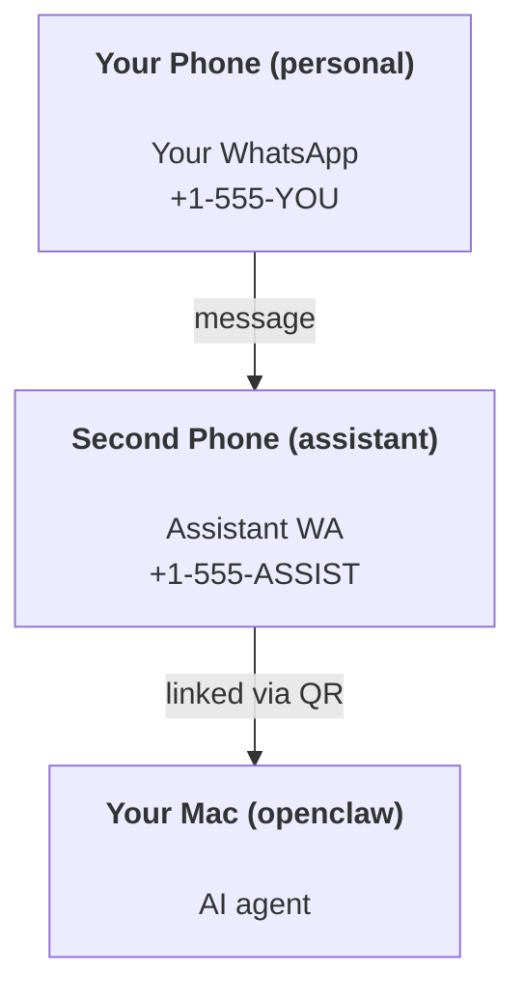

# Construyendo un asistente personal con OpenClaw

OpenClaw es una puerta de enlace autohospedada que conecta WhatsApp, Telegram, Discord, iMessage y más con agentes de IA. Esta guía cubre la configuración de "asistente personal": un número de WhatsApp dedicado que se comporta como tu asistente de IA siempre activo.

## ⚠️ Seguridad primero

Está poniendo a un agente en posición de:

- ejecutar comandos en tu máquina (dependiendo de tu política de herramientas)
- leer/escribir archivos en su espacio de trabajo
- enviar mensajes de nuevo a través de WhatsApp/Telegram/Discord/Mattermost (complemento)

Empiece de forma conservadora:

- Establezca siempre `channels.whatsapp.allowFrom` (nunca ejecute abierto al mundo en su Mac personal).
- Use un número de WhatsApp dedicado para el asistente.
- Los latidos ahora tienen un valor predeterminado de cada 30 minutos. Desactívelos hasta que confíe en la configuración estableciendo `agents.defaults.heartbeat.every: "0m"`.

## Requisitos previos

- OpenClaw instalado y configurado — consulta [Introducción](/en/start/getting-started) si aún no lo has hecho
- Un segundo número de teléfono (SIM/eSIM/prepago) para el asistente

## La configuración de dos teléfonos (recomendada)

Usted quiere esto:



Si vincula su WhatsApp personal a OpenClaw, cada mensaje que le reciba se convierte en "entrada del agente". Eso rara vez es lo que desea.

## Inicio rápido de 5 minutos

1. Vincular WhatsApp Web (muestra código QR; escanee con el teléfono del asistente):

```bash
openclaw channels login
```

2. Inicie la puerta de enlace (déjela ejecutándose):

```bash
openclaw gateway --port 18789
```

3. Ponga una configuración mínima en `~/.openclaw/openclaw.json`:

```json5
{
  channels: { whatsapp: { allowFrom: ["+15555550123"] } },
}
```

Ahora envíe un mensaje al número del asistente desde su teléfono autorizado.

Cuando finalice la integración, abrimos automáticamente el tablero e imprimimos un enlace limpio (sin tokenizar). Si solicita autenticación, pegue el token de `gateway.auth.token` en la configuración de Control UI. Para volver a abrir más tarde: `openclaw dashboard`.

## Dar al agente un espacio de trabajo (AGENTES)

OpenClaw lee las instrucciones de funcionamiento y la "memoria" de su directorio de espacio de trabajo.

De forma predeterminada, OpenClaw usa `~/.openclaw/workspace` como el espacio de trabajo del agente, y lo creará (junto con el `AGENTS.md` inicial, `SOUL.md`, `TOOLS.md`, `IDENTITY.md`, `USER.md`, `HEARTBEAT.md`) automáticamente en la configuración/primera ejecución del agente. `BOOTSTRAP.md` solo se crea cuando el espacio de trabajo es completamente nuevo (no debería reaparecer después de eliminarlo). `MEMORY.md` es opcional (no se crea automáticamente); cuando está presente, se carga para las sesiones normales. Las sesiones de subagentes solo inyectan `AGENTS.md` y `TOOLS.md`.

Consejo: trata esta carpeta como la "memoria" de OpenClaw y conviértela en un repositorio git (idealmente privado) para que tus archivos `AGENTS.md` y de memoria estén respaldados. Si git está instalado, los espacios de trabajo nuevos se inicializan automáticamente.

```bash
openclaw setup
```

Guía completa del diseño del espacio de trabajo + copia de seguridad: [Espacio de trabajo del agente](/en/concepts/agent-workspace)
Flujo de trabajo de memoria: [Memoria](/en/concepts/memory)

Opcional: elige un espacio de trabajo diferente con `agents.defaults.workspace` (admite `~`).

```json5
{
  agent: {
    workspace: "~/.openclaw/workspace",
  },
}
```

Si ya envías tus propios archivos de espacio de trabajo desde un repositorio, puedes desactivar por completo la creación de archivos de inicio:

```json5
{
  agent: {
    skipBootstrap: true,
  },
}
```

## La configuración que lo convierte en "un asistente"

OpenClaw tiene una configuración de asistente predeterminada buena, pero generalmente querrás ajustar:

- persona/instrucciones en `SOUL.md`
- valores predeterminados de pensamiento (si se desea)
- latidos (heartbeats) (una vez que confíes en él)

Ejemplo:

```json5
{
  logging: { level: "info" },
  agent: {
    model: "anthropic/claude-opus-4-6",
    workspace: "~/.openclaw/workspace",
    thinkingDefault: "high",
    timeoutSeconds: 1800,
    // Start with 0; enable later.
    heartbeat: { every: "0m" },
  },
  channels: {
    whatsapp: {
      allowFrom: ["+15555550123"],
      groups: {
        "*": { requireMention: true },
      },
    },
  },
  routing: {
    groupChat: {
      mentionPatterns: ["@openclaw", "openclaw"],
    },
  },
  session: {
    scope: "per-sender",
    resetTriggers: ["/new", "/reset"],
    reset: {
      mode: "daily",
      atHour: 4,
      idleMinutes: 10080,
    },
  },
}
```

## Sesiones y memoria

- Archivos de sesión: `~/.openclaw/agents/<agentId>/sessions/{{SessionId}}.jsonl`
- Metadatos de la sesión (uso de tokens, última ruta, etc.): `~/.openclaw/agents/<agentId>/sessions/sessions.json` (legado: `~/.openclaw/sessions/sessions.json`)
- `/new` o `/reset` inicia una sesión nueva para ese chat (configurable mediante `resetTriggers`). Si se envía solo, el agente responde con un breve saludo para confirmar el restablecimiento.
- `/compact [instructions]` compacta el contexto de la sesión e informa el presupuesto de contexto restante.

## Latidos (modo proactivo)

Por defecto, OpenClaw ejecuta un latido cada 30 minutos con el prompt:
`Read HEARTBEAT.md if it exists (workspace context). Follow it strictly. Do not infer or repeat old tasks from prior chats. If nothing needs attention, reply HEARTBEAT_OK.`
Establezca `agents.defaults.heartbeat.every: "0m"` para desactivar.

- Si `HEARTBEAT.md` existe pero está efectivamente vacío (solo líneas en blanco y encabezados de markdown como `# Heading`), OpenClaw omite la ejecución del latido para ahorrar llamadas a la API.
- Si falta el archivo, el latido aún se ejecuta y el modelo decide qué hacer.
- Si el agente responde con `HEARTBEAT_OK` (opcionalmente con un relleno corto; consulte `agents.defaults.heartbeat.ackMaxChars`), OpenClaw suprime el envío saliente para ese latido.
- Por defecto, se permite la entrega de latidos a objetivos de estilo MD `user:<id>`. Establezca `agents.defaults.heartbeat.directPolicy: "block"` para suprimir la entrega a objetivos directos manteniendo activas las ejecuciones de latidos.
- Los latidos ejecutan turnos completos del agente: los intervalos más cortos consumen más tokens.

```json5
{
  agent: {
    heartbeat: { every: "30m" },
  },
}
```

## Medios de entrada y salida

Los datos adjuntos entrantes (imágenes/audio/docs) se pueden mostrar en su comando a través de plantillas:

- `{{MediaPath}}` (ruta de archivo temporal local)
- `{{MediaUrl}}` (seudo-URL)
- `{{Transcript}}` (si la transcripción de audio está habilitada)

Datos adjuntos salientes del agente: incluya `MEDIA:<path-or-url>` en su propia línea (sin espacios). Ejemplo:

```
Here’s the screenshot.
MEDIA:https://example.com/screenshot.png
```

OpenClaw los extrae y los envía como medios junto con el texto.

El comportamiento de la ruta local sigue el mismo modelo de confianza de lectura de archivos que el agente:

- Si `tools.fs.workspaceOnly` es `true`, las rutas locales salientes de `MEDIA:` se mantienen restringidas a la raíz temporal de OpenClaw, la caché de medios, las rutas del espacio de trabajo del agente y los archivos generados en el sandbox.
- Si `tools.fs.workspaceOnly` es `false`, los `MEDIA:` salientes pueden usar archivos locales del host que el agente ya tiene permitido leer.
- Los envíos locales del host aún solo permiten tipos de medios y documentos seguros (imágenes, audio, video, PDF y documentos de Office). Los archivos de texto sin formato y los similares a secretos no se tratan como medios enviables.

Esto significa que las imágenes/archivos generados fuera del espacio de trabajo ahora se pueden enviar cuando tu política de sistema de archivos ya permite esas lecturas, sin reabrir la exfiltración de archivos de texto arbitrarios del host.

## Lista de verificación de operaciones

```bash
openclaw status          # local status (creds, sessions, queued events)
openclaw status --all    # full diagnosis (read-only, pasteable)
openclaw status --deep   # adds gateway health probes (Telegram + Discord)
openclaw health --json   # gateway health snapshot (WS)
```

Los registros residen en `/tmp/openclaw/` (predeterminado: `openclaw-YYYY-MM-DD.log`).

## Próximos pasos

- WebChat: [WebChat](/en/web/webchat)
- Operaciones de la puerta de enlace: [Manual de operaciones de la puerta de enlace](/en/gateway)
- Cron + activaciones: [Trabajos Cron](/en/automation/cron-jobs)
- Compañero de la barra de menús de macOS: [Aplicación OpenClaw para macOS](/en/platforms/macos)
- Aplicación de nodo iOS: [Aplicación iOS](/en/platforms/ios)
- Aplicación de nodo Android: [Aplicación Android](/en/platforms/android)
- Estado de Windows: [Windows (WSL2)](/en/platforms/windows)
- Estado de Linux: [Aplicación Linux](/en/platforms/linux)
- Seguridad: [Seguridad](/en/gateway/security)
