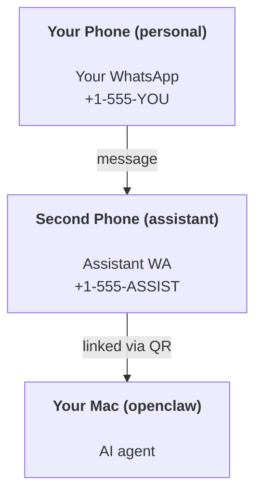

OpenClaw es una puerta de enlace autoalojada que conecta Discord, Google Chat, iMessage, Matrix, Microsoft Teams, Signal, Slack, Telegram, WhatsApp, Zalo y más con agentes de IA. Esta guía cubre la configuración de "asistente personal": un número de WhatsApp dedicado que se comporta como tu asistente de IA siempre activo.

## ⚠️ Seguridad primero

Estás poniendo a un agente en posición de:

- ejecutar comandos en tu máquina (dependiendo de tu política de herramientas)
- leer/escribir archivos en tu espacio de trabajo
- enviar mensajes de vuelta a través de WhatsApp/Telegram/Discord/Mattermost y otros canales incluidos

Empieza con precaución:

- Establezca siempre `channels.whatsapp.allowFrom` (nunca ejecute abierto al mundo en su Mac personal).
- Utiliza un número de WhatsApp dedicado para el asistente.
- Los latidos ahora son cada 30 minutos por defecto. Desactívelos hasta que confíe en la configuración estableciendo `agents.defaults.heartbeat.every: "0m"`.

## Requisitos previos

- OpenClaw instalado y integrado - consulte [Introducción](/es/start/getting-started) si aún no lo ha hecho
- Un segundo número de teléfono (SIM/eSIM/prepago) para el asistente

## La configuración de dos teléfonos (recomendada)

Quieres esto:



Si vinculas tu WhatsApp personal a OpenClaw, cada mensaje que recibas se convierte en "entrada del agente". Eso casi nunca es lo que quieres.

## Inicio rápido de 5 minutos

1. Emparejar WhatsApp Web (muestra un código QR; escanea con el teléfono del asistente):

```bash
openclaw channels login
```

2. Iniciar la puerta de enlace (déjala en ejecución):

```bash
openclaw gateway --port 18789
```

3. Coloque una configuración mínima en `~/.openclaw/openclaw.json`:

```json5
{
  gateway: { mode: "local" },
  channels: { whatsapp: { allowFrom: ["+15555550123"] } },
}
```

Ahora envía un mensaje al número del asistente desde tu teléfono autorizado.

Cuando finalice la integración, OpenClaw abre automáticamente el panel e imprime un enlace limpio (sin tokenizar). Si el panel solicita autenticación, pegue el secreto compartido configurado en la configuración de la Interfaz de Control. La integración usa un token por defecto (`gateway.auth.token`), pero la autenticación por contraseña también funciona si cambió `gateway.auth.mode` a `password`. Para volver a abrir más tarde: `openclaw dashboard`.

## Dar al agente un espacio de trabajo (AGENTS)

OpenClaw lee las instrucciones de operación y la "memoria" de su directorio de espacio de trabajo.

Por defecto, OpenClaw usa `~/.openclaw/workspace` como el espacio de trabajo del agente y lo creará (más los `AGENTS.md`, `SOUL.md`, `TOOLS.md`, `IDENTITY.md`, `USER.md`, `HEARTBEAT.md` iniciales) automáticamente en la configuración/primera ejecución del agente. `BOOTSTRAP.md` solo se crea cuando el espacio de trabajo es totalmente nuevo (no debería reaparecer después de eliminarlo). `MEMORY.md` es opcional (no se crea automáticamente); cuando está presente, se carga para sesiones normales. Las sesiones de subagente solo inyectan `AGENTS.md` y `TOOLS.md`.

<Tip>Trate esta carpeta como la memoria de OpenClaw y conviértala en un repositorio git (idealmente privado) para que sus `AGENTS.md` y archivos de memoria estén respaldados. Si git está instalado, los espacios de trabajo nuevos se inicializan automáticamente.</Tip>

```bash
openclaw setup
```

Diseño completo del espacio de trabajo + guía de respaldo: [Espacio de trabajo del agente](/es/concepts/agent-workspace)
Flujo de trabajo de memoria: [Memoria](/es/concepts/memory)

Opcional: elija un espacio de trabajo diferente con `agents.defaults.workspace` (admite `~`).

```json5
{
  agents: {
    defaults: {
      workspace: "~/.openclaw/workspace",
    },
  },
}
```

Si ya envía sus propios archivos de espacio de trabajo desde un repositorio, puede deshabilitar por completo la creación de archivos de arranque:

```json5
{
  agents: {
    defaults: {
      skipBootstrap: true,
    },
  },
}
```

## La configuración que lo convierte en "un asistente"

OpenClaw tiene una configuración de asistente predeterminada bastante buena, pero generalmente querrás ajustar:

- persona/instrucciones en [`SOUL.md`](/es/concepts/soul)
- valores predeterminados de pensamiento (si se desea)
- latidos (heartbeats) (una vez que confíes en él)

Ejemplo:

```json5
{
  logging: { level: "info" },
  agents: {
    defaults: {
      model: { primary: "anthropic/claude-opus-4-6" },
      workspace: "~/.openclaw/workspace",
      thinkingDefault: "high",
      timeoutSeconds: 1800,
      // Start with 0; enable later.
      heartbeat: { every: "0m" },
    },
    list: [
      {
        id: "main",
        default: true,
        groupChat: {
          mentionPatterns: ["@openclaw", "openclaw"],
        },
      },
    ],
  },
  channels: {
    whatsapp: {
      allowFrom: ["+15555550123"],
      groups: {
        "*": { requireMention: true },
      },
    },
  },
  session: {
    scope: "per-sender",
    resetTriggers: ["/new", "/reset"],
    reset: {
      mode: "daily",
      atHour: 4,
      idleMinutes: 10080,
    },
  },
}
```

## Sesiones y memoria

- Archivos de sesión: `~/.openclaw/agents/<agentId>/sessions/{{SessionId}}.jsonl`
- Metadatos de la sesión (uso de tokens, última ruta, etc.): `~/.openclaw/agents/<agentId>/sessions/sessions.json` (heredado: `~/.openclaw/sessions/sessions.json`)
- `/new` o `/reset` inicia una sesión nueva para ese chat (configurable vía `resetTriggers`). Si se envía solo, OpenClaw confirma el restablecimiento sin invocar al modelo.
- `/compact [instructions]` compacta el contexto de la sesión e informa el presupuesto de contexto restante.

## Latidos (modo proactivo)

Por defecto, OpenClaw ejecuta un latido cada 30 minutos con el prompt:
`Read HEARTBEAT.md if it exists (workspace context). Follow it strictly. Do not infer or repeat old tasks from prior chats. If nothing needs attention, reply HEARTBEAT_OK.`
Establezca `agents.defaults.heartbeat.every: "0m"` para desactivar.

- Si `HEARTBEAT.md` existe pero está efectivamente vacío (solo líneas en blanco y encabezados markdown como `# Heading`), OpenClaw omite la ejecución del latido para ahorrar llamadas a la API.
- Si falta el archivo, el latido aún se ejecuta y el modelo decide qué hacer.
- Si el agente responde con `HEARTBEAT_OK` (opcionalmente con relleno corto; ver `agents.defaults.heartbeat.ackMaxChars`), OpenClaw suprime el envío saliente para ese latido.
- Por defecto, se permite la entrega de latidos a objetivos `user:<id>` de tipo DM. Establezca `agents.defaults.heartbeat.directPolicy: "block"` para suprimir la entrega a objetivos directos manteniendo activas las ejecuciones de latidos.
- Los latidos ejecutan turnos completos del agente: intervalos más cortos consumen más tokens.

```json5
{
  agents: {
    defaults: {
      heartbeat: { every: "30m" },
    },
  },
}
```

## Medios de entrada y salida

Los archivos adjuntos entrantes (imágenes/audio/documentos) pueden mostrarse en su comando a través de plantillas:

- `{{MediaPath}}` (ruta de archivo temporal local)
- `{{MediaUrl}}` (pseudo-URL)
- `{{Transcript}}` (si la transcripción de audio está habilitada)

Archivos adjuntos salientes del agente: incluya `MEDIA:<path-or-url>` en su propia línea (sin espacios). La directiva debe iniciar la línea como texto plano, fuera de las cercas de código y sin envoltorios de Markdown como negrita o código en línea. Ejemplo:

```
Here's the screenshot.
MEDIA:https://example.com/screenshot.png
```

OpenClaw los extrae y los envía como medios junto con el texto.

Estas formas no son directivas de adjunto y se envían como texto normal:

```md
**MEDIA:https://example.com/screenshot.png**
`MEDIA:https://example.com/screenshot.png`
Here is the screenshot: MEDIA:https://example.com/screenshot.png
```

El comportamiento de ruta local sigue el mismo modelo de confianza de lectura de archivos que el agente:

- Si `tools.fs.workspaceOnly` es `true`, las rutas locales `MEDIA:` salientes permanecen restringidas a la raíz temporal de OpenClaw, la caché de medios, las rutas del espacio de trabajo del agente y los archivos generados por el sandbox.
- Si `tools.fs.workspaceOnly` es `false`, `MEDIA:` saliente puede usar archivos locales del host que el agente ya tiene permiso para leer.
- Las rutas locales pueden ser absolutas, relativas al espacio de trabajo o relativas al inicio con `~/`.
- Los envíos locales aún solo permiten tipos de medios y documentos seguros (imágenes, audio, video, PDF y documentos de Office). Los archivos de texto plano y los similares a secretos no se tratan como medios enviables.

Eso significa que las imágenes/archivos generados fuera del espacio de trabajo ahora se pueden enviar cuando su política de fs ya permite esas lecturas, sin reabrir la exfiltración de archivos de texto de host arbitrarios.

## Lista de verificación de operaciones

```bash
openclaw status          # local status (creds, sessions, queued events)
openclaw status --all    # full diagnosis (read-only, pasteable)
openclaw status --deep   # asks the gateway for a live health probe with channel probes when supported
openclaw health --json   # gateway health snapshot (WS; default can return a fresh cached snapshot)
```

Los registros residen en `/tmp/openclaw/` (predeterminado: `openclaw-YYYY-MM-DD.log`).

## Próximos pasos

- WebChat: [WebChat](/es/web/webchat)
- Operaciones de puerta de enlace: [Gateway runbook](/es/gateway)
- Cron + despertares: [Cron jobs](/es/automation/cron-jobs)
- Compañero de la barra de menús de macOS: [OpenClaw macOS app](/es/platforms/macos)
- Aplicación de nodo iOS: [iOS app](/es/platforms/ios)
- Aplicación de nodo Android: [Android app](/es/platforms/android)
- Estado de Windows: [Windows (WSL2)](/es/platforms/windows)
- Estado de Linux: [Linux app](/es/platforms/linux)
- Seguridad: [Security](/es/gateway/security)

## Relacionado

- [Getting started](/es/start/getting-started)
- [Setup](/es/start/setup)
- [Channels overview](/es/channels)
