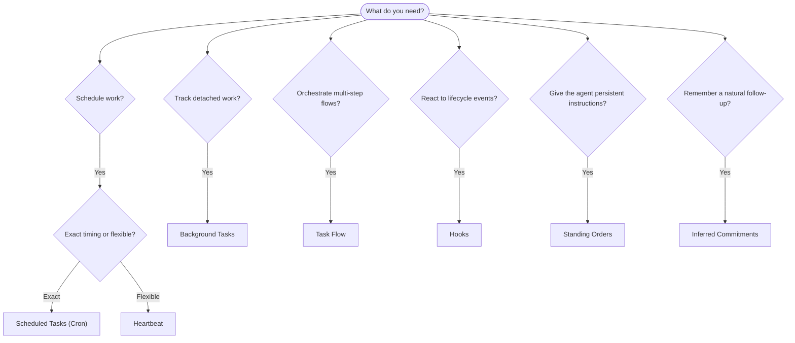

OpenClaw exécute le travail en arrière-plan via des tâches, des tâches planifiées, des engagements déduits, des hooks d'événements et des instructions permanentes. Cette page vous aide à choisir le bon mécanisme et à comprendre comment ils s'articulent.

## Guide de décision rapide

| Cas d'usage                                                  | Recommandé               | Pourquoi                                                                   |
| ------------------------------------------------------------ | ------------------------ | -------------------------------------------------------------------------- |
| Envoyer le rapport quotidien à 9h00 précises                 | Tâches planifiées (Cron) | Timing exact, exécution isolée                                             |
| Me rappeler dans 20 minutes                                  | Tâches planifiées (Cron) | Une seule fois avec un timing précis (`--at`)                              |
| Exécuter une analyse approfondie hebdomadaire                | Tâches planifiées (Cron) | Tâche autonome, peut utiliser un modèle différent                          |
| Vérifier la boîte de réception toutes les 30 min             | Heartbeat                | Traité par lots avec d'autres vérifications, conscient du contexte         |
| Surveiller le calendrier pour les événements à venir         | Heartbeat                | Adapté naturellement à la surveillance périodique                          |
| Faire un point après un entretien mentionné                  | Engagements déduits      | Suivi de type mémoire, sans demande de rappel exacte                       |
| Point de contrôle doux après le contexte utilisateur         | Engagements déduits      | Limité au même agent et channel                                            |
| Vérifier le statut d'un sous-agent ou d'une exécution ACP    | Tâches d'arrière-plan    | Le registre des tâches suit tout le travail détaché                        |
| Auditer ce qui a été exécuté et quand                        | Tâches d'arrière-plan    | `openclaw tasks list` et `openclaw tasks audit`                            |
| Recherche en plusieurs étapes puis résumer                   | Flux de tâches           | Orchestration durable avec suivi des révisions                             |
| Exécuter un script lors de la réinitialisation de la session | Hooks                    | Piloté par les événements, se déclenche sur les événements du cycle de vie |
| Exécuter du code à chaque appel d'outil                      | Hooks de plugin          | Les hooks in-process peuvent intercepter les appels d'outils               |
| Toujours vérifier la conformité avant de répondre            | Ordres permanents        | Injecté automatiquement dans chaque session                                |

### Tâches planifiées (Cron) vs Heartbeat

| Dimension                 | Tâches planifiées (Cron)                  | Heartbeat                                                      |
| ------------------------- | ----------------------------------------- | -------------------------------------------------------------- |
| Timing                    | Exact (expressions cron, unique)          | Approximatif (par défaut toutes les 30 min)                    |
| Contexte de session       | Fraîchement créé (isolé) ou partagé       | Contexte complet de la session principale                      |
| Enregistrements de tâches | Toujours créés                            | Jamais créés                                                   |
| Livraison                 | Channel, webhook ou silencieux            | En ligne dans la session principale                            |
| Idéal pour                | Rapports, rappels, travaux d'arrière-plan | Vérifications de boîte de réception, calendrier, notifications |

Utilisez les Tâches planifiées (Cron) lorsque vous avez besoin d'un timing précis ou d'une exécution isolée. Utilisez Heartbeat lorsque le travail bénéficie du contexte complet de la session et qu'un timing approximatif convient.

## Concepts de base

### Tâches planifiées (cron)

Cron est le planificateur intégré du Gateway pour un timing précis. Il persiste les tâches, réveille l'agent au bon moment et peut envoyer la sortie vers un channel de chat ou un point de terminaison webhook. Prend en charge les rappels uniques, les expressions récurrentes et les déclencheurs de webhook entrants.

Voir [Tâches planifiées](/fr/automation/cron-jobs).

### Tâches

Le grand livre des tâches en arrière-plan suit tout le travail détaché : les exécutions ACP, les créations de sous-agents, les exécutions cron isolées et les opérations CLI. Les tâches sont des enregistrements, pas des planificateurs. Utilisez CLI`openclaw tasks list` et `openclaw tasks audit` pour les inspecter.

Voir [Tâches en arrière-plan](/fr/automation/tasks).

### Engagements déduits

Les engagements sont des mémoires de suivi opt-in et à court terme. OpenClaw les déduit des conversations normales, les limite au même agent et channel, et transmet les points de contrôle d'échéance via le heartbeat. Les rappels exacts demandés par l'utilisateur appartiennent toujours au cron.

Voir [Engagements déduits](/fr/concepts/commitments).

### Flux de tâches

Le flux de tâches est le substrat d'orchestration des flux au-dessus des tâches en arrière-plan. Il gère les flux multi-étapes durables avec des modes de synchronisation gérés et mis en miroir, le suivi des révisions et `openclaw tasks flow list|show|cancel` pour l'inspection.

Voir [Flux de tâches](/fr/automation/taskflow).

### Ordres permanents

Les ordres permanents confèrent à l'agent une autorité opérationnelle permanente pour les programmes définis. Ils résident dans les fichiers de l'espace de travail (généralement `AGENTS.md`) et sont injectés dans chaque session. Combinez-les avec cron pour une application basée sur le temps.

Voir [Ordres permanents](/fr/automation/standing-orders).

### Hooks

Les hooks internes sont des scripts pilotés par les événements déclenchés par les événements du cycle de vie de l'agent (`/new`, `/reset`, `/stop`), la compactage de session, le démarrage de la passerelle et le flux de messages. Ils sont découverts automatiquement à partir des répertoires et peuvent être gérés avec `openclaw hooks`. Pour l'interception des appels d'outils en cours de processus, utilisez [Hooks de plugin](/fr/plugins/hooks).

Voir [Hooks](/fr/automation/hooks).

### Heartbeat

Heartbeat est un tour de session principal périodique (par défaut toutes les 30 minutes). Il regroupe plusieurs vérifications (boîte de réception, calendrier, notifications) en un seul tour d'agent avec le contexte complet de la session. Les tours Heartbeat ne créent pas d'enregistrements de tâches et n'étendent pas la fraîcheur de la réinitialisation quotidienne/inactive de la session. Utilisez `HEARTBEAT.md` pour une petite liste de contrôle, ou un bloc `tasks:` lorsque vous souhaitez des vérifications périodiques uniquement pour les tâches dues à l'intérieur même du heartbeat. Les fichiers heartbeat vides sont ignorés en tant que `empty-heartbeat-file` ; le mode de tâche due-only est ignoré en tant que `no-tasks-due`. Les heartbeats sont différés pendant que le travail cron est actif ou en file d'attente, et `heartbeat.skipWhenBusy` peut également les différer lorsque les sous-agents ou les voies imbriquées sont occupés.

Voir [Heartbeat](/fr/gateway/heartbeat).

## Comment ils fonctionnent ensemble

- **Cron** gère les planifications précises (rapports quotidiens, revues hebdomadaires) et les rappels ponctuels. Toutes les exécutions cron créent des enregistrements de tâches.
- **Heartbeat** gère la surveillance de routine (boîte de réception, calendrier, notifications) en un seul tour groupé toutes les 30 minutes.
- **Hooks** réagissent à des événements spécifiques (réinitialisations de session, compactage, flux de messages) avec des scripts personnalisés. Les hooks de plugin couvrent les appels d'outils.
- **Standing orders** donnent à l'agent un contexte persistant et des limites d'autorité.
- **Task Flow** coordonne les flux multi-étapes au-dessus des tâches individuelles.
- **Tasks** suivent automatiquement tout le travail détaché afin que vous puissiez l'inspecter et l'auditer.

## Connexes

- [Tâches planifiées](/fr/automation/cron-jobs) — planification précise et rappels ponctuels
- [Engagements déduits](/fr/concepts/commitments) — points de contrôle de suivi de type mémoire
- [Tâches d'arrière-plan](/fr/automation/tasks) — registre des tâches pour tout le travail détaché
- [Task Flow](/fr/automation/taskflow) — orchestration de flux durable multi-étapes
- [Hooks](/fr/automation/hooks) — scripts de cycle de vie pilotés par les événements
- [Hooks de plugin](/fr/plugins/hooks) — hooks d'outil, de prompt, de message et de cycle de vie in-process
- [Standing Orders](/fr/automation/standing-orders) — instructions persistantes de l'agent
- [Heartbeat](/fr/gateway/heartbeat) — tours de session principale périodiques
- [Référence de configuration](/fr/gateway/configuration-reference) — toutes les clés de configuration
