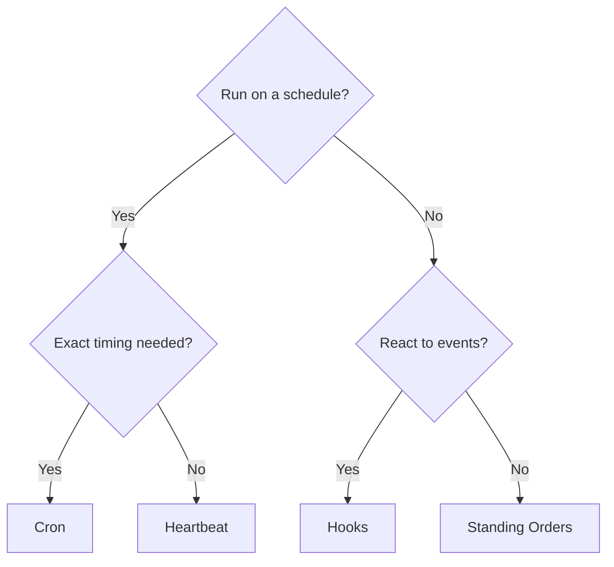

# Automatisation

OpenClaw fournit plusieurs mécanismes d'automatisation, chacun adapté à des cas d'utilisation différents. Cette page vous aide à choisir le bon.

## Guide de décision rapide

## Mécanismes en un coup d'œil

| Mécanisme                                         | Ce qu'il fait                                                                               | S'exécute dans               | Crée un enregistrement de tâche |
| ------------------------------------------------- | ------------------------------------------------------------------------------------------- | ---------------------------- | ------------------------------- |
| [Heartbeat](/en/gateway/heartbeat)                | Tour de session principale périodique — traite plusieurs vérifications par lots             | Session principale           | Non                             |
| [Cron](/en/automation/cron-jobs)                  | Tâches planifiées avec un timing précis                                                     | Session principale ou isolée | Oui (tous types)                |
| [Tâches d'arrière-plan](/en/automation/tasks)     | Suit le travail détaché (cron, ACP, sous-agents, CLI)                                       | N/A (grand livre)            | N/A                             |
| [Hooks](/en/automation/hooks)                     | Scripts pilotés par les événements déclenchés par les événements du cycle de vie de l'agent | Hook runner                  | Non                             |
| [Standing Orders](/en/automation/standing-orders) | Instructions persistantes injectées dans le invite système                                  | Session principale           | Non                             |
| [Webhooks](/en/automation/webhook)                | Reçoit les événements HTTP entrants et les achemine vers l'agent                            | Gateway HTTP                 | Non                             |

### Automatisation spécialisée

| Mécanisme                                                            | Ce qu'il fait                                                     |
| -------------------------------------------------------------------- | ----------------------------------------------------------------- |
| [Gmail PubSub](/en/automation/gmail-pubsub)                          | Notifications Gmail en temps réel via Google PubSub               |
| [Polling](/en/automation/poll)                                       | Vérifications périodiques des sources de données (RSS, API, etc.) |
| [Surveillance de l'authentification](/en/automation/auth-monitoring) | Alertes de santé et d'expiration des identifiants                 |

## Comment ils fonctionnent ensemble

Les configurations les plus efficaces combinent plusieurs mécanismes :

1. Le **Heartbeat** gère la surveillance de routine (boîte de réception, calendrier, notifications) en un seul tour par lot toutes les 30 minutes.
2. Le **Cron** gère les planifications précises (rapports quotidiens, revues hebdomadaires) et les rappels ponctuels.
3. Les **Hooks** réagissent à des événements spécifiques (appels d'outils, réinitialisations de session, compactage) avec des scripts personnalisés.
4. Les **Standing Orders** donnent à l'agent un contexte persistant (« toujours vérifier le tableau de projet avant de répondre »).
5. Les **Tâches d'arrière-plan** suivent automatiquement tout le travail détaché afin que vous puissiez l'inspecter et l'auditer.

Voir [Cron vs Heartbeat](/en/automation/cron-vs-heartbeat) pour une comparaison détaillée des deux mécanismes de planification.

## Références ClawFlow plus anciennes

Les anciennes notes de version et documentations peuvent mentionner `ClawFlow` ou `openclaw flows`, mais l'interface CLI actuelle dans ce dépôt est `openclaw tasks`.

Voir [Background Tasks](/en/automation/tasks) pour les commandes prises en charge du registre de tâches, ainsi que [ClawFlow](/en/automation/clawflow) et [CLI : flows](/en/cli/flows) pour les notes de compatibilité.

## Connexes

- [Cron vs Heartbeat](/en/automation/cron-vs-heartbeat) — guide de comparaison détaillé
- [ClawFlow](/en/automation/clawflow) — note de compatibilité pour les anciennes documentations et notes de version
- [Dépannage](/en/automation/troubleshooting) — débogage des problèmes d'automatisation
- [Référence de configuration](/en/gateway/configuration-reference) — toutes les clés de configuration
