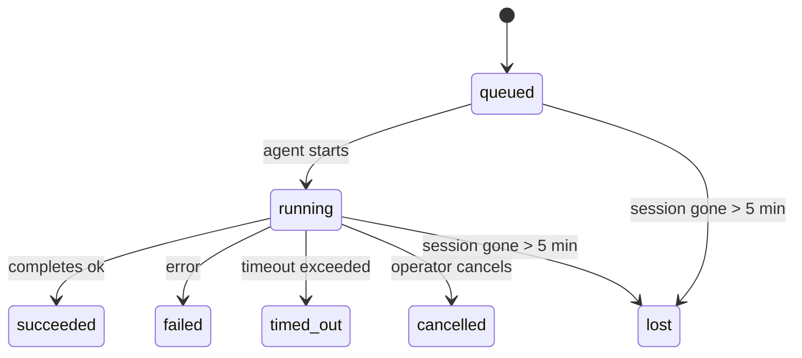

<Note>Vous cherchez à planifier ? Consultez [Automatisation et tâches](/fr/automation) pour choisir le bon mécanisme. Cette page est le registre d'activité pour le travail en arrière-plan, et non le planificateur.</Note>

Les tâches d'arrière-plan suivent le travail qui s'exécute **en dehors de votre session de conversation principale** : exécutions ACP, générations de sous-agents, exécutions de tâches cron isolées et opérations initiées par la CLI.

Les tâches ne remplacent **pas** les sessions, les tâches cron ou les heartbeats — elles constituent le **registre d'activité** qui enregistre le travail détaché effectué, quand il l'a été, et s'il a réussi.

<Note>Toutes les exécutions d'agent ne créent pas une tâche. Ce n'est pas le cas des tours d'heartbeat ni du chat interactif normal. Toutes les exécutions cron, les lancements ACP, les lancements de sous-agents et les commandes d'agent CLI en créent une.</Note>

## TL;DR

- Les tâches sont des **enregistrements**, pas des planificateurs — cron et heartbeat décident _quand_ le travail s'exécute, les tâches suivent _ce qui s'est passé_.
- ACP, sous-agents, toutes les tâches cron et opérations CLI créent des tâches. Les tours d'heartbeat n'en créent pas.
- Chaque tâche passe par `queued → running → terminal` (succeeded, failed, timed_out, cancelled ou lost).
- Les tâches cron restent actives tant que le runtime cron possède toujours le travail ; si l'état du runtime en mémoire a disparu, la maintenance des tâches vérifie d'abord l'historique d'exécution cron durable avant de marquer une tâche comme perdue.
- L'achèvement est piloté par push (push-driven) : le travail détaché peut notifier directement ou réveiller la session/heartbeat du demandeur lorsqu'il se termine, les boucles de interrogation de statut (polling loops) sont donc généralement la mauvaise approche.
- Les exécutions cron isolées et les achèvements de sous-agents nettoient, au mieux effort, les onglets/processus de navigateur suivis pour leur session enfant avant la comptabilité finale de nettoyage.
- La livraison cron isolée supprime les réponses parents intermédiaires obsolètes pendant que le travail des sous-agents descendants est encore en cours de drainage, et elle privilégie la sortie finale du descendant lorsque celle-ci arrive avant la livraison.
- Les notifications d'achèvement sont livrées directement à un channel ou mises en file d'attente pour le prochain heartbeat.
- `openclaw tasks list` affiche toutes les tâches ; `openclaw tasks audit` met en évidence les problèmes.
- Les enregistrements terminaux sont conservés pendant 7 jours, puis supprimés automatiquement.

## Quick start

<Tabs>
  <Tab title="Lister et filtrer">
    ```bash
    # List all tasks (newest first)
    openclaw tasks list

    # Filter by runtime or status
    openclaw tasks list --runtime acp
    openclaw tasks list --status running
    ```

  </Tab>
  <Tab title="Inspect">
    ```bash
    # Show details for a specific task (by ID, run ID, or session key)
    openclaw tasks show <lookup>
    ```
  </Tab>
  <Tab title="Cancel and notify">
    ```bash
    # Cancel a running task (kills the child session)
    openclaw tasks cancel <lookup>

    # Change notification policy for a task
    openclaw tasks notify <lookup> state_changes
    ```

  </Tab>
  <Tab title="Audit and maintenance">
    ```bash
    # Run a health audit
    openclaw tasks audit

    # Preview or apply maintenance
    openclaw tasks maintenance
    openclaw tasks maintenance --apply
    ```

  </Tab>
  <Tab title="Task flow">
    ```bash
    # Inspect TaskFlow state
    openclaw tasks flow list
    openclaw tasks flow show <lookup>
    openclaw tasks flow cancel <lookup>
    ```
  </Tab>
</Tabs>

## Ce qui crée une tâche

| Source                         | Type de runtime | Lorsqu'un enregistrement de tâche est créé                   | Stratégie de notification par défaut |
| ------------------------------ | --------------- | ------------------------------------------------------------ | ------------------------------------ |
| Exécutions en arrière-plan ACP | `acp`           | Génération d'une session ACP enfant                          | `done_only`                          |
| Orchestration de sous-agents   | `subagent`      | Génération d'un sous-agent via `sessions_spawn`              | `done_only`                          |
| Tâches cron (tous types)       | `cron`          | Chaque exécution cron (session principale et isolée)         | `silent`                             |
| Opérations CLI                 | `cli`           | Commandes `openclaw agent` qui s'exécutent via la passerelle | `silent`                             |
| Tâches multimédia d'agent      | `cli`           | Exécutions `video_generate` sauvegardées par session         | `silent`                             |

<AccordionGroup>
  <Accordion title="Notify defaults for cron and media">
    Les tâches cron de session principale utilisent par défaut la stratégie de notification `silent` — elles créent des enregistrements pour le suivi mais ne génèrent pas de notifications. Les tâches cron isolées utilisent également `silent` par défaut, mais sont plus visibles car elles s'exécutent dans leur propre session.

    Les exécutions `video_generate` soutenues par une session utilisent également la stratégie de notification `silent`. Elles créent toujours des enregistrements de tâche, mais l'achèvement est renvoyé à la session de l'agent d'origine sous forme de réveil interne afin que l'agent puisse écrire le message de suivi et attacher lui-même la vidéo terminée. Si vous activez `tools.media.asyncCompletion.directSend`, les achèvements asynchrones `music_generate` et `video_generate` essaient d'abord la livraison directe sur le canal avant de revenir au chemin de réveil de la session du demandeur.

  </Accordion>
  <Accordion title="Concurrent video_generate guardrail">
    Tant qu'une tâche `video_generate` soutenue par une session est encore active, l'outil agit également comme une barrière de protection : les appels répétés à `video_generate` dans cette même session renvoient l'état de la tâche active au lieu de démarrer une deuxième génération simultanée. Utilisez `action: "status"` lorsque vous souhaitez une recherche explicite de progression/d'état depuis le côté de l'agent.
  </Accordion>
  <Accordion title="What does not create tasks">
    - Tours de battement de cœur (Heartbeat) — session principale ; voir [Heartbeat](/fr/gateway/heartbeat)
    - Tours de chat interactif normaux
    - Réponses `/command` directes
  </Accordion>
</AccordionGroup>

## Cycle de vie de la tâche



| Statut      | Signification                                                                               |
| ----------- | ------------------------------------------------------------------------------------------- |
| `queued`    | Créé, en attente du démarrage de l'agent                                                    |
| `running`   | Le tour de l'agent est en cours d'exécution                                                 |
| `succeeded` | Terminé avec succès                                                                         |
| `failed`    | Terminé avec une erreur                                                                     |
| `timed_out` | Délai d'attente configuré dépassé                                                           |
| `cancelled` | Arrêté par l'opérateur via `openclaw tasks cancel`                                          |
| `lost`      | Le runtime a perdu l'état de sauvegarde autoritaire après une période de grâce de 5 minutes |

Les transitions se produisent automatiquement — lorsque l'exécution de l'agent associée se termine, le statut de la tâche est mis à jour en conséquence.

L'achèvement de l'exécution de l'agent fait autorité pour les enregistrements de tâches actifs. Une exécution détachée réussie se finalise en `succeeded`, les erreurs d'exécution ordinaires se finalisent en `failed`, et les résultats d'expiration ou d'abandon se finalisent en `timed_out`. Si un opérateur a déjà annulé la tâche, ou si le runtime a déjà enregistré un état terminal plus fort tel que `failed`, `timed_out` ou `lost`, un signal de succès ultérieur ne réduit pas ce statut terminal.

`lost` est conscient du runtime :

- Tâches ACP : les métadonnées de la session enfant ACP de sauvegarde ont disparu.
- Tâches de sous-agent : la session enfant de sauvegarde a disparu du magasin de l'agent cible.
- Tâches Cron : le runtime cron ne suit plus le travail comme actif et durable
  et l'historique des exécutions cron ne montre pas de résultat terminal pour cette exécution. L'audit CLI hors ligne ne traite pas son propre état d'exécution cron vide en cours comme une autorité.
- Tâches CLI : les tâches de session enfant isolées utilisent la session enfant ; les tâches CLI soutenues par le chat utilisent le contexte d'exécution en direct à la place, de sorte que les lignes de session channel/groupe/direct résiduelles ne les maintiennent pas en vie. Les exécutions `openclaw agent` soutenues par Gateway se finalisent également à partir de leur résultat d'exécution, de sorte que les exécutions terminées ne restent pas actives jusqu'à ce que le balayeur les marque `lost`.

## Livraison et notifications

Lorsqu'une tâche atteint un état terminal, OpenClaw vous en avertit. Il existe deux chemins de livraison :

**Livraison directe** — si la tâche a une cible de canal (le `requesterOrigin`), le message d'achèvement va directement à ce canal (Telegram, Discord, Slack, etc.). Pour les achèvements de sous-agent, OpenClaw préserve également le routage de fil/discussion lié lorsque disponible et peut remplir un `to` / compte manquant à partir de la route stockée de la session du demandeur (`lastChannel` / `lastTo` / `lastAccountId`) avant d'abandonner la livraison directe.

**Livraison mise en file d'attente de session** — si la livraison directe échoue ou si aucune origine n'est définie, la mise à jour est mise en file d'attente en tant qu'événement système dans la session du demandeur et apparaît lors du prochain battement de cœur (heartbeat).

<Tip>L'achèvement de la tâche déclenche un réveil immédiat du battement de cœur (heartbeat) afin que vous puissiez voir le résultat rapidement — vous n'avez pas à attendre le prochain battement programmé.</Tip>

Cela signifie que le workflow habituel est basé sur le push (push-based) : démarrez le travail détaché une fois, puis laissez le runtime vous réveiller ou vous notifier à l'achèvement. Interrogez (poll) l'état de la tâche uniquement lorsque vous avez besoin d'un débogage, d'une intervention ou d'un audit explicite.

### Stratégies de notification

Contrôlez la quantité d'informations que vous recevez pour chaque tâche :

| Stratégie                | Ce qui est livré                                                                      |
| ------------------------ | ------------------------------------------------------------------------------------- |
| `done_only` (par défaut) | Uniquement l'état terminal (réussi, échoué, etc.) — **ceci est la valeur par défaut** |
| `state_changes`          | Chaque transition d'état et mise à jour de progression                                |
| `silent`                 | Rien du tout                                                                          |

Modifier la stratégie pendant qu'une tâche est en cours d'exécution :

```bash
openclaw tasks notify <lookup> state_changes
```

## Référence CLI

<AccordionGroup>
  <Accordion title="tasks list">
    ```bash
    openclaw tasks list [--runtime <acp|subagent|cron|cli>] [--status <status>] [--json]
    ```

    Colonnes de sortie : Task ID, Kind, Status, Delivery, Run ID, Child Session, Summary.

  </Accordion>
  <Accordion title="tasks show">
    ```bash
    openclaw tasks show <lookup>
    ```

    Le jeton de recherche accepte un ID de tâche, un ID d'exécution ou une clé de session. Affiche l'enregistrement complet, y compris le timing, l'état de livraison, l'erreur et le résumé terminal.

  </Accordion>
  <Accordion title="tasks cancel">
    ```bash
    openclaw tasks cancel <lookup>
    ```

    Pour les tâches ACP et sous-agentes, cela tue la session enfant. Pour les tâches suivies par CLI, l'annulation est enregistrée dans le registre des tâches (il n'y a pas de gestionnaire d'exécution enfant distinct). Le statut passe à `cancelled` et une notification de livraison est envoyée, le cas échéant.

  </Accordion>
  <Accordion title="tasks notify">
    ```bash
    openclaw tasks notify <lookup> <done_only|state_changes|silent>
    ```
  </Accordion>
  <Accordion title="audit des tâches">
    ```bash
    openclaw tasks audit [--json]
    ```

    Met en évidence des problèmes opérationnels. Les résultats apparaissent également dans `openclaw status` lorsque des problèmes sont détectés.

    | Finding                   | Severity   | Trigger                                                                                                      |
    | ------------------------- | ---------- | ------------------------------------------------------------------------------------------------------------ |
    | `stale_queued`            | warn       | En file d'attente depuis plus de 10 minutes                                                                 |
    | `stale_running`           | error      | En cours d'exécution depuis plus de 30 minutes                                                               |
    | `lost`                    | warn/error | La propriété de la tâche soutenue par le runtime a disparu ; les tâches perdues retenues génèrent un avertissement jusqu'à `cleanupAfter`, puis deviennent des erreurs |
    | `delivery_failed`         | warn       | Échec de la remise et la stratégie de notification n'est pas `silent`                                               |
    | `missing_cleanup`         | warn       | Tâche terminale sans horodatage de nettoyage                                                                 |
    | `inconsistent_timestamps` | warn       | Violation de la chronologie (par exemple terminée avant d'avoir commencé)                                   |

  </Accordion>
  <Accordion title="tasks maintenance">
    ```bash
    openclaw tasks maintenance [--json]
    openclaw tasks maintenance --apply [--json]
    ```

    Utilisez ceci pour prévisualiser ou appliquer la réconciliation, le marquage du nettoyage et l'élagage pour les tâches et l'état du flux de tâches.

    La réconciliation est consciente du runtime :

    - Les tâches ACP/sous-agent vérifient leur session enfant sous-jacente.
    - Les tâches cron vérifient si le runtime cron possède toujours le travail, puis récupèrent le statut terminal à partir des journaux d'exécution cron persistants/état du travail avant de revenir à `lost`. Seul le processus Gateway est autoritaire pour l'ensemble de travaux cron actifs en mémoire ; l'audit hors ligne CLI utilise l'historique durable mais ne marque pas une tâche cron comme perdue uniquement parce que cet ensemble local est vide.
    - Les tâches CLI sauvegardées par le chat vérifient le contexte d'exécution en direct propriétaire, et pas seulement la ligne de session de chat.

    Le nettoyage à l'achèvement est également conscient du runtime :

    - L'achèvement du sous-agent ferme de manière « au mieux » les onglets/processus de navigateur suivis pour la session enfant avant que le nettoyage d'annonce ne continue.
    - L'achèvement cron isolé ferme de manière « au mieux » les onglets/processus de navigateur suivis pour la session cron avant que l'exécution ne se démonte entièrement.
    - La livraison cron isolée attend le suivi du sous-agent descendant lorsque cela est nécessaire et supprime le texte d'accusé de réception parent périmé au lieu de l'annoncer.
    - La livraison d'achèvement du sous-agent préfère le dernier texte d'assistant visible ; s'il est vide, elle revient au dernier texte outil/toolResult nettoyé, et les exécutions d'appel d'outil en délai d'attente uniquement peuvent s'effondrer en un résumé court de progression partielle. Les exécutions échouées terminales annoncent le statut d'échec sans rejouer le texte de réponse capturé.
    - Les échecs de nettoyage ne masquent pas le résultat réel de la tâche.

  </Accordion>
  <Accordion title="tasks flow list | show | cancel">
    ```bash
    openclaw tasks flow list [--status <status>] [--json]
    openclaw tasks flow show <lookup> [--json]
    openclaw tasks flow cancel <lookup>
    ```

    Utilisez-les lorsque le flux de tâches d'orchestration est ce qui vous importe, plutôt qu'un enregistrement de tâche en arrière-plan individuel.

  </Accordion>
</AccordionGroup>

## Tableau des tâches de chat (`/tasks`)

Utilisez `/tasks` dans n'importe quelle session de chat pour voir les tâches en arrière-plan liées à cette session. Le tableau affiche les tâches actives et récemment terminées avec le runtime, le statut, la minuterie, et les détails de progression ou d'erreur.

Lorsque la session en cours n'a aucune tâche liée visible, `/tasks` revient aux comptes de tâches locaux à l'agent afin que vous ayez toujours une vue d'ensemble sans divulguer les détails d'autres sessions.

Pour le registre complet de l'opérateur, utilisez le CLI : `openclaw tasks list`.

## Intégration du statut (pression de tâche)

`openclaw status` inclut un résumé des tâches d'un coup d'œil :

```
Tasks: 3 queued · 2 running · 1 issues
```

Le résumé indique :

- **actives** — nombre de `queued` + `running`
- **échecs** — nombre de `failed` + `timed_out` + `lost`
- **byRuntime** — répartition par `acp`, `subagent`, `cron`, `cli`

À la fois `/status` et l'outil `session_status` utilisent un instantané de tâches nettoyage-conscient : les tâches actives sont privilégiées, les lignes terminées obsolètes sont masquées, et les échecs récents n'apparaissent que lorsqu'il n'y a plus de travail actif. Cela permet de garder la fiche de statut concentrée sur ce qui compte maintenant.

## Stockage et maintenance

### Où vivent les tâches

Les enregistrements de tâches persistent dans SQLite à :

```
$OPENCLAW_STATE_DIR/tasks/runs.sqlite
```

Le registre se charge en mémoire au démarrage de la passerelle et synchronise les écritures avec SQLite pour la durabilité à travers les redémarrages.
Le Gateway garde le journal d'écriture SQLite (write-ahead log) borné en utilisant le seuil de point de contrôle automatique par défaut de SQLite ainsi que des points de contrôle périodiques et à l'arrêt `TRUNCATE`.

### Maintenance automatique

Un balayeur s'exécute toutes les **60 secondes** et gère trois choses :

<Steps>
  <Step title="Réconciliation">
    Vérifie si les tâches actives ont toujours un support d'exécution (runtime) faisant autorité. Les tâches ACP/sous-agent utilisent l'état de la session enfant, les tâches cron utilisent la propriété du travail actif, et les tâches CLI soutenues par le chat utilisent le contexte d'exécution propriétaire. Si cet état de support a disparu depuis plus de 5 minutes, la tâche est marquée `lost`.
  </Step>
  <Step title="Nettoyage de l'estampillage">Définit un horodatage `cleanupAfter` sur les tâches terminales (endedAt + 7 jours). Pendant la rétention, les tâches perdues apparaissent toujours dans l'audit sous forme d'avertissements ; une fois `cleanupAfter` expiré ou lorsque les métadonnées de nettoyage sont manquantes, elles sont considérées comme des erreurs.</Step>
  <Step title="Élagage">Supprime les enregistrements antérieurs à leur date `cleanupAfter`.</Step>
</Steps>

<Note>**Rétention :** les enregistrements de tâches terminales sont conservés pendant **7 jours**, puis automatiquement élagués. Aucune configuration n'est nécessaire.</Note>

## Comment les tâches sont liées aux autres systèmes

<AccordionGroup>
  <Accordion title="Tâches et flux de tâches">
    [Task Flow](/fr/automation/taskflow) est la couche d'orchestration des flux située au-dessus des tâches d'arrière-plan. Un seul flux peut coordonner plusieurs tâches tout au long de sa vie en utilisant des modes de synchronisation gérés ou en miroir. Utilisez `openclaw tasks` pour inspecter les enregistrements de tâches individuels et `openclaw tasks flow` pour inspecter le flux d'orchestration.

    Voir [Task Flow](/fr/automation/taskflow) pour plus de détails.

  </Accordion>
  <Accordion title="Tâches et cron">
    Une **définition** de tâche cron réside dans `~/.openclaw/cron/jobs.json` ; l'état d'exécution au moment de l'exécution réside à côté dans `~/.openclaw/cron/jobs-state.json`. **Chaque** exécution cron crée un enregistrement de tâche — à la fois en session principale et isolée. Les tâches cron de session principale ont par défaut la stratégie de notification `silent` afin qu'elles assurent le suivi sans générer de notifications.

    Voir [Cron Jobs](/fr/automation/cron-jobs).

  </Accordion>
  <Accordion title="Tâches et heartbeat">
    Les exécutions de heartbeat sont des tours de session principale — elles ne créent pas d'enregistrements de tâches. Lorsqu'une tâche se termine, elle peut déclencher un réveil du heartbeat afin que vous puissiez voir le résultat rapidement.

    Voir [Heartbeat](/fr/gateway/heartbeat).

  </Accordion>
  <Accordion title="Tâches et sessions">
    Une tâche peut faire référence à une `childSessionKey` (où le travail s'exécute) et à une `requesterSessionKey` (qui l'a lancée). Les sessions sont le contexte de conversation ; les tâches assurent le suivi de l'activité par-dessus cela.
  </Accordion>
  <Accordion title="Tâches et exécutions d'agent">
    Le `runId` d'une tâche renvoie à l'exécution de l'agent effectuant le travail. Les événements du cycle de vie de l'agent (démarrage, fin, erreur) mettent automatiquement à jour le statut de la tâche — vous n'avez pas besoin de gérer le cycle de vie manuellement.
  </Accordion>
</AccordionGroup>

## Connexes

- [Automatisation et tâches](/fr/automation) — tous les mécanismes d'automatisation en un coup d'œil
- [CLI : Tâches](/fr/cli/tasks) — référence de la commande CLI
- [Heartbeat](/fr/gateway/heartbeat) — tours de session principale périodiques
- [Tâches planifiées](/fr/automation/cron-jobs) — planification des tâches en arrière-plan
- [Flux de tâches](/fr/automation/taskflow) — orchestration des flux au-dessus des tâches
