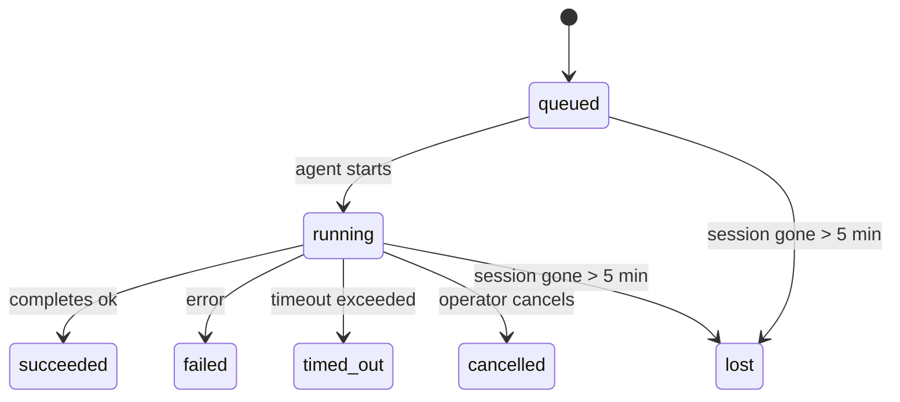

# Tâches d'arrière-plan

> **Vous cherchez à planifier ?** Consultez [Automation & Tasks](/fr/automation) pour choisir le bon mécanisme. Cette page couvre le **suivi** du travail d'arrière-plan, et non sa planification.

Les tâches d'arrière-plan assurent le suivi du travail qui s'exécute **en dehors de votre session de conversation principale** :
exécutions ACP, lancements de sous-agents, exécutions de tâches cron isolées et opérations initiées par la CLI.

Les tâches ne remplacent **pas** les sessions, les tâches cron ou les heartbeats — elles constituent le **registre d'activité** qui enregistre le travail détaché effectué, quand il l'a été, et s'il a réussi.

<Note>Toutes les exécutions d'agent ne créent pas une tâche. Ce n'est pas le cas des tours d'heartbeat ni du chat interactif normal. Toutes les exécutions cron, les lancements ACP, les lancements de sous-agents et les commandes d'agent CLI en créent une.</Note>

## TL;DR

- Les tâches sont des **enregistrements**, pas des planificateurs — cron et heartbeat décident _quand_ le travail s'exécute, les tâches suivent _ce qui s'est passé_.
- ACP, sous-agents, toutes les tâches cron et opérations CLI créent des tâches. Les tours d'heartbeat n'en créent pas.
- Chaque tâche passe par `queued → running → terminal` (réussie, échouée, expirée, annulée ou perdue).
- Les tâches cron restent actives tant que le runtime cron possède toujours la tâche ; les tâches CLI associées au chat restent actives uniquement tant que leur contexte d'exécution propriétaire est toujours actif.
- L'achèvement est piloté par push (push-driven) : le travail détaché peut notifier directement ou réveiller la session/heartbeat du demandeur lorsqu'il se termine, les boucles de interrogation de statut (polling loops) sont donc généralement la mauvaise approche.
- Les exécutions cron isolées et les achèvements de sous-agents nettoient, au mieux effort, les onglets/processus de navigateur suivis pour leur session enfant avant la comptabilité finale de nettoyage.
- La livraison cron isolée supprime les réponses parents intermédiaires obsolètes pendant que le travail des sous-agents descendants se vide encore, et elle préfère la sortie finale du descendant lorsque celle-ci arrive avant la livraison.
- Les notifications d'achèvement sont livrées directement à un channel ou mises en file d'attente pour le prochain heartbeat.
- `openclaw tasks list` affiche toutes les tâches ; `openclaw tasks audit` met en évidence les problèmes.
- Les enregistrements terminaux sont conservés pendant 7 jours, puis supprimés automatiquement.

## Quick start

```bash
# List all tasks (newest first)
openclaw tasks list

# Filter by runtime or status
openclaw tasks list --runtime acp
openclaw tasks list --status running

# Show details for a specific task (by ID, run ID, or session key)
openclaw tasks show <lookup>

# Cancel a running task (kills the child session)
openclaw tasks cancel <lookup>

# Change notification policy for a task
openclaw tasks notify <lookup> state_changes

# Run a health audit
openclaw tasks audit

# Preview or apply maintenance
openclaw tasks maintenance
openclaw tasks maintenance --apply

# Inspect TaskFlow state
openclaw tasks flow list
openclaw tasks flow show <lookup>
openclaw tasks flow cancel <lookup>
```

## Qu'est-ce qui crée une tâche

| Source                         | Type de runtime | Lorsqu'un enregistrement de tâche est créé                   | Stratégie de notification par défaut |
| ------------------------------ | --------------- | ------------------------------------------------------------ | ------------------------------------ |
| Exécutions en arrière-plan ACP | `acp`           | Génération d'une session ACP enfant                          | `done_only`                          |
| Orchestration de sous-agent    | `subagent`      | Génération d'un sous-agent via `sessions_spawn`              | `done_only`                          |
| Tâches cron (tous types)       | `cron`          | Chaque exécution cron (session principale et isolée)         | `silent`                             |
| Opérations CLI                 | `cli`           | Commandes `openclaw agent` qui s'exécutent via la passerelle | `silent`                             |
| Tâches multimédia d'agent      | `cli`           | Exécutions `video_generate` associées à une session          | `silent`                             |

Les tâches cron de session principale utilisent par défaut la stratégie de notification `silent` — elles créent des enregistrements pour le suivi mais ne génèrent pas de notifications. Les tâches cron isolées utilisent également `silent` par défaut, mais sont plus visibles car elles s'exécutent dans leur propre session.

Les exécutions `video_generate` associées à une session utilisent également la stratégie de notification `silent`. Elles créent toujours des enregistrements de tâche, mais l'achèvement est renvoyé à la session de l'agent d'origine sous forme de réveil interne (internal wake), afin que l'agent puisse écrire le message de suivi et joindre lui-même la vidéo terminée. Si vous activez `tools.media.asyncCompletion.directSend`, les achèvements asynchrones `music_generate` et `video_generate` essaient d'abord la livraison directe sur le canal avant de revenir au chemin de réveil de la session demanderesse.

Tant qu'une tâche `video_generate` associée à une session est active, l'outil agit également comme une barrière de sécurité (guardrail) : les appels `video_generate` répétés dans cette même session renvoient l'état de la tâche active au lieu de démarrer une deuxième génération simultanée. Utilisez `action: "status"` lorsque vous souhaitez une recherche explicite de progression/d'état depuis le côté de l'agent.

**Ce qui ne crée pas de tâches :**

- Tours Heartbeat — session principale ; voir [Heartbeat](/fr/gateway/heartbeat)
- Tours de chat interactif normaux
- Réponses `/command` directes

## Cycle de vie de la tâche



| Statut      | Signification                                                                               |
| ----------- | ------------------------------------------------------------------------------------------- |
| `queued`    | Créé, en attente du démarrage de l'agent                                                    |
| `running`   | Le tour de l'agent est en cours d'exécution                                                 |
| `succeeded` | Terminé avec succès                                                                         |
| `failed`    | Terminé avec une erreur                                                                     |
| `timed_out` | Le délai configuré a été dépassé                                                            |
| `cancelled` | Arrêté par l'opérateur via `openclaw tasks cancel`                                          |
| `lost`      | Le runtime a perdu l'état de sauvegarde autoritaire après une période de grâce de 5 minutes |

Les transitions se produisent automatiquement — lorsque l'exécution de l'agent associée se termine, l'état de la tâche est mis à jour en conséquence.

`lost` est conscient du runtime :

- Tâches ACP : les métadonnées de la session enfant ACP de sauvegarde ont disparu.
- Tâches de sous-agent : la session enfant de sauvegarde a disparu du magasin de l'agent cible.
- Tâches Cron : le runtime Cron ne suit plus la tâche comme active.
- Tâches CLI : les tâches de session enfant isolées utilisent la session enfant ; les tâches CLI soutenues par le chat utilisent plutôt le contexte d'exécution en direct, de sorte que les lignes de session channel/group/direct persistantes ne les maintiennent pas en vie.

## Livraison et notifications

Lorsqu'une tâche atteint un état terminal, OpenClaw vous notifie. Il existe deux chemins de livraison :

**Livraison directe** — si la tâche a une cible de channel (le `requesterOrigin`), le message d'achèvement va directement vers ce channel (Telegram, Discord, Slack, etc.). Pour les achèvements de sous-agent, OpenClaw préserve également le routage de fil/discussion lié lorsque disponible et peut combler un `to` / compte manquant à partir de la route stockée de la session du demandeur (`lastChannel` / `lastTo` / `lastAccountId`) avant d'abandonner la livraison directe.

**Livraison mise en file d'attente de session** — si la livraison directe échoue ou si aucune origine n'est définie, la mise à jour est mise en file d'attente en tant qu'événement système dans la session du demandeur et apparaît au prochain battement de cœur (heartbeat).

<Tip>L'achèvement de la tâche déclenche un réveil immédiat du battement de cœur (heartbeat) afin que vous voyiez le résultat rapidement — vous n'avez pas à attendre le prochain battement programmé.</Tip>

Cela signifie que le workflow habituel est basé sur le push (pousser) : démarrez le travail détaché une fois, puis laissez
le runtime vous réveiller ou vous notifier à l'achèvement. Interrogez l'état de la tâche uniquement lorsque vous
avez besoin d'un débogage, d'une intervention ou d'un audit explicite.

### Politiques de notification

Contrôlez ce que vous entendez sur chaque tâche :

| Politique                | Ce qui est livré                                                                    |
| ------------------------ | ----------------------------------------------------------------------------------- |
| `done_only` (par défaut) | Seul l'état terminal (réussi, échoué, etc.) — **il s'agit de la valeur par défaut** |
| `state_changes`          | Chaque transition d'état et mise à jour de progression                              |
| `silent`                 | Rien du tout                                                                        |

Changer la politique pendant qu'une tâche est en cours d'exécution :

```bash
openclaw tasks notify <lookup> state_changes
```

## Référence CLI

### `tasks list`

```bash
openclaw tasks list [--runtime <acp|subagent|cron|cli>] [--status <status>] [--json]
```

Colonnes de sortie : ID de tâche, Type, Statut, Livraison, ID d'exécution, Session enfant, Résumé.

### `tasks show`

```bash
openclaw tasks show <lookup>
```

Le jeton de recherche accepte un ID de tâche, un ID d'exécution ou une clé de session. Affiche l'enregistrement complet, y compris le timing, l'état de livraison, l'erreur et le résumé terminal.

### `tasks cancel`

```bash
openclaw tasks cancel <lookup>
```

Pour les tâches ACP et de sous-agent, cela met fin à la session enfant. Pour les tâches suivies par CLI, l'annulation est enregistrée dans le registre des tâches (il n'y a pas de handle d'exécution enfant distinct). Le statut passe à `cancelled` et une notification de livraison est envoyée le cas échéant.

### `tasks notify`

```bash
openclaw tasks notify <lookup> <done_only|state_changes|silent>
```

### `tasks audit`

```bash
openclaw tasks audit [--json]
```

Signale des problèmes opérationnels. Les résultats apparaissent également dans `openclaw status` lorsque des problèmes sont détectés.

| Résultat                  | Gravité       | Déclencheur                                                              |
| ------------------------- | ------------- | ------------------------------------------------------------------------ |
| `stale_queued`            | avertissement | En file d'attente depuis plus de 10 minutes                              |
| `stale_running`           | erreur        | En cours d'exécution depuis plus de 30 minutes                           |
| `lost`                    | erreur        | La propriété de la tâche basée sur le runtime a disparu                  |
| `delivery_failed`         | avertissement | La livraison a échoué et la stratégie de notification n'est pas `silent` |
| `missing_cleanup`         | avertissement | Tâche terminée sans horodatage de nettoyage                              |
| `inconsistent_timestamps` | avertissement | Violation de la chronologie (par exemple, terminé avant le début)        |

### `tasks maintenance`

```bash
openclaw tasks maintenance [--json]
openclaw tasks maintenance --apply [--json]
```

Utilisez ceci pour prévisualiser ou appliquer la réconciliation, l'horodatage du nettoyage et l'élagage pour
les tâches et l'état du flux de tâches.

La réconciliation est consciente du runtime :

- Les tâches ACP/sous-agent vérifient leur session enfant sous-jacente.
- Les tâches Cron vérifient si le runtime cron possède toujours le travail.
- Les tâches CLI soutenues par le chat vérifient le contexte d'exécution en direct propriétaire, et pas seulement la ligne de la session de chat.

Le nettoyage après achèvement est également conscient du runtime :

- L'achèvement du sous-agent tente de fermer au mieux les onglets/processus de navigateur suivis pour la session enfant avant que le nettoyage de l'annonce ne continue.
- L'achèvement du Cron isolé tente de fermer au mieux les onglets/processus de navigateur suivis pour la session Cron avant que l'exécution ne soit complètement démantelée.
- La livraison du Cron isolé attend le suivi du sous-agent descendant lorsque cela est nécessaire et
  supprime le texte d'accusé de réception parent périmé au lieu de l'annoncer.
- La livraison à l'achèvement du sous-agent préfère le dernier texte visible de l'assistant ; si celui-ci est vide, il revient au dernier texte nettoyé de l'outil/toolResult, et les exécutions d'appels d'outil avec uniquement un délai d'attente peuvent s'effondrer en un court résumé de progression partielle.
- Les échecs de nettoyage ne masquent pas le résultat réel de la tâche.

### `tasks flow list|show|cancel`

```bash
openclaw tasks flow list [--status <status>] [--json]
openclaw tasks flow show <lookup> [--json]
openclaw tasks flow cancel <lookup>
```

Utilisez-les lorsque le flux de tâches orchestrateur est ce qui vous importe plutôt
qu'un seul enregistrement de tâche en arrière-plan.

## Tableau des tâches de chat (`/tasks`)

Utilisez `/tasks` dans n'importe quelle session de chat pour voir les tâches d'arrière-plan liées à cette session. Le tableau affiche les tâches actives et récemment terminées avec leurs détails d'exécution, leur statut, leur chronologie, et leur progression ou leurs erreurs.

Lorsque la session actuelle n'a aucune tâche liée visible, `/tasks` revient aux comptes de tâches locaux à l'agent, afin que vous ayez toujours une vue d'ensemble sans divulguer les détails d'autres sessions.

Pour le grand livre complet de l'opérateur, utilisez le CLI : `openclaw tasks list`.

## Intégration du statut (pression de tâche)

`openclaw status` inclut un résumé des tâches en un coup d'œil :

```
Tasks: 3 queued · 2 running · 1 issues
```

Le résumé indique :

- **actif** — nombre de `queued` + `running`
- **échecs** — nombre de `failed` + `timed_out` + `lost`
- **parRuntime** — répartition par `acp`, `subagent`, `cron`, `cli`

À la fois `/status` et l'outil `session_status` utilisent un instantané de tâches conscient du nettoyage : les tâches actives sont privilégiées, les lignes terminées périmées sont masquées, et les échecs récents n'apparaissent que lorsqu'il ne reste aucun travail actif. Cela permet de garder la carte de statut concentrée sur ce qui compte maintenant.

## Stockage et maintenance

### Où résident les tâches

Les enregistrements de tâches sont conservés dans SQLite à l'emplacement :

```
$OPENCLAW_STATE_DIR/tasks/runs.sqlite
```

Le registre est chargé en mémoire au démarrage de la passerelle et synchronise les écritures avec SQLite pour assurer la durabilité lors des redémarrages.

### Maintenance automatique

Un nettoyeur s'exécute toutes les **60 secondes** et gère trois éléments :

1. **Réconciliation** — vérifie si les tâches actives ont toujours une sauvegarde d'exécution faisant autorité. Les tâches ACP/sous-agent utilisent l'état de la session enfant, les tâches cron utilisent la propriété de la tâche active, et les tâches CLI soutenues par le chat utilisent le contexte d'exécution propriétaire. Si cet état de sauvegarde a disparu depuis plus de 5 minutes, la tâche est marquée comme `lost`.
2. **Estampillage de nettoyage** — définit un horodatage `cleanupAfter` sur les tâches terminales (endedAt + 7 jours).
3. **Élagage** — supprime les enregistrements dépassant leur date `cleanupAfter`.

**Rétention** : les enregistrements de tâches terminaux sont conservés pendant **7 jours**, puis automatiquement élagués. Aucune configuration requise.

## Comment les tâches sont liées aux autres systèmes

### Tâches et flux de tâches

[Task Flow](/fr/automation/taskflow) est la couche d'orchestration de flux au-dessus des tâches d'arrière-plan. Un seul flux peut coordonner plusieurs tâches au cours de sa durée de vie à l'aide des modes de synchronisation géré ou miroir. Utilisez `openclaw tasks` pour inspecter les enregistrements de tâches individuels et `openclaw tasks flow` pour inspecter le flux d'orchestration.

Voir [Task Flow](/fr/automation/taskflow) pour plus de détails.

### Tâches et cron

Une **définition** de tâche cron réside dans `~/.openclaw/cron/jobs.json`. **Chaque** exécution de cron crée un enregistrement de tâche — à la fois dans la session principale et isolée. Les tâches cron de session principale ont par défaut la stratégie de notification `silent` afin qu'elles suivent le processus sans générer de notifications.

Voir [Cron Jobs](/fr/automation/cron-jobs).

### Tâches et heartbeat

Les exécutions Heartbeat sont des tours de session principale — elles ne créent pas d'enregistrements de tâches. Lorsqu'une tâche se termine, elle peut déclencher un réveil heartbeat afin que vous voyiez le résultat rapidement.

Voir [Heartbeat](/fr/gateway/heartbeat).

### Tâches et sessions

Une tâche peut référencer une `childSessionKey` (où le travail s'exécute) et une `requesterSessionKey` (qui l'a démarrée). Les sessions sont le contexte de conversation ; les tâches sont le suivi de l'activité par-dessus cela.

### Tâches et exécutions d'agent

La `runId` d'une tâche renvoie à l'exécution de l'agent effectuant le travail. Les événements du cycle de vie de l'agent (démarrage, fin, erreur) mettent automatiquement à jour le statut de la tâche — vous n'avez pas besoin de gérer le cycle de vie manuellement.

## Connexes

- [Automation & Tasks](/fr/automation) — tous les mécanismes d'automatisation en un coup d'œil
- [Task Flow](/fr/automation/taskflow) — orchestration de flux au-dessus des tâches
- [Scheduled Tasks](/fr/automation/cron-jobs) — planification du travail d'arrière-plan
- [Heartbeat](/fr/gateway/heartbeat) — tours de session principale périodiques
- [CLI : Tâches](/fr/cli/index#tasks) — référence de commande CLI
