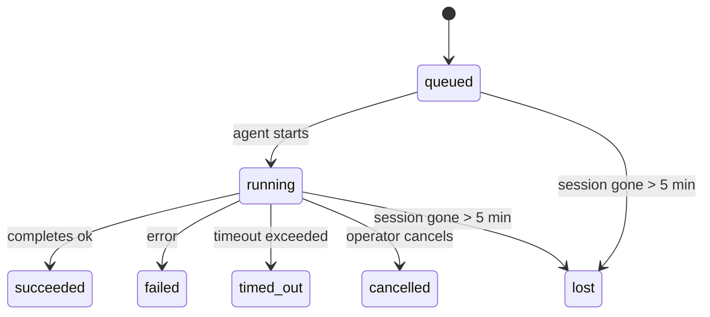

# Tâches d'arrière-plan

> **Cron vs Heartbeat vs Tâches ?** Consultez [Cron vs Heartbeat](/en/automation/cron-vs-heartbeat) pour choisir le bon mécanisme de planification. Cette page couvre le **suivi** du travail d'arrière-plan, et non sa planification.

Les tâches d'arrière-plan assurent le suivi du travail qui s'exécute **en dehors de votre session de conversation principale** :
exécutions ACP, lancements de sous-agents, exécutions de tâches cron isolées et opérations initiées par la CLI.

Les tâches ne remplacent **pas** les sessions, les tâches cron ou les heartbeats — elles constituent le **registre d'activité** qui enregistre le travail détaché effectué, quand il l'a été, et s'il a réussi.

<Note>Toutes les exécutions d'agent ne créent pas une tâche. Ce n'est pas le cas des tours d'heartbeat ni du chat interactif normal. Toutes les exécutions cron, les lancements ACP, les lancements de sous-agents et les commandes d'agent CLI en créent une.</Note>

## TL;DR

- Les tâches sont des **enregistrements**, pas des planificateurs — cron et heartbeat décident _quand_ le travail s'exécute, les tâches suivent _ce qui s'est passé_.
- ACP, sous-agents, toutes les tâches cron et opérations CLI créent des tâches. Les tours d'heartbeat n'en créent pas.
- Chaque tâche passe par `queued → running → terminal` (succeeded, failed, timed_out, cancelled ou lost).
- Les notifications de complétion sont envoyées directement à un channel ou mises en file d'attente pour le prochain heartbeat.
- `openclaw tasks list` affiche toutes les tâches ; `openclaw tasks audit` signale les problèmes.
- Les enregistrements terminaux sont conservés pendant 7 jours, puis automatiquement supprimés.

## Quick start

```bash
# List all tasks (newest first)
openclaw tasks list

# Filter by runtime or status
openclaw tasks list --runtime acp
openclaw tasks list --status running

# Show details for a specific task (by ID, run ID, or session key)
openclaw tasks show <lookup>

# Cancel a running task (kills the child session)
openclaw tasks cancel <lookup>

# Change notification policy for a task
openclaw tasks notify <lookup> state_changes

# Run a health audit
openclaw tasks audit
```

## Ce qui crée une tâche

| Source                        | Type d'exécution | Quand un enregistrement de tâche est créé                    | Politique de notification par défaut |
| ----------------------------- | ---------------- | ------------------------------------------------------------ | ------------------------------------ |
| Exécutions d'arrière-plan ACP | `acp`            | Lancement d'une session ACP enfant                           | `done_only`                          |
| Orchestration de sous-agents  | `subagent`       | Lancement d'un sous-agent via `sessions_spawn`               | `done_only`                          |
| Tâches cron (tous types)      | `cron`           | Chaque exécution cron (session principale et isolée)         | `silent`                             |
| Opérations CLI                | `cli`            | Commandes `openclaw agent` qui s'exécutent via la passerelle | `done_only`                          |

Les tâches cron de session principale utilisent la stratégie de notification `silent` par défaut — elles créent des enregistrements pour le suivi mais ne génèrent pas de notifications. Les tâches cron isolées utilisent également par défaut `silent` mais sont plus visibles car elles s'exécutent dans leur propre session.

**Ce qui ne crée pas de tâches :**

- Tours Heartbeat — session principale ; voir [Heartbeat](/en/gateway/heartbeat)
- Tours de conversation interactive normaux
- Réponses `/command` directes

## Cycle de vie de la tâche



| Statut      | Signification                                                                            |
| ----------- | ---------------------------------------------------------------------------------------- |
| `queued`    | Créé, en attente du démarrage de l'agent                                                 |
| `running`   | Le tour de l'agent est en cours d'exécution                                              |
| `succeeded` | Terminé avec succès                                                                      |
| `failed`    | Terminé avec une erreur                                                                  |
| `timed_out` | Dépassement du délai configuré                                                           |
| `cancelled` | Arrêté par l'opérateur via `openclaw tasks cancel`                                       |
| `lost`      | La session enfant de support a disparu (détecté après une période de grâce de 5 minutes) |

Les transitions se produisent automatiquement — lorsque l'exécution de l'agent associée se termine, le statut de la tâche est mis à jour en conséquence.

## Livraison et notifications

Lorsqu'une tâche atteint un état terminal, OpenClaw vous notifie. Il existe deux chemins de livraison :

**Livraison directe** — si la tâche a une cible de channel (le `requesterOrigin`), le message d'achèvement va directement à ce channel (Telegram, Discord, Slack, etc.).

**Livraison en file d'attente de session** — si la livraison directe échoue ou si aucune origine n'est définie, la mise à jour est mise en file d'attente en tant qu'événement système dans la session du demandeur et apparaît lors du prochain heartbeat.

<Tip>L'achèvement de la tâche déclenche un réveil heartbeat immédiat pour que vous puissiez voir le résultat rapidement — vous n'avez pas à attendre le prochain tick heartbeat programmé.</Tip>

### Stratégies de notification

Contrôlez ce que vous entendez concernant chaque tâche :

| Stratégie                | Ce qui est livré                                                                          |
| ------------------------ | ----------------------------------------------------------------------------------------- |
| `done_only` (par défaut) | Uniquement l'état terminal (réussi, échoué, etc.) — **il s'agit de la valeur par défaut** |
| `state_changes`          | Chaque transition d'état et mise à jour de progression                                    |
| `silent`                 | Rien du tout                                                                              |

Modifier la stratégie pendant qu'une tâche est en cours d'exécution :

```bash
openclaw tasks notify <lookup> state_changes
```

## Référence CLI

### `tasks list`

```bash
openclaw tasks list [--runtime <acp|subagent|cron|cli>] [--status <status>] [--json]
```

Colonnes de sortie : Task ID, Kind, Status, Delivery, Run ID, Child Session, Summary.

### `tasks show`

```bash
openclaw tasks show <lookup>
```

Le jeton de recherche accepte un ID de tâche, un ID d'exécution ou une clé de session. Affiche l'enregistrement complet incluant le timing, l'état de livraison, l'erreur et le résumé terminal.

### `tasks cancel`

```bash
openclaw tasks cancel <lookup>
```

Pour les tâches ACP et de sous-agent, cela tue la session enfant. Le statut passe à `cancelled` et une notification de livraison est envoyée.

### `tasks notify`

```bash
openclaw tasks notify <lookup> <done_only|state_changes|silent>
```

### `tasks audit`

```bash
openclaw tasks audit [--json]
```

Met en évidence les problèmes opérationnels. Les résultats apparaissent également dans `openclaw status` lorsque des problèmes sont détectés.

| Finding                   | Severity | Trigger                                                                   |
| ------------------------- | -------- | ------------------------------------------------------------------------- |
| `stale_queued`            | warn     | En file d'attente depuis plus de 10 minutes                               |
| `stale_running`           | error    | En cours d'exécution depuis plus de 30 minutes                            |
| `lost`                    | error    | La session de support a disparu                                           |
| `delivery_failed`         | warn     | La livraison a échoué et la politique de notification n'est pas `silent`  |
| `missing_cleanup`         | warn     | Tâche terminale sans horodatage de nettoyage                              |
| `inconsistent_timestamps` | warn     | Violation de la chronologie (par exemple, terminé avant d'avoir commencé) |

## Tableau des tâches de chat (`/tasks`)

Utilisez `/tasks` dans n'importe quelle session de chat pour voir les tâches d'arrière-plan liées à cette session. Le tableau affiche les tâches actives et récemment terminées avec leur durée d'exécution, leur statut, leur timing, ainsi que les détails de progression ou d'erreur.

Lorsque la session actuelle n'a aucune tâche liée visible, `/tasks` revient aux comptes de tâches locales de l'agent afin que vous ayez toujours une vue d'ensemble sans divulguer les détails d'autres sessions.

Pour le grand livre complet de l'opérateur, utilisez le CLI : `openclaw tasks list`.

## Intégration de statut (pression des tâches)

`openclaw status` inclut un résumé des tâches d'un coup d'œil :

```
Tasks: 3 queued · 2 running · 1 issues
```

Le résumé indique :

- **active** — nombre de `queued` + `running`
- **échecs** — nombre de `failed` + `timed_out` + `lost`
- **byRuntime** — répartition par `acp`, `subagent`, `cron`, `cli`

Both `/status` and the `session_status` tool use a cleanup-aware task snapshot: active tasks are
preferred, stale completed rows are hidden, and recent failures only surface when no active work
remains. This keeps the status card focused on what matters right now.

## Stockage et maintenance

### Où résident les tâches

Les enregistrements de tâches sont conservés dans SQLite à l'emplacement suivant :

```
$OPENCLAW_STATE_DIR/tasks/runs.sqlite
```

Le registre est chargé en mémoire au démarrage de la passerelle et synchronise les écritures dans SQLite pour assurer la persistance entre les redémarrages.

### Maintenance automatique

Un nettoyeur s'exécute toutes les **60 secondes** et gère trois éléments :

1. **Réconciliation** — vérifie si les sessions sous-jacentes des tâches actives existent toujours. Si une session fille est absente depuis plus de 5 minutes, la tâche est marquée `lost`.
2. **Estampillage de nettoyage** — définit un horodatage `cleanupAfter` sur les tâches terminales (endedAt + 7 jours).
3. **Élagage** — supprime les enregistrements dépassant leur date `cleanupAfter`.

**Rétention** : les enregistrements de tâches terminales sont conservés pendant **7 jours**, puis automatiquement élagués. Aucune configuration n'est nécessaire.

## Comment les tâches se rapportent aux autres systèmes

### Tâches et anciennes références de flux

Certaines anciennes notes de version et documentation d'OpenClaw faisaient référence à la gestion des tâches sous le nom `ClawFlow` et documentaient une surface de commande `openclaw flows`.

Dans la base de code actuelle, la surface de l'opérateur prise en charge est `openclaw tasks`. Consultez [ClawFlow](/en/automation/clawflow) et [CLI : flux](/en/cli/flows) pour les notes de compatibilité qui font correspondre ces anciennes références aux commandes de tâches actuelles.

### Tâches et cron

Une **définition** de tâche cron réside dans `~/.openclaw/cron/jobs.json`. **Chaque** exécution cron crée un enregistrement de tâche, à la fois en session principale et isolée. Les tâches cron en session principale utilisent par défaut la stratégie de notification `silent` afin qu'elles suivent le processus sans générer de notifications.

Voir [Tâches cron](/en/automation/cron-jobs).

### Tâches et heartbeat

Les exécutions Heartbeat sont des tours de session principale — elles ne créent pas d'enregistrements de tâches. Lorsqu'une tâche se termine, elle peut déclencher un réveil heartbeat afin que vous voyiez le résultat rapidement.

Voir [Heartbeat](/en/gateway/heartbeat).

### Tâches et sessions

Une tâche peut faire référence à une `childSessionKey` (où le travail s'exécute) et une `requesterSessionKey` (qui l'a démarrée). Les sessions sont le contexte de conversation ; les tâches assurent le suivi de l'activité par-dessus cela.

### Tâches et exécutions d'agent

Le `runId` d'une tâche renvoie à l'exécution de l'agent effectuant le travail. Les événements du cycle de vie de l'agent (démarrage, fin, erreur) mettent automatiquement à jour le statut de la tâche — vous n'avez pas besoin de gérer le cycle de vie manuellement.

## Connexes

- [Vue d'ensemble de l'automatisation](/en/automation) — tous les mécanismes d'automatisation en un coup d'œil
- [ClawFlow](/en/automation/clawflow) — note de compatibilité pour les anciennes documentations et les notes de version
- [Tâches Cron](/en/automation/cron-jobs) — planification du travail en arrière-plan
- [Cron vs Heartbeat](/en/automation/cron-vs-heartbeat) — choisir le bon mécanisme
- [Heartbeat](/en/gateway/heartbeat) — tours périodiques de la session principale
- [CLI : flows](/en/cli/flows) — note de compatibilité pour le nom de commande erroné
- [CLI : Tasks](/en/cli/index#tasks) — référence de commande CLI
