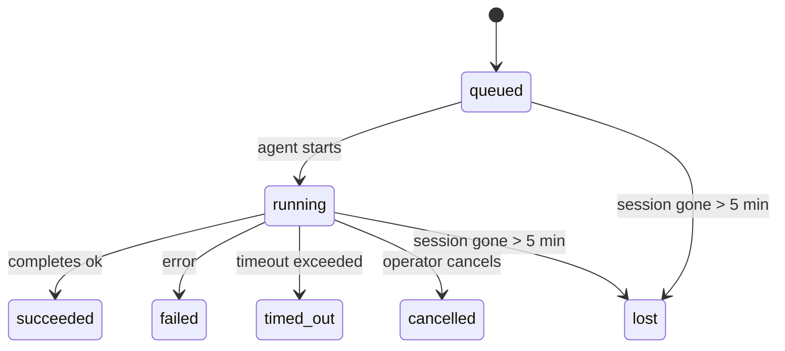

<Note>Vous cherchez une planification ? Consultez [Automation](/fr/automation) pour choisir le bon mécanisme. Cette page est le registre d'activité pour le travail en arrière-plan, et non le planificateur.</Note>

Les tâches d'arrière-plan suivent le travail qui s'exécute **en dehors de votre session de conversation principale** : exécutions ACP, générations de sous-agents, exécutions de tâches cron isolées et opérations initiées par la CLI.

Les tâches ne remplacent **pas** les sessions, les tâches cron ou les heartbeats - elles sont le **registre d'activité** qui enregistre quel travail détenu s'est produit, quand, et s'il a réussi.

<Note>Toutes les exécutions d'agent ne créent pas une tâche. Ce n'est pas le cas des tours d'heartbeat ni du chat interactif normal. Toutes les exécutions cron, les lancements ACP, les lancements de sous-agents et les commandes d'agent CLI en créent une.</Note>

## TL;DR

- Les tâches sont des **enregistrements**, pas des planificateurs - cron et heartbeat décident _quand_ le travail s'exécute, les tâches suivent _ce qui s'est passé_.
- ACP, sous-agents, toutes les tâches cron et opérations CLI créent des tâches. Les tours d'heartbeat n'en créent pas.
- Chaque tâche passe par `queued → running → terminal` (succeeded, failed, timed_out, cancelled, ou lost).
- Les tâches cron restent actives tant que le runtime cron possède toujours le travail ; si l'état du runtime en mémoire a disparu, la maintenance des tâches vérifie d'abord l'historique d'exécution cron durable avant de marquer une tâche comme perdue.
- L'achèvement est piloté par push (push-driven) : le travail détaché peut notifier directement ou réveiller la session/heartbeat du demandeur lorsqu'il se termine, les boucles de interrogation de statut (polling loops) sont donc généralement la mauvaise approche.
- Les exécutions cron isolées et les achèvements de sous-agents nettoient, au mieux effort, les onglets/processus de navigateur suivis pour leur session enfant avant la comptabilité finale de nettoyage.
- La livraison cron isolée supprime les réponses parents intermédiaires obsolètes pendant que le travail des sous-agents descendants est encore en cours de drainage, et elle privilégie la sortie finale du descendant lorsque celle-ci arrive avant la livraison.
- Les notifications d'achèvement sont livrées directement à un channel ou mises en file d'attente pour le prochain heartbeat.
- `openclaw tasks list` affiche toutes les tâches ; `openclaw tasks audit` met en évidence les problèmes.
- Les enregistrements terminaux sont conservés pendant 7 jours, puis supprimés automatiquement.

## Quick start

<Tabs>
  <Tab title="Lister et filtrer">
    ```bash
    # List all tasks (newest first)
    openclaw tasks list

    # Filter by runtime or status
    openclaw tasks list --runtime acp
    openclaw tasks list --status running
    ```

  </Tab>
  <Tab title="Inspect">
    ```bash
    # Show details for a specific task (by ID, run ID, or session key)
    openclaw tasks show <lookup>
    ```
  </Tab>
  <Tab title="Cancel and notify">
    ```bash
    # Cancel a running task (kills the child session)
    openclaw tasks cancel <lookup>

    # Change notification policy for a task
    openclaw tasks notify <lookup> state_changes
    ```

  </Tab>
  <Tab title="Audit and maintenance">
    ```bash
    # Run a health audit
    openclaw tasks audit

    # Preview or apply maintenance
    openclaw tasks maintenance
    openclaw tasks maintenance --apply
    ```

  </Tab>
  <Tab title="Task flow">
    ```bash
    # Inspect TaskFlow state
    openclaw tasks flow list
    openclaw tasks flow show <lookup>
    openclaw tasks flow cancel <lookup>
    ```
  </Tab>
</Tabs>

## Ce qui crée une tâche

| Source                         | Type de runtime | Lorsqu'un enregistrement de tâche est créé                                 | Stratégie de notification par défaut |
| ------------------------------ | --------------- | -------------------------------------------------------------------------- | ------------------------------------ |
| Exécutions en arrière-plan ACP | `acp`           | Génération d'une session ACP enfant                                        | `done_only`                          |
| Orchestration de sous-agents   | `subagent`      | Générer un sous-agent via `sessions_spawn`                                 | `done_only`                          |
| Tâches cron (tous types)       | `cron`          | Chaque exécution cron (session principale et isolée)                       | `silent`                             |
| Opérations CLI                 | `cli`           | Commandes `openclaw agent` qui s'exécutent via la passerelle               | `silent`                             |
| Tâches multimédia d'agent      | `cli`           | Exécutions `image_generate`/`music_generate`/`video_generate` avec session | `silent`                             |

<AccordionGroup>
  <Accordion title="Notify defaults for cron and media">
    Les tâches cron de session principale utilisent la stratégie de notification `silent` par défaut - elles créent des enregistrements pour le suivi mais ne génèrent pas de notifications. Les tâches cron isolées utilisent également par défaut `silent` mais sont plus visibles car elles s'exécutent dans leur propre session.

    Les exécutions `image_generate`, `music_generate` et `video_generate` avec session utilisent également la stratégie de notification `silent`. Elles créent toujours des enregistrements de tâche, mais l'achèvement est renvoyé à la session d'agent d'origine sous forme de réveil interne afin que l'agent puisse écrire le message de suivi et joindre lui-même le média terminé. Les achèvements de groupe/de canal suivent la stratégie normale de réponse visible, donc l'agent utilise l'outil message lorsque la livraison source l'exige. Si l'agent d'achèvement ne parvient pas à produire une preuve de livraison par l'outil message dans une route outil uniquement, OpenClaw envoie l'alternative d'achèvement directement au canal d'origine au lieu de laisser le média privé.

  </Accordion>
  <Accordion title="Concurrent media-generation guardrail">
    Tant qu'une tâche de génération de média avec session est toujours active, l'outil agit également comme une barrière de sécurité : les appels répétés à `image_generate`, `music_generate` ou `video_generate` dans cette même session renvoient l'état de la tâche active au lieu de démarrer une deuxième génération simultanée. Utilisez `action: "status"` lorsque vous souhaitez une recherche explicite de progression/d'état du côté de l'agent.
  </Accordion>
  <Accordion title="What does not create tasks">
    - Heartbeat turns - main-session; voir [Heartbeat](/fr/gateway/heartbeat)
    - Normal interactive chat turns
    - Direct `/command` responses

  </Accordion>
</AccordionGroup>

## Cycle de vie de la tâche



| Statut      | Signification                                                                               |
| ----------- | ------------------------------------------------------------------------------------------- |
| `queued`    | Créé, en attente du démarrage de l'agent                                                    |
| `running`   | Le tour de l'agent est en cours d'exécution                                                 |
| `succeeded` | Terminé avec succès                                                                         |
| `failed`    | Terminé avec une erreur                                                                     |
| `timed_out` | Délai d'attente configuré dépassé                                                           |
| `cancelled` | Arrêté par l'opérateur via `openclaw tasks cancel`                                          |
| `lost`      | Le runtime a perdu l'état de sauvegarde autoritaire après une période de grâce de 5 minutes |

Les transitions se produisent automatiquement - lorsque l'exécution de l'agent associée se termine, l'état de la tâche est mis à jour en conséquence.

La fin de l'exécution de l'agent fait autorité pour les enregistrements de tâches actifs. Une exécution détachée réussie se termine par `succeeded`, les erreurs d'exécution ordinaires se terminent par `failed`, et les résultats d'expiration ou d'abandon se terminent par `timed_out`. Si un opérateur a déjà annulé la tâche, ou si l'exécution a déjà enregistré un état terminal plus fort tel que `failed`, `timed_out`, ou `lost`, un signal de succès ultérieur ne réduit pas cet état terminal.

`lost` est conscient du runtime :

- Tâches ACP : les métadonnées de la session enfant ACP de sauvegarde ont disparu.
- Tâches de sous-agent : la session enfant de sauvegarde a disparu du magasin de l'agent cible.
- Tâches Cron : le runtime cron ne suit plus le travail comme actif et durable
  et l'historique des exécutions cron ne montre pas de résultat terminal pour cette exécution. L'audit CLI hors ligne ne traite pas son propre état d'exécution cron vide en cours comme une autorité.
- Tâches CLI : les tâches avec un id d'exécution/id source utilisent le contexte d'exécution en direct, de sorte que
  les lignes de session enfant ou de chat persistantes ne les gardent pas en vie après la disparition de
  l'exécution possédée par la passerelle. Les tâches CLI héritées sans identité d'exécution retombent
  encore sur la session enfant. Les exécutions CLICLIGateway`openclaw agent` soutenues par la passerelle se terminent également
  à partir de leur résultat d'exécution, donc les exécutions terminées ne restent pas actives jusqu'à ce que le nettoyeur
  les marque `lost`.

## Livraison et notifications

Lorsqu'une tâche atteint un état terminal, OpenClaw vous en avertit. Il existe deux chemins de livraison :

**Livraison directe** - si la tâche a une cible de channel (le `requesterOrigin`TelegramDiscordSlackOpenClaw), le message d'achèvement va directement à ce channel (Telegram, Discord, Slack, etc.). Les achèvements de tâches de groupe et de channel sont plutôt acheminés via la session demandeur afin que l'agent parent puisse écrire la réponse visible. Pour les achèvements de sous-agent, OpenClaw préserve également le routage thread/topic lié lorsque disponible et peut remplir un `to` / compte manquant à partir de la route stockée de la session demandeur (`lastChannel` / `lastTo` / `lastAccountId`) avant d'abandonner la livraison directe.

**Livraison en file d'attente de session** - si la livraison directe échoue ou si aucune origine n'est définie, la mise à jour est mise en file d'attente en tant qu'événement système dans la session du demandeur et apparaît au prochain battement de cœur (heartbeat).

<Tip>L'achèvement de la tâche déclenche un réveil immédiat du battement de cœur (heartbeat) afin que vous voyiez le résultat rapidement - vous n'avez pas à attendre le prochain battement planifié.</Tip>

Cela signifie que le workflow habituel est basé sur le push (push-based) : démarrez le travail détaché une fois, puis laissez le runtime vous réveiller ou vous notifier à l'achèvement. Interrogez (poll) l'état de la tâche uniquement lorsque vous avez besoin d'un débogage, d'une intervention ou d'un audit explicite.

### Stratégies de notification

Contrôlez la quantité d'informations que vous recevez pour chaque tâche :

| Stratégie                | Ce qui est livré                                                                      |
| ------------------------ | ------------------------------------------------------------------------------------- |
| `done_only` (par défaut) | Uniquement l'état terminal (réussi, échoué, etc.) - **ceci est la valeur par défaut** |
| `state_changes`          | Chaque transition d'état et mise à jour de progression                                |
| `silent`                 | Rien du tout                                                                          |

Modifier la stratégie pendant qu'une tâche est en cours d'exécution :

```bash
openclaw tasks notify <lookup> state_changes
```

## Référence CLI

<AccordionGroup>
  <Accordion title="tasks list">
    ```bash
    openclaw tasks list [--runtime <acp|subagent|cron|cli>] [--status <status>] [--json]
    ```

    Colonnes de sortie : Task ID, Kind, Status, Delivery, Run ID, Child Session, Summary.

  </Accordion>
  <Accordion title="tasks show">
    ```bash
    openclaw tasks show <lookup>
    ```

    Le jeton de recherche accepte un ID de tâche, un ID d'exécution ou une clé de session. Affiche l'enregistrement complet, y compris le timing, l'état de livraison, l'erreur et le résumé terminal.

  </Accordion>
  <Accordion title="tasks cancel">
    ```bash
    openclaw tasks cancel <lookup>
    ```CLI

    Pour les tâches ACP et de sous-agent, cela tue la session enfant. Pour les tâches suivies par le CLI, l'annulation est enregistrée dans le registre des tâches (il n'y a pas de handle d'exécution enfant séparé). Le statut passe à `cancelled` et une notification de livraison est envoyée le cas échéant.

  </Accordion>
  <Accordion title="tasks notify">
    ```bash
    openclaw tasks notify <lookup> <done_only|state_changes|silent>
    ```
  </Accordion>
  <Accordion title="tasks audit">
    ```bash
    openclaw tasks audit [--json]
    ```

    Signale les problèmes opérationnels. Les résultats apparaissent également dans `openclaw status` lorsque des problèmes sont détectés.

    | Finding                   | Severity   | Trigger                                                                                                      |
    | ------------------------- | ---------- | ------------------------------------------------------------------------------------------------------------ |
    | `stale_queued`            | warn       | En file d'attente depuis plus de 10 minutes                                                                              |
    | `stale_running`           | error      | En cours d'exécution depuis plus de 30 minutes                                                                             |
    | `lost`                    | warn/error | La propriété de la tâche soutenue par le runtime a disparu ; les tâches perdues retenues génèrent un avertissement jusqu'à `cleanupAfter`, puis deviennent des erreurs |
    | `delivery_failed`         | warn       | Échec de la livraison et la stratégie de notification n'est pas `silent`                                                            |
    | `missing_cleanup`         | warn       | Tâche terminée sans horodatage de nettoyage                                                                      |
    | `inconsistent_timestamps` | warn       | Violation de la chronologie (par exemple terminé avant d'avoir commencé)                                                        |

  </Accordion>
  <Accordion title="tâches de maintenance">
    ```bash
    openclaw tasks maintenance [--json]
    openclaw tasks maintenance --apply [--json]
    ```

    Utilisez ceci pour prévisualiser ou appliquer la réconciliation, l'horodatage du nettoyage et l'élagage pour les tâches, l'état du flux de tâches (Task Flow) et les lignes obsolètes du registre de sessions d'exécution cron.

    La réconciliation est consciente du runtime :

    - Les tâches ACP/sous-agent vérifient leur session enfant sous-jacente.
    - Les tâches de sous-agent dont la session enfant possède une pierre tombale de redémarrage-récupération sont marquées comme perdues au lieu d'être traitées comme des sessions sous-jacentes récupérables.
    - Les tâches cron vérifient si le runtime cron possède toujours la tâche, puis récupèrent le statut terminal à partir des journaux d'exécution cron persistés/état de la tâche avant de revenir à `lost`. Seul le processus Gateway fait autorité pour l'ensemble des tâches cron actives en mémoire ; l'audit CLI hors ligne utilise l'historique durable mais ne marque pas une tâche cron comme perdue uniquement parce que cet ensemble local est vide.
    - Les tâches CLI avec une identité d'exécution vérifient le contexte d'exécution en direct propriétaire, et pas seulement les lignes de session enfant ou de session de chat.

    Le nettoyage après achèvement est également conscient du runtime :

    - L'achèvement de sous-agent tente de fermer au mieux les onglets/processus de navigateur suivis pour la session enfant avant que le nettoyage d'annonce ne continue.
    - L'achèvement cron isolé tente de fermer au mieux les onglets/processus de navigateur suivis pour la session cron avant que l'exécution ne se démonte complètement.
    - La livraison cron isolée attend le suivi du sous-agent descendant lorsque cela est nécessaire et supprime le texte d'accusé de réception parent obsolète au lieu de l'annoncer.
    - La livraison d'achèvement de sous-agent préfère le dernier texte d'assistant visible ; si celui-ci est vide, elle revient au dernier texte outil/toolResult nettoyé, et les exécutions d'appel d'outil avec uniquement délai d'attente peuvent s'effondrer en un résumé de progrès partiel court. Les exécutions échouées en terminal annoncent le statut d'échec sans rejouer le texte de réponse capturé.
    - Les échecs de nettoyage ne masquent pas le résultat réel de la tâche.

    Lors de l'application de la maintenance, OpenClaw supprime également les lignes obsolètes du registre de sessions `cron:<jobId>:run:<uuid>` de plus de 7 jours, tout en préservant les lignes pour les tâches cron en cours d'exécution et en laissant les lignes de sessions non cron intactes.

  </Accordion>
  <Accordion title="tasks flow list | show | cancel">
    ```bash
    openclaw tasks flow list [--status <status>] [--json]
    openclaw tasks flow show <lookup> [--json]
    openclaw tasks flow cancel <lookup>
    ```

    Utilisez-les lorsque le flux de tâches d'orchestration est ce qui vous importe, plutôt qu'un enregistrement de tâche en arrière-plan individuel.

  </Accordion>
</AccordionGroup>

## Tableau des tâches de chat (`/tasks`)

Utilisez `/tasks` dans n'importe quelle session de discussion pour voir les tâches d'arrière-plan liées à cette session. Le tableau affiche les tâches actives et récemment terminées avec leur durée d'exécution, leur statut, leur chronologie, ainsi que des détails sur la progression ou les erreurs.

Lorsque la session actuelle n'a aucune tâche liée visible, `/tasks` revient aux comptes de tâches locaux de l'agent afin que vous ayez toujours une vue d'ensemble sans divulguer les détails d'autres sessions.

Pour le registre complet de l'opérateur, utilisez la CLI : `openclaw tasks list`.

## Intégration du statut (pression de tâche)

`openclaw status` comprend un résumé des tâches d'un coup d'œil :

```
Tasks: 3 queued · 2 running · 1 issues
```

Le résumé indique :

- **actives** - nombre de `queued` + `running`
- **échecs** - nombre de `failed` + `timed_out` + `lost`
- **parDurée** - répartition par `acp`, `subagent`, `cron`, `cli`

À la fois `/status` et l'outil `session_status` utilisent un instantané de tâches conscient du nettoyage : les tâches actives sont privilégiées, les lignes terminées obsolètes sont masquées, et les échecs récents n'apparaissent que lorsqu'aucun travail actif ne reste. Cela permet de garder la fiche de statut concentrée sur ce qui est important actuellement.

## Stockage et maintenance

### Où vivent les tâches

Les enregistrements de tâches persistent dans SQLite à :

```
$OPENCLAW_STATE_DIR/tasks/runs.sqlite
```

Le registre est chargé en mémoire au démarrage de la passerelle et synchronise les écritures avec SQLite pour la durabilité entre les redémarrages.
Le Gateway maintient le journal d'écriture anticipé (write-ahead log) de SQLite dans des limites en utilisant le seuil de point de contrôle automatique par défaut de SQLite ainsi que des points de contrôle `TRUNCATE` périodiques et à l'arrêt.

### Maintenance automatique

Un balayeur (sweeper) s'exécute toutes les **60 secondes** et gère quatre éléments :

<Steps>
  <Step title="Réconciliation">
    Vérifie si les tâches actives disposent toujours d'une prise en charge d'exécution (runtime) faisant autorité. Les tâches ACP/sous-agent utilisent l'état de la session enfant, les tâches cron utilisent la propriété du travail actif (active-job) et les tâches CLI avec une identité d'exécution utilisent le contexte de l'exécution propriétaire. Si cet état de prise en charge a disparu depuis plus
    de 5 minutes, la tâche est marquée `lost`.
  </Step>
  <Step title="Réparation de session ACP">Ferme les sessions ACP ponctuelles de terminal ou orphelines appartenant au parent, et ferme les sessions ACP persistantes de terminal ou orphelines uniquement lorsqu'il ne reste aucune liaison de conversation active.</Step>
  <Step title="Cleanup stamping">Définit un horodatage `cleanupAfter` sur les tâches terminales (endedAt + 7 jours). Pendant la rétention, les tâches perdues apparaissent toujours dans l'audit sous forme d'avertissements ; après l'expiration de `cleanupAfter` ou lorsque les métadonnées de nettoyage sont manquantes, ce sont des erreurs.</Step>
  <Step title="Pruning">Supprime les enregistrements antérieurs à leur date `cleanupAfter`.</Step>
</Steps>

<Note>**Rétention :** les enregistrements de tâches terminales sont conservés pendant **7 jours**, puis élagués automatiquement. Aucune configuration n'est nécessaire.</Note>

## Relation des tâches avec les autres systèmes

<AccordionGroup>
  <Accordion title="Tasks and Task Flow">
    [Task Flow](/fr/automation/taskflow) est la couche d'orchestration de flux au-dessus des tâches d'arrière-plan. Un seul flux peut coordonner plusieurs tâches au cours de sa vie en utilisant des modes de synchronisation gérés ou miroirs. Utilisez `openclaw tasks` pour inspecter les enregistrements de tâches individuels et `openclaw tasks flow` pour inspecter le flux d'orchestration.

    Voir [Task Flow](/fr/automation/taskflow) pour plus de détails.

  </Accordion>
  <Accordion title="Tasks and cron">
    Une **définition** de tâche cron réside dans `~/.openclaw/cron/jobs.json` ; l'état d'exécution au moment de l'exécution réside à côté dans `~/.openclaw/cron/jobs-state.json`. **Chaque** exécution cron crée un enregistrement de tâche - à la fois de session principale et isolée. Les tâches cron de session principale sont par défaut définies sur la stratégie de notification `silent` afin qu'elles effectuent un suivi sans générer de notifications.

    Voir [Cron Jobs](/fr/automation/cron-jobs).

  </Accordion>
  <Accordion title="Tasks and heartbeat">
    Les exécutions Heartbeat sont des tours de session principale - elles ne créent pas d'enregistrements de tâches. Lorsqu'une tâche se termine, elle peut déclencher un réveil heartbeat afin que vous puissiez voir le résultat rapidement.

    Voir [Heartbeat](/fr/gateway/heartbeat).

  </Accordion>
  <Accordion title="Tasks and sessions">
    Une tâche peut référencer une `childSessionKey` (où le travail s'exécute) et une `requesterSessionKey` (qui l'a lancée). Les sessions sont le contexte de conversation ; les tâches sont le suivi de l'activité par-dessus cela.
  </Accordion>
  <Accordion title="Tâches et exécutions d'agent">
    Le `runId` d'une tâche lie celle-ci à l'exécution de l'agent effectuant le travail. Les événements du cycle de vie de l'agent (démarrage, fin, erreur) mettent à jour automatiquement le statut de la tâche - vous n'avez pas besoin de gérer le cycle de vie manuellement.
  </Accordion>
</AccordionGroup>

## Connexes

- [Automatisation](/fr/automation) - tous les mécanismes d'automatisation en un coup d'œil
- [CLI : Tâches](CLI/en/cli/tasksCLI) - référence des commandes CLI
- [Heartbeat](/fr/gateway/heartbeat) - tours de session principale périodiques
- [Tâches planifiées](/fr/automation/cron-jobs) - planification du travail en arrière-plan
- [Flux de tâches](/fr/automation/taskflow) - orchestration des flux au-dessus des tâches
