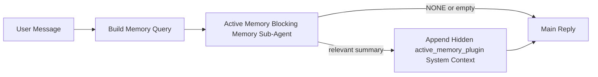

# Active Memory

La mémoire active est un sous-agent de mémoire bloquant facultatif détenu par le plugin qui s'exécute avant la réponse principale pour les sessions de conversation éligibles.

Elle existe parce que la plupart des systèmes de mémoire sont capables mais réactifs. Ils s'appuient sur l'agent principal pour décider quand rechercher dans la mémoire, ou sur l'utilisateur pour dire des choses comme "souviens-toi de ceci" ou "recherche dans la mémoire." À ce moment-là, l'instant où la mémoire aurait rendu la réponse naturelle est déjà passé.

La mémoire active donne au système une chance limitée de faire remonter des mémoires pertinentes avant que la réponse principale ne soit générée.

## Collez ceci dans votre agent

Collez ceci dans votre agent si vous souhaitez activer la mémoire active avec une configuration autonome et sécurisée par défaut :

```json5
{
  plugins: {
    entries: {
      "active-memory": {
        enabled: true,
        config: {
          enabled: true,
          agents: ["main"],
          allowedChatTypes: ["direct"],
          modelFallbackPolicy: "default-remote",
          queryMode: "recent",
          promptStyle: "balanced",
          timeoutMs: 15000,
          maxSummaryChars: 220,
          persistTranscripts: false,
          logging: true,
        },
      },
    },
  },
}
```

Cela active le plugin pour l'agent `main`, le limite par défaut aux sessions de style message direct, lui permet d'hériter d'abord du model de session actuel, et autorise toujours le repli distant intégré si aucun model explicite ou hérité n'est disponible.

Après cela, redémarrez la passerelle :

```bash
node scripts/run-node.mjs gateway --profile dev
```

Pour l'inspecter en direct dans une conversation :

```text
/verbose on
```

## Activer la mémoire active

La configuration la plus sûre est :

1. activer le plugin
2. cibler un agent conversationnel
3. garder la journalisation activée uniquement pendant le réglage

Commencez par ceci dans `openclaw.json` :

```json5
{
  plugins: {
    entries: {
      "active-memory": {
        enabled: true,
        config: {
          agents: ["main"],
          allowedChatTypes: ["direct"],
          modelFallbackPolicy: "default-remote",
          queryMode: "recent",
          promptStyle: "balanced",
          timeoutMs: 15000,
          maxSummaryChars: 220,
          persistTranscripts: false,
          logging: true,
        },
      },
    },
  },
}
```

Ensuite, redémarrez la passerelle :

```bash
node scripts/run-node.mjs gateway --profile dev
```

Ce que cela signifie :

- `plugins.entries.active-memory.enabled: true` active le plugin
- `config.agents: ["main"]` active la mémoire active uniquement pour l'agent `main`
- `config.allowedChatTypes: ["direct"]` garde la mémoire active par défaut uniquement pour les sessions de style message direct
- si `config.model` n'est pas défini, la mémoire active hérite d'abord du model de session actuel
- `config.modelFallbackPolicy: "default-remote"` conserve le repli distant intégré par défaut lorsqu'aucun model explicite ou hérité n'est disponible
- `config.promptStyle: "balanced"` utilise le style de prompt polyvalent par défaut pour le mode `recent`
- la mémoire active ne s'exécute toujours que sur les sessions de chat interactives persistantes éligibles

## Comment le voir

Active memory injecte un contexte système masqué pour le modèle. Il n'expose pas
les balises brutes `<active_memory_plugin>...</active_memory_plugin>` au client.

## Session toggle

Utilisez la commande du plugin lorsque vous souhaitez suspendre ou reprendre la mémoire active pour
la session de chat actuelle sans modifier la configuration :

```text
/active-memory status
/active-memory off
/active-memory on
```

Ceci est limité à la session. Cela ne modifie pas
`plugins.entries.active-memory.enabled`, le ciblage de l'agent ou d'autres
configurations globales.

Si vous souhaitez que la commande écrive la configuration et suspende ou reprenne la mémoire active pour
toutes les sessions, utilisez la forme globale explicite :

```text
/active-memory status --global
/active-memory off --global
/active-memory on --global
```

La forme globale écrit `plugins.entries.active-memory.config.enabled`. Elle laisse
`plugins.entries.active-memory.enabled` activé pour que la commande reste disponible
pour réactiver la mémoire active ultérieurement.

Si vous souhaitez voir ce que fait la mémoire active dans une session en direct, activez le mode
verbeux pour cette session :

```text
/verbose on
```

Avec le mode verbeux activé, OpenClaw peut afficher :

- une ligne de statut de mémoire active telle que `Active Memory: ok 842ms recent 34 chars`
- un résumé de débogage lisible tel que `Active Memory Debug: Lemon pepper wings with blue cheese.`

Ces lignes sont dérivées de la même passe de mémoire active qui alimente le contexte
système masqué, mais elles sont formatées pour les humains au lieu d'exposer le balisage brut
du prompt.

Par défaut, la transcription du sous-agent de mémoire bloquante est temporaire et supprimée
une fois l'exécution terminée.

Exemple de flux :

```text
/verbose on
what wings should i order?
```

Forme attendue de la réponse visible :

```text
...normal assistant reply...

🧩 Active Memory: ok 842ms recent 34 chars
🔎 Active Memory Debug: Lemon pepper wings with blue cheese.
```

## When it runs

La mémoire active utilise deux portes :

1. **Config opt-in**
   Le plugin doit être activé et l'identifiant de l'agent actuel doit apparaître dans
   `plugins.entries.active-memory.config.agents`.
2. **Strict runtime eligibility**
   Même lorsqu'elle est activée et ciblée, la mémoire active ne s'exécute que pour les sessions de chat
   interactives persistantes éligibles.

La règle réelle est :

```text
plugin enabled
+
agent id targeted
+
allowed chat type
+
eligible interactive persistent chat session
=
active memory runs
```

Si l'une de ces conditions échoue, la mémoire active ne s'exécute pas.

## Session types

`config.allowedChatTypes` contrôle quels types de conversations peuvent exécuter Active
Memory.

La valeur par défaut est :

```json5
allowedChatTypes: ["direct"]
```

Cela signifie que Active Memory s'exécute par défaut dans les sessions de style message direct, mais
pas dans les sessions de groupe ou de channel, sauf si vous les activez explicitement.

Exemples :

```json5
allowedChatTypes: ["direct"]
```

```json5
allowedChatTypes: ["direct", "group"]
```

```json5
allowedChatTypes: ["direct", "group", "channel"]
```

## Where it runs

Active memory est une fonctionnalité d'enrichissement conversationnel, et non une fonctionnalité d'infération
à l'échelle de la plateforme.

| Surface                                                             | Exécute active memory ?                           |
| ------------------------------------------------------------------- | ------------------------------------------------- |
| Control UI / web chat persistent sessions                           | Oui, si le plugin est activé et l'agent est ciblé |
| Other interactive channel sessions on the same persistent chat path | Oui, si le plugin est activé et l'agent est ciblé |
| Exécutions headless ponctuelles                                     | Non                                               |
| Exécutions de heartbeat/en arrière-plan                             | Non                                               |
| Chemins internes génériques `agent-command`                         | Non                                               |
| Exécution de sous-agent/assistant interne                           | Non                                               |

## Pourquoi l'utiliser

Utilisez la mémoire active lorsque :

- la session est persistante et orientée utilisateur
- l'agent possède une mémoire à long terme significative à rechercher
- la continuité et la personnalisation priment sur le déterminisme brut du prompt

Elle fonctionne particulièrement bien pour :

- les préférences stables
- les habitudes récurrentes
- le contexte utilisateur à long terme qui doit apparaître naturellement

Elle est mal adaptée pour :

- l'automatisation
- les workers internes
- les tâches API ponctuelles
- les endroits où une personnalisation cachée serait surprenante

## Comment cela fonctionne

La forme d'exécution est :



Le sous-agent de mémoire bloquant ne peut utiliser que :

- `memory_search`
- `memory_get`

Si la connexion est faible, il doit renvoyer `NONE`.

## Modes de requête

`config.queryMode` contrôle la quantité de conversation que le sous-agent de mémoire bloquant voit.

## Styles de prompt

`config.promptStyle` contrôle la volonté ou la rigueur du sous-agent de mémoire bloquant
lorsqu'il décide s'il faut renvoyer la mémoire.

Styles disponibles :

- `balanced` : valeur par défaut polyvalente pour le mode `recent`
- `strict` : le moins volontaire ; idéal lorsque vous voulez très peu de fuite depuis le contexte voisin
- `contextual` : le plus favorable à la continuité ; idéal lorsque l'historique de la conversation doit primer
- `recall-heavy` : plus enclin à afficher la mémoire sur des correspondances plus douces mais toujours plausibles
- `precision-heavy` : préfère agressivement `NONE` sauf si la correspondance est évidente
- `preference-only` : optimisé pour les favoris, les habitudes, les routines, le goût et les faits personnels récurrents

Mappage par défaut lorsque `config.promptStyle` n'est pas défini :

```text
message -> strict
recent -> balanced
full -> contextual
```

Si vous définissez `config.promptStyle` explicitement, cette substitution prévaut.

Exemple :

```json5
promptStyle: "preference-only"
```

## Politique de repli de modèle

Si `config.model` n'est pas défini, Active Memory essaie de résoudre un modèle dans cet ordre :

```text
explicit plugin model
-> current session model
-> agent primary model
-> optional built-in remote fallback
```

`config.modelFallbackPolicy` contrôle la dernière étape.

Par défaut :

```json5
modelFallbackPolicy: "default-remote"
```

Autre option :

```json5
modelFallbackPolicy: "resolved-only"
```

Utilisez `resolved-only` si vous voulez que la Mémoire Active ignore le rappel au lieu de revenir au défaut distant intégré lorsqu'aucun modèle explicite ou hérité n'est disponible.

## Échappatoires avancées

Ces options ne font intentionnellement pas partie de la configuration recommandée.

`config.thinking` peut remplacer le niveau de réflexion du sous-agent de mémoire bloquante :

```json5
thinking: "medium"
```

Par défaut :

```json5
thinking: "off"
```

N'activez pas ceci par défaut. La Mémoire Active s'exécute dans le chemin de réponse, donc le temps de réflexion supplémentaire augmente directement la latence visible par l'utilisateur.

`config.promptAppend` ajoute des instructions d'opérateur supplémentaires après l'invite par défaut de la Mémoire Active et avant le contexte de conversation :

```json5
promptAppend: "Prefer stable long-term preferences over one-off events."
```

`config.promptOverride` remplace l'invite par défaut de la Mémoire Active. OpenClaw ajoute toujours le contexte de conversation par la suite :

```json5
promptOverride: "You are a memory search agent. Return NONE or one compact user fact."
```

La personnalisation de l'invite n'est pas recommandée sauf si vous testez délibérément un contrat de rappel différent. L'invite par défaut est réglée pour renvoyer soit `NONE`, soit un contexte de faits utilisateur compact pour le modèle principal.

### `message`

Seul le dernier message utilisateur est envoyé.

```text
Latest user message only
```

Utilisez ceci lorsque :

- vous voulez le comportement le plus rapide
- vous voulez le biais le plus fort vers un rappel de préférences stable
- les tours de suite n'ont pas besoin de contexte conversationnel

Délai d'expiration recommandé :

- commencez autour de `3000` à `5000` ms

### `recent`

Le dernier message utilisateur plus une petite file conversationnelle récente est envoyé.

```text
Recent conversation tail:
user: ...
assistant: ...
user: ...

Latest user message:
...
```

Utilisez ceci lorsque :

- vous voulez un meilleur équilibre entre vitesse et ancrage conversationnel
- les questions de suite dépendent souvent des derniers tours

Délai d'expiration recommandé :

- commencez autour de `15000` ms

### `full`

La conversation complète est envoyée au sous-agent de mémoire bloquante.

```text
Full conversation context:
user: ...
assistant: ...
user: ...
...
```

Utilisez ceci lorsque :

- la qualité de rappel la plus forte compte plus que la latence
- la conversation contient une configuration importante loin en arrière dans le fil

Délai d'expiration recommandé :

- augmentez-le considérablement par rapport à `message` ou `recent`
- commencez autour de `15000` ms ou plus selon la taille du fil

En général, le délai d'expiration devrait augmenter avec la taille du contexte :

```text
message < recent < full
```

## Persistance de la transcription

Les exécutions du sous-agent de mémoire bloquant Active Memory créent une vraie `session.jsonl`
transcription lors de l'appel du sous-agent de mémoire bloquant.

Par défaut, cette transcription est temporaire :

- elle est écrite dans un répertoire temporaire
- elle est utilisée uniquement pour l'exécution du sous-agent de mémoire bloquant
- elle est supprimée immédiatement après la fin de l'exécution

Si vous souhaitez conserver ces transcriptions de sous-agent de mémoire bloquant sur disque pour le débogage ou
l'inspection, activez explicitement la persistance :

```json5
{
  plugins: {
    entries: {
      "active-memory": {
        enabled: true,
        config: {
          agents: ["main"],
          persistTranscripts: true,
          transcriptDir: "active-memory",
        },
      },
    },
  },
}
```

Lorsqu'elle est activée, la mémoire active stocke les transcriptions dans un répertoire séparé sous le
dossier sessions de l'agent cible, et non dans le chemin principal de la transcription de la conversation utilisateur.

La disposition par défaut est conceptuellement :

```text
agents/<agent>/sessions/active-memory/<blocking-memory-sub-agent-session-id>.jsonl
```

Vous pouvez modifier le sous-répertoire relatif avec `config.transcriptDir`.

Utilisez ceci avec prudence :

- les transcriptions du sous-agent de mémoire bloquant peuvent s'accumuler rapidement sur les sessions actives
- le mode de requête `full` peut dupliquer une grande partie du contexte de conversation
- ces transcriptions contiennent un contexte de prompt masqué et des souvenirs rappelés

## Configuration

Toute la configuration de la mémoire active se trouve sous :

```text
plugins.entries.active-memory
```

Les champs les plus importants sont :

| Clé                         | Type                                                                                                 | Signification                                                                                                                                      |
| --------------------------- | ---------------------------------------------------------------------------------------------------- | -------------------------------------------------------------------------------------------------------------------------------------------------- |
| `enabled`                   | `boolean`                                                                                            | Active le plugin lui-même                                                                                                                          |
| `config.agents`             | `string[]`                                                                                           | Identifiants des agents qui peuvent utiliser la mémoire active                                                                                     |
| `config.model`              | `string`                                                                                             | Référence de modèle optionnelle pour le sous-agent de mémoire bloquant ; si non défini, la mémoire active utilise le modèle de la session actuelle |
| `config.queryMode`          | `"message" \| "recent" \| "full"`                                                                    | Contrôle la quantité de conversation que le sous-agent de mémoire bloquant voit                                                                    |
| `config.promptStyle`        | `"balanced" \| "strict" \| "contextual" \| "recall-heavy" \| "precision-heavy" \| "preference-only"` | Contrôle le degré d'empressement ou de rigueur du sous-agent de mémoire bloquant lorsqu'il décide de renvoyer des souvenirs                        |
| `config.thinking`           | `"off" \| "minimal" \| "low" \| "medium" \| "high" \| "xhigh" \| "adaptive"`                         | Remplacement avancé de la réflexion pour le sous-agent de mémoire bloquant ; `off` par défaut pour la vitesse                                      |
| `config.promptOverride`     | `string`                                                                                             | Remplacement avancé du prompt complet ; non recommandé pour une utilisation normale                                                                |
| `config.promptAppend`       | `string`                                                                                             | Instructions supplémentaires avancées ajoutées au prompt par défaut ou remplacé                                                                    |
| `config.timeoutMs`          | `number`                                                                                             | Délai d'attente strict pour le sous-agent de mémoire bloquant                                                                                      |
| `config.maxSummaryChars`    | `number`                                                                                             | Nombre maximal de caractères autorisés dans le résumé de la mémoire active                                                                         |
| `config.logging`            | `boolean`                                                                                            | Émet les journaux de mémoire active pendant le réglage                                                                                             |
| `config.persistTranscripts` | `boolean`                                                                                            | Conserve les transcriptions du sous-agent de mémoire bloquant sur le disque au lieu de supprimer les fichiers temporaires                          |
| `config.transcriptDir`      | `string`                                                                                             | Répertoire relatif des transcriptions du sous-agent de mémoire bloquant sous le dossier des sessions de l'agent                                    |

Champs de réglage utiles :

| Clé                           | Type     | Signification                                                              |
| ----------------------------- | -------- | -------------------------------------------------------------------------- |
| `config.maxSummaryChars`      | `number` | Nombre maximal de caractères autorisés dans le résumé de la mémoire active |
| `config.recentUserTurns`      | `number` | Tours d'utilisateur précédents à inclure lorsque `queryMode` est `recent`  |
| `config.recentAssistantTurns` | `number` | Tours d'assistant précédents à inclure lorsque `queryMode` est `recent`    |
| `config.recentUserChars`      | `number` | Max. de caractères par tour d'utilisateur récent                           |
| `config.recentAssistantChars` | `number` | Max. de caractères par tour d'assistant récent                             |
| `config.cacheTtlMs`           | `number` | Réutilisation du cache pour les requêtes identiques répétées               |

## Configuration recommandée

Commencez avec `recent`.

```json5
{
  plugins: {
    entries: {
      "active-memory": {
        enabled: true,
        config: {
          agents: ["main"],
          queryMode: "recent",
          promptStyle: "balanced",
          timeoutMs: 15000,
          maxSummaryChars: 220,
          logging: true,
        },
      },
    },
  },
}
```

Si vous souhaitez inspecter le comportement en direct pendant le réglage, utilisez `/verbose on` dans la
session au lieu de chercher une commande de débogage distincte pour la mémoire active.

Passez ensuite à :

- `message` si vous souhaitez une latence plus faible
- `full` si vous décidez que le contexte supplémentaire vaut le coût d'un sous-agent de mémoire bloquant plus lent

## Débogage

Si la mémoire active n'apparaît pas là où vous l'attendez :

1. Confirmez que le plugin est activé sous `plugins.entries.active-memory.enabled`.
2. Confirmez que l'ID de l'agent actuel est répertorié dans `config.agents`.
3. Confirmez que vous effectuez des tests via une session de chat interactive persistante.
4. Activez `config.logging: true` et surveillez les journaux de la passerelle.
5. Vérifiez que la recherche de mémoire fonctionne avec `openclaw memory status --deep`.

Si les résultats de la mémoire sont bruités, resserez :

- `maxSummaryChars`

Si la mémoire active est trop lente :

- baissez `queryMode`
- baissez `timeoutMs`
- réduisez les nombres de tours récents
- réduisez les limites de caractères par tour

## Pages connexes

- [Recherche de mémoire](/en/concepts/memory-search)
- [Référence de configuration de la mémoire](/en/reference/memory-config)
- [Configuration du SDK de plugin](/en/plugins/sdk-setup)
