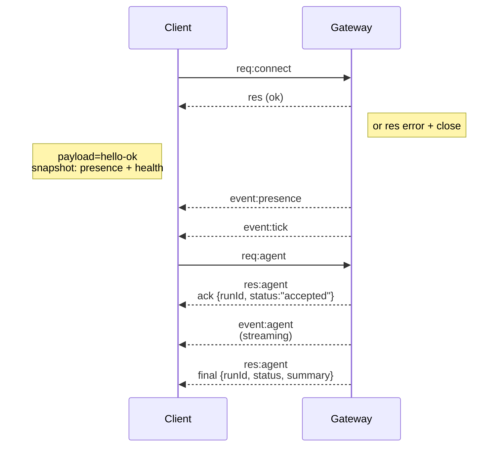

# Architecture Gateway

## Vue d'ensemble

- Un unique **Gateway** de longue durée possède toutes les surfaces de messagerie (WhatsApp via
  Baileys, Telegram via grammY, Slack, Discord, Signal, iMessage, WebChat).
- Les clients du plan de contrôle (application macOS, CLI, interface Web Web, automatisations) se connectent au
  Gateway via **WebSocket** sur l'hôte de liaison configuré (par défaut
  `127.0.0.1:18789`).
- Les **Nœuds** (macOS/iOS/Android/headless) se connectent également via **WebSocket**, mais
  déclarent `role: node` avec des commandes/capacités explicites.
- Un Gateway par hôte ; c'est le seul endroit qui ouvre une session WhatsApp.
- L'**hôte de canvas** est servi par le serveur HTTP du Gateway sous :
  - `/__openclaw__/canvas/` (HTML/CSS/JS modifiables par l'agent)
  - `/__openclaw__/a2ui/` (hôte A2UI)
    Il utilise le même port que le Gateway (par défaut `18789`).

## Composants et flux

### Gateway (démon)

- Maintient les connexions aux fournisseurs.
- Expose une API WS typée (requêtes, réponses, événements push serveur).
- Valide les trames entrantes par rapport au schéma JSON.
- Émet des événements comme `agent`, `chat`, `presence`, `health`, `heartbeat`, `cron`.

### Clients (application Mac / CLI / administrateur Web)

- Une connexion WS par client.
- Envoyer des requêtes (`health`, `status`, `send`, `agent`, `system-presence`).
- S'abonner aux événements (`tick`, `agent`, `presence`, `shutdown`).

### Nœuds (macOS / iOS / Android / headless)

- Se connecter au **même serveur WS** avec `role: node`.
- Fournir une identité d'appareil dans `connect` ; le jumelage est **basé sur l'appareil** (rôle `node`) et
  l'approbation réside dans le magasin de jumelage des appareils.
- Exposer des commandes comme `canvas.*`, `camera.*`, `screen.record`, `location.get`.

Détails du protocole :

- [Protocole Gateway](/fr/gateway/protocol)

### WebChat

- Interface utilisateur statique qui utilise l'API WS du Gateway pour l'historique des discussions et les envois.
- Dans les configurations distantes, se connecte via le même tunnel SSH/Tailscale que les autres clients.

## Cycle de vie de la connexion (client unique)



## Protocole filaire (résumé)

- Transport : WebSocket, trames textuelles avec payloads JSON.
- La première trame **doit** être `connect`.
- Après la poignée de main :
  - Requêtes : `{type:"req", id, method, params}` → `{type:"res", id, ok, payload|error}`
  - Événements : `{type:"event", event, payload, seq?, stateVersion?}`
- `hello-ok.features.methods` / `events` sont des métadonnées de découverte, et non une
  vidange générée de chaque route d'assistant appelable.
- L'auth par secret partagé utilise `connect.params.auth.token` ou
  `connect.params.auth.password`, selon le mode d'auth Gateway configuré.
- Les modes porteurs d'identité tels que Tailscale Serve
  (`gateway.auth.allowTailscale: true`) ou le `gateway.auth.mode: "trusted-proxy"` non-bouclé (non-loopback)
  satisfont l'auth via les en-têtes de requête
  au lieu de `connect.params.auth.*`.
- Le `gateway.auth.mode: "none"` d'ingrès privé désactive complètement l'auth par secret partagé ;
  gardez ce mode hors de l'ingrès public ou non fiable.
- Les clés d'idempotence sont requises pour les méthodes à effets de bord (`send`, `agent`) pour
  pouvoir réessayer en toute sécurité ; le serveur conserve un cache de déduplication à court terme.
- Les nœuds doivent inclure `role: "node"` ainsi que les caps/commandes/permissions dans `connect`.

## Appairage + confiance locale

- Tous les clients WS (opérateurs + nœuds) incluent une **identité d'appareil** sur `connect`.
- Les nouveaux ID d'appareil nécessitent une approbation d'appairage ; le Gateway émet un **jeton d'appareil**
  pour les connexions ultérieures.
- Les connexions directes en boucle locale (local loopback) peuvent être approuvées automatiquement pour garder l'UX
  sur le même hôte fluide.
- OpenClaw dispose également d'un chemin étroit de connexion automatique backend/conteneur-local pour
  les flux d'assistants de secret partagé de confiance.
- Les connexions Tailnet et LAN, y compris les liaisons Tailnet sur le même hôte, nécessitent toujours une
  approbation d'appairage explicite.
- Toutes les connexions doivent signer le nonce `connect.challenge`.
- La charge utile de signature `v3` lie également `platform` + `deviceFamily` ; la passerelle
  épingle les métadonnées appariées à la reconnexion et exige un appairage de réparation pour les modifications
  de métadonnées.
- Les connexions **non locales** nécessitent toujours une approbation explicite.
- L'auth Gateway (`gateway.auth.*`) s'applique toujours à **toutes** les connexions, locales ou
  distantes.

Détails : [Protocole Gateway](/fr/gateway/protocol), [Appairage](/fr/channels/pairing),
[Sécurité](/fr/gateway/security).

## Typage de protocole et génération de code

- Les schémas TypeBox définissent le protocole.
- Le schéma JSON est généré à partir de ces schémas.
- Les models Swift sont générés à partir du JSON Schema.

## Accès à distance

- Préféré : Tailscale ou VPN.
- Alternative : tunnel SSH

  ```bash
  ssh -N -L 18789:127.0.0.1:18789 user@host
  ```

- Le même handshake + jeton d'auth s'appliquent sur le tunnel.
- TLS + pinning optionnel peuvent être activés pour WS dans les configurations distantes.

## Instantané des opérations

- Démarrage : `openclaw gateway` (premier plan, journaux vers stdout).
- Santé : `health` sur WS (également inclus dans `hello-ok`).
- Supervision : launchd/systemd pour le redémarrage automatique.

## Invariants

- Exactement un Gateway contrôle une seule session Baileys par hôte.
- Le handshake est obligatoire ; toute première trame non-JSON ou non-connect est une fermeture brutale.
- Les événements ne sont pas rejoués ; les clients doivent rafraîchir en cas de discontinuité.

## Connexes

- [Agent Loop](/fr/concepts/agent-loop) — cycle d'exécution détaillé de l'agent
- [Protocole Gateway](/fr/gateway/protocol) — contrat de protocole WebSocket
- [File d'attente](/fr/concepts/queue) — file de commandes et concurrence
- [Sécurité](/fr/gateway/security) — model de confiance et durcissement
