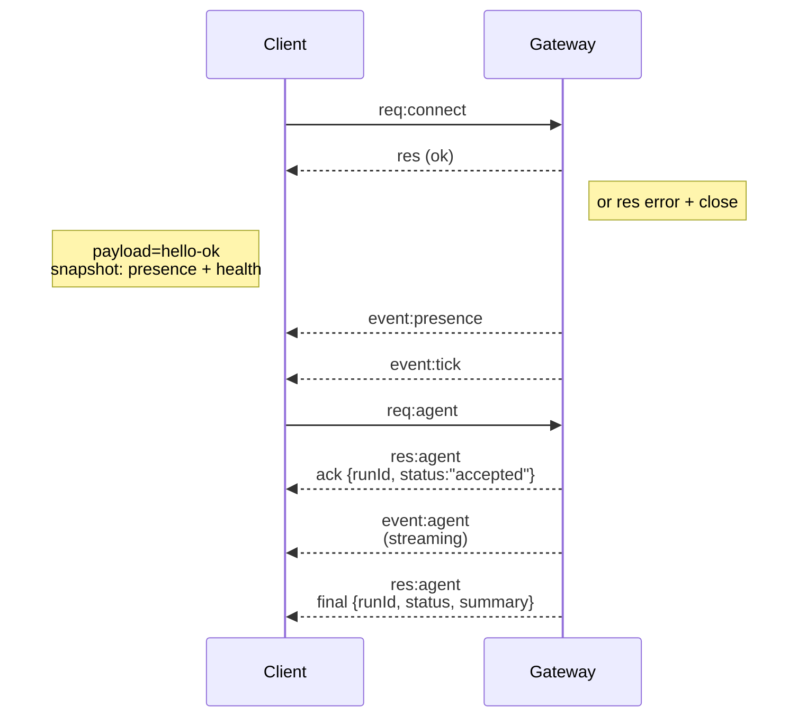

## Vue d'ensemble

- Une seule et unique instance Gateway de longue durée possède toutes les surfaces de messagerie (WhatsApp via
  Baileys, Telegram via grammY, Slack, Discord, Signal, iMessage, WebChat).
- Les clients du plan de contrôle (application macOS, CLI, interface Web Web UI, automatisations) se connectent à la
  Gateway via **WebSocket** sur l'hôte de liaison configuré (par défaut
  `127.0.0.1:18789`).
- Les **Nœuds** (macOS/iOS/Android/headless) se connectent également via **WebSocket**, mais
  déclarent `role: node` avec des commandes/capacités explicites.
- Une seule Gateway par hôte ; c'est le seul endroit qui ouvre une session WhatsApp.
- L'**hôte de canvas** est servi par le serveur HTTP de la Gateway sous :
  - `/__openclaw__/canvas/` (HTML/CSS/JS modifiable par l'agent)
  - `/__openclaw__/a2ui/` (hôte A2UI)
    Il utilise le même port que la Gateway (par défaut `18789`).

## Composants et flux

### Gateway (démon)

- Maintient les connexions des providers.
- Expose une API WS typée (requêtes, réponses, événements push serveur).
- Valide les trames entrantes par rapport au schéma JSON.
- Émet des événements tels que `agent`, `chat`, `presence`, `health`, `heartbeat`, `cron`.

### Clients (application Mac / CLI / administration Web)

- Une connexion WS par client.
- Envoyer des requêtes (`health`, `status`, `send`, `agent`, `system-presence`).
- S'abonner aux événements (`tick`, `agent`, `presence`, `shutdown`).

### Nœuds (macOS / iOS / Android / headless)

- Se connecter au **même serveur WS** avec `role: node`.
- Fournir une identité d'appareil dans `connect` ; le couplage est **basé sur l'appareil** (rôle `node`) et
  l'approbation réside dans le stockage de couplage des appareils.
- Exposer des commandes telles que `canvas.*`, `camera.*`, `screen.record`, `location.get`.

Détails du protocole :

- [Protocole Gateway](/fr/gateway/protocol)

### WebChat

- Interface utilisateur statique qui utilise l'API WS du Gateway pour l'historique des discussions et l'envoi de messages.
- Dans les configurations distantes, se connecte via le même tunnel SSH/Tailscale que les autres clients.

## Cycle de vie de la connexion (client unique)



## Protocole de liaison (résumé)

- Transport : WebSocket, trames texte avec payloads JSON.
- La première trame **doit** être `connect`.
- Après la poignée de main :
  - Requêtes : `{type:"req", id, method, params}` → `{type:"res", id, ok, payload|error}`
  - Événements : `{type:"event", event, payload, seq?, stateVersion?}`
- `hello-ok.features.methods` / `events` sont des métadonnées de découverte, pas une vidange générée de chaque route d'assistant callable.
- L'authentification par secret partagé utilise `connect.params.auth.token` ou `connect.params.auth.password`, selon le mode d'authentification de la passerelle configuré.
- Les modes porteurs d'identité tels que Tailscale Serve (`gateway.auth.allowTailscale: true`) ou le `gateway.auth.mode: "trusted-proxy"` non-bouclé satisfont l'authentification via les en-têtes de requête au lieu de `connect.params.auth.*`.
- Le `gateway.auth.mode: "none"` d'entrée privée désactive entièrement l'authentification par secret partagé ; gardez ce mode hors des entrées publiques ou non fiables.
- Les clés d'idempotence sont requises pour les méthodes à effets de bord (`send`, `agent`) pour réessayer en toute sécurité ; le serveur conserve un cache de déduplication éphémère.
- Les nœuds doivent inclure `role: "node"` ainsi que les capacités/commandes/autorisations dans `connect`.

## Appariement + confiance locale

- Tous les clients WS (opérateurs + nœuds) incluent une **identité d'appareil** sur `connect`.
- Les nouveaux ID d'appareil nécessitent une approbation d'appariement ; le Gateway émet un **jeton d'appareil** pour les connexions ultérieures.
- Les connexions directes en local loopback peuvent être approuvées automatiquement pour garder l'expérience utilisateur same-host fluide.
- OpenClaw dispose également d'un chemin étroit de connexion automatique local au backend/conteneur pour les flux d'assistants de secret partagé de confiance.
- Les connexions Tailnet et LAN, y compris les liaisons Tailnet same-host, nécessitent toujours une approbation d'appariement explicite.
- Toutes les connexions doivent signer le nonce `connect.challenge`.
- Le payload de signature `v3` lie également `platform` + `deviceFamily` ; la passerelle épingle les métadonnées appariées à la reconnexion et exige un appariement de réparation pour les modifications de métadonnées.
- **Non‑local** connects still require explicit approval.
- Gateway auth (`gateway.auth.*`) still applies to **all** connections, local or
  remote.

Details: [Gateway protocol](/fr/gateway/protocol), [Pairing](/fr/channels/pairing),
[Security](/fr/gateway/security).

## Protocol typing and codegen

- TypeBox schemas define the protocol.
- JSON Schema is generated from those schemas.
- Swift models are generated from the JSON Schema.

## Remote access

- Preferred: Tailscale or VPN.
- Alternative: SSH tunnel

  ```bash
  ssh -N -L 18789:127.0.0.1:18789 user@host
  ```

- The same handshake + auth token apply over the tunnel.
- TLS + optional pinning can be enabled for WS in remote setups.

## Operations snapshot

- Start: `openclaw gateway` (foreground, logs to stdout).
- Health: `health` over WS (also included in `hello-ok`).
- Supervision: launchd/systemd for auto‑restart.

## Invariants

- Exactly one Gateway controls a single Baileys session per host.
- Handshake is mandatory; any non‑JSON or non‑connect first frame is a hard close.
- Events are not replayed; clients must refresh on gaps.

## Related

- [Agent Loop](/fr/concepts/agent-loop) — detailed agent execution cycle
- [Gateway Protocol](/fr/gateway/protocol) — WebSocket protocol contract
- [Queue](/fr/concepts/queue) — command queue and concurrency
- [Security](/fr/gateway/security) — trust model and hardening
