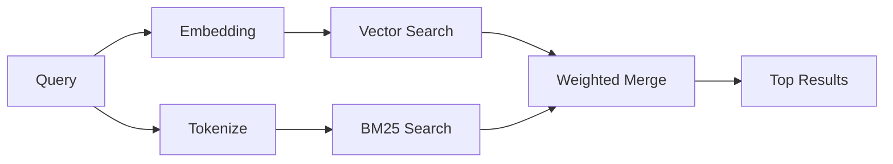

# Recherche de mémoire

`memory_search` trouve des notes pertinentes dans vos fichiers de mémoire, même lorsque
la formulation diffère du texte original. Il fonctionne en indexant la mémoire en petits
morceaux et en les recherchant à l'aide d'embeddings, de mots-clés ou des deux.

## Quick start

Si vous avez un abonnement GitHub Copilot, une clé API OpenAI, Gemini, Voyage ou Mistral configurée, la recherche de mémoire fonctionne automatiquement. Pour définir explicitement un fournisseur :

```json5
{
  agents: {
    defaults: {
      memorySearch: {
        provider: "openai", // or "gemini", "local", "ollama", etc.
      },
    },
  },
}
```

Pour les embeddings locaux sans clé API, utilisez `provider: "local"` (nécessite
node-llama-cpp).

## Providers pris en charge

| Provider       | ID               | Nécessite une clé API | Notes                                                                      |
| -------------- | ---------------- | --------------------- | -------------------------------------------------------------------------- |
| Bedrock        | `bedrock`        | Non                   | Détecté automatiquement lorsque la chaîne d'identification AWS est résolue |
| Gemini         | `gemini`         | Oui                   | Prend en charge l'indexation d'images/audio                                |
| GitHub Copilot | `github-copilot` | Non                   | Détecté automatiquement, utilise l'abonnement Copilot                      |
| Local          | `local`          | Non                   | Modèle GGUF, téléchargement d'environ 0,6 Go                               |
| Mistral        | `mistral`        | Oui                   | Détecté automatiquement                                                    |
| Ollama         | `ollama`         | Non                   | Local, doit être défini explicitement                                      |
| OpenAI         | `openai`         | Oui                   | Détecté automatiquement, rapide                                            |
| Voyage         | `voyage`         | Oui                   | Détecté automatiquement                                                    |

## Fonctionnement de la recherche

OpenClaw exécute deux chemins de récupération en parallèle et fusionne les résultats :



- **La recherche vectorielle** trouve des notes ayant une signification similaire ("hôte passerelle" correspond
  à "la machine exécutant OpenClaw").
- **La recherche de mots-clés BM25** trouve des correspondances exactes (identifiants, chaînes d'erreur, clés
  de configuration).

Si un seul chemin est disponible (pas d'embeddings ou pas de recherche en texte intégral), l'autre s'exécute seul.

Lorsque les embeddings ne sont pas disponibles, OpenClaw utilise toujours le classement lexical sur les résultats de recherche en texte intégral au lieu de revenir à un classement par correspondance exacte brute uniquement. Ce mode dégradé privilégie les segments avec une couverture plus forte des termes de la requête et des chemins de fichiers pertinents, ce qui maintient le rappel utile même sans `sqlite-vec` ou de fournisseur d'embeddings.

## Amélioration de la qualité de la recherche

Deux fonctionnalités optionnelles aident lorsque vous avez un historique de notes important :

### Décroissance temporelle

Les anciennes notes perdent progressivement du poids dans le classement afin que les informations récentes apparaissent en premier.
Avec la demi-vie par défaut de 30 jours, une note du mois dernier est notée à 50 % de
son poids d'origine. Les fichiers pérennes comme `MEMORY.md` ne sont jamais soumis à la décroissance.

<Tip>Activez la décroissance temporelle si votre agent a des mois de notes quotidiennes et si des informations obsolètes surclassent constamment le contexte récent.</Tip>

### MMR (diversité)

Réduit les résultats redondants. Si cinq notes mentionnent toutes la même configuration de routeur, le MMR
assure que les principaux résultats couvrent différents sujets au lieu de se répéter.

<Tip>Activez le MMR si `memory_search` continue à renvoyer des extraits presque identiques provenant de différentes notes quotidiennes.</Tip>

### Activer les deux

```json5
{
  agents: {
    defaults: {
      memorySearch: {
        query: {
          hybrid: {
            mmr: { enabled: true },
            temporalDecay: { enabled: true },
          },
        },
      },
    },
  },
}
```

## Mémoire multimodale

Avec Gemini Embedding 2, vous pouvez indexer des images et des fichiers audio
alongside du Markdown. Les requêtes de recherche restent textuelles, mais elles
portent sur le contenu visuel et audio. Consultez la [référence de
configuration de la mémoire](/en/reference/memory-config) pour le
paramétrage.

## Recherche de mémoire de session

Vous pouvez éventuellement indexer les transcriptions de session afin que
`memory_search` puisse se rappeler les conversations
précédentes. C'est optionnel via `memorySearch.experimental.sessionMemory`. Consultez la
[référence de configuration](/en/reference/memory-config) pour les détails.

## Dépannage

**Pas de résultats ?** Exécutez `openclaw memory status` pour vérifier
l'index. S'il est vide, exécutez `openclaw memory index --force`.

**Uniquement des correspondances par mots-clés ?** Votre provider d'embedding
n'est peut-être pas configuré. Vérifiez `openclaw memory status --deep`.

**Texte CJK introuvable ?** Reconstruisez l'index FTS avec
`openclaw memory index --force`.

## Pour aller plus loin

- [Mémoire active](/en/concepts/active-memory) -- mémoire de sous-agent
  pour les sessions de chat interactives
- [Mémoire](/en/concepts/memory) -- disposition des fichiers,
  backends, outils
- [Référence de configuration de la mémoire](/en/reference/memory-config)
  -- tous les paramètres de configuration
