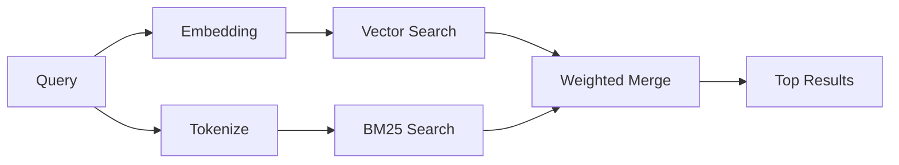

`memory_search` trouve des notes pertinentes dans vos fichiers de mémoire, même lorsque le
formulation diffère du texte original. Il fonctionne en indexant la mémoire en petits
blocs et en les recherchant à l'aide d'embeddings, de mots-clés, ou des deux.

## Quick start

La recherche mémoire utilise les embeddings OpenAI par défaut. Pour utiliser un autre backend d'embedding, définissez explicitement un provider :

```json5
{
  agents: {
    defaults: {
      memorySearch: {
        provider: "openai", // or "gemini", "local", "ollama", "openai-compatible", etc.
      },
    },
  },
}
```

Pour les configurations multi-points de terminaison avec providers spécifiques à la mémoire, `provider` peut également être une entrée personnalisée `models.providers.<id>`, telle que `ollama-5080`, lorsque ce provider définit `api: "ollama"` ou un autre propriétaire d'adaptateur d'embedding mémoire.

Pour les intégrations locales sans clé API, définissez `provider: "local"`. Les extraits de code source peuvent toujours nécessiter une approbation de build native : `pnpm approve-builds` puis `pnpm rebuild node-llama-cpp`.

Certains points de terminaison d'embedding compatibles OpenAI nécessitent des étiquettes asymétriques telles que `input_type: "query"` pour les recherches et `input_type: "document"` ou `"passage"` pour les fragments indexés. Configurez-les avec `memorySearch.queryInputType` et `memorySearch.documentInputType` ; voir la [référence de configuration de la mémoire](/fr/reference/memory-config#provider-specific-config).

## Providers pris en charge

| Provider          | ID                  | Nécessite une clé API | Notes                                        |
| ----------------- | ------------------- | --------------------- | -------------------------------------------- |
| Bedrock           | `bedrock`           | Non                   | Utilise la chaîne d'identification AWS       |
| DeepInfra         | `deepinfra`         | Oui                   | Par défaut : `BAAI/bge-m3`                   |
| Gemini            | `gemini`            | Oui                   | Prend en charge l'indexation d'images/audio  |
| GitHub Copilot    | `github-copilot`    | Non                   | Utilise l'abonnement Copilot                 |
| Local             | `local`             | Non                   | Modèle GGUF, téléchargement d'environ 0,6 Go |
| Mistral           | `mistral`           | Oui                   |                                              |
| Ollama            | `ollama`            | Non                   | Local/auto-hébergé                           |
| OpenAI            | `openai`            | Oui                   | Par défaut                                   |
| Compatible OpenAI | `openai-compatible` | Habituellement        | `/v1/embeddings` générique                   |
| Voyage            | `voyage`            | Oui                   |                                              |

## Fonctionnement de la recherche

OpenClaw exécute deux chemins de récupération en parallèle et fusionne les résultats :



- **La recherche vectorielle** trouve des notes ayant un sens similaire ("hôte de passerelle" correspond à "la machine exécutant OpenClaw").
- **La recherche par mots-clés BM25** trouve des correspondances exactes (ID, chaînes d'erreur, clés de configuration).

Si un seul chemin est disponible (pas d'embeddings ou pas de FTS), l'autre fonctionne seul.

Lorsque les embeddings ne sont pas disponibles, OpenClaw utilise toujours le classement lexical sur les résultats FTS au lieu de revenir à un classement par correspondance exacte brute uniquement. Ce mode dégradé favorise les blocs avec une couverture plus forte des termes de la requête et des chemins de fichiers pertinents, ce qui maintient le rappel utile même sans `sqlite-vec` ou un fournisseur d'embeddings.

## Amélioration de la qualité de la recherche

Deux fonctionnalités optionnelles aident lorsque vous avez un historique de notes important :

### Décroissance temporelle

Les anciennes notes perdent progressivement du poids dans le classement afin que les informations récentes apparaissent en premier.
Avec la demi-vie par défaut de 30 jours, une note du mois dernier obtient un score de 50 % de
son poids original. Les fichiers pérennes comme `MEMORY.md` ne sont jamais soumis à la décroissance.

<Tip>Activez la décroissance temporelle si votre agent a des mois de notes quotidiennes et que des informations obsolètes continuent à dépasser le contexte récent.</Tip>

### MMR (diversité)

Réduit les résultats redondants. Si cinq notes mentionnent toutes la même configuration de routeur, le MMR
assure que les principaux résultats couvrent différents sujets au lieu de se répéter.

<Tip>Activez le MMR si `memory_search` continue à renvoyer des extraits presque identiques provenant de différentes notes quotidiennes.</Tip>

### Activer les deux

```json5
{
  agents: {
    defaults: {
      memorySearch: {
        query: {
          hybrid: {
            mmr: { enabled: true },
            temporalDecay: { enabled: true },
          },
        },
      },
    },
  },
}
```

## Mémoire multimodale

Avec Gemini Embedding 2, vous pouvez indexer des images et des fichiers audio avec le
Markdown. Les requêtes de recherche restent textuelles, mais elles correspondent au contenu visuel et audio.
Voir la [référence de configuration de la mémoire](/fr/reference/memory-config) pour
la configuration.

## Recherche dans la mémoire de session

Vous pouvez éventuellement indexer les transcriptions de session afin que `memory_search` puisse se souvenir de
conversations antérieures. C'est une option accessible via
`memorySearch.experimental.sessionMemory`. Voir la
[référence de configuration](/fr/reference/memory-config) pour plus de détails.

## Dépannage

**Aucun résultat ?** Exécutez `openclaw memory status` pour vérifier l'index. S'il est vide, exécutez
`openclaw memory index --force`.

**Seulement des correspondances par mot-clé ?** Votre fournisseur d'embeddings n'est peut-être pas configuré. Vérifiez
`openclaw memory status --deep`.

**Les embeddings locaux expir-ils ?** `ollama`, `lmstudio` et `local` utilisent un délai d'expiration plus long
pour les lots en ligne par défaut. Si l'hôte est simplement lent, définissez
`agents.defaults.memorySearch.sync.embeddingBatchTimeoutSeconds` et réexécutez
`openclaw memory index --force`.

**Texte CJK introuvable ?** Reconstruisez l'index FTS avec
`openclaw memory index --force`.

## Pour aller plus loin

- [Active Memory](/fr/concepts/active-memory) -- mémoire de sous-agent pour les sessions de chat interactives
- [Memory](/fr/concepts/memory) -- disposition des fichiers, backends, outils
- [Référence de configuration de la mémoire](/fr/reference/memory-config) -- tous les paramètres de configuration

## Connexes

- [Aperçu de la mémoire](/fr/concepts/memory)
- [Mémoire active](/fr/concepts/active-memory)
- [Moteur de mémoire intégré](/fr/concepts/memory-builtin)
