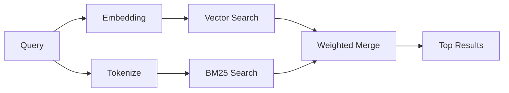

`memory_search` trouve des notes pertinentes dans vos fichiers de mémoire, même lorsque le
formulation diffère du texte original. Il fonctionne en indexant la mémoire en petits
blocs et en les recherchant à l'aide d'embeddings, de mots-clés, ou des deux.

## Quick start

Si vous avez un abonnement GitHub Copilot, une clé OpenAI configurée pour API, Gemini, Voyage ou Mistral,
la recherche mémoire fonctionne automatiquement. Pour définir un provider
explicitement :

```json5
{
  agents: {
    defaults: {
      memorySearch: {
        provider: "openai", // or "gemini", "local", "ollama", etc.
      },
    },
  },
}
```

Pour les embeddings locaux sans clé API, installez le package d'exécution
optionnel `node-llama-cpp` à côté de OpenClaw et utilisez `provider: "local"`.

Certains points de terminaison d'embeddings compatibles avec OpenAI nécessitent des étiquettes asymétriques telles que
`input_type: "query"` pour les recherches et `input_type: "document"` ou `"passage"`
pour les blocs indexés. Configurez-les avec `memorySearch.queryInputType` et
`memorySearch.documentInputType` ; voir la [Référence de configuration de la mémoire](/fr/reference/memory-config#provider-specific-config).

## Providers pris en charge

| Provider       | ID               | Nécessite une clé API | Notes                                                                      |
| -------------- | ---------------- | --------------------- | -------------------------------------------------------------------------- |
| Bedrock        | `bedrock`        | Non                   | Détecté automatiquement lorsque la chaîne d'identification AWS est résolue |
| Gemini         | `gemini`         | Oui                   | Prend en charge l'indexation d'images/audio                                |
| GitHub Copilot | `github-copilot` | Non                   | Détecté automatiquement, utilise l'abonnement Copilot                      |
| Local          | `local`          | Non                   | Modèle GGUF, téléchargement d'environ 0,6 Go                               |
| Mistral        | `mistral`        | Oui                   | Détecté automatiquement                                                    |
| Ollama         | `ollama`         | Non                   | Local, doit être défini explicitement                                      |
| OpenAI         | `openai`         | Oui                   | Détecté automatiquement, rapide                                            |
| Voyage         | `voyage`         | Oui                   | Détecté automatiquement                                                    |

## Fonctionnement de la recherche

OpenClaw exécute deux chemins de récupération en parallèle et fusionne les résultats :



- **La recherche vectorielle** trouve des notes ayant une signification similaire ("hôte passerelle" correspond
  à "la machine exécutant OpenClaw").
- **La recherche de mots-clés BM25** trouve des correspondances exactes (identifiants, chaînes d'erreur, clés
  de configuration).

Si un seul chemin est disponible (pas d'embeddings ou pas de recherche en texte intégral), l'autre s'exécute seul.

Lorsque les embeddings ne sont pas disponibles, OpenClaw utilise toujours un classement lexical sur les résultats FTS au lieu de revenir à un classement par correspondance exacte brute uniquement. Ce mode dégradé privilégie les blocs ayant une plus forte couverture des termes de la requête et des chemins de fichiers pertinents, ce qui maintient le rappel utile même sans `sqlite-vec` ou de provider d'embeddings.

## Amélioration de la qualité de la recherche

Deux fonctionnalités optionnelles aident lorsque vous avez un historique de notes important :

### Décroissance temporelle

Les anciennes notes perdent progressivement leur poids dans le classement afin que les informations récentes apparaissent en premier.
Avec la demi-vie par défaut de 30 jours, une note du mois dernier obtient un score de 50 % de
son poids initial. Les fichiers intemporels comme `MEMORY.md` ne sont jamais dépréciés.

<Tip>Activez la décroissance temporelle si votre agent a des mois de notes quotidiennes et si des informations obsolètes surclassent constamment le contexte récent.</Tip>

### MMR (diversité)

Réduit les résultats redondants. Si cinq notes mentionnent toutes la même configuration de routeur, le MMR
assure que les principaux résultats couvrent différents sujets au lieu de se répéter.

<Tip>Activez MMR si `memory_search` continue à renvoyer des extraits presque en double à partir de différentes notes quotidiennes.</Tip>

### Activer les deux

```json5
{
  agents: {
    defaults: {
      memorySearch: {
        query: {
          hybrid: {
            mmr: { enabled: true },
            temporalDecay: { enabled: true },
          },
        },
      },
    },
  },
}
```

## Mémoire multimodale

Avec Gemini Embedding 2, vous pouvez indexer des images et des fichiers audio
alongside Markdown. Search queries remain text, but they match against visual and
audio content. See the [Memory configuration reference](/fr/reference/memory-config) for
setup.

## Recherche de mémoire de session

You can optionally index session transcripts so `memory_search` can recall
earlier conversations. This is opt-in via
`memorySearch.experimental.sessionMemory`. See the
[configuration reference](/fr/reference/memory-config) for details.

## Dépannage

**No results?** Run `openclaw memory status` to check the index. If empty, run
`openclaw memory index --force`.

**Only keyword matches?** Your embedding provider may not be configured. Check
`openclaw memory status --deep`.

**Local embeddings time out?** `ollama`, `lmstudio`, and `local` use a longer
inline batch timeout by default. If the host is simply slow, set
`agents.defaults.memorySearch.sync.embeddingBatchTimeoutSeconds` and rerun
`openclaw memory index --force`.

**CJK text not found?** Rebuild the FTS index with
`openclaw memory index --force`.

## Further reading

- [Active Memory](/fr/concepts/active-memory) -- sub-agent memory for interactive chat sessions
- [Memory](/fr/concepts/memory) -- file layout, backends, tools
- [Memory configuration reference](/fr/reference/memory-config) -- all config knobs

## Related

- [Memory overview](/fr/concepts/memory)
- [Active memory](/fr/concepts/active-memory)
- [Builtin memory engine](/fr/concepts/memory-builtin)
