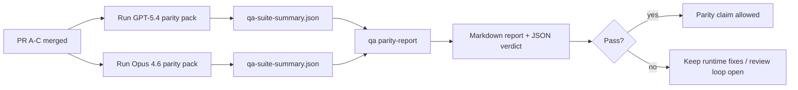

# Notes de maintenance pour la parité GPT-5.4 / Codex

Cette note explique comment examiner le programme de parité GPT-5.4 / Codex en quatre unités de fusion sans perdre l'architecture originale à six contrats.

## Unités de fusion

### PR A : exécution stricte-agentic

Propriétaire de :

- `executionContract`
- suivi immédiat GPT-5 en priorité
- `update_plan` comme suivi de progression non terminal
- états bloqués explicites au lieu d'arrêts silencieux basés uniquement sur le plan

Non propriétaire de :

- classification des échecs d'authentification/exécution
- véracité des autorisations
- refonte de la reprise/continuation
- benchmark de parité

### PR B : véracité de l'exécution

Propriétaire de :

- exactitude de la portée OAuth Codex
- classification des échecs de type provider/exécution
- disponibilité véridique de `/elevated full` et raisons de blocage

Non propriétaire de :

- normalisation du schéma de tool
- état de reprise/sanité
- validation des benchmarks

### PR C : exactitude de l'exécution

Propriétaire de :

- compatibilité des outils OpenAI/Codex détenus par le provider
- gestion de schéma strict sans paramètre
- signalement de reprise invalide
- visibilité de l'état des tâches longues en pause, bloquées et abandonnées

Non propriétaire de :

- continuation auto-élue
- comportement du dialecte Codex générique en dehors des hooks du provider
- validation des benchmarks

### PR D : harnais de parité

Propriétaire de :

- pack de scénarios GPT-5.4 vs Opus 4.6 de première vague
- documentation de parité
- rapport de parité et mécanismes de release-gate

Non propriétaire de :

- changements de comportement d'exécution en dehors du QA-lab
- simulation d'authentification/proxy/DNS à l'intérieur du harnais

## Correspondance avec les six contrats originaux

| Contrat original                                          | Unité de fusion |
| --------------------------------------------------------- | --------------- |
| Exactitude du transport/de l'authentification du Provider | PR B            |
| Compatibilité du contrat/de schéma de Tool                | PR C            |
| Exécution immédiate                                       | PR A            |
| Véracité des autorisations                                | PR B            |
| Exactitude de la reprise/continuation/sanité              | PR C            |
| Benchmark/release gate                                    | PR D            |

## Ordre de révision

1. PR A
2. PR B
3. PR C
4. PR D

La PR D est la couche de preuve. Elle ne devrait pas être la raison du retard des PR d'exactitude de l'exécution.

## Ce qu'il faut rechercher

### PR A

- Les exécutions GPT-5 agissent ou échouent de manière fermée au lieu de s'arrêter au commentaire
- `update_plan` ne ressemble plus à une progression par lui-même
- le comportement reste prioritaire pour GPT-5 et délimité à l'intégration Pi

### PR B

- les échecs d'auth/proxy/runtime ne s'effondrent plus dans une gestion générique de « model failed »
- `/elevated full` n'est décrit comme disponible que lorsqu'il est réellement disponible
- les raisons de blocage sont visibles à la fois par le model et le runtime orienté utilisateur

### PR C

- l'enregistrement strict des tools OpenAI/Codex se comporte de manière prévisible
- les tools sans paramètres ne font pas échouer les contrôles de schéma stricts
- les résultats de relecture et de compactage préservent l'état de vivacité véridique

### PR D

- le pack de scénarios est compréhensible et reproductible
- le pack inclut une voie de sécurité de relecture avec mutations, et pas seulement des flux en lecture seule
- les rapports sont lisibles par les humains et l'automatisation
- les revendications de parité sont étayées par des preuves, et non anecdotiques

Artefacts attendus de la PR D :

- `qa-suite-report.md` / `qa-suite-summary.json` pour chaque exécution de model
- `qa-agentic-parity-report.md` avec une comparaison agrégée et au niveau du scénario
- `qa-agentic-parity-summary.json` avec un verdict lisible par machine

## Critère de release

Ne revendiquez pas la parité ou la supériorité de GPT-5.4 sur Opus 4.6 jusqu'à ce que :

- les PR A, PR B et PR C sont fusionnées
- la PR D exécute proprement le pack de parité de la première vague
- les suites de régression de véracité du runtime restent vertes
- le rapport de parité ne montre aucun cas de fausse réussite et aucune régression du comportement d'arrêt

Le harnais de parité n'est pas la seule source de preuve. Gardez cette séparation explicite lors de la revue :

- la PR D possède la comparaison basée sur des scénarios entre GPT-5.4 et Opus 4.6
- les suites déterministes de la PR B possèdent toujours les preuves d'auth/proxy/DNS et de véracité à accès complet

## Carte objectif-preuve

| Élément du jalon d'achèvement                             | Propriétaire principal | Artefact de revue                                                                       |
| --------------------------------------------------------- | ---------------------- | --------------------------------------------------------------------------------------- |
| Aucun blocage de planification uniquement                 | PR A                   | tests de runtime strict-agentic et `approval-turn-tool-followthrough`                   |
| Pas de fausse progression ni de fausse complétion de tool | PR A + PR D            | nombre de fausses réussites de parité plus les détails du rapport au niveau du scénario |
| Pas de fausse orientation `/elevated full`                | PR B                   | suites déterministes de véracité du runtime                                             |
| Les échecs de relecture/vivacité restent explicites       | PR C + PR D            | suites de cycle de vie/relecture plus `compaction-retry-mutating-tool`                  |
| GPT-5.4 égale ou surpasse Opus 4.6                        | PR D                   | `qa-agentic-parity-report.md` et `qa-agentic-parity-summary.json`                       |

## Raccourci du réviseur : avant vs après

| Problème visible par l'utilisateur avant                                             | Signal de revue après                                                                                         |
| ------------------------------------------------------------------------------------ | ------------------------------------------------------------------------------------------------------------- |
| GPT-5.4 s'est arrêté après la planification                                          | la PR A montre un comportement d'agir ou bloquer au lieu d'une complétion par commentaires uniquement         |
| L'utilisation des outils semblait fragile avec les schémas stricts OpenAI/Codex      | La PR C rend l'enregistrement des outils et l'invocation sans paramètres prévisibles                          |
| Les indices `/elevated full` étaient parfois trompeurs                               | La PR B lie les directives à la capacité d'exécution réelle et aux raisons du blocage                         |
| Les tâches longues pouvaient disparaître dans l'ambiguïté de la relecture/compaction | La PR C émet des états explicites de pause, blocage, abandon et invalidité de relecture                       |
| Les affirmations de parité étaient anecdotiques                                      | La PR D produit un rapport ainsi qu'un verdict JSON avec la même couverture de scénarios sur les deux modèles |
