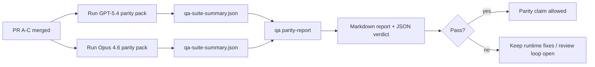

# Notes du mainteneur de parité GPT-5.4 / Codex

Cette note explique comment réviser le programme de parité GPT-5.4 / Codex sous forme de quatre unités de fusion sans perdre l'architecture originale à six contrats.

## Unités de fusion

### PR A : exécution strict-agentic

Possède :

- `executionContract`
- suivi dans le même tour, priorité GPT-5
- `update_plan` comme suivi de progression non terminal
- états bloqués explicites au lieu d'arrêts silencieux de planification seule

Ne possède pas :

- classification des échecs auth/runtime
- véracité des permissions
- refonte de la relecture/continuation
- benchmarking de parité

### PR B : véracité du runtime

Possède :

- correction des scopes OAuth Codex
- classification typée des échecs fournisseur/runtime
- disponibilité véridique de `/elevated full` et raisons de blocage

Ne possède pas :

- normalisation des schémas d'outils
- état de relecture/vivacité
- contrôle de porte de benchmark

### PR C : correction de l'exécution

Possède :

- compatibilité des outils OpenAI/Codex détenus par le fournisseur
- gestion des schémas stricts sans paramètres
- visibilité de l'invalidité de relecture
- visibilité des états de tâches longues en pause, bloquées et abandonnées

Ne possède pas :

- continuation auto-élue
- comportement générique du dialecte Codex en dehors des hooks fournisseur
- contrôle de porte de benchmark

### PR D : harnais de parité

Possède :

- pack de scénarios GPT-5.4 vs Opus 4.6 de première vague
- documentation de parité
- rapport de parité et mécaniques de porte de publication

Ne possède pas :

- changements de comportement du runtime en dehors du laboratoire QA
- simulation auth/proxy/DNS à l'intérieur du harnais

## Correspondance avec les six contrats originaux

| Contrat original                              | Unité de fusion |
| --------------------------------------------- | --------------- |
| Correction du transport/auth du fournisseur   | PR B            |
| Compatibilité des contrats/schémas d'outils   | PR C            |
| Exécution dans le même tour                   | PR A            |
| Véracité des permissions                      | PR B            |
| Correction de relecture/continuation/vivacité | PR C            |
| Porte de benchmark/publication                | PR D            |

## Ordre de révision

1. PR A
2. PR B
3. PR C
4. PR D

PR D est la couche de preuve. Elle ne devrait pas être la raison pour laquelle les PR de correction du runtime sont retardés.

## Ce qu'il faut rechercher

### PR A

- les exécutions GPT-5 agissent ou échouent fermement au lieu de s'arrêter au commentaire
- `update_plan` ne ressemble plus à du progrès par lui-même
- le comportement reste centré GPT-5 et limité au Pi intégré

### PR B

- les échecs auth/proxy/runtime ne s'effondrent plus dans la gestion générique « le modèle a échoué »
- `/elevated full` n'est décrit comme disponible que lorsqu'il est réellement disponible
- les raisons de blocage sont visibles à la fois pour le modèle et le runtime面向 utilisateur

### PR C

- l'enregistrement strict des outils OpenAI/Codex se comporte de manière prévisible
- les outils sans paramètres ne échouent pas aux vérifications de schéma strict
- les résultats de relecture et de compaction préservent un état de vivacité véridique

### PR D

- le pack de scénarios est compréhensible et reproductible
- le pack inclut une voie de sécurité de relecture mutante, pas seulement des flux en lecture seule
- les rapports sont lisibles par les humains et l'automatisation
- les affirmations de parité sont étayées par des preuves, non anecdotiques

Artefacts attendus de PR D :

- `qa-suite-report.md` / `qa-suite-summary.json` pour chaque exécution de modèle
- `qa-agentic-parity-report.md` avec comparaison agrégée et par scénario
- `qa-agentic-parity-summary.json` avec un verdict lisible par machine

## Porte de publication

Ne pas affirmer la parité ou la supériorité de GPT-5.4 sur Opus 4.6 tant que :

- PR A, PR B et PR C sont fusionnés
- PR D exécute proprement le pack de parité de première vague
- les suites de régression de véracité du runtime restent vertes
- le rapport de parité ne montre aucun cas de faux succès et aucune régression du comportement d'arrêt

Le harnais de parité n'est pas la seule source de preuve. Gardez cette séparation explicite dans la révision :

- PR D possède la comparaison GPT-5.4 vs Opus 4.6 basée sur les scénarios
- Les suites déterministes de PR B possèdent toujours la preuve de véracité auth/proxy/DNS et de l'accès complet

## Carte objectif-preuve

| Élément de la porte d'achèvement                    | Propriétaire principal | Artefact de révision                                                    |
| --------------------------------------------------- | ---------------------- | ----------------------------------------------------------------------- |
| Pas de blocages de planification seule              | PR A                   | tests runtime strict-agentic et `approval-turn-tool-followthrough`      |
| Pas de faux progrès ni fausse complétion d'outils   | PR A + PR D            | comptage des faux succès de parité plus détails du rapport par scénario |
| Pas de guidance `/elevated full` erronée            | PR B                   | suites déterministes de véracité du runtime                             |
| Les échecs de relecture/vivacité restent explicites | PR C + PR D            | suites lifecycle/replay et `compaction-retry-mutating-tool`             |
| GPT-5.4 égale ou surpasse Opus 4.6                  | PR D                   | `qa-agentic-parity-report.md` et `qa-agentic-parity-summary.json`       |

## Aide-mémoire du réviseur : avant vs après

| Problème visible par l'utilisateur avant                                            | Signal de révision après                                                                               |
| ----------------------------------------------------------------------------------- | ------------------------------------------------------------------------------------------------------ |
| GPT-5.4 s'arrêtait après la planification                                           | PR A montre un comportement d'action ou de blocage au lieu d'une complétion par commentaire uniquement |
| L'utilisation des outils semblait fragile avec les schémas stricts OpenAI/Codex     | PR C maintient l'enregistrement des outils et l'invocation sans paramètres prévisibles                 |
| Les indications `/elevated full` étaient parfois trompeuses                         | PR B lie la guidance à la capacité réelle du runtime et aux raisons de blocage                         |
| Les tâches longues pouvaient disparaître dans l'ambiguïté de relecture/compactation | PR C émet un état explicite en pause, bloqué, abandonné et de relecture invalide                       |
| Les affirmations de parité étaient anecdotiques                                     | PR D produit un rapport plus un verdict JSON avec la même couverture de scénarios sur les deux modèles |
