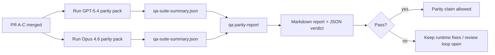

# Notes de maintenance sur la parité GPT-5.4 / Codex

Cette note explique comment réviser le programme de parité GPT-5.4 / Codex en quatre unités de fusion sans perdre l'architecture originale des six contrats.

## Unités de fusion

### PR A : exécution stricte-agentic

Possède :

- `executionContract`
- suivi immédiat (same-turn) prioritaire GPT-5
- `update_plan` en tant que suivi de progression non terminal
- états bloqués explicites au lieu d'arrêts silencieux basés uniquement sur le plan

Ne possède pas :

- classification des échecs d'authentification/exécution
- exactitude des permissions
- refonte de la reprise/continuation
- benchmark de parité

### PR B : exactitude de l'exécution (runtime truthfulness)

Possède :

- exactitude de la portée OAuth Codex
- classification typée des échecs de fournisseur/exécution
- disponibilité et raisons de blocage exactes de `/elevated full`

Ne possède pas :

- normalisation du schéma de l'outil
- état de reprise/vivacité
- validation par benchmark (gating)

### PR C : correction de l'exécution

Possède :

- compatibilité des outils OpenAI/Codex détenus par le fournisseur
- gestion de schéma stricte sans paramètre
- affichage des invalidités de reprise
- visibilité de l'état des tâches longues en pause, bloquées et abandonnées

Ne possède pas :

- continuation auto-élue
- comportement du dialecte Codex générique en dehors des hooks du fournisseur
- validation par benchmark (gating)

### PR D : harnais de parité

Possède :

- pack de scénarios de première vague GPT-5.4 vs Opus 4.6
- documentation de la parité
- rapport de parité et mécaniques de porte de sortie (release-gate)

Ne possède pas :

- changements de comportement d'exécution en dehors du QA-lab
- simulation auth/proxy/DNS à l'intérieur du harnais

## Correspondance avec les six contrats originaux

| Contrat original                                             | Unité de fusion |
| ------------------------------------------------------------ | --------------- |
| Exactitude du transport/de l'authentification du fournisseur | PR B            |
| Compatibilité du contrat/du schéma de l'outil                | PR C            |
| Exécution immédiate (same-turn)                              | PR A            |
| Exactitude des permissions                                   | PR B            |
| Exactitude de la reprise/continuation/vivacité               | PR C            |
| Porte de benchmark/de sortie                                 | PR D            |

## Ordre de révision

1. PR A
2. PR B
3. PR C
4. PR D

La PR D est la couche de preuve. Elle ne doit pas être la raison du retard des PR de correction d'exécution.

## Ce qu'il faut rechercher

### PR A

- Les exécutions GPT-5 agissent ou échouent de manière fermée au lieu de s'arrêter au commentaire
- `update_plan` n'apparaît plus comme une progression en soi
- le comportement reste prioritaire GPT-5 et délimité à la portée Pi intégrée

### PR B

- les échecs auth/proxy/exécution cessent de s'effondrer dans la gestion générique « échec du model »
- `/elevated full` n'est décrit comme disponible que lorsqu'il est réellement disponible
- les raisons du blocage sont visibles à la fois pour le model et pour le runtime orienté utilisateur

### PR C

- l'enregistrement strict des tools OpenAI/Codex se comporte de manière prévisible
- les tools sans paramètres ne font pas échouer les vérifications strictes du schéma
- les résultats de la relecture et de la compaction préservent l'état de vivacité véridique

### PR D

- le pack de scénarios est compréhensible et reproductible
- le pack inclut une voie de sécurité de relecture avec mutation, et pas seulement des flux en lecture seule
- les rapports sont lisibles par les humains et l'automatisation
- les revendications de parité sont étayées par des preuves, et non anecdotiques

Artefacts attendus de la PR D :

- `qa-suite-report.md` / `qa-suite-summary.json` pour chaque exécution de model
- `qa-agentic-parity-report.md` avec une comparaison agrégée et au niveau du scénario
- `qa-agentic-parity-summary.json` avec un verdict lisible par machine

## Porte de version

Ne prétendez pas à une parité ou une supériorité de GPT-5.4 par rapport à Opus 4.6 tant que :

- les PR A, PR B et PR C sont fusionnées
- la PR D exécute proprement le pack de parité de la première vague
- les suites de régression de véracité du runtime restent vertes
- le rapport de parité ne présente aucun cas de fausse réussite et aucune régression dans le comportement d'arrêt

Le harnais de parité n'est pas la seule source de preuves. Gardez cette séparation explicite lors de la révision :

- la PR D possède la comparaison basée sur des scénarios entre GPT-5.4 et Opus 4.6
- les suites déterministes de la PR B possèdent toujours les preuves de véracité auth/proxy/DNS et à accès complet

## Cartographie objectif-preuve

| Élément de porte d'achèvement                          | Propriétaire principal | Artefact de révision                                                                |
| ------------------------------------------------------ | ---------------------- | ----------------------------------------------------------------------------------- |
| Aucun blocage de planification uniquement              | PR A                   | tests de runtime strict-agentic et `approval-turn-tool-followthrough`               |
| Aucune fausse progression ou fausse achèvement de tool | PR A + PR D            | nombre de fausses réussites de parité plus détails du rapport au niveau du scénario |
| Aucune fausse guidances `/elevated full`               | PR B                   | suites déterministes de véracité du runtime                                         |
| Les échecs de relecture/vivacité restent explicites    | PR C + PR D            | suites de cycle de vie/relecture plus `compaction-retry-mutating-tool`              |
| GPT-5.4 égale ou surpasse Opus 4.6                     | PR D                   | `qa-agentic-parity-report.md` et `qa-agentic-parity-summary.json`                   |

## Raccourci du réviseur : avant vs après

| Problème visible par l'utilisateur avant                                             | Signal de révision après                                                                                   |
| ------------------------------------------------------------------------------------ | ---------------------------------------------------------------------------------------------------------- |
| GPT-5.4 s'est arrêté après la planification                                          | la PR A montre un comportement d'action ou de blocage au lieu d'un achèvement par commentaire uniquement   |
| L'utilisation des tools semblait fragile avec les schémas stricts OpenAI/Codex       | la PR C maintient l'enregistrement des tools et l'invocation sans paramètres prévisibles                   |
| `/elevated full` hints étaient parfois trompeurs                                     | PR B lie les conseils aux capacités d'exécution réelles et aux raisons de blocage                          |
| Les tâches longues pouvaient disparaître dans l'ambiguïté de la relecture/compactage | PR C émet des états explicites de pause, blocage, abandon et invalidité de relecture                       |
| Les affirmations de parité étaient anecdotiques                                      | PR D produit un rapport ainsi qu'un verdict JSON avec la même couverture de scénarios sur les deux modèles |
