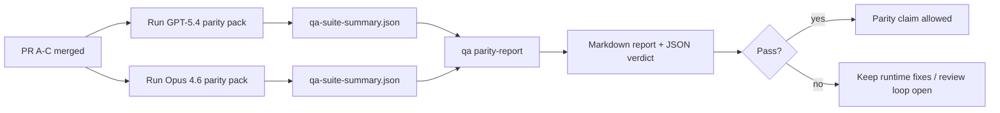

Cette note explique comment réviser le programme de parité GPT-5.4 / Codex sous forme de quatre unités de fusion sans perdre l'architecture originale à six contrats.

## Unités de fusion

### PR A : exécution stricte d'agent

Possède :

- `executionContract`
- suivi immédiat GPT-5 en premier
- `update_plan` en tant que suivi des progrès non terminaux
- états bloqués explicites au lieu d'arrêts silencieux purement planifiés

Ne possède pas :

- classification des échecs d'auth/exécution
- vérité des permissions
- refonte de la reprise/continuation
- benchmark de parité

### PR B : vérité de l'exécution

Possède :

- correction de la portée OAuth de Codex
- classification des échecs de fournisseur/exécution typés
- disponibilité véridique de `/elevated full` et raisons de blocage

Ne possède pas :

- normalisation du schéma d'outil
- état de reprise/vivacité
- blocage des benchmarks

### PR C : correction de l'exécution

Possède :

- compatibilité de l'outil OpenAI/Codex possédée par le fournisseur
- gestion de schéma strict sans paramètre
- remontée des rejets invalides de reprise
- visibilité de l'état des tâches longues en pause, bloquées et abandonnées

Ne possède pas :

- continuation auto-élue
- comportement générique du dialecte Codex en dehors des crochets de fournisseur
- blocage des benchmarks

### PR D : harnais de parité

Possède :

- pack de scénarios de première vague GPT-5.4 vs Opus 4.6
- documentation de parité
- rapport de parité et mécaniques de porte de sortie

Ne possède pas :

- changements de comportement d'exécution en dehors du labo QA
- simulation auth/proxy/DNS dans le harnais

## Correspondance avec les six contrats originaux

| Contrat original                               | Unité de fusion |
| ---------------------------------------------- | --------------- |
| Correction du transport/auth du fournisseur    | PR B            |
| Compatibilité du contrat/schéma de l'outil     | PR C            |
| Exécution immédiate                            | PR A            |
| Vérité des permissions                         | PR B            |
| Correction de la reprise/continuation/vivacité | PR C            |
| Benchmark/porte de sortie                      | PR D            |

## Ordre de révision

1. PR A
2. PR B
3. PR C
4. PR D

La PR D est la couche de preuve. Elle ne doit pas être la raison du retard des PR de correction d'exécution.

## Ce qu'il faut rechercher

### PR A

- Les exécutions de GPT-5 agissent ou échouent de manière fermée au lieu de s'arrêter sur des commentaires
- `update_plan` n'apparaît plus comme un progrès par lui-même
- le comportement reste GPT-5 en premier et délimité à Pi embarqué

### PR B

- les échecs d'auth/proxy/runtime ne convergent plus vers une gestion générique de « échec du modèle »
- `/elevated full` est uniquement décrit comme disponible lorsqu'il est réellement disponible
- les raisons de blocage sont visibles à la fois pour le modèle et pour le runtime orienté utilisateur

### PR C

- l'enregistrement strict des outils OpenAI/Codex se comporte de manière prévisible
- les outils sans paramètres ne font pas échouer les vérifications strictes du schéma
- les résultats de relecture et de compactage préservent l'état de vivacité véridique

### PR D

- le pack de scénarios est compréhensible et reproductible
- le pack inclut une voie de sécurité de relecture mutante, et pas seulement des flux en lecture seule
- les rapports sont lisibles par les humains et l'automatisation
- les revendications de parité sont étayées par des preuves, et non anecdotiques

Artefacts attendus de la PR D :

- `qa-suite-report.md` / `qa-suite-summary.json` pour chaque exécution de modèle
- `qa-agentic-parity-report.md` avec une comparaison agrégée et au niveau du scénario
- `qa-agentic-parity-summary.json` avec un verdict lisible par machine

## Critère de version

Ne pas revendiquer la parité ou la supériorité de GPT-5.4 sur Opus 4.6 tant que :

- les PR A, PR B et PR C sont fusionnées
- la PR D exécute proprement le pack de parité de la première vague
- les suites de régression de véracité du runtime restent au vert
- le rapport de parité ne montre aucun cas de faux succès et aucune régression dans le comportement d'arrêt

Le harnais de parité n'est pas la seule source de preuves. Gardez cette séparation explicite lors de la révision :

- la PR D détient la comparaison basée sur les scénarios entre GPT-5.4 et Opus 4.6
- les suites déterministes de la PR B détiennent toujours les preuves de véracité pour auth/proxy/DNS et l'accès complet

## Carte objectif-vers-preuve

| Élément de critère d'achèvement                        | Propriétaire principal | Artefact de révision                                                              |
| ------------------------------------------------------ | ---------------------- | --------------------------------------------------------------------------------- |
| Aucun blocage de planification uniquement              | PR A                   | tests d'exécution strict-agentic et `approval-turn-tool-followthrough`            |
| Aucune fausse progression ou fausse complétion d'outil | PR A + PR D            | nombre de faux succès de parité plus les détails du rapport au niveau du scénario |
| Aucune fausse orientation `/elevated full`             | PR B                   | suites déterministes de véracité du runtime                                       |
| Les échecs de relecture/vivacité restent explicites    | PR C + PR D            | suites de cycle de vie/relecture plus `compaction-retry-mutating-tool`            |
| GPT-5.4 est égal ou supérieur à Opus 4.6               | PR D                   | `qa-agentic-parity-report.md` et `qa-agentic-parity-summary.json`                 |

## Raccourci de réviseur : avant vs après

| Problème visible par l'utilisateur avant                                            | Signal de révision après                                                                                   |
| ----------------------------------------------------------------------------------- | ---------------------------------------------------------------------------------------------------------- |
| GPT-5.4 s'est arrêté après la planification                                         | La PR A montre un comportement d'action ou de blocage au lieu d'une complétion par commentaire uniquement  |
| L'utilisation des outils semblait fragile avec les schémas stricts OpenAI/Codex     | PR C rend l'enregistrement des outils et l'invocation sans paramètres prévisibles                          |
| Les indications `/elevated full` étaient parfois trompeuses                         | PR B lie les directives aux capacités réelles lors de l'exécution et aux motifs de blocage                 |
| Les tâches longues pouvaient disparaître dans une ambiguïté de relecture/compactage | PR C émet des états explicites de pause, de blocage, d'abandon et de relecture invalide                    |
| Les affirmations de parité étaient anecdotiques                                     | PR D produit un rapport ainsi qu'un verdict JSON avec la même couverture de scénarios sur les deux modèles |

## Connexes

- [Parité agentic GPT-5.4 / Codex](/fr/help/gpt54-codex-agentic-parity)
